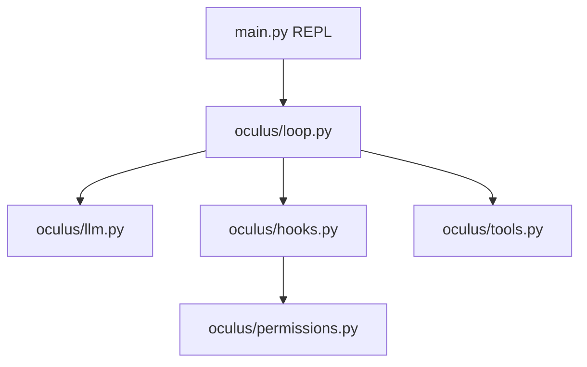

# Oculus

一个最小可用的 coding agent harness：**loop 不变，工具 / 权限 / hooks 外挂**。

## 架构



| 模块 | 作用 |
|------|------|
| `loop.py` | `while stop_reason == tool_use` 内核 |
| `llm.py` | DeepSeek client（Anthropic 兼容 API） |
| `config.py` | `DEEPSEEK_API_KEY` → 端点 / 模型 |
| `tools.py` | bash / read / write / edit / glob + dispatch |
| `permissions.py` | deny / ask 闸门 |
| `hooks.py` | PreToolUse 审计 + 权限 |
| `prompt.py` | system prompt 组装 |

## 快速开始（DeepSeek）

Oculus 通过 **DeepSeek 的 Anthropic 兼容端点** 调用模型，沿用 Anthropic SDK + tool_use 协议。

```sh
cd oculus
python -m venv .venv && source .venv/bin/activate
pip install -r requirements.txt
cp .env.example .env   # 填入 DEEPSEEK_API_KEY

# 验证 API 连通
python ping.py "say hello in one word"

python main.py
```

`.env` 示例：

```env
DEEPSEEK_API_KEY=sk-xxx
MODEL_ID=deepseek-v4-pro
```

也可用 `02-agent-basic/labs/lab00/.env` 里已有的 key（symlink 即可）：

```sh
ln -sf ../02-agent-basic/labs/lab00/.env .env
```

可选：限定工作区

```sh
export OCULUS_WORKDIR=/path/to/project
python main.py
```

## 测试

```sh
pytest tests/ -q
```

## 与 02-agent-basic 的关系

- **Labs / my-mini-agent**：按章节练习，导师不代写
- **Oculus**：你的真实产品，直接迭代功能

建议：遇到 Oculus 搞不定的失败（偏航、上下文爆、要接 GitHub），再回 `02-agent-basic` 学对应章节（s05 todo、s08 compact、s19 MCP）。

## 下一步

- [ ] s05 — `todo_write` 多步规划
- [ ] s09 — `MEMORY.md` 跨会话记忆
- [ ] s19 — MCP 插件
- [ ] FastAPI `/chat` + 部署
