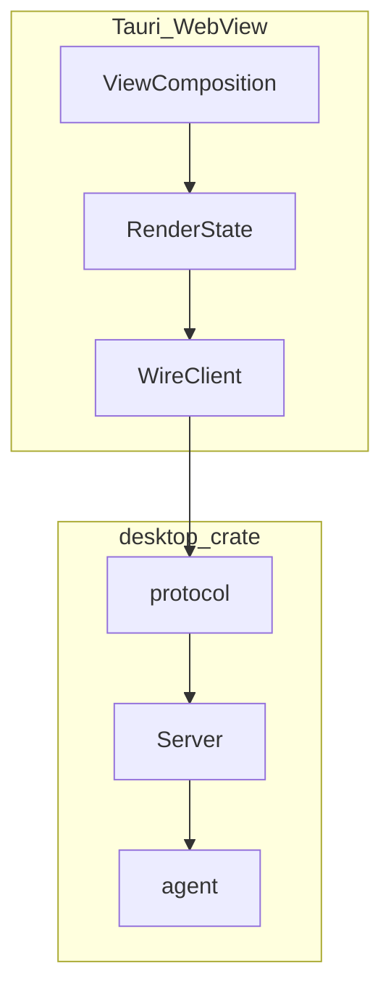

# Desktop 栈精简重构计划

> **性质：** 工程重构与实施顺序
> **状态：** R2 已完成（2026-08-26）；旧 R0/R1/R3–R5 因产品目标变更而 superseded
> **范围门禁：** 先完成 Single-Agent Terminal 文档与视觉 review，再另开实施 Work Packet
> **交互权威：** [`../../../moontide-desktop/docs/UI-INTERACTION.md`](../../../moontide-desktop/docs/UI-INTERACTION.md)
> **视觉权威：** [`../../../moontide-desktop/docs/UI-VISUAL-DIRECTION.md`](../../../moontide-desktop/docs/UI-VISUAL-DIRECTION.md)

## 1. 动机

D3-PF 已跑通 protocol-first vertical slice，R2 也已将 wire contract 合并进 `desktop` crate。
这些技术事实不变。但产品目标已从 Conversation/Inspector Workbench 改为
next-generation Single-Agent Terminal，旧 R3/R4 的固定 Workbench grid 不再符合 Scope。

本计划因此只保留已验证的 R2 结果，并重新建立实施门禁。不得从旧组件名、旧 `960×720`
frame 或旧 grid 反推新的产品结构。

**精简原则：** 先锁定产品状态、ownership 与 lifecycle，再重新规划 UI 实施；不为有限的
v0.1 split 引入通用 dock engine。

## 2. 稳定的技术心智模型

| 层 | 职责 | 现状 |
|---|---|---|
| **Desktop Server** | Agent 生命周期、command 路由、event 产出 | `crates/desktop` Host + ProtocolServer，已实现 |
| **Wire API** | 前后端 JSON 契约（v1） | `desktop::protocol`，已实现 |
| **RenderState** | event → UI projection；controller 上行 intent | frontend foundation，已实现 |
| **View composition** | Activity Rail、Project Navigator、Content Deck、Agent Dock；Floating Island 为 MoonTide Agent Companion 的 v0.1 embedded attention layer | 产品目标，待实现；独立 Companion app/process 后置 |
| **Layout** | responsive composition；Content Deck 内有限 split/group/tab | 产品目标，待实现 |

旧叙事中的 `Panel Host + WorkbenchLayout` 不再是已确认组件边界。后续可以拆分组件，但必须
从 Agent Terminal 的语义区域、状态 ownership 与交互验收推导。

## 3. 阶段状态

### R0 — Scope 定稿（本设计批）

- [x] 产品定位改为 next-generation Single-Agent Terminal；
- [x] v0.1 每个窗口只绑定一个 Project/workspace root；in-app Project switching 与
  multi-project 后置；Project 不定义为新的 durable aggregate；
- [x] Sessions 与 Files 是 Project scope 下的 siblings；Agent 只表示 runtime identity/status，
  不成为 navigation-tree level；
- [x] 确认 Activity Rail、Project Navigator、Content Deck、Agent Dock 与 Dock 内 Floating Island；
- [x] 确认 Floating Island 是 embedded Agent Companion；v0.1 不拆独立应用、进程或桌面浮动产品；
- [x] 锁定一个 loaded/running Session，以及归属它的一个 Agent runtime、一个 PTY 和一个 Agent Shell；
- [x] 锁定 `1440px` fresh layout：`56 + 232 Project Navigator (Sessions) + 736 Content Deck +
  416 Agent Dock`；Agent Dock 的 Chat/Context mode 互斥；
- [x] 锁定 Content Deck 的 Agent Shell、File、Plan、Artifact peer view kinds；Agent Shell pinned
  primary，close tab 只 hide view，`End Agent Shell` 是独立 lifecycle action；
- [ ] 用户完成 Scope、Interaction 与 low-fidelity visual direction review。

### R1 — 文档对齐（本设计批，无行为变更）

- [x] Scope 与 Interaction 使用 Single-Agent Terminal 术语；
- [x] 新增 [`UI-VISUAL-DIRECTION.md`](../../../moontide-desktop/docs/UI-VISUAL-DIRECTION.md)；
- [x] README 与 UI-STATE 区分 D3-PF 现状和产品目标；
- [x] 独立 Standards / Spec review 通过；
- [ ] 用户视觉 review 后冻结本批 source of truth。

### R2 — 合并 wire crate（已完成）

- [x] `desktop-protocol/src` → `desktop/src/protocol/`；
- [x] fixtures/tests 迁入 `desktop/tests/protocol/`；
- [x] 更新 `moontide-desktop`、`desktop` import；workspace 移除 `desktop-protocol` 成员；
- [x] **不变量：** `protocol` 模块不 import `agent`；v1 JSON shape 不变；adapter 仍是唯一出口。

**既有验收：** `cargo test -p desktop` · `cargo test -p moontide-desktop` · frontend `pnpm test` ·
`just check`

R2 的完成事实与既有验收证据保持不变；本设计批不重复执行或修改该实现。

### R3 — 旧 Panel Host + WorkbenchLayout（superseded）

- ~~`ConversationPanel`、`InspectorPanel` 与固定 `WorkbenchLayout.svelte` grid~~；
- 不按旧任务列表实现；保留 `App.svelte` 瘦身目标，但组件边界由新的实施计划确定。

旧结构缺少 PTY/Agent Shell、Agent Dock、Content Deck、Floating Island 和目标 lifecycle。
继续执行会构建错误的产品骨架。

### R4 — Single-Agent Terminal 实施（待另开计划）

- [ ] 建立 one-Project-root-per-window bootstrap 与 Project/Session identity scoping，不增加
  Project entity/API 或 in-app Project switching；
- [ ] 解决 PTY ownership/order、单 loaded Session lifecycle 与 window/runtime separation；
- [ ] 定义 shared draft、pending prompt 与 input/control arbitration；
- [ ] 定义 frontend-local Content Deck views/tabs/groups/layout，以及 Project filesystem File
  view、revision 和 dirty write guard；
- [ ] 定义 Plan/Pins durability，确保 Plan tab 与 Agent Dock Context mode 投影同一个
  Session-owned Plan；
- [ ] 明确 close Agent Shell tab 只隐藏 pinned primary view，`End Agent Shell` 单独结束 lifecycle；
- [ ] 再按独立 Work Packet 分批实现 Project Navigator、Content Deck、Agent Dock、Island
  与轻量 File Edit。

本文件不授权上述实现，也不定义 Rust signature、wire revision 或持久化 encoding。

### R5 — TASKS 同步（后置）

只在用户批准新的 implementation plan 后更新 [`moontide-desktop/DESIGN.md`](../../../moontide-desktop/DESIGN.md)，
不得把本轮设计讨论直接转成未经 review 的工程任务。

## 4. 明确不做

- 在本设计批修改 application code、protocol 或 persistence；
- D4 `agent-host` 进程拆分与 `desktop-supervisor` 接入；
- dock-anywhere 或无限嵌套 layout engine；v0.1 只需要受限的 split/group/tab；
- in-app Project switching、multi-project、Project durable aggregate 或 Project API；
- 多 Session 并行、多 Agent、第二 Agent Shell、Fleet、Task system；
- 完整 IDE/LSP/debugger/extensions 与完整 Diff Review；
- 因 thin client 尚无明确消费者而再次拆分 `desktop::protocol` crate。

## 5. 后续实施顺序

用户完成本轮设计 review 后：

1. 为产品目标创建独立 implementation architecture / Work Packet；
2. 先定 Project filesystem scope、单 Session/Agent/PTY lifecycle、input arbitration、
   dirty-write 与 durable product state；
3. 再实现 Project/Session-scoped frontend-local view composition，并切分可 review 的 UI
   vertical slices；
4. 最后评估受限 split implementation，不引入通用 dock engine。

每批保持独立验收、Standards / Spec review 与用户 diff review；未经用户明确要求不提交。
