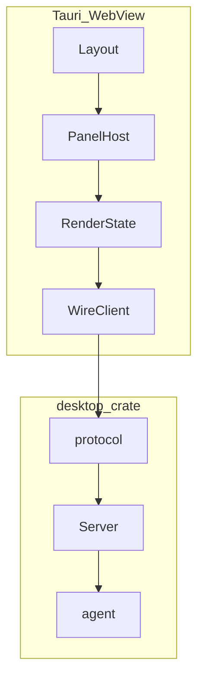

# Desktop 栈精简重构计划

> **性质：** 工程重构与实施顺序
> **状态：** R2 已完成（2026-08-26）；R0–R1、R3–R5 待推进
> **范围门禁：** [`../desktop/UI-V0.1-SCOPE.md`](../desktop/UI-V0.1-SCOPE.md) 定稿后再大批量 Workbench 编码
> **交互权威：** [`../desktop/UI-INTERACTION.md`](../desktop/UI-INTERACTION.md)

## 1. 动机

D3-PF 已跑通 protocol-first vertical slice，但存在：

- `desktop-protocol` 与 `desktop` 拆分对当前团队规模偏重；
- 文档术语（protocol / Host / adapter）与心智模型（Desktop Server / Wire / RenderState / Panel Host）不一致；
- Workbench UI 未完成，不宜并行推进 D4、layout engine、Workspace 多 pane。

**精简原则：** 合并可合并的 crate；用四层模型统一叙事；**先定 v0.1 scope，再拆 Panel**；layout engine 最后。

## 2. 四层心智模型

| 层 | 职责 | 现状位置 |
|----|------|----------|
| **Desktop Server** | Agent 生命周期、command 路由、event 产出 | [`crates/desktop`](../desktop) Host + ProtocolServer |
| **Wire API** | 前后端 JSON 契约（v1） | [`desktop::protocol`](../desktop/src/protocol/mod.rs) |
| **RenderState** | event → UI 可消费状态；command 经 controller 上行 | [`moontide-desktop/frontend`](../moontide-desktop/frontend) |
| **Panel Host** | 最小 UI 渲染单元：bind、slice、intent | **待建** |
| **Layout** | slot 编排 | v0.1 固定 CSS grid；engine 后置 |

**旧术语对照：**

| 旧 | 新叙事 |
|----|--------|
| `desktop-protocol` crate | `desktop::protocol` 模块 |
| Host + `host_protocol::adapter` | Desktop Server（adapter = 出站转换，非独立层） |
| `App.svelte` 单体 | Panel Host + WorkbenchLayout |

## 3. 阶段任务

### R0 — Scope 定稿（门禁）

- [ ] 确认 [`UI-V0.1-SCOPE.md`](../desktop/UI-V0.1-SCOPE.md) §2–§3（Session Rail、Inspector、Settings）
- [ ] 状态改为 `Confirmed baseline`

### R1 — 文档对齐（无行为变更）

- [ ] [`desktop/DESIGN.md`](../desktop/DESIGN.md) 增「四层心智模型」
- [ ] [`tauri-protocol-boundary-refactor.md`](tauri-protocol-boundary-refactor.md) 标 Historical（D3-PF 已完成部分）
- [ ] 本文件与 UI-V0.1-SCOPE 互相链接

### R2 — 合并 wire crate（已完成）

- [x] `desktop-protocol/src` → `desktop/src/protocol/`
- [x] fixtures/tests 迁入 `desktop/tests/protocol/`
- [x] 更新 `moontide-desktop`、`desktop` import；workspace 移除 `desktop-protocol` 成员
- [x] **不变量：** `protocol` 模块不 import `agent`；v1 JSON shape 不变；adapter 仍唯一出口

**验收：** `cargo test -p desktop` · `cargo test -p moontide-desktop` · frontend `npm test` · `just check`

### R3 — Panel Host + WorkbenchLayout

- [ ] `frontend/src/panel/types.ts`、`host.ts`
- [ ] `ConversationPanel`、`InspectorPanel`（范围见 UI-V0.1-SCOPE）
- [ ] `WorkbenchLayout.svelte` 固定 grid
- [ ] `App.svelte` 瘦身

**验收：** 现有 vitest 绿；流式/Stop/Approval 行为不退化

### R4 — v0.1.0 features（按 scope 定稿）

- [ ] Inspector 简化版（若 scope 选中）
- [ ] Session Rail（若 scope 选中）
- [ ] Composer 输入保留、TopBar、UI-INTERACTION checklist
- [ ] Provider 流式 smoke

### R5 — TASKS 同步

- [ ] [`desktop/TASKS.md`](../desktop/TASKS.md) 增 R-simplify 批次

## 4. 明确不做（Non-goals）

- D4 agent-host 进程拆分（与 R2 正交，scope 收齐后再做）
- `desktop-supervisor` 接入
- dockview / paneforge / Magnet 式 layout engine
- 多 Session 并行、TabBar、Fleet
- 从 `desktop::protocol` 再拆独立 crate — **仅当** thin client 需零 `agent` 依赖时

## 5. R2 完成后补什么（摘要）

R2 本身不补产品能力。后续按 UI-V0.1-SCOPE：

1. Panel Host 结构（R3）
2. Inspector / Rail / TopBar（R4，取决于定稿）
3. Provider smoke
4. Layout engine — **不做**

详见 [`UI-V0.1-SCOPE.md`](../desktop/UI-V0.1-SCOPE.md) §3–§6。

## 6. 建议提交顺序

1. `docs(desktop): add v0.1 UI scope and stack simplification plan`
2. `refactor(desktop): merge desktop-protocol into protocol module`（已完成）
3. `feat(desktop-ui): panel host and workbench layout`
4. `feat(desktop-ui): inspector and session rail per v0.1 scope`

每批 `just check` 后停等 review。
