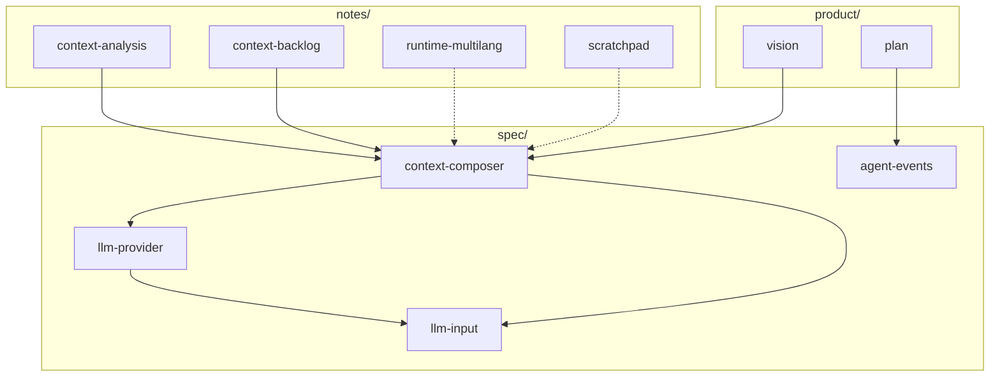

# Doc Map

Ocula 文档分三层：`product/` 定方向，`spec/` 是可实现的设计，`notes/` 是分析与候选。用词规范见 [`agent.md`](../agent.md)。

**命名：** 全部小写 kebab-case；`{domain}-{topic}.md`，目录已表达层级时不重复前缀。

## 目录

| 目录 | 性质 | 文档 |
|------|------|------|
| [`product/`](product/) | 方向 | [vision](product/vision.md) · [plan](product/plan.md) |
| [`spec/`](spec/) | 设计 Spec | [context-composer](spec/context-composer.md) · [llm-provider](spec/llm-provider.md) · [llm-input](spec/llm-input.md) · [agent-events](spec/agent-events.md) |
| [`notes/`](notes/) | 参考 / 候选 | [context-analysis](notes/context-analysis.md) · [context-backlog](notes/context-backlog.md) · [runtime-multilang](notes/runtime-multilang.md) · [scratchpad](notes/scratchpad.md) |

## 阅读路径

**新人** — vision → plan → context-composer → llm-provider → llm-input

**改 context** — context-composer（主 Spec）→ context-backlog（演进候选）→ context-analysis（行业背景）

**改 LLM 接入** — llm-provider → llm-input → agent-events（run 观测字段）

**改桌面 runtime** — runtime-multilang → context-composer

## 文档速查

| 文档 | 一句话 |
|------|--------|
| [vision](product/vision.md) | 产品定位（Ocula）与远期代号（Bruma、MoonTide 等） |
| [plan](product/plan.md) | 当前优先级、分段 JSONL 存储与非目标 |
| [context-composer](spec/context-composer.md) | Session Event Log、Context Composer、Compaction 主 Spec |
| [llm-provider](spec/llm-provider.md) | Provider preset、API 适配层、`LLMRequest` |
| [llm-input](spec/llm-input.md) | 一次调用的 `system` / `tools` / `messages` 对表 |
| [agent-events](spec/agent-events.md) | Agent Event Log（run 级 JSONL）schema |
| [context-analysis](notes/context-analysis.md) | 竞品 context window 架构对比 |
| [context-backlog](notes/context-backlog.md) | Context 演进特性候选（非实现承诺） |
| [runtime-multilang](notes/runtime-multilang.md) | 多语言 Desktop Runtime 技术讨论 |
| [scratchpad](notes/scratchpad.md) | `scratch.eval` 低风险草稿执行层 |

## 重命名对照

| 旧文件名 | 新文件名 |
|----------|----------|
| `VISION.md` | `product/vision.md` |
| `PLAN.md` | `product/plan.md` |
| `EVENTS.md` | `spec/agent-events.md` |
| `llm-input-mapping.md` | `spec/llm-input.md` |
| `context-window-analysis.md` | `notes/context-analysis.md` |
| `context-features-backlog.md` | `notes/context-backlog.md` |
| `multi-language-runtime.md` | `notes/runtime-multilang.md` |
| `executable-scratchpad.md` | `notes/scratchpad.md` |
