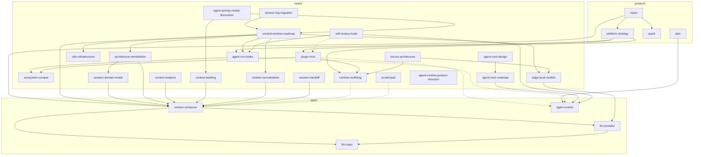

MoonTide 文档分三层：`product/` 定方向，`spec/` 是可实现的设计，`notes/` 是分析与候选。Agent 协作与开发规则见 [`AGENTS.md`](../AGENTS.md)。**执行优先级**见根 [`TODO.md`](../TODO.md)（**§16 agent-core** · §15 后续四条轨）。

**模块级操作说明（与 Doc Map 并列，避免孤儿文档）：**

| 路径 | 内容 |
|------|------|
| [`packages/tools/src/builtins/README.md`](../packages/tools/src/builtins/README.md) | 内置 tool 目录约定、域一览、新增 checklist |
| [`apps/moontide/src/plugins/builtin/README.md`](../apps/moontide/src/plugins/builtin/README.md) | 内置 plugin 模块、含 tool 的 spec/impl 约定 |
| [`notes/monorepo-packages.md`](notes/monorepo-packages.md) | Monorepo 包清单、依赖图、路径对照 |

**命名：** 全部小写 kebab-case；`{domain}-{topic}.md`，目录已表达层级时不重复前缀。

## 目录

| 目录 | 性质 | 文档 |
|------|------|------|
| [`product/`](product/) | 方向 | [vision](product/vision.md) · [plan](product/plan.md) · [platform-strategy](product/platform-strategy.md) · [spark](product/spark.md) |
| [`spec/`](spec/) | 设计 Spec | [context-composer](spec/context-composer.md) · [llm-provider](spec/llm-provider.md) · [llm-input](spec/llm-input.md) · [agent-events](spec/agent-events.md) |
| [`notes/`](notes/) | 参考 / 候选 | [monorepo-packages](notes/monorepo-packages.md) · [agent-core-roadmap](notes/agent-core-roadmap.md) · [agent-runtime-product-direction](notes/agent-runtime-product-direction.md) · [context-window-roadmap](notes/context-window-roadmap.md) · [architecture-remediation](notes/architecture-remediation.md) · [deep-mode](notes/deep-mode.md) · [session-domain-model](notes/session-domain-model.md) · [session-log-migration](notes/session-log-migration.md) · [session-persistence](notes/session-persistence.md) · [context-inspect-debug](notes/context-inspect-debug.md) · [agent-run-hooks](notes/agent-run-hooks.md) · [utils-infrastructure](notes/utils-infrastructure.md) · [ecosystem-compat](notes/ecosystem-compat.md) · [context-analysis](notes/context-analysis.md) · [context-backlog](notes/context-backlog.md) · [agent-activity-model-discussion](notes/agent-activity-model-discussion.md) · [context-normalization](notes/context-normalization.md) · [self-review-mode](notes/self-review-mode.md) · [edge-local-models](notes/edge-local-models.md) · [kocoro-architecture](notes/kocoro-architecture.md) · [plugin-host](notes/plugin-host.md) · [session-handoff](notes/session-handoff.md) · [runtime-multilang](notes/runtime-multilang.md) · [scratchpad](notes/scratchpad.md) |

## 阅读路径

**新人** — vision → plan → context-composer → llm-provider → llm-input

**改 agent hook / 观测** — [agent-core-roadmap](notes/agent-core-roadmap.md) · [agent-core-design](../agent-core-design.md) · [AGENTS.md §7.2](../AGENTS.md#72-agent-core--run内核层)（RunEvent bus · resolveRunConfig）→ agent-events（Spec，M6 迁 RunEvent）→ ecosystem-compat

**改 agent-core 内核** — agent-core-design → agent-core-roadmap → [TODO.md](../TODO.md) §16

**改模块边界 / 架构修复** — [AGENTS.md §2](../AGENTS.md#2-模块高内聚低耦合) → [architecture-remediation](notes/architecture-remediation.md) → [context-composer](spec/context-composer.md) §4/§10.1 → [session-domain-model](notes/session-domain-model.md)

**新增 / 修改 builtin tool** — [AGENTS.md §2.1](../AGENTS.md#21-声明与实现分离spec--impl-split) → [tools/builtins/README](../packages/tools/src/builtins/README.md) → [register-defaults.ts](../apps/moontide/src/tools/register-defaults.ts) · `pnpm test:conformance`

**新增 / 修改 plugin tool**（code_repl、deep_research、work_mem）— [plugins/builtin/README](../apps/moontide/src/plugins/builtin/README.md) → [deep-mode](notes/deep-mode.md)（`work_mem`）→ 同上 conformance

**本地 dev / REPL 起不来** — [monorepo-packages](notes/monorepo-packages.md) §Dev 启动（根目录 `.env`、`bootstrap-env`、`tsconfig.dev.json`）→ `tests/conformance/dev-startup.test.ts`

**接 MCP / 外部 Plugin** — ecosystem-compat → plugin-host → platform-strategy

**改 context** — [context-window-roadmap](notes/context-window-roadmap.md)（**#1–#6 + Budget Tiers done · §8 后续四条轨**）→ [session-domain-model](notes/session-domain-model.md)（类型/数据流）→ context-composer（主 Spec）→ agent-run-hooks（Session/Turn Observe）→ [utils-infrastructure](notes/utils-infrastructure.md) → context-backlog（C6+ 演进）→ context-analysis（行业背景）

**后续四条轨（2026-08）** — [TODO.md](../TODO.md) §15 → [context-window-roadmap](notes/context-window-roadmap.md) §8 → 分轨：[context-backlog §15 Prefix Cache](notes/context-backlog.md) · [agent-activity-model-discussion](notes/agent-activity-model-discussion.md) · [edge-local-models Local Fusion](notes/edge-local-models.md) · [context-normalization](notes/context-normalization.md)

**改 context preflight / postflight** — [context-normalization](notes/context-normalization.md)（本 feature backlog）→ context-composer（最终 request owner）→ agent-run-hooks（完整 turn postflight）

**讨论 Self-Review / 受控自我改进** — [self-review-mode](notes/self-review-mode.md)（feature backlog）→ agent-events（事实源）→ agent-run-hooks（enqueue）→ plugin-host（后台 worker）

**改 REPL session 持久化** — [session-persistence](notes/session-persistence.md) → session-domain-model → context-composer §4

**改 context 调试 dump** — [context-inspect-debug](notes/context-inspect-debug.md) → README §CLI（Debug）

**跨 agent 交接** — session-handoff（产品讨论）→ context-composer（Session Log / Composer）→ vision（Zephyr 远期）

**改 LLM 接入** — llm-provider → llm-input → agent-events（run 观测字段）

**Edge 本地模型 / Local Fusion** — [edge-local-models](notes/edge-local-models.md)（§2.1 Local Fusion）→ [llm-provider](spec/llm-provider.md) Model Router → [runtime-multilang](notes/runtime-multilang.md) · [context-window-roadmap](notes/context-window-roadmap.md) §8.3

**改桌面 runtime** — runtime-multilang → kocoro-architecture → context-composer

**Release / 竞争定位** — platform-strategy → plugin-host → runtime-multilang → context-analysis

**Hook 工程落地** — agent-run-hooks §11+ → agent-run-hooks §1–§10 → [agent-run.ts](../apps/moontide/src/agent/agent-run.ts)

**Rust REPL 开发** — 根 [README](../README.md) §Rust CLI → `crates/moontide-cli` · `crates/moontide-observability` · `platform-strategy` §10

## notes 主题索引

| 主题 | 主文档 | 关联 |
|------|--------|------|
| Agent-core 内核 | [agent-core-roadmap](notes/agent-core-roadmap.md) · [agent-core-design](../agent-core-design.md) | agent-events · plugin-host · TODO §16 |
| Agent Runtime 与产品方向 | [agent-runtime-product-direction](notes/agent-runtime-product-direction.md) | platform-strategy · spark · vision · agent-core-design |
| Monorepo 布局 | [monorepo-packages](notes/monorepo-packages.md) | architecture-remediation · AGENTS.md §2 · dev 启动 · conformance |
| Agent hook 设计（legacy） | [agent-run-hooks](notes/agent-run-hooks.md) | agent-events · session-log-migration · M7 归档 |
| Release 与平台策略 | [platform-strategy](product/platform-strategy.md) | plugin-host · runtime-multilang · kocoro-architecture · agent-run-hooks |
| 插件与 MCP 集成 | [plugin-host](notes/plugin-host.md) | platform-strategy · runtime-multilang · scratchpad |
| Deep Task Mode / work_mem | [deep-mode](notes/deep-mode.md) | work-mem plugin · compose Working Set |
| 外网内容 / artifact 阅读 | [web-content-retrieval-discussion](notes/web-content-retrieval-discussion.md) | http_fetch · read_artifact · deep_research · truncation-strategies |
| 架构修复计划 | [architecture-remediation](notes/architecture-remediation.md) | Phase A–C；六件事 done 后择项 |
| Agent Activity Model | [agent-activity-model-discussion](notes/agent-activity-model-discussion.md) | context-backlog §8 · roadmap §7 · TODO §15.2 |
| Utils / storage 分层 | [utils-infrastructure](notes/utils-infrastructure.md) | fs · process · event-hub · storage |
| Builtin / plugin tool 结构 | [tools/builtins/README](../packages/tools/src/builtins/README.md) · [plugins/builtin/README](../apps/moontide/src/plugins/builtin/README.md) | AGENTS.md §2.1 · register-defaults · architecture-boundaries |
| Session 域模型 | [session-domain-model](notes/session-domain-model.md) | SessionContext / Item / compose 数据流 |
| Session 迁移 | [session-log-migration](notes/session-log-migration.md) | C1a/C1b；链到 #1 runtime-status |
| Session 书签 / 恢复 | [session-persistence](notes/session-persistence.md) | `/save` · `/resume session` · index.json |
| Context debug dump | [context-inspect-debug](notes/context-inspect-debug.md) | `/debug` · context-inspect |
| Context 演进 / 后续计划 | [context-window-roadmap](notes/context-window-roadmap.md) §8 · [TODO.md](../TODO.md) §15 | context-backlog · context-normalization · edge-local-models |
| Agent Feature 评测 | [harness-eval-1.0](spec/harness-eval-1.0.md) · [agent-eval-task-taxonomy](notes/agent-eval-task-taxonomy.md) · [harness-eval-refactor-plan](notes/harness-eval-refactor-plan.md) · [agent-eval-roadmap](notes/agent-eval-roadmap.md) | [packages/evals](../packages/evals/) · [TODO.md](../TODO.md) §7 · §8 |
| LLM API 适配层 backlog | [llm-provider-backlog](notes/llm-provider-backlog.md) | [llm-provider](spec/llm-provider.md) §13 · eval PR 计划外 |
| Prompt Prefix Cache | [context-backlog](notes/context-backlog.md) §15 | context-normalization §13 · context-composer |
| Local Fusion（edge 路由） | [edge-local-models](notes/edge-local-models.md) §2.1 | llm-provider · runtime-multilang · TODO §15.3 |
| Context Preflight / Postflight | [context-normalization](notes/context-normalization.md) | context-composer · agent-run-hooks · deep-mode |
| Self-Review / 受控自我改进 | [self-review-mode](notes/self-review-mode.md) | agent-events · agent-run-hooks · plugin-host · tool-hints |
| 跨 agent 交接 | [session-handoff](notes/session-handoff.md) | context-composer · vision（Zephyr） |
| Edge 本地推理 / catalog | [edge-local-models](notes/edge-local-models.md) | Local Fusion §2.1 · llm-provider · runtime-multilang |
| 多语言 Runtime | [runtime-multilang](notes/runtime-multilang.md) | kocoro-architecture · edge-local-models |
| 参考架构 | [kocoro-architecture](notes/kocoro-architecture.md) | edge-local-models · runtime-multilang |
| 草稿执行 | [scratchpad](notes/scratchpad.md) | runtime-multilang §4.4 WASM |

## 文档速查

| 文档 | 一句话 |
|------|--------|
| [vision](product/vision.md) | 产品定位（MoonTide）与保留产品名（Spark、Bruma 等） |
| [spark](product/spark.md) | **Spark / 随形** 移动端 capture、成长助手、L1–L3 分层与 MoonTide 协同 |
| [platform-strategy](product/platform-strategy.md) | Release 架构、竞争定位、MCP/sidecar 边界与非目标 |
| [plugin-host](notes/plugin-host.md) | Plugin host、MCP client、startup assembly 与 runtime attach |
| [plan](product/plan.md) | 当前优先级、分段 JSONL 存储与非目标 |
| [context-composer](spec/context-composer.md) | Session Event Log、Context Composer、Compaction 主 Spec |
| [llm-provider](spec/llm-provider.md) | Provider preset、`local-direct`、API 适配层、`LLMRequest` |
| [llm-input](spec/llm-input.md) | 一次调用的 `system` / `tools` / `messages` 对表 |
| [monorepo-packages](notes/monorepo-packages.md) | **Monorepo** 包清单、依赖图、Dev 启动、conformance 布局 |
| [agent-core-roadmap](notes/agent-core-roadmap.md) | **开发计划**：agent-common + agent-core · RunEvent bus · resolveRunConfig · M1–M7 |
| [agent-runtime-product-direction](notes/agent-runtime-product-direction.md) | **方向记录**：元 agent 问题、Agent Runtime、产品 Preset / Shell 与产品族边界 |
| [agent-core-design](../agent-core-design.md) | Agent 时序内核与 Preset 设计 Spec（平台中立） |
| [agent-events](spec/agent-events.md) | Agent Event Log（run 级 JSONL）schema；M6 迁 RunEvent |
| [agent-run-hooks](notes/agent-run-hooks.md) | Agent 运行时 hook：生命周期、四类语义、注册实践与 §11+ 工程落地 |
| [context-analysis](notes/context-analysis.md) | 竞品 context window 架构对比 |
| [deep-mode](notes/deep-mode.md) | Deep Task Mode：`deep:` prompt gate、`work_mem`、Working Set snapshot |
| [web-content-retrieval-discussion](notes/web-content-retrieval-discussion.md) | 外研 artifact 嵌套问题 · 正文提取 / artifact 搜索 backlog（讨论备忘） |
| [context-window-roadmap](notes/context-window-roadmap.md) | **开发计划**：六件事 done · §8 后续四条轨（Prefix Cache / 需求讨论 / Local Fusion / Normalization） |
| [agent-eval-roadmap](notes/agent-eval-roadmap.md) | **开发计划**：Feature 评测流水线 L0–L3 · 分桶 suite · grader · Impact Card（对齐 TODO §7/§8） |
| [agent-eval-task-taxonomy](notes/agent-eval-task-taxonomy.md) | **调研**：业界 workload taxonomy · Harness contract / API profile / oracle 分类依据 |
| [harness-eval-refactor-plan](notes/harness-eval-refactor-plan.md) | **重构计划**：contract-first case schema · request/trace/outcome grader · adapter capability contract |
| [harness-eval-1.0](spec/harness-eval-1.0.md) | **Spec + 实现 1.0**：`@moontide/evals` feature A/B · grader · suites/v1 |
| [architecture-remediation](notes/architecture-remediation.md) | **架构修复计划**：16 项 review · Phase A–C |
| [utils-infrastructure](notes/utils-infrastructure.md) | Utils / storage 分层、event-hub、import 约束 |
| [session-domain-model](notes/session-domain-model.md) | Session 类型、模块职责与 compose 数据流 |
| [session-log-migration](notes/session-log-migration.md) | C1 双写 → compose 迁移策略 |
| [session-persistence](notes/session-persistence.md) | Session Index 书签 · `/save` · `/resume session` |
| [context-inspect-debug](notes/context-inspect-debug.md) | `/debug` 分级全量 compose/llm/tool dump |
| [context-backlog](notes/context-backlog.md) | Context 演进特性候选（C6+ · §15 Prefix Cache 等） |
| [agent-activity-model-discussion](notes/agent-activity-model-discussion.md) | Agent Activity Model 讨论备忘：7a–7c、开放问题 checklist |
| [context-normalization](notes/context-normalization.md) | Preflight / Postflight Normalization（§8.4 后续轨） |
| [self-review-mode](notes/self-review-mode.md) | 使用日志 → User Reflection + Improvement Candidates；Controlled Self-Update 远期研究 |
| [edge-local-models](notes/edge-local-models.md) | Local Fusion：edge 小模型 catalog + 路由降 cloud 成本 |
| [kocoro-architecture](notes/kocoro-architecture.md) | Kocoro/Shannon 架构参考与 MoonTide 对照 |
| [session-handoff](notes/session-handoff.md) | 跨 agent 会话交接：价值、分层方案、业界 gap |
| [runtime-multilang](notes/runtime-multilang.md) | 多语言 Desktop Runtime、`moontide-infer` sidecar |
| [scratchpad](notes/scratchpad.md) | `scratch.eval` 低风险草稿执行层 |

## 重命名对照

| 旧文件名 | 新文件名 |
|----------|----------|
| `VISION.md` | `product/vision.md` |
| `PLAN.md` | `product/plan.md` |
| `EVENTS.md` | `spec/agent-events.md` |
| `llm-input-mapping.md` | `spec/llm-input.md` |
| `context-window-analysis.md` | `notes/context-analysis.md` |
| `context-features-backlog.md` | `notes/context-backlog.md` |
| `multi-language-runtime.md` | `notes/runtime-multilang.md` |
| `executable-scratchpad.md` | `notes/scratchpad.md` |
