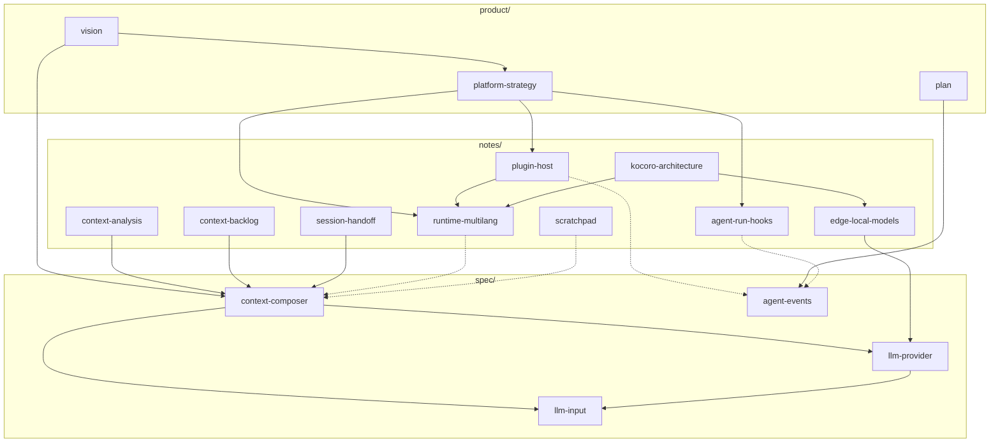

# Doc Map

Ocula 文档分三层：`product/` 定方向，`spec/` 是可实现的设计，`notes/` 是分析与候选。用词规范见 [`agent.md`](../agent.md)。

**命名：** 全部小写 kebab-case；`{domain}-{topic}.md`，目录已表达层级时不重复前缀。

## 目录

| 目录 | 性质 | 文档 |
|------|------|------|
| [`product/`](product/) | 方向 | [vision](product/vision.md) · [plan](product/plan.md) · [platform-strategy](product/platform-strategy.md) |
| [`spec/`](spec/) | 设计 Spec | [context-composer](spec/context-composer.md) · [llm-provider](spec/llm-provider.md) · [llm-input](spec/llm-input.md) · [agent-events](spec/agent-events.md) |
| [`notes/`](notes/) | 参考 / 候选 | [agent-run-hooks](notes/agent-run-hooks.md) · [context-analysis](notes/context-analysis.md) · [context-backlog](notes/context-backlog.md) · [edge-local-models](notes/edge-local-models.md) · [kocoro-architecture](notes/kocoro-architecture.md) · [plugin-host](notes/plugin-host.md) · [session-handoff](notes/session-handoff.md) · [runtime-multilang](notes/runtime-multilang.md) · [scratchpad](notes/scratchpad.md) |

## 阅读路径

**新人** — vision → plan → context-composer → llm-provider → llm-input

**改 agent hook / 观测** — agent-run-hooks（生命周期与注册）→ agent-events（Spec）

**改 context** — context-composer（主 Spec）→ context-backlog（演进候选）→ context-analysis（行业背景）

**跨 agent 交接** — session-handoff（产品讨论）→ context-composer（Session Log / Composer）→ vision（Zephyr 远期）

**改 LLM 接入** — llm-provider → llm-input → agent-events（run 观测字段）

**Edge 本地模型** — edge-local-models（候选调研）→ kocoro-architecture（参考实现）→ llm-provider（Model Router）→ runtime-multilang

**改桌面 runtime** — runtime-multilang → kocoro-architecture → context-composer

**Release / 竞争定位** — platform-strategy → plugin-host → runtime-multilang → context-analysis

**Hook 工程落地** — agent-run-hooks §11+ → agent-run-hooks §1–§10 → [agent-run.ts](../src/agent/agent-run.ts)

## notes 主题索引

| 主题 | 主文档 | 关联 |
|------|--------|------|
| Agent hook 设计 | [agent-run-hooks](notes/agent-run-hooks.md) | agent-events · session-log-migration · platform-strategy |
| Release 与平台策略 | [platform-strategy](product/platform-strategy.md) | plugin-host · runtime-multilang · kocoro-architecture · agent-run-hooks |
| 插件与 MCP 集成 | [plugin-host](notes/plugin-host.md) | platform-strategy · runtime-multilang · scratchpad |
| Context 演进 | [context-backlog](notes/context-backlog.md) | context-composer · context-analysis |
| 跨 agent 交接 | [session-handoff](notes/session-handoff.md) | context-composer · vision（Zephyr） |
| Edge 本地推理 | [edge-local-models](notes/edge-local-models.md) | llm-provider · runtime-multilang · kocoro-architecture |
| 多语言 Runtime | [runtime-multilang](notes/runtime-multilang.md) | kocoro-architecture · edge-local-models |
| 参考架构 | [kocoro-architecture](notes/kocoro-architecture.md) | edge-local-models · runtime-multilang |
| 草稿执行 | [scratchpad](notes/scratchpad.md) | runtime-multilang §4.4 WASM |

## 文档速查

| 文档 | 一句话 |
|------|--------|
| [vision](product/vision.md) | 产品定位（Ocula）与远期保留产品名（Bruma、MoonTide 等） |
| [platform-strategy](product/platform-strategy.md) | Release 架构、竞争定位、MCP/sidecar 边界与非目标 |
| [plugin-host](notes/plugin-host.md) | Plugin host、MCP client、startup assembly 与 runtime attach |
| [plan](product/plan.md) | 当前优先级、分段 JSONL 存储与非目标 |
| [context-composer](spec/context-composer.md) | Session Event Log、Context Composer、Compaction 主 Spec |
| [llm-provider](spec/llm-provider.md) | Provider preset、`local-direct`、API 适配层、`LLMRequest` |
| [llm-input](spec/llm-input.md) | 一次调用的 `system` / `tools` / `messages` 对表 |
| [agent-events](spec/agent-events.md) | Agent Event Log（run 级 JSONL）schema |
| [agent-run-hooks](notes/agent-run-hooks.md) | Agent 运行时 hook：生命周期、四类语义、注册实践与 §11+ 工程落地 |
| [context-analysis](notes/context-analysis.md) | 竞品 context window 架构对比 |
| [context-backlog](notes/context-backlog.md) | Context 演进特性候选（非实现承诺） |
| [edge-local-models](notes/edge-local-models.md) | Edge 小模型：catalog pull、Cloud train only、`ocula-infer` |
| [kocoro-architecture](notes/kocoro-architecture.md) | Kocoro/Shannon 架构参考与 Ocula 对照 |
| [session-handoff](notes/session-handoff.md) | 跨 agent 会话交接：价值、分层方案、业界 gap |
| [runtime-multilang](notes/runtime-multilang.md) | 多语言 Desktop Runtime、`ocula-infer` sidecar |
| [scratchpad](notes/scratchpad.md) | `scratch.eval` 低风险草稿执行层 |

## 重命名对照

| 旧文件名 | 新文件名 |
|----------|----------|
| `VISION.md` | `product/vision.md` |
| `PLAN.md` | `product/plan.md` |
| `EVENTS.md` | `spec/agent-events.md` |
| `llm-input-mapping.md` | `spec/llm-input.md` |
| `context-window-analysis.md` | `notes/context-analysis.md` |
| `context-features-backlog.md` | `notes/context-backlog.md` |
| `multi-language-runtime.md` | `notes/runtime-multilang.md` |
| `executable-scratchpad.md` | `notes/scratchpad.md` |
