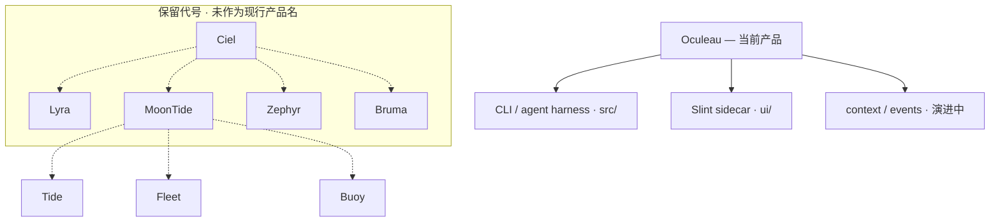

# Oculeau — Product Vision

**当前产品名：Oculeau｜观澜**

本仓库交付的是 **Oculeau** — 最小可用的 coding agent CLI + Slint sidecar。  
**观澜** 为中文品牌名（观澜索源：观水之象，溯流之源）；**Oculeau** 为英文品牌 / repo / npm / CLI（眼 + 水）。

文档、代码、CLI、配置目录（`.oculeau/`）在现阶段 **统一使用 Oculeau**，不使用下文保留代号指称当前产品。

---

## 保留代号（未来产品，当前不用）

以下名称已登记为 **未来产品线代号**，仅供愿景与 TODO 引用；**不是** 本仓库现行产品名，也不应在用户-facing 文案、README 或实现注释中替代 Oculeau。

| 代号 | 天象意象 | 设想方向（远期） |
|------|----------|------------------|
| **Ciel** | 天 | 产品家族 / 天象母题总称 |
| **Lyra** | 天琴（星） | 独立 agent harness 产品线（若与 Oculeau 分叉） |
| **MoonTide** | 月潮 | 多 panel / 多窗口桌面 shell |
| **Zephyr** | 风 | 跨 agent 产品切换与迁移 |
| **Bruma** | 雾 | Session 事实为 source of truth（技术 Spec：**Session Event Log**，见 [`context-composer.md`](context-composer.md)） |
| **Tide** | — | MoonTide 内：日常 action 摘要 panel |
| **Fleet** | — | MoonTide 内：多 agent 运行监控 panel |
| **Buoy** | — | MoonTide 内：Pin notes |

虚线表示 **愿景关联**，不表示本 repo 已以该代号对外发布。

### 代号说明（备忘，非现行规格）

- **Bruma** — Session 完整事实为 source of truth（**Session Event Log**）；model context 仅为 `LLMRequest` 投影。Spec：[`context-composer.md`](./context-composer.md)；在 Oculeau 中由 `src/context/` 等模块 **逐步演进**，产品名仍称 Oculeau。
- **MoonTide / Tide / Fleet / Buoy** — 桌面 shell 与 panel 设想，见 [`TODO.md`](../TODO.md)。
- **Zephyr** — 跨 Cursor / Claude Code / Codex 等工具的会话管理与迁移，远期。
- **Lyra** — 曾为 harness 候选名；若未来单独发产品线再启用，当前 harness 即 **Oculeau**。

---

## 命名母题（保留代号共用）

**天象层**：天 · 星 · 月潮 · 风 · 雾。

- 英文代号有隐喻，避免 Code / Studio 等直白命名
- 不走地理分类感（Atoll / Estuary 等已弃）
- 不走织物系（Loom / Spool / Motif / Swatch 等已弃）
- **Aster** 曾为 harness 候选，已由 **Lyra** 代号取代（二者均未用于现行产品名）

## Naming non-goals

不用于产品 / 代号登记：

- Code / Studio（过直白）
- Current（显 low）
- Atoll / Estuary / Archipelago（地理古板）
- Loom / Spool / Weave / Shuttle / Motif / Swatch（织物系，已弃）

## Status

- **对外与实现：Oculeau｜观澜**
- **保留代号：仅文档 / TODO / 愿景，不替代当前产品名**
- 包名、CLI 二进制、`.oculeau/` 路径维持 Oculeau；无计划将 CLI 改名为 Lyra 等代号
