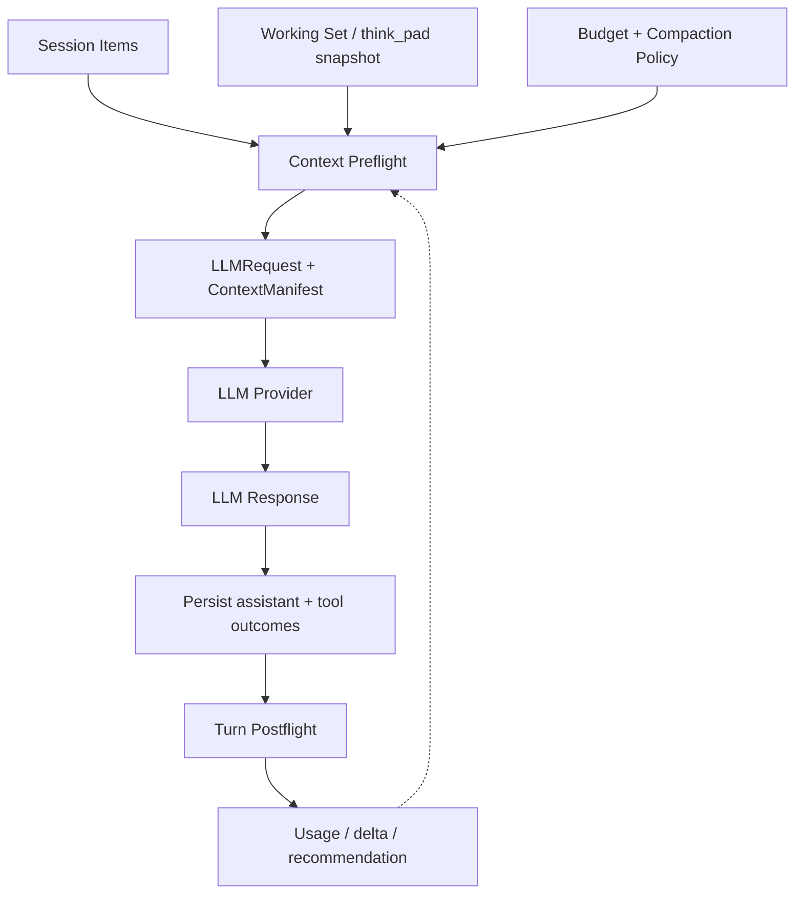

> **状态：** 后续计划轨 **8.4** · Backlog / Feature candidate  
> **入口：** [`context-window-roadmap.md` §8.4](context-window-roadmap.md) · [`TODO.md`](../../../TODO.md) §15.4
> **性质：** Context Composer 与 Agent turn pipeline 的演进设计  
> **非实现承诺：** 本文记录讨论结论、边界和验收方向；不代表当前已实现。

## 1. 一句话

在每次 LLM request 前生成满足预算与 provider 协议不变量的 Context Projection；在一次完整 Agent turn 后记录事实、usage 和下一轮上下文状态。

这里整理的是上下文 **projection / budget normalization**，不是简单地“每次前后重新数 token”。

## 2. 背景与价值

当前上下文处理涉及多个独立问题：

- Session Event Log 是完整会话事实；
- Context Composer 编译本次 `LLMRequest`；
- Compaction / prune 只改变本次 compose projection；
- Artifact Store 保存大型 tool output；
- working set / `think_pad` 提供受限的任务相关上下文；
- Agent Event Log 记录运行时观测。

如果没有一个明确的 request boundary，token 估算、compaction、working set 注入、tool pair 校验和 provider 限制容易分散在不同层，导致：

- 预算计算口径不一致；
- system、tools、messages 互相挤占；
- compaction 重复执行或结果不可解释；
- request 已经生成后又被 hook 静默修改；
- post-response 整理过早，遗漏后续 tool results。

该特性的主要价值是 **request correctness、预算可解释性、恢复能力和观测一致性**，不是让模型自动获得更强的推理能力。

## 3. 核心边界

### 3.1 Preflight：发送 request 前

Preflight 必须由 Context Composer 统一拥有并输出最终 `LLMRequest` 与 `ContextManifest`。

应保证：

1. Session items 已投影为 provider protocol messages；
2. checkpoint / active compaction 已应用；
3. working set 已 bounded 注入；
4. tool call / tool result 配对合法；
5. context input、tool definitions、system 与 output reserve 均纳入预算；
6. compaction / prune 按 policy 执行；
7. request 满足 provider 协议；
8. manifest 记录选择、丢弃、变换和 token 估算。

Preflight 应满足幂等性：

```text
normalize(normalize(context)) === normalize(context)
```

### 3.2 Postflight：完整 Agent turn 后

Postflight 不修改已经发送的 request，也不重写 Session 事实。

推荐时序：

```text
LLM response
  → append assistant response
  → execute tool calls
  → append tool outcomes / artifacts
  → postflight metrics and state update
  → next request preflight
```

Postflight 可以：

- 记录 input / output token usage；
- 记录 context delta；
- 标记 context dirty；
- 生成下一轮 prune / summary recommendation；
- 更新运行时缓存；
- 记录本轮使用的 source item IDs 与 working-set revision。

Postflight 不应直接删除或修改旧 Session items。Context pruning 仍然是 compose-time projection。

## 4. 推荐数据流



## 5. Hook 与 Plugin 的边界

### 5.1 推荐方案

| 能力 | 所属边界 |
|------|----------|
| 最终 request 生成 | Core Context Composer |
| token budget 与 provider invariant | Core Context Composer |
| compaction / prune 执行 | Core Context Composer |
| think_pad / working set 内容提供 | Plugin capability |
| 自定义 normalization policy | Plugin 提供、Core 执行 |
| request / usage metrics | Hook |
| 完整 turn 后状态观察 | `postTurn` / `turnComplete` Hook |

Plugin 可以提供受限的 `ContextPreflightPass`，但不能直接在 Composer 之外修改最终 request。

示意接口：

```ts
interface ContextPreflightPass {
  name: string;
  order: number;
  apply(input: ContextPreflightInput): ContextPreflightOutput;
}
```

Core 必须负责 pass 顺序、预算重检、最终协议校验、manifest 和 fallback。

当前 `composeComplete` 与 `llmCall` hook 主要是 observe-only；`llmCall` 发生在 provider 返回之后，不能作为修改本次 request 的 preflight transform。若需要 postflight，应该增加完整 turn 结束语义，而不是复用过早的 `llmCall`。

## 6. Token budget 设计

如果 provider 限制的是 input + output 总和，预算不能只检查 input：

```text
maxInputTokens =
  contextWindow
  - maxOutputTokens
  - safetyMarginTokens
```

建议显式建模：

```ts
interface ContextBudget {
  contextWindow: number;
  maxOutputTokens: number;
  safetyMarginTokens: number;
  maxInputTokens: number;
}
```

默认采用本地估算；只有接近阈值、provider 支持精确计数或发生超长失败时才使用 exact count / aggressive fallback。不要每次 request 都依赖额外的 provider token-count API。

## 7. 与 `think_pad` / Working Set 的关系

`think_pad` 应作为 preflight 的一个 bounded context source，而不是直接修改完整 request：

```text
ThinkPad Store
  → resolve bounded working-set snapshot
  → Context Composer 注入
  → budget / protocol validation
  → LLMRequest
```

完整 pad 留在持久化层；本次 request 只接收受限 snapshot，并在 manifest 中记录 pad 或 working-set revision。不要把全部 scratch 或隐藏 chain-of-thought 直接注入 context。

## 8. 建议实现阶段

### Phase 1：统一已有 preflight

- 以 `composeContext` 作为唯一 request projection owner；
- 将现有 token estimate、compaction、working-set 注入收敛到明确的 preflight pipeline；
- 增加 output reserve；
- 扩展 manifest，记录 before / after estimate 和 transformation list；
- 验证 tool pair、预算和幂等性。

### Phase 2：增加 turn-level postflight

- 在 assistant response 与 tool outcomes 全部持久化后执行；
- 记录 usage、context delta 和 dirty state；
- 生成下一轮 recommendation；
- 不直接重写 Session facts。

### Phase 3：按 recommendation 执行自动整理

下一次 preflight 根据压力选择：

```text
normal → prune → summary → emergency fallback
```

不要让 postflight 与 preflight 同时拥有 compaction 决策权。

## 9. 验收标准

- preflight 生成的 request 不超过明确的 input/output budget；
- system、tools、messages、working set 的预算来源可解释；
- tool call / tool result 不会产生 orphan 或重复配对；
- preflight 重复执行不会重复注入或重复压缩；
- postflight 只在完整 turn 后执行；
- Session Event Log 仍保持 append-only；
- compaction projection 不改变 Session 事实；
- manifest 能显示 source IDs、excluded IDs、transformation 和 token estimates；
- provider 超长错误可以触发一次确定性的 fallback；
- 进程重启和多次 compaction 后，request projection 仍可复现；
- plugin pass 不能绕过 Core budget / protocol validation；
- hook 失败不会静默改变最终 request。

## 10. 非目标

- 不把 token estimate 当成模型推理质量指标；
- 不让 postflight 修改已经发送的 request；
- 不让 plugin 直接拥有 Session facts 或任意 request mutation；
- 不自动持久化 provider hidden reasoning / token-level chain-of-thought；
- 不在本 feature 中引入跨 Session 向量 memory、context graph 或后台 compaction daemon；
- 不为了抽象而重写现有 Session / Composer 层次。

## 11. 依赖与相关文档

| 文档 | 关系 |
|------|------|
| [`context-composer.md`](../../spec/context-composer.md) | Session source of truth、Composer、Compaction、Manifest 主 Spec |
| [`context-backlog.md`](context-backlog.md) | Budget Tiers、Structured IR、Working Set、Compose Dedup backlog |
| [`agent-run-hooks.md`](../runtime/agent-run-hooks.md) | Hook 生命周期、observe / transform / decide 边界 |
| [`deep-mode.md`](deep-mode.md) | `work_mem` 与 Working Set snapshot |
| [`agent-events.md`](../../spec/agent-events.md) | request / usage / context 运行时观测 |

## 12. 一句话决策

**保留 pre-norm，落在 Core Context Composer；保留 post-norm，落在完整 turn 的 postflight Hook；Plugin 只提供策略和上下文能力，不能绕过 Composer 修改最终 LLM request。**

## 13. Related Backlog：Prompt Prefix Cache

Prompt prefix cache 与 Context normalization 相关，但职责不同：

- Context normalization 负责 correctness、预算和 provider 协议；
- prefix cache 负责降低重复 prefix 的 latency / cost；
- cache 命中不能成为 request 正确性的前置条件。

详细 backlog 见 [`context-backlog.md`](context-backlog.md#14-backlog-prompt-prefix-cache)。
