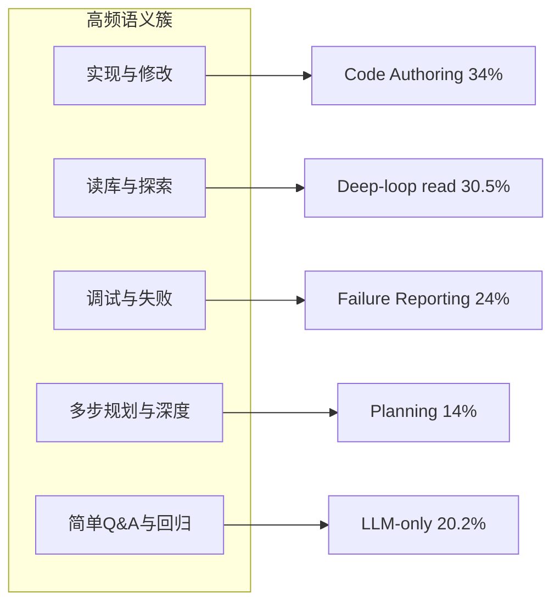

# Agent Eval Taxonomy：Workload 与 Harness Contract

> **状态：** 2026-08 调研备忘 · 2026-08 Harness 视角修订 · **notes**（非 Spec）
> **用途：** 区分 **workload taxonomy**、**Harness contract taxonomy**、API profile 与判分 oracle
> **关联：** [`harness-eval-1.0.md`](../../spec/harness-eval-1.0.md) · [`harness-eval-refactor-plan.md`](harness-eval-refactor-plan.md) · [`agent-eval-roadmap.md`](agent-eval-roadmap.md) · [`feature-ab-eval.md`](../../guides/feature-ab-eval.md) · [`packages/evals`](../../../packages/evals/)

---

## 1. 问题

MoonTide `@moontide/evals` 需要回答：

1. **Workload 按什么维度分类？** 哪些标签只描述任务内容或生产流量？
2. **Harness contract 按什么维度分类？** 如何验证 request、tool loop、state 与 failure handling？
3. **API profile 是否生效？** 配置是 supported、ignored、rejected，还是由 MoonTide emulated？
4. **有明确答案 vs 主观题** 如何判分？一次 merge 前 eval 如何选择 case 与重复次数？

本文汇总 **公开资料** 中的 task taxonomy，但修订后的结论是：生产任务分类只能提供 workload sampling，不能直接证明 MoonTide Harness 正确。Harness eval 还需要独立的 contract taxonomy、API profile 与分层 oracle（非产品 telemetry 规范）。

---

## 2. 公开资料是否存在？

**有，但没有统一行业标准。**

各厂/论文公开形态通常是：

- Research report（session 占比、趋势）
- PDF **Appendix 中的 classifier prompt**（完整 label 列表）
- Benchmark 论文中的 **分布图**（Figure 4 等）

**很少**放出可 SQL 的原始 telemetry 或内部 Dashboard 定义。第三方博客若无法追溯到 primary source，不应作为 taxonomy 依据。

### 2.1 可信度分层

| 层级 | 来源 | 公开内容 |
|------|------|----------|
| **A** | Anthropic [Claude Code expertise](https://www.anthropic.com/research/claude-code-expertise) | ~40 万 session → **9 work modes** + 时间序列占比 |
| **A** | OpenAI [Shift to Agentic (PDF)](https://cdn.openai.com/pdf/5d1e1489-21c0-43e4-9d42-f87efdbf0082/the-shift-to-agentic-ai-evidence-from-codex.pdf) | Codex **两级 task taxonomy**（Appendix E）+ 用量 Figure 5 / A3 / A4 |
| **A** | Microsoft [Agentic Coding in the Wild (PDF)](https://www.microsoft.com/en-us/research/wp-content/uploads/2026/08/ghcp_traces-6.pdf) | Copilot 3.2M 用户 / 13M session → **6 turn workflow** + **5 user archetypes** |
| **A** | [REAP](https://arxiv.org/html/2604.01527v3) (ASE 2026) | 生产 agent session → **17 task types**（testable/untestable）+ Harvest 分布 |
| **A** | [Programming by Chat](https://arxiv.org/html/2604.00436v1) | 11,579 IDE session → **7 主类 / 20 子类** message intent + **% 分布** |
| **B** | Anthropic [Economic Index Jan 2026](https://www.anthropic.com/research/anthropic-economic-index-january-2026-report) | O\*NET 职业、任务复杂度、成功率（非 coding 细类） |
| **C** | Anthropic [2026 Agentic Coding Trends](https://resources.anthropic.com/2026-agentic-coding-trends-report) | 趋势 + case study；**无完整 task 占比表**（门控下载） |
| **D** | [tokenscape](https://pypi.org/project/tokenscape/) 等 | 本地 session 解析 → 13 activity category；**非厂商官方** |

### 2.2 Benchmark 侧（非生产 telemetry，但定义「工程活动」）

| 来源 | 分类轴 |
|------|--------|
| [LongCLI-Bench](https://aclanthology.org/2026.findings-acl.1497/) | From Scratch / Feature Addition / Bug Fix / Refactoring |
| [EvoCode-Bench](https://arxiv.org/html/2605.24110) | construction、spec evolution、review、migration… |

---

## 3. 各来源 taxonomy 摘录

### 3.1 Anthropic — 9 work modes（session 单标签）

样本：~400,000 Claude Code sessions，~235,000 用户（2025-10 ~ 2026-04）。

| Work mode | 含义（简述） | 占比趋势 |
|-----------|--------------|----------|
| Building new code | 从零或新功能 | ~25% |
| Fixing broken code | 修 bug / 回归 | **33% → 19%** |
| Testing / orchestrating | 测代码或编排 agent | ~5% |
| Operating software | deploy、config、pipeline、监控 | **14% → 21%** |
| Planning / exploring | 理解系统、改前规划 | ~14% |
| Data analysis | 分析数据 | 合计 ~10% → ~20% |
| Writing documents | 非代码 prose | （同上） |

**解读：** agent 用法从「纯修 bug」转向「围绕代码的操作、分析与写作」；taxonomy 是 **session 目标**，不是 message 意图。

### 3.2 OpenAI Codex — 两级 task taxonomy

Classifier 按 **用户请求 outcome** 标注（非 incidental tool use）。Appendix E 给出完整 label 列表；一级族例如：

- Code Understanding / Code Implementation / Code Validation
- Engineering Operations / Application Management
- Data Analysis / Research / Knowledge Artifacts / Collaboration / Business Function Workflows

二级高频示例：

- Bug Fixing、Refactoring、Backend/Frontend Features、App Prototypes
- Code Q&A、Planning、Testing、Code Review、Security Audit
- Repo Management、Environment Configuration、Production Monitoring
- Documents、Presentations、Message Drafting、Codex Configuration…

**用量（Figure 5）：** Organizational 用户 **Engineering Operations 占比最高**；OpenAI 内部用户更偏 research、web search、app config。

**对 eval 的启示：** 生产任务谱极宽；feature eval 应 **粗分 + 按需子集**，不宜一次覆盖 Appendix E 全量 40+ label。

### 3.3 Microsoft Copilot — turn 级 workflow archetypes

基于 tool 组合、LLM 深度、token 聚类（2026-06 生产 trace）。

| Archetype | Share | 特征 |
|-----------|-------|------|
| Deep-loop read | **30.5%** | ~9 LLM calls；多读少改 |
| LLM-only | 20.2% | 无 tool；推理/解释 |
| Multi-cycle edit | 19.0% | 读→改→build 循环 |
| Multi-cycle other | 13.2% | 读为主 |
| Deep-loop w/failures | 9.1% | 失败重试放大算力 |
| Deep-loop run | 8.1% | terminal 为主 |

**用户 archetypes（Table 7）：** Readers 41.7%、Coders 30.4%、Terminal 11%、Deep-loop 9.2%、Chat-only 7.6%。

**对 eval 的启示：** 「探索读库」与「多轮编辑」是独立高频形态，应各有 case 覆盖。

### 3.4 Programming by Chat — message 级 intent（7+20）

74,998 messages，multi-label。

| 主类 | % Msg |
|------|-------|
| Code Authoring | **34.53** |
| Failure Reporting | **24.00** |
| Inquiry | 19.17 |
| Context Specification | 14.08 |
| Delegation | 16.48 |
| Workflow Control | 11.47 |
| Validation | **3.99** |

20 子类含：Iterative Modification、Log Paste、Symptom Description、Planning & Consultation、Project Comprehension、Toolchain Operation…

**对 eval 的启示：** 「写代码」与「报失败/贴 log」合计近 60% message；Validation 仅 ~4%，客观可验证题在生产对话中是少数但 eval 中应 **over-sample** 作 guard。

### 3.5 REAP — 17 类（生产 prompt → testability）

LLM classifier（Claude Sonnet 4.5）对首条 user message 分类；**正文未列全 17 名**，已知 partition：

**Testable 示例：** bug fix、feature request、refactoring、type/build/linting fixes、dead-code removal（部分）

**Untestable 示例：** documentation-only、code explanation、UI-only

Harvest benchmark 分布：**refactoring + feature request 领先**；单类 <25%；与 issue-derived benchmark（bug fix 主导）不同。

**对 eval 的启示：** 业界生产 eval pipeline 普遍做 **testable / untestable 二分**；MoonTide 的 `gradingMode: objective | subjective` 与此同构。

---

## 4. 跨来源收敛

各家 **标注粒度** 不同（session / turn / message / diff），但语义簇高度重叠：



| 语义簇 | 代表证据 |
|--------|----------|
| 实现/修改代码 | Code Authoring 34%；Codex Implementation |
| 读库/探索 | Deep-loop read 30.5%；Inquiry·Comprehension |
| 调试/失败 | Failure Reporting 24%；Codex Bug Fixing |
| 多步规划/深度 | Claude planning ~14%；MoonTide `deep:` 协议 |
| 简单 Q&A / guard | LLM-only 20.2%；Chat-only 7.6% |

**结论：** MoonTide 用 5 类左右的粗粒度 workload 标签覆盖生产任务有公开数据支撑；不必复制 OpenAI 40+ label 或 REAP 17 类。

但这些分类描述的是“用户要完成什么”或“LLM 正在处理什么形态的任务”，不是“MoonTide Harness 的哪条契约正在被验证”。`coding`、`exploration`、`deep_task`、`general`、`regression`，以及实现中后来加入的 `external_research`，都只能作为 workload sampling 维度，不能单独承担 Harness 正确性证明。

---

## 5. MoonTide 设计：四个正交维度

### 5.1 Case 不是一个 `category`

Harness contract case 包含四个正交维度；只评估用户结果的历史 case 必须显式标为 workload outcome case，不能伪装成 Harness contract 覆盖：

| 维度 | 建议字段 | 作用 |
|------|----------|------|
| **Case kind** | `kind` | 区分 `harness_contract` 与 `workload_outcome`，决定能否计入 Harness coverage |
| **Workload** | `workloadCategory` / tags | 提供 prompt、fixture、领域与任务形态；用于 workload sampling |
| **Harness contract** | `harnessClasses[]` | 声明本 case 要验证哪条 request / loop / state / recovery 契约 |
| **API profile** | `apiProfile` | 声明 baseline/candidate 的单变量配置和 provider capability 预期 |
| **Oracle** | `expected.request` / `expected.trace` / `expected.outcome` | 分别验证请求、运行协议与用户结果 |

`outcomeGrading` 只描述 outcome oracle 是确定性检查还是主观 judge；它不替代 request 和 trace contract。

建议结构：

```yaml
id: tool-required-read-file
kind: harness_contract
workloadCategory: coding
harnessClasses: [tool_decision, tool_loop]
apiProfile: responses-function-required
steps:
  - type: prompt
    content: Read version.txt and return its exact content.
expected:
  request:
    - kind: tool_available
      name: read_file
    - kind: tool_choice
      value: required
  trace:
    - kind: tool_called
      name: read_file
    - kind: tool_result_followed_by_request
  outcome:
    - kind: reply_contains
      value: 1.2.3
```

`workload_outcome` case 可以只有 `expected.outcome`，用于衡量真实任务完成率；它不需要虚构 `harnessClasses`，也不得计入 request / trace contract coverage。只有 `harness_contract` case 才必须声明至少一个 Harness class，并提供对应的 request 或 trace oracle。

### 5.2 Workload taxonomy：只负责抽样

现有 `coding`、`exploration`、`deep_task`、`general`、`regression`、`external_research` 可继续作为迁移输入，但不再决定 Harness contract：

| Workload 标签 | 主要用途 | 不证明什么 |
|---------------|----------|------------|
| `coding` | 文件、仓库、修改与测试 fixture | 不自动证明 tool loop 正确 |
| `exploration` | 查找、读取、理解多文件结构 | 不自动证明 context 编译正确 |
| `deep_task` | 多步调查、计划与决策 | 不自动证明 reasoning 或 work_mem 有效 |
| `general` | 无外部 fixture 的问答与解释 | 不自动证明“不该调用工具” |
| `regression` | 简单任务 guard | 不是独立领域，可以与其他 workload 重叠 |
| `external_research` | HTTP fixture、来源和 artifact 场景 | 更接近环境/工具标签，不是稳定的第六任务本体 |

后续可以把 workload 从单值 enum 改为非互斥 tags，但这不是 Harness contract 重构的前置条件。

### 5.3 Harness contract taxonomy：五类

| `harnessClass` | 要验证的问题 | 典型 contract |
|----------------|----------------|------------------|
| `request_shaping` | Composer / RunConfig 是否产生正确的语义请求 | system、roles、messages、tools schema、response format、max tokens、reasoning level |
| `tool_decision` | Agent 是否正确选择、拒绝或被约束使用工具 | none / auto / required / specified；正确工具、正确参数、无无效调用 |
| `tool_loop` | tool call → execution → result → next request → final 是否闭环 | 顺序、参数、result 关联、重复调用、停止条件、多工具 |
| `state_context` | 多轮、reload、compaction 后事实是否正确进入下一次请求 | history、Session Item、tool result、context manifest、事实连续性 |
| `constraint_recovery` | 约束与失败路径是否符合协议 | structured output、stream、截断、timeout、tool error、abort、retry、budget |

这五类与领域无关。同一条 coding prompt 可以验证 `tool_decision`，也可以验证 `state_context`；同一条 general prompt 可以验证 `tool_not_called`、structured output 或 max-token failure。

### 5.4 API profile 与 capability status

API 配置不是天然有效的 feature。每个 provider / adapter 应声明并通过 contract test 验证以下状态之一：

| 状态 | 含义 | Eval 行为 |
|------|------|-----------|
| `supported` | provider 按声明语义执行 | request + behavior 均须通过 |
| `ignored` | provider 接收但不执行 | 不得把 HTTP success 当能力通过 |
| `rejected` | provider 明确报错 | 验证稳定 error code / message |
| `emulated` | MoonTide 在 Harness 或 adapter 中补足语义 | 验证补偿逻辑和边界 |

以 DeepSeek Responses API 为例：`tool_choice` 支持 none / auto / required / 指定工具；`function` 与 `web_search` tools 支持；`parallel_tool_calls` 被忽略且始终开启；`previous_response_id`、`conversation`、`store` 与 `truncation` 不支持；不支持的部分参数可能被静默忽略。详见 [DeepSeek Responses API](https://api-docs.deepseek.com/zh-cn/guides/responses_api/)。

因此每个 API profile 必须同时记录：语义配置、resolved provider route、capability status、实际生效策略。不能只记录用户传入的参数。

### 5.5 三层 oracle

#### Request oracle：我们实际发了什么

从最终 `LLMRequest` / `LLMCallRecord` 验证：

- system / messages / roles / content blocks；
- tool schema 与 tool choice；
- response format、reasoning level、max tokens；
- resolved route 与 adapter family。

Provider wire 的字段映射只在 adapter contract test 中断言，避免把厂商字段泄漏进 Agent Core。

#### Trace oracle：Harness 如何执行

从 RunEvent、Session Item 和 tool execution trace 验证：

- tool 应调用 / 不应调用；
- 调用顺序与参数；
- tool result 是否与 call id 配对；
- result 后是否形成下一次 LLM request；
- timeout、abort、retry、error 和 stop reason；
- 是否出现不必要的重复调用。

#### Outcome oracle：用户结果是否正确

继续使用文件、回复、测试、artifact、rubric 等结果检查。Outcome 通过不代表 request / trace 一定正确；request / trace 通过也不代表用户目标已经完成。

### 5.6 Tool 不是天然正向指标

`tool_called` 只能证明发生过调用，不能证明调用有价值。工具相关 case 必须包含正向与负向 control：

| 场景 | 正确行为 |
|------|----------|
| 事实只存在于 fixture / tool 中 | 调用正确工具并使用结果 |
| 模型自身可可靠回答的简单问题 | 不产生无必要 tool call |
| `tool_choice=none` | 不调用工具 |
| `tool_choice=required` | final 前至少有一次合法调用 |
| 工具返回错误 | 恢复、换路径或明确报告，不能编造成功 |
| 工具结果已充分 | 停止调用并完成结果 |

其他配置的正向作用可能体现在格式合规、恢复率、成本、延迟或安全边界，而不是 task score：stream 应测语义重建与首 token 延迟；reasoning level 应测质量/成本 trade-off；max tokens 应测 incomplete 处理；response format 应测机器可解析率。

### 5.7 A/B 必须是单变量 intervention

每个 L2 API profile eval 先写可证伪 claim：

```text
在固定 model、prompt、tools、fixture 与 judge 下，
只改变 tool_choice=auto → required，
要求 tool-required case 的合法调用率提高，
同时 no-tool guard 不参与该比较。
```

Baseline 与 candidate 必须只有一个已记录的 config 差异；否则结果不能归因。对于预期无 effect 的配置，也应允许结论为 neutral，而不是强迫 candidate 获得正向 lift。

### 5.8 `outcomeGrading`、规模与 batch

- `objective`：request / trace / outcome 的声明式 checks 优先，零 LLM judge；
- `subjective`：只用于无法由确定性 oracle 判定的 outcome；
- LLM judge 不应判定 request 是否包含某字段或 tool event 顺序；
- batch 应按相同 `harnessClasses` + `outcomeGrading` + API profile 分组，不能只按 workload category 分组。

规模由 intervention 决定，而不是固定“每个 workload 15 题”：开发迭代每条 Harness contract 先有 1 个正向 control、1 个负向 guard、1 个 failure case；真 LLM merge 决策再根据方差增加 repetitions。

---

## 6. 与现有 MoonTide 文档关系

| 文档 | 职责 |
|------|------|
| **本文（notes）** | Workload 调研 + Harness contract / API profile / oracle 分类依据 |
| [`harness-eval-refactor-plan.md`](harness-eval-refactor-plan.md) | 从当前 v2 schema 迁到 contract-first eval 的重构计划 |
| [`harness-eval-1.0.md`](../../spec/harness-eval-1.0.md) | 实现 Spec **1.1**（pairwise judge、schema、runner） |
| [`agent-eval-roadmap.md`](agent-eval-roadmap.md) | L0–L3 路线、分桶 A–E、Impact Card |
| [`feature-ab-eval.md`](../../guides/feature-ab-eval.md) | 工作流与成本；Pi upstream 参考 |

---

## 7. 参考文献（primary source）

1. Anthropic — *How Claude Code is used in practice* — https://www.anthropic.com/research/claude-code-expertise  
2. OpenAI — *The Shift to Agentic: Evidence from Codex* — https://cdn.openai.com/pdf/5d1e1489-21c0-43e4-9d42-f87efdbf0082/the-shift-to-agentic-ai-evidence-from-codex.pdf  
3. Microsoft Research — *Agentic Coding in the Wild* — https://www.microsoft.com/en-us/research/wp-content/uploads/2026/08/ghcp_traces-6.pdf  
4. REAP — *Automatic Curation of Coding Agent Benchmarks from Interactive Production Usage* — https://arxiv.org/html/2604.01527v3  
5. Programming by Chat — https://arxiv.org/html/2604.00436v1  
6. LongCLI-Bench — https://aclanthology.org/2026.findings-acl.1497/  
7. EvoCode-Bench — https://arxiv.org/html/2605.24110  
8. DeepSeek — *使用 Responses API* — https://api-docs.deepseek.com/zh-cn/guides/responses_api/
