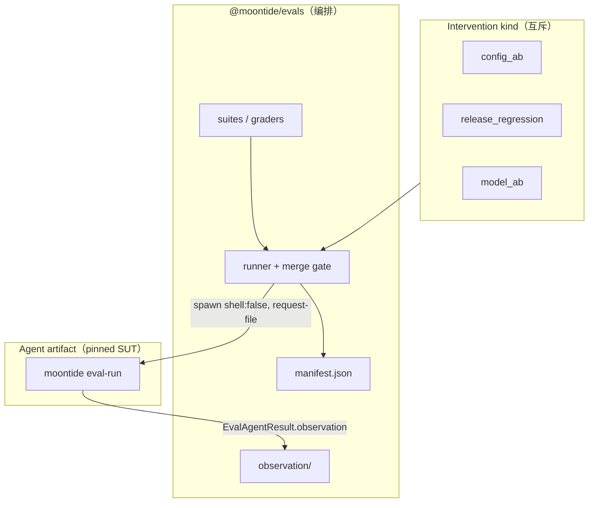

> **状态：** 2026-08 开发计划（候选，未实现）  
> **性质：** L2 eval 从「源码耦合」迁到 **pinned agent build artifact** 的工程方案  
> **现行实现：** [`packages/evals`](../../../packages/evals/) 仍 import `packages/agent-cli/src` + `tsx`（Harness Eval 1.x 过渡期）  
> **关联：** [`agent-eval-roadmap.md`](agent-eval-roadmap.md) · [`harness-eval-1.0.md`](../../spec/harness-eval-1.0.md) · [`harness-eval-refactor-plan.md`](harness-eval-refactor-plan.md) · [`platform-strategy.md`](../../product/platform-strategy.md) · [`packages/evals/README.md`](../../../packages/evals/README.md)

**术语：** 本文用 **agent artifact**（agent build artifact）指被测的二进制或 dist 产物。候选 artifact 在 eval 通过前**不是** release；release 是发布动作，artifact 是系统 under test（SUT）。

---

## 1. 问题

### 1.1 现状

`@moontide/evals` 通过相对路径直接加载产品源码，并用 dev 路径执行 agent：

```text
packages/evals/scripts/run-agent-job.ts
  → import ../../../packages/agent-cli/src/bootstrap.js
  → moontide-harness.ts import AgentSession、eval-overrides 等

spawnAgentJob:
  pnpm exec tsx --tsconfig tsconfig.dev.json <workerScript>
```

特征：

- eval **不依赖** `moontide` app 的 build 产物；
- 测的是 **工作树内 tsx 行为**，不是 pinned agent artifact；
- 「子进程隔离」只隔离进程，**未**隔离为 artifact 边界；
- worker 输出以 **reply-only** 为主，不足以支撑 contract-first 的 request / trace / outcome grader（见 [`harness-eval-refactor-plan.md`](harness-eval-refactor-plan.md) §4.4）。

### 1.2 缺口

| 缺口 | 后果 |
|------|------|
| 外部效度 | merge gate 不能代表「用户安装的 agent 行为」 |
| 可回放配置 | 难以用 **artifact 坐标 + 完整实验配置** 复跑历史 eval |
| 证据层 | 无 versioned headless 协议 → trace / request oracle 无法落地 |
| 边界 | eval 包 import 产品内部模块（`eval-overrides`），与产品 API 未分离 |
| 配对比较 | 若 baseline 用历史 aggregate、candidate 用当日 run，比较无效 |

### 1.3 现行 manifest 已知不足（待 R0 修）

[`suiteContentHash`](../../../packages/evals/src/manifest.ts) 仅 hash `suiteVersion` + case id 列表；prompt / rubric / fixture 变更可能保持相同 hash。

[`harnessAbDiffFields`](../../../packages/evals/src/intervention.ts) 将 `judgeModel` 视为合法 A/B diff——**错误**；judge 属于 grader，不是 agent intervention（见 §6）。

---

## 2. 目标

**L2 gate**（真 LLM、merge gate / nightly / pre-release）应驱动 **pinned agent artifact**，而不是 monorepo 源码。

| 角色 | 职责 |
|------|------|
| **Agent artifact** | SUT：固定版本的 CLI / dist binary |
| **`@moontide/evals`** | suite / grader / judge / merge gate；spawn artifact；写 manifest |
| **Eval run 目录** | 证据源：`observation/`、脱敏 trace、aggregate、`manifest.json` |

eval 编排层 **不在** 包内 `import packages/agent-cli/src/**`；通过 **versioned headless 协议**（§4）与 artifact 通信。

---

## 3. 设计原则

| 原则 | 说明 |
|------|------|
| **Artifact 为 L2 SUT** | gate 使用 pinned agent artifact；eval run 目录 + manifest 为证据源 |
| **实验类型 discriminated** | `config_ab` / `release_regression` / `model_ab` 分类型；**不可**混为通用「单变量 toggle」 |
| **Grader 与 agent 分离** | baseline / candidate **同一 judge 配置**；`judgeModel` 不得作为 arm diff |
| **配对执行** | L2 gate 在同一 eval window 内 **重跑 baseline 与 candidate**；历史 aggregate 仅作趋势 |
| **Replayable 配置** | manifest 记录完整实验配置；**不**承诺 live model 输出 bitwise 可复现 |
| **Contract-first 协议先行** | R0 定稿 request/result envelope 与 redaction；**再** build headless CLI（§10） |
| **分层保留 fast path** | L0/L1 仍可用源码 + mock；L0/L1 contract 结果仍写入 Impact Card（§9） |
| **平台终局** | Rust `moontide` CLI（[`platform-strategy.md`](../../product/platform-strategy.md)）；TS 阶段用 dist 过渡 |

---

## 4. Headless 协议（R0，必须先于 R1）

R1 若只做 reply-only stdout，会锁死 outcome-first 路径，R2 contract grader 需 breaking rewrite。**R0 必须与 [`harness-eval-refactor-plan.md`](harness-eval-refactor-plan.md) §4.4 `EvalRunObservation` 对齐。**

### 4.1 版本化 envelope

**stdin 或私有 JSON 文件**传入 request；**stdout 一行 JSON** 返回 result（stderr 人类日志）。不通过 shell 拼接 prompt。

```typescript
/** @eval-protocol 1 — bump on breaking field changes */
interface EvalAgentRequest {
  protocolVersion: 1;
  runId: string;
  caseId: string;
  workdir: string;
  steps: EvalStep[];
  semanticConfig: EvalSemanticConfig;
  budgets: EvalBudgets;
}

interface EvalAgentResult {
  protocolVersion: 1;
  status: "succeeded" | "failed" | "aborted";
  observation: EvalRunObservation;
  artifactRefs: ArtifactRef[];
  error?: EvalAgentError;
}

/** 与 harness-eval-refactor-plan §4.4 一致 */
interface EvalRunObservation {
  llmCalls: EvalLlmCallObservation[];
  runEvents: RunEvent[];
  outcome: EvalRunOutput;
}
```

要求：

- **`runEvents` 必须始终收集**（contract case 的 trace grader 依赖）；人类 verbose 渲染可选，与采集正交；
- **`llmCalls`**：脱敏后的 semantic `LLMRequest`、resolved route、stop reason、usage；wire body 不入库；
- **`outcome`**：reply、turn、session 摘要、文件/artifact 指针等 outcome grader 输入；
- **`EvalSemanticConfig`**：typed Preset / RunConfig 快照（§8），不是 loose env map；
- exit code：0 成功；非 0 带稳定 `errorCode`。

CLI 表面形态（示意）：

```bash
# executable 为单一二进制路径；node 作 launcher 时见 §5
moontide eval-run --request-file=/tmp/eval-req.json --result-file=/tmp/eval-res.json
```

**禁止** R1 临时协议：仅 `{ reply, turn, sessionId }` 的 stdout。

### 4.2 脱敏（redaction）

observation 写入 eval run 目录前必须经过 **redaction policy**（版本号写入 manifest）：

| 类别 | 默认 |
|------|------|
| semantic LLM request | 保留结构；API key / auth header 剔除 |
| tool arguments | 保留相对路径；绝对 home / 临时目录替换为占位符 |
| RunEvent payload | 同上；大块 user content 可 truncate + hash |
| session items | case 需要的字段；PII 按 suite 声明 |
| model output | 完整保留于 run artifact；对外 report 可按 policy 摘要 |

redaction 版本与 protocol 版本独立 bump。

### 4.3 与 REPL / AgentRun 的关系

headless 子命令与 REPL **共用** `AgentRun` 执行路径；eval 通过 `extraRunEventListeners`（或等价 port）订阅 RunEvent 写入 `observation.runEvents`，**不是**可选 verbose 开关。

---

## 5. 进程启动契约

### 5.1 结构化 launch spec

**禁止** `MOONTIDE_EVAL_BIN="node packages/agent-cli/dist/main.js"` 这类需 shell 解析的「单字符串命令」。

```typescript
interface AgentArtifactCommand {
  executable: string;   // 单一路径，如 /path/to/moontide 或 /path/to/node
  args: string[];       // 如 ["eval-run", "--request-file", "..."]
  digest: string;       // SHA-256 of executable（或 node + script 组合 digest）
  buildKind: "ts-dist" | "rust-release" | "ci-tarball";
  platform: string;     // os.arch，如 darwin.arm64
  sourceSha: string;    // 构建该 artifact 的 git sha
}
```

baseline / candidate **各自** 一条 `AgentArtifactCommand`（`release_regression` 时两条 digest 不同）。

`EvalAgentRequest` 经 **stdin 或 `--request-file`** 传入；**不**把 prompt / harness JSON 塞 argv（长度、quoting、进程表泄露）。

### 5.2 Runner 职责

eval runner 必须：

- `spawn(executable, args, { shell: false })`；
- 超时、取消、**进程树终止**；
- 隔离 workdir / config 目录；
- stdout/stderr / observation **输出大小上限**；
- 不经过 shell 管道解析用户内容。

TS 过渡：launcher 可为 `node`，`args[0]` 为 `packages/agent-cli/dist/main.js`；manifest 记录 **组合 digest**。

---

## 6. 实验类型（intervention kinds）

**禁止** 将 artifact 版本对比与 feature toggle 都称为「单变量 feature 实验」。改用 discriminated kind：

| Kind | Arms | 有效结论 | merge gate 用语 |
|------|------|----------|-----------------|
| **`config_ab`** | 同一 artifact；**一处** semantic config diff | 因果式 capability-impact（在配对噪声下） | 可用 `expectLift` / feature Impact Card |
| **`release_regression`** | stable artifact vs candidate artifact；**完全相同** semantic config | 发布兼容 / 回归；**不可**归因到单一 feature | **禁止** `expectLift`；仅 regression / no-regression |
| **`model_ab`** | 同一 artifact；model route 为显式 intervention | 模型能力对比 | model 专项 gate；与 feature PR 分开 |

硬规则：

- **`release_regression` 禁止** candidate 侧「intentional config 变更」——否则两轴叠加；
- **`judgeModel` / judge route 两 arm 必须相同**；变更 judge 是 grader 实验，不是 harness A/B；
- **`config_ab`** 仅允许 **一处** semantic config diff（与今日 toggle 意图一致，但 config 类型化后不限于 boolean）；
- 一次 L2 run **只有一种** intervention kind。

现行代码债：实现 R0 时重写 `ResolvedEvalIntervention` 与 `harnessAbDiffFields`，移除 `judgeModel` arm diff。

---

## 7. 配对执行与 baseline.json

### 7.1 L2 gate 执行模型

Provider / model 行为会漂移。**无效**比较：

```text
candidate run（今日）
vs
baseline aggregate（上周 manifest 缓存）
```

L2 gate 必须：

1. **同一 eval window** 内对 baseline artifact 与 candidate artifact **均执行**完整 suite（或选定 case 子集）；
2. **同一** agent model route、fixtures、budgets、repetitions、**judge 配置**；
3. baseline / candidate repetitions **交错或随机化**（降低时间漂移偏差）；
4. pairwise judge 仅在 **成对 observation** 上运行。

### 7.2 baseline.json 角色

| 用途 | 允许 |
|------|------|
| 趋势 / nightly 仪表盘 | 引用 **完整历史 run artifact**（manifest + observation hash） |
| merge gate 配对 baseline | **禁止**仅用 aggregate；必须同窗重跑 baseline arm |
| `release_regression` | baseline = 上一 **stable artifact 坐标**；同窗重跑，非 aggregate 复用 |

---

## 8. Manifest：可回放实验配置

目标：**replayable experiment configuration**（相同输入配置可重跑实验），**非**「bitwise 可复现的 model 输出」。

每次 L2 run 的 `manifest.json` **至少**包含：

### 8.1 Agent artifact（每 arm）

| 字段 | 要求 |
|------|------|
| `baseline.agentArtifact` / `candidate.agentArtifact` | 完整 `AgentArtifactCommand` |
| `*.digest` | **必填** SHA-256 |
| `*.version` | semver 或 `x.y.z+git.abc` |
| `*.sourceSha` | 构建源码 sha |
| `*.buildKind` / `*.platform` | 见 §5.1 |

### 8.2 Eval runner

| 字段 | 说明 |
|------|------|
| `evalRunner.version` | `@moontide/evals` 包版本 |
| `evalRunner.sourceSha` | 构建 eval runner 的 git sha |
| `protocolVersion` | headless 协议版本（§4.1） |
| `redactionVersion` | §4.2 |

### 8.3 Suite 与 case

| 字段 | 说明 |
|------|------|
| `suiteContentHash` | **全量** hash：prompts、fixtures、rubrics、expected checks、oracle 定义（非仅 id 列表） |
| `suiteVersion` / `suitePath` | 与现 manifest 对齐 |
| `caseIds` | 本次选中 case |
| `repetitions` / `budgets` | 与 request 一致 |

### 8.4 Harness / grader

| 字段 | 说明 |
|------|------|
| `intervention.kind` | `config_ab` \| `release_regression` \| `model_ab` |
| `intervention.diff` | 声明的单 diff 字段路径 |
| `semanticConfig.baseline` / `.candidate` | typed config 快照（`config_ab` / `model_ab`） |
| `judge.route` | **单条**；两 arm 相同 |
| `judge.promptVersion` / `judge.schemaVersion` | judge 模板版本 |
| `agentModel.route` | resolveRoute 结果 |
| `capabilityManifestHash` | adapter capability 表 hash |

### 8.5 录制与 observation

| 字段 | 说明 |
|------|------|
| `fixtureDigests` / `httpRecordingDigests` | 外部 fixture / VCR |
| `observationArtifactHashes` | 每 case×arm×rep 的 observation 文件 hash |
| `priorRunRef` | 趋势对比时指向完整历史 run，非 aggregate  alone |

---

## 9. Semantic 配置（产品面）

### 9.1 要求

可被 eval 切换的行为必须在 **typed、versioned `EvalSemanticConfig`** 中声明（Preset / RunConfig 快照），经 headless request 传入 artifact。

环境变量可 **传输** 配置，但 **不是** 契约本身。每个可配置 capability 需要：

| 属性 | 说明 |
|------|------|
| type / allowed values | 如 `toolChoicePolicy: "auto" \| "required" \| "none"` |
| default | artifact 版本默认值 |
| owner | Preset / 模块 |
| supportedProtocolVersions | 与 agent artifact 能力对齐 |
| capabilityStatus | 见 refactor plan `CapabilityStatus` |
| deprecation | 移除策略 |

`thinkingDefault`、`toolChoicePolicy` 等是 **semantic config**，不是 boolean `featureToggles`。

### 9.2 eval-overrides

`eval-overrides.ts` 保留 **L1 / dev-only** 或删除；**L2 gate 禁止** eval 私有 override import。`config_ab` 只 diff 产品声明的 config 键。

---

## 10. 分层与 Impact Card

| 层 | Agent 来源 | merge gate | Impact Card |
|----|------------|------------|-------------|
| **L0** | 单测 / mock | 否 | **contract / 机制证据可写** |
| **L1** | 源码 + mock LLM | 否 | **protocol smoke 可写** |
| **L2 dev** | 源码 `tsx` | 否 | 本地迭代 only |
| **L2 gate** | pinned artifact | **是** | capability-impact / regression 主张 |
| **L3** | artifact + 外部 benchmark | tag 前 | 外部对标 |

规则：**capability-impact 主张** 需要 L2 gate（`config_ab`）；**L0/L1 contract 失败** 仍必须在 Impact Card 呈现，不能被 L2 覆盖。

---

## 11. 目标架构



---

## 12. 与现行 `@moontide/evals` 的差异

| 项 | 现行（1.x） | 目标 |
|----|-------------|------|
| Agent 加载 | `import packages/agent-cli/src/...` | `AgentArtifactCommand` spawn |
| Worker | `tsx` + dev tsconfig | artifact `eval-run` |
| 输出 | reply-first | `EvalRunObservation` 三层证据 |
| Intervention | toggle + 误含 judgeModel | discriminated kind（§6） |
| 配对 | 同窗 baseline+candidate run | 同窗 **重跑** 两 artifact |
| Overrides | `eval-overrides.ts` | `EvalSemanticConfig` |
| suiteHash | id 列表 | 全量 suite content hash |

编排层（pairwise judge、guard+primary、concurrency）保留；**grader 输入** 从 reply 扩展到 observation。

---

## 13. 迁移分期

**R0 协议与 refactor plan §4.4 对齐；implementation 可并行，但 schema 不可分叉。**

| Phase | 内容 | 验收 |
|-------|------|------|
| **R0 协议** | `EvalAgentRequest` / `EvalAgentResult` / redaction / `AgentArtifactCommand`；manifest 字段定稿；`intervention` kind 设计 | Spec 评审；types 进 `packages/evals` 或 shared eval-protocol 包 |
| **R0b observation ports** | 与 [`harness-eval-refactor-plan.md`](harness-eval-refactor-plan.md) Phase 3 对齐：llmCalls + runEvents + outcome | contract case 可跑 trace/request oracle（mock LLM） |
| **R1 headless CLI** | `moontide eval-run` 实现上述协议；共用 `AgentRun` | L1 mock 绿；stdout 非 reply-only |
| **R2 去源码 import** | eval 只 spawn TS dist artifact | L2 smoke；manifest 含 digest |
| **R3 `config_ab` on artifact** | 产品 semantic config；移除 L2 `eval-overrides` | feature-pr gate 绿 |
| **R4 `release_regression`** | 同窗双 artifact；禁止 config 混 diff | pre-release vN vs vN+1 |
| **R5 Rust CLI** | 同协议 impl 于 Rust `moontide` | platform-strategy 对齐 |

**不可** 在 R0 未完成时 ship R1 reply-only 路径。

---

## 14. 非目标

- 用 artifact eval **替代** L0/L1  
- 每 PR 全量真 LLM  
- eval 包 deep import 产品模块  
- 单次 run 混合 intervention kind  
- `release_regression` 上做 feature 因果断言或 `expectLift`  
- 承诺 live LLM 输出 bitwise 可复现  

---

## 15. 开放问题

1. **Artifact 分发**：GitHub Release vs CI artifact 库 vs 本地 `dist/`？  
2. **RC 命名**：`1.3.0-rc.1+git.sha` 与 npm/rust 版本统一？  
3. **Rust vs TS canonical**：L2 gate 以哪一个为默认 SUT？  
4. **eval-protocol 包边界**：类型放 `@moontide/evals` 还是独立 `@moontide/eval-protocol`？  
5. **Observation 存储格式**：单文件 JSON vs NDJSON per turn？

---

## 16. 相关文档

| 文档 | 关系 |
|------|------|
| [`harness-eval-refactor-plan.md`](harness-eval-refactor-plan.md) | `EvalRunObservation` · request/trace/outcome grader · **R0 必须先对齐** |
| [`agent-eval-roadmap.md`](agent-eval-roadmap.md) | L0–L3 · Impact Card |
| [`harness-eval-1.0.md`](../../spec/harness-eval-1.0.md) | 现行 Spec（1.1 outcome-first） |
| [`platform-strategy.md`](../../product/platform-strategy.md) | Rust release CLI |
| [`.github/eval-impact-card.md`](../../../.github/eval-impact-card.md) | PR 模板 |

---

## 17. 变更记录

| 日期 | 说明 |
|------|------|
| 2026-08 | 第二稿：纳入 external review — headless 协议、intervention kinds、manifest、配对执行、launch spec |
| 2026-08 | 初稿：agent artifact L2 eval · 双轴 A/B · 迁移 R0–R4 |
