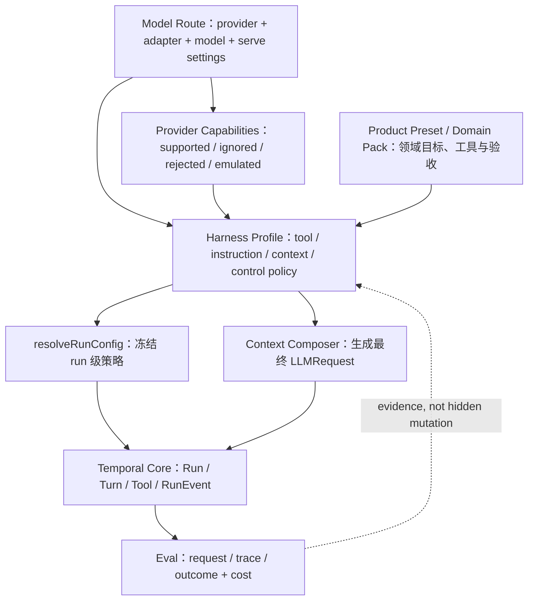

# Model–Harness Fit 与 Harness Profile 研究方向

> **文档性质：** notes（研究方向与 feature backlog，非实现 Spec、非近期交付承诺）  
> **状态：** 2026-08 讨论稿  
> **外部依据：** [Meta-Harness coding comparison](https://github.com/JoelNiklaus/harness-optimization#how-much-is-the-harness-worth-swe-bench-pro) · [Meta-Harness paper](https://arxiv.org/abs/2603.28052)  
> **关联：** [`agent-runtime-product-direction`](../runtime/agent-runtime-product-direction.md) · [`harness-eval-refactor-plan`](harness-eval-refactor-plan.md) · [`agent-eval-task-taxonomy`](agent-eval-task-taxonomy.md) · [`llm-provider`](../../spec/llm-provider.md) · [`context-composer`](../../spec/context-composer.md)

## 1. 当前结论

Harness 是 Agent 系统能力的一部分，不是固定模型外的一层中性包装。同一模型更换 Harness，结果可能出现足以改变产品判断的差异；同一 Harness 在不同模型上的相对排名也可能不稳定。

因此，MoonTide 的长期方向不应是寻找一个对所有模型都最优的 Harness，也不应按模型参数量复制多套 Agent Runtime。更合理的目标是：

> 保持统一的 Temporal Core 和安全、状态、观测不变量；将模型可见的工具、指令、上下文与控制策略组织为可声明、可评测的 Harness Profile，并为具体模型路由与任务域选择经过验证的组合。

这里的 `Harness Profile` 是工作术语，表示一组模型交互策略，不是已经确定的新 runtime 类型。只有出现至少两个需要长期维护的真实配置，并完成边界验证后，才决定是否引入正式接口。

## 2. 外部实验提供的证据

Meta-Harness 项目的 coding comparison 在相同的 250 个 SWE-bench Pro held-out tasks 上，对十种现成 coding Harness 和两个模型各运行一次：

- GLM-5.2 744B-A40B：pass@1 范围为 23.2%–52.4%；
- Gemma 4 26B-A4B：pass@1 范围为 15.2%–36.0%；
- 两个模型的 Harness 排名 Spearman 相关系数为 `-0.05`；
- GLM 上 `mini-swe-agent` 领先，Codex 和 Claude Code 也处于较高区间；
- Gemma 上 Crush、OpenCode 等更通用的 Harness 上升，Codex 和 Claude Code 的相对排名下降。

项目同时记录了 token 成本、graded patch、transcript、`no_patch`、timeout 与 Harness failure 等信息。其结果支持两个判断：

1. Harness 选择可以产生一阶影响，不能只报告基础模型名称；
2. Harness 排名不能假定能跨模型迁移，模型与 Harness 必须作为组合评测。

论文的其他实验也说明，“更厚”不是稳定的优化方向：一个优化后的 context system 在效果提升的同时使用了约四分之一的 context token；另一个 Harness 在五个 held-out 模型上取得平均提升。部分策略可以迁移，但需要通过实验识别，不能从复杂度推断。

## 3. 证据不支持的推论

当前证据不能直接推出：

- 强模型使用越厚的 Harness 越好；
- 小模型需要越自由、越少约束的 Harness；
- Codex、Claude Code、Pi 等产品的总体复杂度就是结果差异的原因；
- 参数量可以直接决定 Harness 配置；
- coding benchmark 上的组合排名能直接迁移到 Spark、research 或其他产品域。

这次比较只有两个不同家族的模型，每个 task 只有一次 rollout。模型规模还与 post-training、tool-call 格式、provider adapter、context window、output cap、推理速度及 Harness 兼容性混杂。项目记录中也出现过未生成 patch、上下文窗口配置错误、任务指令没有正确传入和平台二进制不兼容等问题。

所以，这项实验说明了 **model–Harness interaction 存在且很大**，但没有分离出“厚度”或“自由度”的因果作用。

## 4. 更准确的设计模型

“厚 / 薄”混合了两个应当分开的维度。

### 4.1 模型可见表面

模型每 turn 实际看到和需要理解的内容：

- system / developer instruction 的数量、结构与密度；
- tool catalog 的大小、命名、schema 与描述；
- 当前 working set、历史消息、compaction 和 artifact 摘要；
- 是否要求显式计划、检查点、反思或固定输出格式；
- 一个动作需要模型完成多少选择和协议步骤。

能力较弱或 tool-call 稳定性较差的模型，可能更适合较窄、低分支、低歧义的模型可见表面。这不等于让模型更自由。

### 4.2 确定性 Runtime

模型之外、由程序执行和强制的机制：

- permission、approval 与 capability policy；
- wall-clock、turn、token、tool-call 和 cost budget；
- abort、timeout、settlement、retry 与错误分类；
- tool call / result 配对、schema validation 和 outcome verification；
- Session Item Log、RunEvent、artifact 与 eval observation；
- sandbox、workspace isolation、redaction 与审计。

这些机制不应因为模型较小而减少。更合适的概括是：

> 小模型可能需要更薄的模型可见表面，以及更强的外部编排；所有模型都需要完整的 Runtime 不变量。

强模型可以利用更丰富的可选工具和动态上下文，但仍可能受到重复指令、冲突约束和无效历史的影响。“能承受更多内容”不代表“更多内容一定更好”。

## 5. MoonTide 的目标分层



### 5.1 保持统一的不变量

- `@moontide/agent-core` 继续只拥有时序、RunConfig、RunEvent 和 Effect port；
- Context Composer 继续是最终 `LLMRequest` 与 Context Manifest 的唯一 owner；
- provider 专有字段和 wire 差异继续留在 API 适配层；
- Session Item Log、RunEvent、artifact 和 eval observation 保持各自事实边界；
- permission、cancellation、budget enforcement 和安全边界不允许由 Profile 关闭；
- Product Preset / Domain Pack 继续拥有领域工具、工作流与 outcome verifier。

### 5.2 可以实验的 Harness Profile 维度

| 维度 | 候选干预 | 首要观测 |
|------|----------|----------|
| Tool surface | 全量、按 capability 筛选、按阶段披露 | 合法调用率、错误参数、未调用、无效调用 |
| Instruction | 简短约束、结构化步骤、渐进披露 | instruction adherence、冲突、重复 token |
| Context | working set 大小、compaction 时机、artifact 摘要 | context 利用率、遗漏、prefix cache、成本 |
| Control | 自主规划、显式阶段、程序化 checkpoint | 完成率、无效 turn、恢复率、人工介入 |
| Recovery | 失败反馈、有限 retry、降级策略 | repeated failure、timeout、成功恢复 |
| Budget | turn / output / tool / cost 档位 | 完成率、截断、成本、延迟 |

Profile 只描述允许变化的策略，不重新定义工具语义、事实源或运行协议。

## 6. 选择依据：能力证据，而不是模型规格

参数量、MoE active parameters、context window 和 vendor 标签只能作为候选先验。实际选择至少需要以下证据：

- tool selection、tool-call schema 和 argument validity；
- 多轮 tool result 后的 state continuity；
- 长上下文增加后是增益、持平还是退化；
- 对约束、停止条件和输出格式的遵循；
- tool error、invalid result 和 partial progress 后的恢复；
- `no_patch` / no-output、timeout、harness-failure 和 abort outcome；
- verified completion、token、latency、cost 与人工介入；
- adapter capability 与模型 post-training 预期是否匹配。

因此，选择键至少是：

```text
model route
× adapter capability revision
× Harness Profile revision
× Product Preset / workload
```

不能只用 `modelId`，也不能只用“small / large model”。同一模型在不同 provider、量化、context/output cap 或 tool parser 下可能属于不同实验条件。

## 7. 与 Harness Eval 的关系

本方向依赖 contract-first eval，而不是另建一套 benchmark：

- `request` 验证 Profile 是否真的改变最终 semantic `LLMRequest`；
- `trace` 验证 tool loop、state continuity、constraint 和 recovery；
- `outcome` 验证用户目标是否实际完成；
- manifest 固定 model route、adapter、Profile revision、Product Preset、case 与预算；
- report 同时呈现 verified completion 和 guard metrics，不使用单一总分选择 Profile。

每次实验只改变一个可以解释的维度。例如先比较相同 tool catalog 下的 context policy，再比较相同 context policy 下的 tool surface。不得把 instructions、tools、budget 和 recovery 同时改变后，将差异归因于“Profile 更适合模型”。

建议的首批 guard metrics：

- valid tool-call rate；
- required-tool omission 与 forbidden-tool call；
- no-output / `no_patch`；
- timeout、abort 与 budget exhaustion；
- repeated identical failure；
- token、tool-call、wall-clock 和 estimated cost；
- permission、sandbox 与 evidence-integrity failure。

## 8. 分期 Backlog

### Phase 0 — 建立可解释基线

- 完成 request / trace / outcome observation 与 grader 边界；
- manifest 能固定 model route、adapter capability、预算和 Harness revision；
- 选择一个已观察到的具体失败模式，不先创建通用 Profile 系统。

### Phase 1 — Eval-only Profile

- 在 eval 配置中定义两个小型 treatment，不进入生产 runtime 公共 API；
- 候选标签可以使用 `minimal` / `standard` / `rich`，但只表示实验配置，不表示模型等级；
- 同一模型、同一 case、同一预算做 paired comparison；
- 对至少两个 model route 重复，检查排序是否迁移。

### Phase 2 — 声明式产品配置

- 只有某个维度产生可重复收益且没有 guard regression，才进入 Product Preset；
- 明确 Profile 的 owner、resolve 时机、默认值、override 顺序和 manifest fingerprint；
- 通过 conformance 防止 Profile 绕过 permission、budget 或 Context Composer。

### Phase 3 — 选择策略

- 先支持显式选择和版本化默认值；
- 累积足够矩阵数据后，再考虑按 route / workload 推荐默认 Profile；
- 自动选择必须输出选择依据，并记录到 run manifest；
- 不在单次 run 中根据未审计的模型输出隐式改写 Profile。

### Phase 4 — 受控优化研究

- 在 disposable task environment 中搜索 Profile 候选；
- optimizer 只读取脱敏 trace、确定性聚合和失败分类；
- 使用 holdout、anti-gaming、cost 和 safety guard；
- candidate 先进入 eval，不自动升级为产品默认配置。

## 9. 进入实现的前置条件

只有同时满足以下条件，才从 research backlog 升级为实现计划：

- [ ] 已有两个可复现的 model route；
- [ ] 已明确一个当前 Harness 的具体失败模式；
- [ ] 存在只改变一个维度的 control / treatment；
- [ ] request / trace / outcome artifact 可回放；
- [ ] runtime 能强制执行 turn、token、tool、time 和 cost limits；
- [ ] 有 verified completion primary metric 和预先声明的 guard metrics；
- [ ] Profile 不会建立第二个 Context Composer 或 provider routing 路径；
- [ ] 预估收益足以抵消新增配置、测试矩阵和维护成本。

## 10. 非目标

- 当前立即实现 `HarnessProfile` 类型或自动路由器；
- 按参数量硬编码 small / medium / large 三档；
- 为每个模型 fork Agent Core、Session 或 Context Composer；
- 把“minimal”解释为取消 permission、sandbox、budget 或 outcome verification；
- 把单个 coding benchmark 的排名直接变成所有产品的默认值；
- 以更多 tools、更多 instructions 或更多 context 作为进步指标；
- 在缺少 paired control 和 guard metrics 时自动优化生产 Harness。

## 11. 下一步

当前只保留本文档作为研究方向，不加入近期交付 `TODO.md`。

最近的有效动作是：在 [`harness-eval-refactor-plan`](harness-eval-refactor-plan.md) 的 request / trace / outcome 与 manifest 基础完成后，选择一个已知失败模式，设计两个 eval-only Harness 配置，对至少两个 model route 做小规模 paired experiment。实验先回答“哪一项策略对哪一个模型有效”，再决定是否需要正式的 Harness Profile 抽象。
