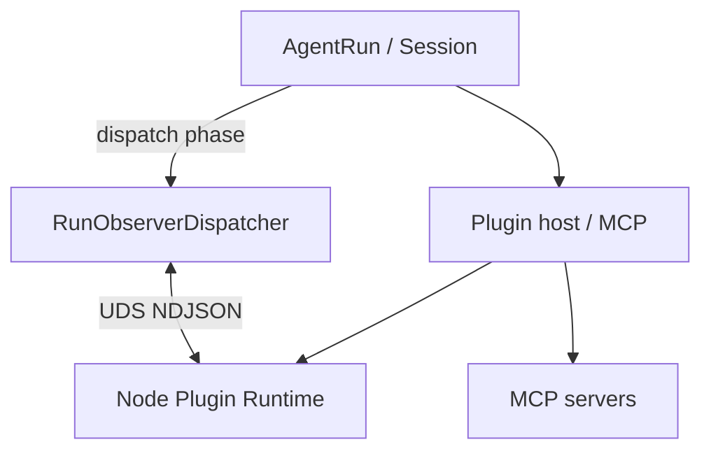

> **文档性质：** notes（机制设计，非 Spec）  
> **状态：** 2026-08 M7 已迁移 — **`RunObserverDispatcher`** + [`src/agent/run-observers/`](../../../packages/agent/src/agent/run-observers/) + RunConfig 决策槽 + RunEvent subscribe；legacy `HookDispatcher` / `src/agent/hooks/` 已删除  
> **生态兼容：** [`ecosystem-compat.md`](ecosystem-compat.md) · **Plugin host：** [`plugin-host.md`](plugin-host.md) · **平台：** [`platform-strategy.md`](../../product/platform-strategy.md)

---

## 1. 一词一义

| 术语 | 定义 | 禁止指 |
|------|------|--------|
| **Phase** | 内核固定挂载点（`sessionItem`、`beforeToolUse` …） | 泛称「事件」 |
| **Hook** | 某 observer phase 上的扩展逻辑；由 **RunObserverDispatcher** 经 sidecar-host 注册 | 外部 Plugin 包名 |
| **Hook handler** | sidecar 内具名回调；`name` 用于日志、排序、dispose | tap、plugin 实例 |
| **Kernel 模块** | loop 内直接调用（Session 落盘、permission、compose） | Extension、Plugin |
| **Extension** | 官方 sidecar 内置模块（tool-use-log …） | 外部 npm |
| **Plugin** | 用户安装的 MCP / sidecar 扩展 | tool-use-log、context 等官方模块 |

**不引入：** Tap、tapable、parallel/waterfall/bail/around 作为对外 API。

---

## 2. 设计目标

1. **内核稳定** — loop 只写「Session → compose → LLM → tool」；不出现扩展名。
2. **Sidecar-first** — 外部扩展不在 Rust/TS loop 内 `import` npm；走 MCP 或 Node Plugin Runtime。
3. **可组合** — 多 handler 同 phase；`order` 排序；fail-open / fail-closed 按 phase 声明。
4. **可测试** — in-memory transport mock sidecar；内核只测 dispatch 契约。
5. **Rust 同构** — phase 名与 dispatch mode 与 TS 一致；实现可换 transport。

**不是目标：** hook 替代 tool registry；VS Code Extension API；Pi/OpenCode 零改 in-process。

---

## 3. 三层机制（仅此三层）

| 层 | 职责 | 代码/文档 |
|----|------|-----------|
| **RunObserverDispatcher** | 固定 observer phase → dispatch → 收集 outcome | [`src/agent/run-observers/`](../../../packages/agent/src/agent/run-observers/) |
| **Tool registry** | builtin + MCP + sidecar 暴露的 tools | [`ToolRegistry`](../../../packages/tools/src/registry.ts) · [`plugin-host.md`](plugin-host.md) |
| **Plugin host** | MCP attach、sidecar spawn、manifest | [`plugin-host.md`](plugin-host.md) |



**Plugin Runtime 折中：** 按需 spawn 常驻 Node 进程，插件在 sidecar 内 `import` npm — 语义接近 in-process，边界在 IPC。见 [`runtime-multilang.md`](runtime-multilang.md) §9。

---

## 4. 生命周期粒度

```text
Session   一次 REPL（同一 sessionId）
  Run     一次 Enter（一个 runId）
    Turn  run 内一次 LLM 往返（含 tool 链至 end_turn）
      Step  单次 runLLM 或 runTool
```

Session 级 phase 在 REPL 宿主注册；Run/Step 在 `AgentRun` 内 dispatch。

---

## 5. Phase 全表

| 粒度 | Phase | mode | 触发点 | 默认 errorPolicy | 执行方 |
|------|-------|------|--------|------------------|--------|
| Session | `sessionItem` | observe | `Session.commitItems` | fail-open | sidecar（file + derive） |
| Turn | `composeComplete` | observe | compose 后 | fail-open | sidecar |
| Turn | `turnStart` | observe | `withTurn` 开头 | fail-open | sidecar |
| Turn | `turnEnd` | observe | `withTurn` finally | fail-open | sidecar |
| Run | `runStart` | observe | `withRun` 开头 | fail-open | sidecar |
| Run | `runEnd` | observe | `withRun` 成功返回前 | fail-open | sidecar |
| Run | `runFinalize` | observe | `withRun` finally | fail-open | sidecar |
| Run | `runError` | observe | `withRun` catch | fail-open | sidecar |
| Step | `beforeToolUse` | decide | tool 前 | fail-closed | **内核 permission** + sidecar |
| Step | `toolUse` | observe | tool 后 | fail-open | sidecar（**tool-use-log**） |
| Step | `llmCall` | observe | `runLLM` 后 | fail-open | sidecar |

**mode 语义（写在 phase 元数据，不对 loop 暴露方法名）：**

| mode | 行为 |
|------|------|
| **observe** | 顺序调用全部 handler，不合并返回值 |
| **transform** | 顺序调用，phase 自带 merge 规则 |
| **decide** | 顺序调用，首个 block/cancel 短路 |

**Around（超时/重试）：** MVP 不做；用内核 `withTimeout` 或远期 `wrap` mode。

---

## 6. 内核唯一调用方式

Loop / Session **只写一行**：

```typescript
await dispatcher.dispatch("beforeToolUse", payload);
```

分派策略由 `PHASE_DEFS[phase].mode` 决定；内核不选 parallel/waterfall/bail。

Sidecar 内注册（对用户 Plugin / 官方 Extension 同协议）：

```typescript
sidecar.on("toolUse", "tool-use-log", handler, { order: 0 });
```

---

## 7. 四层模型

```text
Layer 4  Plugin / Extension（MCP · sidecar SDK · Codex hooks 适配）
              ↓ attach / activate
Layer 3  HookDispatcher + Plugin host（机制，只实现一次）
              ↓ dispatch(phase)
Layer 2  LoopConfig 适配（AgentRun 薄封装，可选）
              ↓
Layer 1  纯 loop（buildInput → llm → recordOutcome）
```

**AgentEvent vs Hook：**

| 机制 | 用途 |
|------|------|
| **AgentEvent + emit** | Session 派生 / hook 观测 → JSONL（[`log/index`](../../../packages/agent-cli/src/log/index.ts)） |
| **Hook phase + dispatch** | 扩展观测 / 改写 / 拦截 |

**反模式：** loop 内 `for (hooks)`；扩展互 import；在 observe handler 里改 Session 数组（应返回 transform 结果或写 Session API）。

---

## 8. Decide outcome（对齐 Codex）

`beforeToolUse` / Codex `PreToolUse` 共用 outcome 词汇：

| outcome | 含义 |
|---------|------|
| `proceed` | 继续执行 |
| `block` | 拒绝，带 `reason` |
| `modify` | 替换 tool 输入（LocalShell 等待定是否禁止） |

permission 为 **内核 Decide**，不依赖 sidecar 加载；sidecar handler 可追加 block 理由。

---

## 9. 错误策略

| mode | 默认 | 示例 |
|------|------|------|
| observe | fail-open | metrics、derive 失败记日志 |
| transform | fail-open | 单 handler 失败跳过 |
| decide | fail-closed | permission、用户 hook block |

记录：`HookFailureRecord`（扩展 `source`、`phase`、`name`）。

---

## 10. 与当前代码对照

| 模块 | 位置 |
|------|------|
| RunObserverDispatcher | [`src/agent/run-observers/dispatcher.ts`](../../../packages/agent/src/agent/run-observers/dispatcher.ts) |
| default sidecar 注册 | [`src/agent/run-observers/defaults.ts`](../../../packages/agent/src/agent/run-observers/defaults.ts) |
| turn / llm_call_end → observers | [`src/agent/harness/run-event-observers.ts`](../../../packages/agent/src/agent/harness/run-event-observers.ts) |
| beforeToolCall / afterToolCall | [`src/agent/harness/run-config.ts`](../../../packages/agent/src/agent/harness/run-config.ts) |
| RunEvent → Agent Event | [`run-event-derive.ts`](../../../packages/agent/src/log/run-event-derive.ts) |
| tool-use-log | [`src/plugins/builtin/tool-use-log/`](../../../packages/agent/src/plugins/builtin/tool-use-log/) |
| permission（内核 decide） | [`src/agent/pipeline/permission/`](../../../packages/agent/src/agent/pipeline/permission/) |
| Agent Event fan-out | [`src/log/event-hub.ts`](../../../packages/log/src/event-hub.ts) |

**已删除：** RunHooks、AgentPlugin、pipeline/registry、session/observe、extensions/audit。

**C6 派生不变量：** 一次 user turn → RunEvent derive 一条 `user_prompt`；conversation/trace **不**在 step 级重复 emit（见 `tests/log-sync.test.ts`）。

---

## 11. 架构选型摘要

| 选项 | 结论 |
|------|------|
| webpack/tapable | **不用** — phase 太少，类型矩阵过重 |
| in-process RunObserverRegistry 给外部 Plugin | **采用** — sidecar attach 经 `sidecarObservers()` port |
| Pi-lite phase 表 + 单入口 `dispatch` | **采用** |
| Node sidecar Plugin Runtime | **采用** — npm 在 sidecar 内 |
| MCP 优先接 tool | **采用** — 见 [`ecosystem-compat.md`](ecosystem-compat.md) |

---

## 12. 模块布局（已实现）

```text
src/agent/run-observers/
  phases.ts · types.ts · dispatcher.ts · failures.ts
  manifest.ts · defaults.ts · parse-events.ts · index.ts

src/agent/harness/
  run-event-observers.ts — turn_start/turn_end/llm_call_end → observer dispatch
  run-config.ts — beforeToolCall / afterToolCall → observer decide/observe

src/log/
  event-hub.ts     — emit / subscribe / setOutputs（经 log/index barrel）
  run-event-derive.ts — RunEvent → Agent Event

packages/sidecar-host/src/sidecar/
  bridge.ts — sidecarObservers().on(...)
```

TS harness：`in-process` + **stdio pipe** transport；终局 UDS 与 Rust 同 NDJSON 协议。

---

## 13. 非目标

- npm `tapable`、HookMap、interceptors
- Rust loop 内 embed V8
- VS Code / Pi / OpenCode in-process 零改
- 用 Hook 注册 tools / CLI commands

---

## 15. 命名：`tool-use-log`（原 audit）

| 层 | 名字 | 说明 |
|----|------|------|
| Built-in plugin 目录 | `src/plugins/builtin/tool-use-log/` | kebab-case |
| sidecar 模块 / handler `name` | `tool-use-log` | 注册 id |
| Agent Event **`channel`** | `tool_use_log` | JSON 字段 snake_case |
| Event **`kind`** | `tool_use` | 不变 |
| 终端 / verbose 前缀 | `tool_use_log/` | 替代原 `audit/` |

**为何不用 `audit`：** 易与安全合规、企业审计混淆；本机制仅 **observe 每次 tool 调用**（toolName、输入摘要、状态），写入 Agent Event Log。

**迁移：** 已完成 — `extensions/audit/` 已删；channel 统一为 `tool_use_log`。

---

## 14. 相关文档

| 文档 | 关系 |
|------|------|
| [`ecosystem-compat.md`](ecosystem-compat.md) | P0/P1/P2 兼容承诺 |
| [`plugin-host.md`](plugin-host.md) | MCP + sidecar attach |
| [`platform-strategy.md`](../../product/platform-strategy.md) | L1/L2/L3、非目标 |
| [`agent-events.md`](../../spec/agent-events.md) | Run 观测 Spec |
| [`context-window-roadmap.md`](../context/context-window-roadmap.md) | #2 迁移任务 |

**外部参考：** [Pi hooks](https://github.com/badlogic/pi-mono/blob/main/packages/agent/docs/hooks.md) · [Codex hooks](https://developers.openai.com/codex/hooks)
