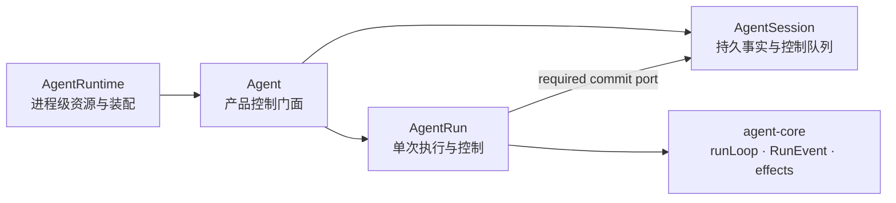

# Agent Runtime API 目标与实现标准

> **文档性质：** target contract + implementation standard，非当前实现 Spec  
> **状态：** 2026-08 讨论结论；实现前仍需按 capability 分期评审  
> **当前权威：** [`agent-core.md`](../../spec/agent-core.md) · [`context-composer.md`](../../spec/context-composer.md) · [`AGENTS.md`](../../../AGENTS.md) §7.2  
> **相关方向：** [`agent-runtime-product-direction.md`](agent-runtime-product-direction.md) · [`agent-core-roadmap.md`](agent-core-roadmap.md)  
> **执行入口：** 根 [`TODO.md`](../../../TODO.md)；本文件尚未自动改变 TODO 优先级

本文定义 MoonTide Agent Runtime 的目标对象模型、产品 API、状态所有权、事件与恢复语义，以及一个 capability 何时可以标记为 **done**。它解决的问题不是“给 `Agent` 类继续增加多少方法”，而是让产品 Shell、Harness、Session 与 Temporal Core 之间形成可实现、可测试、可演进的稳定契约。

本文包含尚未实现的目标行为，因此暂存于 `notes/runtime/`。当某组 API 的语义通过评审、生产路径接入并满足本文 Definition of Done 后，再把对应部分提升到 `docs/spec/`。

---

## 1. 结论

MoonTide 应提供 Pi 风格的简单 `Agent` 产品门面，但内部保持四个职责不同的对象：



| 对象 | 生命周期 | 唯一职责 | 不拥有 |
|------|----------|----------|--------|
| `AgentRuntime` | 进程级 | 装配 Preset、Provider、tools、stores，创建或打开 Agent | 单个 Session 的对话事实 |
| `Agent` | Session 绑定的长生命周期门面 | 向 Shell 提供 prompt、control、snapshot、capabilities | Temporal Core 时序、可变 message 数组 |
| `AgentSession` | 可跨进程恢复 | Session Item Log、checkpoint、compaction、control queue | Provider SDK、`runLoop` |
| `AgentRun` | 单次 run | run handle、abort、事件、interaction、settlement、outcome | 跨 run 的 durable Session ownership |
| `agent-core` | 每次 run 内 | 唯一 Run/Turn 时序、RunConfig、RunEvent、Effect 编排 | Session persistence、Context Composer、CLI、Preset |

核心判断：

1. `Agent` 是产品门面，不是新的事实源。
2. Session Item Log 仍是 canonical durable history。
3. `AgentRun` 是短生命周期 control handle；abort、事件与 settlement 都是 run-scoped。
4. control queue 属于长生命周期 Session；`Agent.steer()` 只是门面委托。
5. `RunEvent` 是执行协议，不代替 Session facts；Session 的 **materialize**、Context Composer 的 **compile**、RunEvent 到 Agent Event Log 的 **derive** 保持分离。

---

## 2. 目标与非目标

### 2.1 目标

1. 给 CLI、Desktop、RPC、eval 提供同一套 host-facing Agent API。
2. 让 prompt、abort、continue、steering、follow-up、interaction 与 recovery 都有明确状态机和 owner。
3. 让每个 capability 都能用生产路径与契约测试证明，而不是以“存在一个方法”作为完成证据。
4. 保持 `agent-core -> @moontide/agent -> @moontide/agent-cli` 的单向责任边界。
5. 为未来多语言宿主提供带 ID、版本、序号、幂等键的可序列化协议。

### 2.2 非目标

- 不把 Session、Context Composer、Provider adapter、plugin host 吸收进 `agent-core`。
- 不把所有能力堆进一个巨型 `Agent` 类。
- 不允许产品 Shell 直接修改 `agent.state.messages` 一类可变业务状态。
- 不在 active run 中动态注册 hook、tool 或 lifecycle phase。
- 不把 `steer()` 定义成“立即取消当前工具”；立即停止由 `abort()` 负责。
- 不先承诺通用 `pause()/resumeRun()`；Provider stream、子进程和外部工具通常不存在真实暂停语义。
- 不在缺少 idempotency 与状态损失模型时承诺任意中断点原地恢复。
- v1 不允许同一 Session 多个 active run；多个 Session 可以并发。

---

## 3. API 分层

目标 API 分成三层，不能混成同一组可变方法。

| 层 | 调用者 | 内容 | 稳定性 |
|----|--------|------|--------|
| 产品控制面 | CLI、Desktop、RPC、eval | `AgentRuntime`、`Agent`、`AgentSession`、`AgentRun` | 稳定 public contract |
| Developer 扩展面 | Preset、内置能力、sidecar adapter | tools、RunConfig source、observer、Provider route | 受控 extension contract |
| Core effect 面 | Harness 与 Temporal Core | `StreamFn`、`ToolExecutor`、commit port、clock、limits | 内部窄端口 |

最终用户配置只允许修改 Preset `exposes` schema 中的键。Developer 扩展面与 Core effect 面不能通过 `Agent` 实例暴露给最终用户。

---

## 4. `AgentRuntime`：进程级入口

`AgentRuntime` 管理共享资源与显式 bootstrap，避免依赖 process-global mutable singleton。

```ts
export interface AgentRuntime {
  readonly sessions: SessionRepository;

  createAgent(options: CreateAgentOptions): Promise<Agent>;
  openAgent(options: OpenAgentOptions): Promise<Agent>;

  getCapabilities(): RuntimeCapabilities;
  shutdown(options?: ShutdownOptions): Promise<void>;
}
```

### 4.1 Runtime 必须拥有

- Preset catalog 与默认装配；
- Provider route / adapter registry；
- tool registry 与 permission declarations；
- Session、Checkpoint、Compaction、Artifact stores；
- process-scoped observers、event outputs 与 sidecar connections；
- clock、ID generator、deadline 与其他可测试 effect。

### 4.2 Runtime 不得拥有

- 当前 UI 选中了哪条消息；
- 某个 Session 的 active run 状态；
- 一个全局 `AbortController`；
- 可被任意调用方直接修改的 tool/hook 数组。

### 4.3 Session repository

```ts
export interface SessionRepository {
  create(options?: CreateSessionOptions): Promise<AgentSession>;
  open(sessionId: string): Promise<AgentSession>;
  list(options?: SessionListOptions): Promise<readonly SessionSummary[]>;
  fork(sessionId: string, options?: ForkOptions): Promise<AgentSession>;
  export(sessionId: string, options?: ExportOptions): Promise<SessionExport>;
  delete(sessionId: string): Promise<void>;
}
```

`list`、`export`、`delete` 属于 repository，不应堆到 `Agent` 门面。

---

## 5. `Agent`：产品控制门面

```ts
export interface Agent {
  readonly session: AgentSession;
  readonly status: AgentStatus;
  readonly currentRun: AgentRun | null;

  prompt(input: UserInput, options?: RunStartOptions): AgentRun;
  continue(options?: ContinueOptions): AgentRun;
  recover(recoveryId: string): AgentRun;

  steer(input: UserInput): QueuedInputReceipt;
  followUp(input: UserInput): QueuedInputReceipt;
  listQueuedInputs(): readonly QueuedInput[];
  cancelQueuedInput(id: string): boolean;
  clearQueue(kind?: QueueKind): number;

  abort(reason?: AbortReason): AbortReceipt;
  waitForIdle(options?: WaitForIdleOptions): Promise<AgentSnapshot>;

  subscribe(listener: AgentNotificationListener): Unsubscribe;
  getSnapshot(): AgentSnapshot;
  getCapabilities(): AgentCapabilities;

  updateSettings(
    patch: AgentSettingsPatch,
    options?: SettingsUpdateOptions,
  ): Promise<SettingsRevision>;

  close(options?: CloseOptions): Promise<void>;
}
```

### 5.1 API 设计决策

- `prompt()` 同步返回 `AgentRun` handle；最终结果通过 `await run.result` 获取。
- `currentRun` 只是只读引用；canonical active-run ownership 在 Session/Agent controller 内。
- `abort()` 是 `currentRun?.abort()` 的便捷入口。
- Session busy 时再次 `prompt()` 默认返回稳定的 `session_busy` 错误；不静默转换为 steering/follow-up。
- `getSnapshot()` 返回 immutable product view；UI 不获得业务对象的可变句柄。
- settings update 明确生效边界，默认 `next_run`，不能改变已冻结的 RunConfig。

### 5.2 Agent 状态

```ts
export type AgentStatus =
  | "idle"
  | "running"
  | "waiting_for_input"
  | "aborting"
  | "closing"
  | "closed";
```

`AgentSnapshot` 至少包含：

- `sessionId`；
- 当前 `status`；
- active run 摘要；
- steering/follow-up queue 数量；
- pending interaction 摘要；
- settings revision；
- runtime/preset capabilities。

---

## 6. 输入与 Run 启动

### 6.1 User input

```ts
export interface UserInput {
  content: readonly InputContent[];
  metadata?: Readonly<Record<string, JsonValue>>;
}

export type InputContent =
  | { type: "text"; text: string }
  | { type: "image"; artifactId: string; mimeType: string }
  | { type: "file"; artifactId: string; name: string }
  | { type: "reference"; uri: string; title?: string };
```

附件使用 artifact/reference 标识，不把任意本地路径或大块二进制直接塞进 Agent API。

### 6.2 Run start options

```ts
export interface RunStartOptions {
  idempotencyKey?: string;
  signal?: AbortSignal;
  metadata?: Readonly<Record<string, JsonValue>>;
  limits?: RunLimits;
}

export interface RunLimits {
  maxTurns?: number;
  maxToolCalls?: number;
  maxInputTokens?: number;
  maxOutputTokens?: number;
  maxTotalTokens?: number;
  deadlineMs?: number;
  maxCost?: number;
}
```

要求：

- 外部 `AbortSignal` 与 run 内部 controller 组合，而不是写入 `LLMRequest`。
- `idempotencyKey` 防止 RPC 重试重复追加 prompt 或重复启动工具副作用。
- limits 必须由 runtime 强制执行；只在 eval CLI 事后统计不算实现。

---

## 7. `AgentRun`：单次执行 handle

```ts
export interface AgentRun {
  readonly id: string;
  readonly sessionId: string;
  readonly status: RunStatus;
  readonly signal: AbortSignal;
  readonly result: Promise<RunOutcome>;

  abort(reason?: AbortReason): AbortReceipt;
  waitForIdle(): Promise<RunOutcome>;

  subscribe(listener: RunEventListener): Unsubscribe;
  events(options?: EventStreamOptions): AsyncIterable<RunEventEnvelope>;

  getSnapshot(): RunSnapshot;

  respond(
    requestId: string,
    response: InteractionResponse,
  ): Promise<InteractionReceipt>;
}
```

### 7.1 Run 状态

```ts
export type RunStatus =
  | "created"
  | "preparing"
  | "calling_model"
  | "executing_tools"
  | "waiting_for_input"
  | "aborting"
  | "settling"
  | "settled";
```

`RunSnapshot` 至少包含：

- `runId`、`sessionId`、当前 turn；
- 当前 phase 与 status；
- streaming assistant message；
- active/pending tool calls；
- pending interaction；
- token、cost、tool-call usage；
- abort request 与 outcome；
- recoverability。

### 7.2 Run outcome

```ts
export type RunOutcome =
  | {
      kind: "success";
      finalMessageId?: string;
      usage: RunUsage;
      artifacts: readonly ArtifactRef[];
    }
  | {
      kind: "aborted";
      reason: AbortReason;
      recoverability: Recoverability;
      lastCommittedItemId?: string;
    }
  | {
      kind: "error";
      error: AgentErrorInfo;
      recoverability: Recoverability;
      lastCommittedItemId?: string;
    };
```

Provider failure、tool failure、user abort 等预期运行结果用 `RunOutcome` 表达。closed Agent、非法状态转换、协议不兼容等 API 使用错误才 throw `AgentApiError`。

---

## 8. Settlement 语义

`run_end`、`run.result`、`waitForIdle()` 和 Session durable commit 必须具有可验证的先后关系。

### 8.1 Settled 的定义

一个 run 只有同时满足以下条件才是 settled：

1. 不会再开始新的 LLM call 或 tool call；
2. 最终 `run_end` 已产生；
3. 所有 required effect 已完成或以稳定错误结束；
4. Session commit 已完成；
5. run-scoped critical observer 已完成；
6. 已派发的 public listener task 已按 bounded drain policy 收敛；
7. event stream 已关闭；
8. `RunOutcome` 已冻结。

### 8.2 Subscriber 与 commit 分离

- Session commit 是显式、被 await 的 Effect port，不依赖 fire-and-forget `subscribe()`。
- public subscriber 只能观察，不能决定下一阶段、修改 Session 或 publish RunEvent。
- subscriber delivery 保持注册顺序和事件顺序。
- public listener 失败默认 fail-open，但必须进入 error reporting；critical internal effect 按声明的 error policy 处理。
- listener drain 必须有 timeout，避免一个 UI listener 永久阻塞 `waitForIdle()`。
- `events()` 的外部消费速度不参与 settlement；stream 在 `run_end` 后关闭，消费者自行处理背压。

---

## 9. Abort 与资源边界

### 9.1 Abort contract

```ts
export type AbortReason =
  | "user"
  | "deadline"
  | "shutdown"
  | "superseded"
  | "budget_exhausted";

export interface AbortReceipt {
  accepted: boolean;
  requestedAt: number;
  runId?: string;
}
```

语义：

- `abort()` 是请求，不等同于已经 idle；调用方通过 `run.result` 或 `waitForIdle()` 确认完成。
- abort 被接受后不得再启动新的 tool call 或 LLM call。
- 已运行 effect 必须收到 AbortSignal；effect 不响应时由 deadline/强制终止策略兜底。
- abort 路径仍必须产生唯一最终 `run_end`，outcome 为 `aborted`。
- partial assistant、已完成 tool result、未完成 tool call 如何进入 Session 必须由 turn atomicity 规则决定，不能依赖偶然执行到哪一行。

### 9.2 不提供通用 pause

`pause()` 暗示 Provider stream、子进程、网络和外部 side effect 都能无损冻结。v1 不承诺这一点。产品需要的行为拆成：

- 暂停等待用户回答：`waiting_for_input`；
- 改变下一步：`steer()`；
- 立即停止：`abort()`；
- 合法边界重新开始：`continue()` 或 recovery。

---

## 10. Continue、Recovery 与 Session restore

这些语义必须分开命名。

### 10.1 `continue()`

`continue()` 从当前合法 Session 状态开始一个新 run，不追加 user message。典型用途是 provider error 后重试当前上下文。

要求：

- 最后有效状态必须是可续接边界，例如 user message、tool result 或明确可续接的 aborted outcome；
- 不能在 assistant 已完整结束且没有未处理工作时伪造 continue；
- continuation 的原因与来源进入 run metadata；
- `continue()` 不等同于 retry 任意 effect。

### 10.2 Recovery

通用 recovery 在 Session 层表达：

```ts
export interface RecoveryOption {
  id: string;
  kind: "continue" | "retry_turn" | "restore_checkpoint" | "none";
  description: string;
  risks: readonly string[];
}
```

```ts
const options = await agent.session.getRecoveryOptions();
const run = agent.recover(options[0].id);
```

Session 提供 recovery facts 与 options，`Agent` 负责启动新的 run 并更新 `currentRun`。重复执行 tool side effect 的 recovery 必须依赖 idempotency、effect journal 或明确的人类确认；否则不允许自动 retry。

### 10.3 Session restore

明确使用：

- `runtime.openAgent({ sessionId })`：跨进程打开历史 Session；
- `session.restoreCheckpoint(checkpointId)`：恢复可见/compile 状态；
- `agent.continue()`：不追加消息地启动新 run。

不使用一个含糊的 `resume()` 同时表示三者。

---

## 11. Steering 与 Follow-up

### 11.1 Control policy

```ts
export interface AgentControlPolicy {
  steeringMode: "one-at-a-time" | "all";
  followUpMode: "one-at-a-time" | "all";
}

export type QueueKind = "steering" | "follow_up";
```

### 11.2 Queue item

```ts
export interface QueuedInput {
  id: string;
  kind: QueueKind;
  input: UserInput;
  enqueuedAt: number;
  state: "queued" | "consumed" | "cancelled";
}
```

### 11.3 语义

- `steer()` 在当前 turn/tool batch 的安全边界后注入，不立即终止已运行工具。
- steering queue 先于 follow-up queue 消费。
- follow-up 只在当前 run 原本将正常停止时消费。
- `one-at-a-time` 每个 turn 消费一个；`all` 将当前同类 queued inputs 一次性注入。
- queue item 必须有稳定 ID，可 list、cancel、clear。
- 用户已提交但未消费的意图应可跨 crash 恢复；目标设计将 queue transitions 记录为 durable Session facts，而不是只放内存数组。

建议的 Session facts：

- `queued_input`；
- `queued_input_consumed`；
- `queued_input_cancelled`。

这些 facts 在 **materialize** 时决定 queue 状态，在真正消费后才进入 model-visible conversation。

---

## 12. User Interaction 协议

产品 Shell 不能依赖 ToolExecutor 直接调用 terminal callback。Desktop、RPC、移动端与重连都需要 request/response 协议。

```ts
export type InteractionRequest =
  | PermissionRequest
  | QuestionRequest
  | ConfirmationRequest
  | CredentialRequest;
```

Run 进入 `waiting_for_input` 并发出带 `requestId` 的 interaction request；Shell 通过：

```ts
await run.respond(requestId, response);
```

完成回答。

必须支持：

- `interaction_requested`；
- `interaction_resolved`；
- `interaction_cancelled`；
- `interaction_expired`；
- reconnect 后从 `RunSnapshot.pendingInteraction` 恢复 UI；
- 同一 request 只能成功回答一次；
- permission request 与 response 进入审计事实；
- abort/close 时 pending interaction 稳定取消。

---

## 13. Event 与订阅

### 13.1 RunEvent envelope

`RunEvent` union 继续属于 `@moontide/run-protocol`。跨 Shell/RPC 暴露时必须带 envelope：

```ts
export interface RunEventEnvelope {
  protocolVersion: number;
  sessionId: string;
  runId: string;
  seq: number;
  timestamp: number;
  event: RunEvent;
}
```

要求：

- `seq` 在一个 run 内严格递增；
- `runId`、`sessionId` 不靠调用方外部拼接；
- `run_end` 是该 run 的最后一个 RunEvent；
- consumer 忽略未知新增字段；破坏性变更 bump protocol version；
- `message_update` 仍是 rendering event，不进入 Session Item Log。

### 13.2 两类订阅

| API | 事件范围 | 用途 |
|-----|----------|------|
| `run.subscribe()` / `run.events()` | 单个 run 的 RunEvent envelope | 流式 UI、tool 状态、run outcome |
| `agent.subscribe()` / `session.subscribe()` | active run、queue、settings、checkpoint、recovery 等 product notification | Shell 状态同步 |

产品层通知命名为 `AgentNotification` / `SessionNotification`，不冒充 RunEvent，也不等同于持久化 Agent Event Log。

---

## 14. `AgentSession`：持久事实与恢复

```ts
export interface AgentSession {
  readonly id: string;

  getSnapshot(): Promise<SessionSnapshot>;
  subscribe(listener: SessionNotificationListener): Unsubscribe;

  listItems(options?: ItemQuery): Promise<readonly SessionItem[]>;
  materializeMessages(
    options?: MaterializeOptions,
  ): Promise<readonly SessionMessage[]>;

  createCheckpoint(options?: CheckpointOptions): Promise<Checkpoint>;
  restoreCheckpoint(checkpointId: string): Promise<void>;
  listCheckpoints(): Promise<readonly Checkpoint[]>;

  compact(options?: CompactionOptions): Promise<CompactionResult>;
  getContextReport(): Promise<ContextReport>;

  getRecoveryOptions(): Promise<readonly RecoveryOption[]>;

  close(): Promise<void>;
}
```

规则：

- `listItems()` 返回 canonical facts；`materializeMessages()` 返回只读 materialized view。
- checkpoint restore 改变 compile/materialize 的有效窗口，不删除 canonical item log。
- compaction 是产品 context 策略，不进入 Temporal Core。
- Session 不直接持有 Provider SDK 或运行 `runLoop`。
- active run 时 restore、fork、destructive mutation 默认拒绝。

---

## 15. Settings 与 Capabilities

### 15.1 Settings update

不提供 Pi 风格的任意可变 `agent.state.model = ...`。使用显式 patch 与 revision：

```ts
await agent.updateSettings(
  {
    model: "deepseek-v4",
    thinkingLevel: "high",
    controlPolicy: {
      steeringMode: "one-at-a-time",
      followUpMode: "one-at-a-time",
    },
  },
  { effective: "next_run" },
);
```

规则：

- 可配置键必须来自当前 Preset `exposes` schema；
- active run 使用冻结的 RunConfig，不读取中途 patch；
- settings update 返回新 revision；
- permission、安全边界和 hook 实现不是普通用户 settings。

### 15.2 Capabilities

```ts
export interface AgentCapabilities {
  abort: boolean;
  continue: boolean;
  steering: boolean;
  followUp: boolean;
  checkpoint: boolean;
  interruptedRunRecovery: boolean;
  attachments: readonly string[];
  interactionKinds: readonly string[];
  toolExecution: readonly ("sequential" | "parallel")[];
}
```

Shell 应通过 capability handshake 决定展示哪些控件，而不是调用失败后猜测 runtime/provider 能力。

---

## 16. Developer 扩展面与禁止项

以下能力属于 Harness、`plugins-sdk`、tools 或 Provider package，不是 `Agent` 实例方法：

- `definePreset()`；
- `defineTool()`；
- RunConfig source；
- `beforeToolCall`、`afterToolCall`、`shouldStopAfterTurn`；
- Provider route / API adapter 注册；
- `StreamFn`、`ToolExecutor`；
- Session commit port；
- observers 与 event outputs；
- clock、process、network、storage effects。

禁止形成以下产品 API：

```ts
agent.registerHook(...);
agent.registerTool(...);
agent.emitEvent(...);
agent.setMutableContext(...);
```

原因：这些接口会破坏 run 前 freeze、能力白名单、事件单一发布者与时序唯一权威。

---

## 17. Package export 边界

### 17.1 `@moontide/agent`

稳定产品/Harness API：

- `createAgentRuntime`；
- `AgentRuntime`；
- `Agent`；
- `AgentRun`；
- `AgentSession`；
- `SessionRepository`；
- input、snapshot、notification、outcome、error、capability 类型；
- protocol version/capability handshake 的产品入口。

### 17.2 `@moontide/run-protocol`

- `RunEvent`；
- `RunConfig`；
- `AgentMessage`；
- `Outcome`；
- Effect port signatures；
- `PROTOCOL_VERSION`。

### 17.3 `@moontide/agent-core`

- `runLoop`；
- `resolveRunConfig`；
- `resolveTurnContext`；
- RunEvent bus；
- lifecycle primitives；
- narrow testable temporal-core API。

Product Shell 不 direct import `agent-core`。

### 17.4 `@moontide/agent/testing`

单独暴露：

- `createTestAgent()`；
- fake `StreamFn` / `ToolExecutor` / clock；
- deterministic IDs；
- `collectRunEvents()`；
- `drainAgent()`；
- failure injection 与 contract fixtures。

测试替身不得进入生产根 export。

---

## 18. Capability 状态词汇

Roadmap 不再只使用 unchecked/checked 表示复杂能力。每项 capability 使用以下状态：

| 状态 | 定义 |
|------|------|
| `absent` | 无类型、无实现、无生产入口 |
| `plumbing` | 有底层类型、signal、event 或局部 port |
| `core-only` | Core API 存在，但 Harness/Session/产品路径未使用 |
| `integrated` | `@moontide/agent` 生产路径接入，Shell 未完成 |
| `product-ready` | 至少一个真实 Shell/headless consumer 可用 |
| `verified` | success/error/abort/recovery 契约测试与文档完整 |

只有 `verified` 可以在 TODO 中标记 **done**。`plumbing`、`core-only` 不得因为方法名存在而标记完成。

### 18.1 2026-08-11 初始观察

以下是本讨论期间对 live checkout 的初步分类，不代替后续逐项审计：

| Capability | 初始状态 | 依据与缺口 |
|------------|----------|------------|
| Core `subscribe()` | `core-only` | Core Agent/RunEvent bus 存在；public listener 不构成生产 settlement contract |
| Core `abort()` | `core-only` | AbortController 与 signal plumbing 存在；生产 `AgentRun` 无 control handle |
| Core `waitForIdle()` | `core-only` | 只等待 active promise；未证明 Session commit/listener drain |
| Product `AgentRun` handle | `absent` | 当前 `AgentRun.execute()` 是一次性执行对象，不是可立即持有的 run handle |
| Pi 语义 `continue()` | `absent` | 当前 `continueReplAgent()` 仍需要新 user prompt |
| checkpoint/session restore | `integrated` | 已有 `/resume` 路径，但不是 interrupted-run continue |
| steering/follow-up queue | `absent` | 无 queue owner、mode、durable transitions |
| interaction request/response | `plumbing` | 现有 UserInteraction callback；缺少可重连协议与 pending state |
| product settlement | `plumbing` | RunEvent/commit listener 存在，但 required commit 未形成统一 awaited contract |

审计时必须重新验证 live checkout；本表会随实现变化而更新。

---

## 19. Definition of Done

一个 Agent capability 只有同时满足以下条件才能标记 done：

1. **语义**：公共行为写入认可的 Spec，名词一词一义。
2. **Owner**：状态 owner、reader、display、trigger、recorder 明确。
3. **API**：类型、状态转换与错误码稳定。
4. **Core**：Temporal Core 或 Effect port 行为实现。
5. **Harness**：`@moontide/agent` 生产路径真正使用，不是孤立 demo。
6. **Persistence**：Session fact、queue、interaction、outcome 的 durable 语义明确。
7. **Events**：RunEvent/notification 顺序与 final settlement 明确。
8. **Tests**：success、error、abort、timeout、recovery 路径有 invariant/contract tests。
9. **Consumer**：至少一个 CLI、headless eval、Desktop/RPC consumer 验证。
10. **Docs**：Spec、capability 状态、TODO 和 package README 同步。

仅完成其中一部分时，使用 §18 状态词汇，不得写 done。

---

## 20. 必须具备的契约测试

1. 一个 Session 默认最多一个 active run。
2. 每个 run 恰好一个 `run_start` 和一个最终 `run_end`。
3. `runId/sessionId/seq` 稳定且事件严格有序。
4. abort 接受后不再启动新的 tool/LLM call。
5. settlement 前 Session required commit 已完成。
6. `continue()` 不追加 user message。
7. steering 在安全 turn 边界消费，顺序稳定。
8. follow-up 只在 steering queue 为空且 run 原本将停止时消费。
9. queue cancel/consume 可从 durable facts 重建。
10. interaction 重连后仍可回答，且不能重复回答。
11. checkpoint restore 不删除 canonical Session Item Log。
12. 两个 Session 的 abort、queue、event、settings 完全隔离。
13. Provider/tool 忽略 AbortSignal 时，deadline/强制终止仍能让 run settle。
14. settings patch 不改变 active run 的 frozen RunConfig。
15. public observer 不能 publish RunEvent、写 Session 或跳过 lifecycle phase。

---

## 21. 建议实施顺序

本节描述 capability 依赖，不代表根 TODO 已更新。

| 阶段 | 交付 | 关键验收 |
|------|------|----------|
| P0 | Run identity、`AgentRun` handle、status/outcome、单 active run | lifecycle 与隔离契约 |
| P1 | required commit、subscribe、settlement、`waitForIdle()` | durable commit 后才 settled |
| P2 | abort、deadline、turn/token/tool/cost limits | 全 effect abort + 唯一 aborted outcome |
| P3 | interaction request/response | waiting/reconnect/duplicate response |
| P4 | `continue()` 与 recovery options | 合法边界、不重复 side effect |
| P5 | steering/follow-up durable queues | 顺序、mode、cancel、crash reopen |
| P6 | Session product API、capabilities | open/fork/checkpoint/context report |
| P7 | RPC/Desktop event replay 与 idempotency | reconnect、afterSeq、协议版本 |

每个阶段先更新 capability 状态，再决定是否提升对应内容到正式 Spec。

---

## 22. 开放问题

以下问题需要在对应 capability 实施前单独决策：

1. partial assistant 在 abort 时以哪种 SessionItem 形状落盘？
2. tool 已产生外部副作用但结果未提交时，recovery 如何提示风险？
3. public listener bounded drain 的默认 timeout 与错误路由是什么？
4. control queue facts 是否进入现有 Session Item Log，还是使用同一 Session 下的独立 Control Log？目标要求 durable，具体物理布局待定。
5. `Agent` 是直接绑定一个 Session，还是允许显式 rebind？本文件默认一个 Agent 绑定一个 Session，不支持 rebind。
6. Desktop/RPC 是否直接使用 `RunEventEnvelope`，还是再封装 transport envelope？不得改变 RunEvent 语义。
7. interrupted-run recovery 在何种 idempotency 证据下可以自动执行？

这些开放问题不影响 P0/P1 开始，但会阻塞相应 capability 标记 `verified`。
