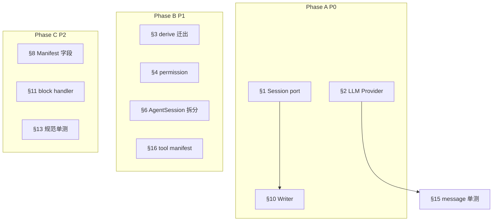
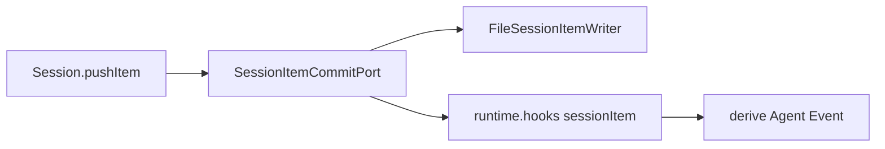

> **状态：** 2026-08 定稿 · **Phase A 完成** · **Phase B §3/§4/§5/§6/§9/§16 已实现**（§7 bootstrap 拆分跳过）  
> **工程原则：** [`AGENTS.md`](../../../AGENTS.md) · **Spec：** [`context-composer.md`](../../spec/context-composer.md) §4/§10.1  
> **功能轨并行：** [`context-window-roadmap.md`](../context/context-window-roadmap.md) #5 LLM Provider

TypeScript Harness 架构 review（成熟度 ~6.5/10）识别的 **16 项**修复项，按 Phase A/B/C 分批实现。

---

## Phase 总览



| Phase | 项 | 优先级 |
|-------|-----|--------|
| **A 边界** | §1, §2, §10 | P0 |
| **B 内聚** | §3–§7, §9, §16 + 规范单测 + pre-commit | P1 |
| **C 硬化** | §8, §11, §12, §13, §15（**§14 不实施**） | P2 |

**建议 commit 顺序：** 见文末 [Commit 顺序](#commit-顺序)。

---

## 模块边界

### Session Item commit — `session/` 不得依赖 Harness（**已实现**）

**目标态：**



| 项 | 做法 |
|----|------|
| `src/session/` | 只调 `commitPort.onItemCommitted(item)`；**零** `agent/` import |
| Harness | `createSessionCommitPort(workdir, runtime)`：先 `FileSessionItemWriter.append`，再 `runtime.hooks.dispatch("sessionItem")` **仅 derive** |
| Hook manifest | **无** `sessionItem/file` handler |
| API | **无** `Session.flush()`、`SessionItemWriter.flush?` |

**验收：** `rg 'from.*agent/' src/session/` 为零。

### Context Composer

Composer 显式组装 `system` + `tools` + `messages` → `LLMRequest` + Manifest。Harness 收集输入、调用 `composeContext` 一次。

切片表见 [`context-composer.md` §10.1](../../spec/context-composer.md#101-context-window-显式组装)。Composer **不管** Item 落盘或 derive。

### 目录收敛（目标态）

| 现状 | 目标 |
|------|------|
| `src/context/stores/` | `src/session/stores/` |
| `src/context/` 混 Composer + runtime | 只留 `composer/` |
| `context/runtime-status.ts` 等 | `src/agent/` 或 `src/cli/` |

`src/session/` 与 `src/agent/`（Harness）**分目录**；`llm/`、`cli/` 不应依赖 `agent/`。

---

## §1 Session 反向依赖 Harness（P0 · Phase A · **已实现**）

**方案：**

1. [`src/session/ports.ts`](../../../packages/session/src/ports.ts)：`SessionItemCommitPort`
2. `Session` 构造注入 `commitPort`；`pushItem` / `commitItems` 只调 `onItemCommitted`
3. Harness（`createSessionCommitPort(workdir, runtime)`）composite port（见 §10）
4. 测试用 noop / spy port

**验收：** `rg 'from.*agent/' src/session/` 为零。

---

## §2 LLM 解耦（P0 · Phase A · 对齐 roadmap #5）

**现象：** `src/agent/`、`src/context/` 多处 `@anthropic-ai/sdk`；`runLLM` 调 `chat()`；Composer 出口绑 `MessageParam`。

**方案：** 按 [`llm-provider.md`](../../spec/llm-provider.md) §8.4：

1. `packages/llm/src/provider.ts` — `LLMProvider` + `getLLMProvider()`
2. `packages/llm/src/adapters/openai-chat-completions.ts` — DeepSeek default（fetch，零 SDK）
3. Harness：`composeContext` → protocol `Message[]`；`runLLM` → `LLMResponse`
4. `compact` / `metrics` / healthcheck 经 Provider

**验收：** `rg '@anthropic-ai/sdk' packages/agent-cli/src packages/llm/src` 为零；mock Provider 可单测 `runLLM`。

---

## §3 item-handlers 混 derive（P1 · Phase B · **done**）

**现象：** `item-handlers.ts` 同时含 materialize 与 derive（依赖 `log/event-hub`）。

**结果（M6）：**

1. `packages/session` 的 `item-handlers.ts` 只保留 materialize
2. Legacy `log-sync` / `sessionItem` derive **已删除**
3. Agent Event 由 RunEvent bus → [`run-event-derive.ts`](../../../packages/agent/src/log/run-event-derive.ts)（`createRunEventDeriveListener`）

**验收：** `rg 'emitDraft|event-hub' packages/session/src/` 为零；hook manifest 无 `sessionItem/agent-event-derive`。

---

## §4 Permission 与 Tool 定义脱节（P1 · Phase B）

**现象：** `TOOL_RULES` 在 `permission/index.ts`；`ToolSpec` 无 `permission` 字段。

**方案：**

1. `ToolSpec` 必填 `permission: ToolPermissionRule`
2. `checkPermission` 读 tool 定义，删除硬编码 `TOOL_RULES`
3. 新建 `tests/conformance/tool-permissions.test.ts`；pre-commit 门禁

**验收：** 新增 tool 只改 spec 一处；`permission/index.ts` 无 tool 名列表。

---

## §5 Module Singleton（P1 · Phase B · **已实现 — 全量显式 runtime**）

**现象：** `hookDispatcher`、`toolsByName`、`event-hub` listeners 等模块级单例；测试需散落 `reset()`。

**方案：** `AgentRuntime` 为组合根容器；热路径显式 `runtime.hooks` / `runtime.tools` / `runtime.plugins`；`LoopContext.runtime` 必填；仅保留 `getAgentRuntime()` / `setAgentRuntime()` 供 CLI 与测试。

**实现：** [`packages/agent/src/agent/runtime/`](../../../packages/agent/src/agent/runtime/) 与 [`packages/tools/src/registry.ts`](../../../packages/tools/src/registry.ts) — `HookRegistry` · `ToolRegistry` · `PluginHost`；旧 `tools/store.ts` 与 `hooks/registry.ts` 门面已删除；测试用 [`tests/helpers/test-runtime.ts`](../../../tests/helpers/test-runtime.ts) `installTestRuntime()` 隔离。

**非目标：** 多 REPL 并行（未来）· **§7 bootstrap 拆分（按用户要求跳过）**

---

## §6 AgentSession 职责过重（P1 · Phase B）

**现象：** `agent-session.ts` 兼 run、compact、checkpoint、resume。

**方案：** 拆 `CompactionService`、`CheckpointService`；`AgentSession` 委托；compose 重复抽 `composeForTurn` helper。

**验收：** `AgentSession` < 80 行；各 service 可单测。

---

## §7 log/setup 兼做平台 bootstrap（P1 · Phase B · **已实现**）

**现象：** `bootstrapEventPlatform()` 混 event pipeline、plugin、hook 注册。

**方案：** 新建 `app/bootstrap.ts`；`log/setup.ts` 只管 Agent Event 输出管道。

**验收：** `log/setup.ts` 无 `plugin-host` / `agent/hooks` import。

---

## §8 Manifest ID 语义不一致（P2 · Phase C · **已实现**）

**现象：** `includedItemIds` / `excludedItemIds` 混 checkpoint tail 与 compaction prune。

**方案：** 拆为 `sourceItemIds`、`checkpointExcludedItemIds`、`compiledMessageItemIds`、`compactionExcludedItemIds`；**直接删除**旧字段，无 deprecated alias。

---

## §9 Permission 覆盖不全（P1 · Phase B · **已实现**）

**方案：** 每条 tool spec 显式 `permission`（[`permission-table.ts`](../../../packages/tools/src/permission-table.ts)）；未知 tool **deny**；`list_dir` / `grep` / `git_diff` / `git_log` 使用 `path` kind。

**验收：** `tests/conformance/tool-permissions.test.ts` 对照 `TOOL_PERMISSIONS`；`permission/index.ts` 无 tool 名列表。

---

## §10 SessionItemWriter + flush（P0 · Phase A）

**现象：** `Session.flush()` 空实现、零调用方；file 写入在 hook `file-item` + manifest `file` handler。

**方案：**

1. 实现 `FileSessionItemWriter`（迁 `appendSessionItemToFile` / `replaceSessionItems`）
2. Harness 注入 port：

```typescript
function createSessionCommitPort(workdir: string, runtime: AgentRuntime): SessionItemCommitPort {
  const writer = new FileSessionItemWriter(workdir);
  return {
    async onItemCommitted(item) {
      await writer.append(item.sessionId, item);
      await runtime.hooks.dispatch("sessionItem", { item }); // 仅 derive
    },
  };
}
```

3. **删除** manifest `sessionItem/file` handler
4. **删除** `Session.flush()`、`SessionItemWriter.flush?`

**验收：** manifest 无 `file` handler；Writer 单测覆盖 append/replace。

---

## §11 block-registry 并行 switch（P2 · Phase C · **已实现**）

**现象：** `BLOCK_HANDLERS` 与 `blockMessageLabel` / `blockMessagePreview` 两套 switch。

**方案：** `BlockHandler` 可选 `toMessageLabel` / `toMessagePreview`；删除独立 wrapper；`metrics.ts` 调 handler + fallback。

---

## §12 item-handlers redundant kind 检查（P2 · Phase C · **已实现**）

**现象：** Record key 已窄化，handler 内仍 `if (item.kind !== ...)`。

**方案：** discriminated union 映射；入口一次 kind 分发。

---

## §13 Sidecar + Hook 规范单测（P2 · Phase C · **已实现**）

**方案：**

1. ✅ `tests/conformance/hook-manifest.test.ts` — phase / name / errorPolicy；断言无 `sessionItem/file`
2. ✅ `tests/conformance/architecture-boundaries.test.ts` — 结构不变量（import / SDK 边界）
3. ✅ `tests/conformance/tool-permissions.test.ts` — 注册 tool 与 permission 表对齐（§4 完成前用 `DEFAULT_ALLOW_TOOLS`）
4. ✅ `tests/conformance/plugin-manifest.test.ts` — manifest schema + sidecar fixture
5. ✅ `tests/conformance/dev-startup.test.ts` · `tests/conformance/package-exports.test.ts` — dev 启动链与 package exports 运行时
6. ✅ pre-commit：`pnpm run test:conformance`（`vitest run tests/conformance`）

Sidecar 协议加固（protocolVersion、timeout）同 Phase C 可选。

---

## §14 Store 实现重复 — **不实施**

三份 File store（compaction / checkpoint / artifact）结构相似，**允许简单重复**，不抽 `JsonRecordStore`。见 [`AGENTS.md`](../../../AGENTS.md) §3。

---

## §15 to-message-params — 规范单测，无 runtime 校验（P2 · Phase C · **已实现**）

**现象：** `to-message-params.ts` 仅 cast。

**方案：** §2 完成后删除该文件；compose + adapter 单测锁定 message shape；**不加** runtime validator。

---

## §16 builtins 命名与 register-defaults（P2 · Phase B · **已实现**）

**方案：** 按域拆分 `workspace-tools` / `shell-tools` / `search-tools` / `network-tools` / `git-tools`；manifest 子分区 + `BUILTIN_TOOL_MANIFEST` / `BUILTIN_PLUGIN_TOOL_MANIFEST`。

---

## Commit 顺序

1. `docs: AGENTS.md §2 + architecture-remediation`
2. `test: tool-permissions + hook-manifest; pre-commit`
3. `refactor(session): SessionItemCommitPort + FileSessionItemWriter` (§1, §10)
4. `feat(llm): LLMProvider + anthropic adapter` (§2)
5. ~~`refactor(log-sync): split derive from item-handlers` (§3)~~ **done** — RunEvent derive；log-sync 已删
6. `refactor(tools): permission on ToolSpec + manifest split` (§4, §9, §16)
7. `refactor(agent): CompactionService + CheckpointService` (§6)
8. `refactor(app): bootstrap split` (§7)
9. `refactor(runtime): AgentRuntime container` (§5)
10. `fix(composer): manifest id fields` (§8)
11. `refactor(session): BlockHandler optional label/preview` (§11)
12. `refactor(session): discriminated item handlers` (§12)
13. `feat(plugin-host): sidecar + conformance tests` (§13)
14. `test(llm): compose/adapter message shape; remove to-message-params` (§15)

---

## 验收（实现阶段）

| 项 | 命令 / 检查 |
|----|-------------|
| Session 无 Harness import | `rg 'from.*agent/' src/session/` 为零 |
| SDK 边界 | `rg '@anthropic-ai/sdk' src/agent src/context` 仅 adapter |
| Hook manifest | `sessionItem/file` 不存在 |
| 规范单测 | `pnpm run test:conformance` |
| §14 | 无 `JsonRecordStore` 抽象 |

---

## 相关文档

| 文档 | 关系 |
|------|------|
| [`AGENTS.md`](../../../AGENTS.md) | 工程原则 §2 内聚/耦合 |
| [`context-composer.md`](../../spec/context-composer.md) | Spec §4 commit 边界 · §10.1 组装 |
| [`context-window-roadmap.md`](../context/context-window-roadmap.md) | #5 Provider 与 Phase A §2 并行 |
| [`session-domain-model.md`](../session/session-domain-model.md) | Session 类型与数据流 |
| [`agent-run-hooks.md`](agent-run-hooks.md) | Hook phase · sidecar |
