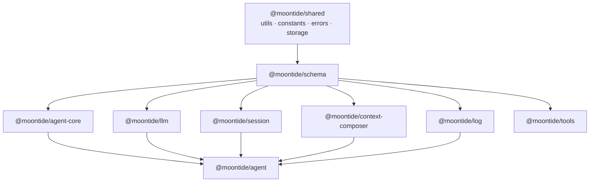

> **文档性质：** notes（架构参考，**非**当前实现承诺）
> **状态：** **deferred / no-go**（2026-08，当前证据下不执行）
> **动机：** 将分散在 `run-protocol`、`llm/protocol`、`session/types` 等的契约类型收拢为 **canonical schema 层**，避免各 package 重复定义或从多条路径 import 同类 type。
> **参考：** OpenCode V2 [`@opencode-ai/schema`](https://github.com/anomalyco/opencode) · JSON Schema SoT [#6879](https://github.com/anomalyco/opencode/issues/6879) / [#6987](https://github.com/anomalyco/opencode/pull/6987)
> **相关：** [`monorepo-packages.md`](monorepo-packages.md) · [`type-imports.md`](../../spec/type-imports.md)（**当前契约 import 权威**）· [`agent-harness-cli-split.md`](agent-harness-cli-split.md) DR-A

---

## 0. 决策（2026-08）

**结论：** 在当前证据下 **不执行** `@moontide/schema` 迁包；**不**写入根 [`TODO.md`](../../../TODO.md) 执行路径（原 §10 提议的 §19 作废）。

**当前权威：** [`docs/spec/type-imports.md`](../../spec/type-imports.md) — 按域边界（`run-protocol` · `llm/protocol` · `session` · `shared/protocol`）决策 import；**不**围绕 `@moontide/schema` 重写。

### 0.1 为何 no-go（当前证据）

| 证据 | 说明 |
|------|------|
| DR-A 已落地 | `@moontide/run-protocol` 已是 Run 栈契约包；**非** `@moontide/types` / mega 桶 |
| `type-imports.md` 可验收 | 域决策表 + conformance（如 `ToolArgumentStatus` 唯一定义）已守门 |
| `shared/protocol` 够用 | 跨层、无域语义 primitive 已抽 shared；**不**并入 run-protocol |
| 无 JSON Schema SoT 硬需求 | 手写 TS、小团队迭代；无对外 SDK / 多语言 client 同源约束 |
| 无 stable server API | OpenCode 式 `packages/protocol`（HttpApi）暂无产品里程碑 |
| 迁包成本 > 收益 | Phase 1–3 删 `run-protocol`、全局 import 替换；§18 主轨刚稳定 |

### 0.2 Revisit 条件（满足 **任一** 再开 RFC）

1. **JSON Schema 为 SoT** 成为硬需求 — Session Item / Agent Event / tool input 需 TS 类型与持久化/对外格式 **同源**（含 runtime 校验或 codegen）。
2. **重复定义**在 ≥2 域包反复出现，且 `shared/protocol` + conformance 无法收敛（非单次漏网）。
3. **版本化 wire format** — eval harness、sidecar IPC 或第三方 embed 需独立 bump 的 schema 版本，与实现包 release 解耦。
4. **Stable server API** 里程碑 — 需 OpenCode 式 **protocol（HttpApi）** 与域 model 分离；`@moontide/schema` 与 protocol 包分工明确。
5. **团队显式批准迁包预算** — 愿意承担 Phase 1–3 全量替换 + `pnpm run check`；且 §18 / M7 无并行大轨。

Revisit 时：**新开 notes RFC**，更新本文件状态；**仍不**默认改写 [`type-imports.md`](../../spec/type-imports.md)，除非 RFC 验收通过。

---

## 1. 问题

### 1.1 现状

| 位置 | 内容 | 问题 |
|------|------|------|
| `@moontide/run-protocol` | `RunEvent`、`RunConfig`、`AgentMessage`、Effect port 签名 | 命名与边界像「Run 栈专用包」，但动机应是 **全 repo 契约单一来源** |
| `@moontide/llm/protocol` | `Message`、`LLMRequest`、`ToolSchema` | 与 run transcript 分离合理，但与 run-protocol **同属 schema 层**，却物理分散 |
| `@moontide/session` `types.ts` | `SessionItem`、`SessionMessage` | 实现包内定义契约，eval/compose 从多路径引用 |
| `@moontide/shared/protocol/tool` | `ToolArgumentStatus` | 跨层 primitive 已抽 shared；与 run/llm 域 schema **混放层级不清** |

已发生过的重复：`ToolArgumentStatus` 在 run-protocol 与 llm/protocol 各定义一份（已迁至 shared/protocol/tool）。

### 1.2 目标陈述

1. **单一 schema 层**：对外契约 type 只在一处定义；实现包 **消费** schema，不私自定义再 export。
2. **按域分模块**（session / message / event / run / tool / llm），而非按「谁在用」拆成 run-only 小包。
3. **依赖图贴底**：schema 零业务包依赖；`agent-core`、`llm`、`session`、`log`、`agent` 等均依赖 schema。
4. **门禁可验收**：conformance 禁止域包重复 export 已在 schema 定义的符号。

### 1.3 非目标（本方案 Phase 1–3）

| 非目标 | 说明 |
|--------|------|
| 合并三种 Message 为一种 | `SessionMessage` / `Message`（LLM wire）/ `AgentMessage`（run transcript）语义不同；统一需单独 unification 设计（Phase 4 可选） |
| JSON Schema 为 SoT + codegen | OpenCode 远期方向；MoonTide 先手写 TS，规模小、迭代快 |
| 新建 `protocol` HttpApi 包 | OpenCode 的 `@opencode-ai/protocol` 是 **server↔client wire**；MoonTide 暂无多端 API，不引入 |
| 把 schema 并进 `@moontide/shared` | shared 保留 infra（utils/constants/errors/storage）；schema 独立包名与 OpenCode 对齐，避免与 path/fs 原语混 rebuild |

---

## 2. 参考：OpenCode schema 模型

```text
packages/schema/          @opencode-ai/schema — canonical Session/Message/Event/Tool/Agent/Provider…
packages/protocol/        Effect HttpApi — 客户端与服务端 API 契约（≠ 全部 domain type）
packages/core/            实现 — 只 import schema，不定义契约
schema/*.json（可选）     JSON Schema SoT → Zod + TS codegen
```

**可借鉴：**

- Schema **按域目录**组织，不按 consumer 分包。
- Event、Message、Session 同在 schema；CLI、server、core、log 共用 import 路径。
- **Protocol 与 schema 分离**：protocol = 对外 API 边界；schema = 域模型与事件 union。

**MoonTide 映射：**

| OpenCode | MoonTide（目标） |
|----------|------------------|
| `@opencode-ai/schema` | `@moontide/schema` |
| `packages/protocol`（HttpApi） | **暂不建**；RunEvent 属 schema/event，非 HTTP RPC |
| `@moontide/shared` | 仍 infra 原语；`shared/protocol/*` 逐步迁入 `schema/primitives` |

---

## 3. 目标结构

### 3.1 包：`@moontide/schema`

```text
packages/schema/
  src/
    primitives/           # ToolArgumentStatus 等跨域 enum
    session/                # SessionItem, SessionMessage, ItemKind…
    message/                # LLM Message, ContentBlock, ToolSchema（或拆 llm/）
    run/                    # RunConfig, TurnCompileResult, ports 签名, Outcome
    event/                  # RunEvent union, StreamDelta, LlmCallEndRecord
    version.ts              # PROTOCOL_VERSION（event/run 协议版本）
    index.ts                # 根 re-export（可选，优先 subpath）
  package.json              # exports 见 §3.2
```

### 3.2 package.json exports（建议）

| Subpath | 内容 |
|---------|------|
| `@moontide/schema` | 常用符号 barrel（可选，避免拉全量） |
| `@moontide/schema/primitives` | 跨域小 type |
| `@moontide/schema/session` | Session 域 |
| `@moontide/schema/message` | LLM wire message（现 llm/protocol 主体） |
| `@moontide/schema/run` | RunConfig、AgentMessage、ports、Outcome |
| `@moontide/schema/event` | RunEvent、StreamDelta |

### 3.3 依赖图（目标）



**硬规则：**

- `schema` **不**依赖 `agent-core` / `session` / `llm` 实现包。
- 实现包 **不 export** 已在 schema 定义的契约 type（允许 `export type { X } from "@moontide/schema/..."` 的 thin re-export 可讨论 deprecate）。
- `session` / `composer` **可以**依赖 schema，但 conformance 可限制 **不得** import `schema/run` · `schema/event`（仅 run 观测链需要）。

---

## 4. 自现状迁移映射

| 现状 | 迁入 schema | 原包保留 |
|------|-------------|----------|
| `packages/run-protocol/src/protocol/*` | `schema/run` + `schema/event` + `schema/primitives`（message 部分） | **删除** `run-protocol` 包 |
| `packages/llm/src/protocol/types.ts` | `schema/message` | `@moontide/llm` 保留 `runLLM`、adapters、routing |
| `packages/shared/src/protocol/tool.ts` | `schema/primitives/tool.ts` | shared 可 re-export 一版或删 subpath |
| `packages/session/src/types.ts` | `schema/session`（Phase 3） | session 保留 IO、transform、stores |
| `packages/tools` ToolSchema 引用 | import `@moontide/schema/message` | tools 保留 manifest、permission impl |

### 4.1 import 路径变更（示例）

| 旧 | 新 |
|----|-----|
| `@moontide/run-protocol` | `@moontide/schema/run` 或 `@moontide/schema/event` |
| `@moontide/llm/protocol` | `@moontide/schema/message` |
| `@moontide/shared/protocol/tool` | `@moontide/schema/primitives` |

[`docs/spec/type-imports.md`](../../spec/type-imports.md) **保持**域包中心叙述；若未来执行本方案，再 **增补** schema subpath 映射，而非预先改写权威文档。

---

## 5. 与「三种 Message」的关系

Phase 1–3 **不**合并语义，只 **搬迁 + 统一 import**：

| Type | Schema 模块 | 用途 |
|------|-------------|------|
| `SessionMessage` / `SessionItem` | `schema/session` | Item Log 事实源 |
| `Message` / `ContentBlock` | `schema/message` | LLM API 适配 wire |
| `AgentMessage` | `schema/run` | run loop 内存 transcript |

层间仍经现有 adapter（如 [`message-map.ts`](../../../packages/agent/src/agent/harness/message-map.ts)）转换。

**Phase 4（可选）：** 参考 OpenCode，在 schema 内定义 canonical `Message` + `Part` 变体，session/llm/run 改为 **投影** — 需单独 RFC，不在本方案默认范围。

---

## 6. 纪律与验收

### 6.1 定义层 vs 实现层（AGENTS §2.1 在 schema 层的落点）

| 层 | 位置 | 允许 |
|----|------|------|
| **Schema** | `packages/schema` | `export type` / `interface` / 纯函数 type guard；**禁止** IO、spawn、FS |
| **Impl** | 各业务包 | 算法、IO、注册表 handler；**禁止** 私自定义与 schema 同名的 export type |

### 6.2 Conformance（计划新增/调整）

| 测试 | 断言 |
|------|------|
| `schema-types-unique.test.ts` | 域包内不得 `export type ToolArgumentStatus` 等已在 schema/primitives 定义的符号 |
| `architecture-boundaries.test.ts` | `schema/` 零 `agent/` · `session/` impl import；`session`/`composer` 零 `schema/run` import（可选） |
| `package-exports.test.ts` | `@moontide/schema/*` dist 存在性 + Node import smoke |
| 更新 `type-imports.md` | **仅在未来 RFC 通过后**增补 schema 映射；deferred 期间以域包决策表为准 |

### 6.3 版本

- `PROTOCOL_VERSION` 留在 `schema/run` 或 `schema/event`（与 `RunEvent` union 同模块）。
- 破坏性变更 RunEvent / RunConfig → bump version；与 shared constants 变更 **解耦**。

---

## 7. 分期实施

### Phase 1 — 建包 + 迁 run-protocol（优先）

**范围：**

1. 新建 `packages/schema`，迁入现 `run-protocol` 全部源码（目录映射 §4）。
2. 全局替换 `@moontide/run-protocol` → `@moontide/schema/run` / `event`。
3. 删除 `packages/run-protocol`；更新 `pnpm-workspace`、`tsconfig.dev.json`、`vitest` alias。
4. `agent-core` 依赖改为 `@moontide/schema`。
5. 跑通 `pnpm run check`；更新 `monorepo-packages.md`、run-protocol README → schema README。

**验收：** 无 `@moontide/run-protocol` 引用；conformance 全绿。

### Phase 2 — 迁 llm/protocol + primitives

**范围：**

1. `llm/protocol/types.ts` → `schema/message`。
2. `shared/protocol/tool.ts` → `schema/primitives`；更新 re-export 或删旧路径。
3. `@moontide/llm` 改为从 schema import；`@moontide/llm/protocol` 可保留 **deprecated re-export** 一个版本周期。

**验收：** `ToolArgumentStatus` 唯一定义在 `schema/primitives`；llm 实现文件无本地 Message 定义。

### Phase 3 — 迁 session types

**范围：**

1. `session/types.ts` 及相关 export → `schema/session`。
2. `@moontide/session` 实现 import schema；block-registry 等同理。

**验收：** session 包不 export 与 schema/session 重复的顶层 type 定义。

### Phase 4（可选）— Message 语义统一

- 单独 notes RFC：canonical Message/Part、materialize/compile 影响面、迁移 oracle 测试。
- **不在 Phase 1–3 阻塞项。**

### Phase 5（远期）— JSON Schema SoT

- 根目录 `schema/*.json` + generate script（参考 OpenCode `script/generate-from-schemas.ts`）。
- 生成 TS + 可选 runtime validator；**仅当** 需要对外 SDK / 多语言 client 时启动。

---

## 8. 不做的事（明确排除）

- **不**将 schema 并入 `@moontide/shared` 根（避免 infra 与契约同包 rebuild）。
- **不**维持 `@moontide/run-protocol` 作为长期独立包名（内容并入 schema，包名退役）。
- **不**在 Phase 1 改 RunEvent / RunConfig 语义或合并 Message 模型。
- **不**为 MoonTide 引入 OpenCode 式 `packages/protocol` HttpApi，除非产品出现 stable server API 里程碑。

---

## 9. 开放问题

| # | 问题 | 倾向 |
|---|------|------|
| Q1 | `schema/message` vs `schema/llm` 目录名 | `message` 对齐 OpenCode；子路径 `@moontide/schema/message` |
| Q2 | 根 `@moontide/schema` barrel 是否 export 全部 | 仅 export 高频符号；完整列表走 subpath，避免 accidental 全量依赖 |
| Q3 | `@moontide/llm/protocol` 兼容 re-export 保留多久 | 一个 minor 周期，conformance 标记 deprecated import |
| Q4 | `session`/`composer` 禁止 import `schema/run` 是否上门禁 | 建议 Phase 1 后加 grep 门禁，防误用 |
| Q5 | `PROTOCOL_VERSION` 与 Agent Event schema 版本是否合并 | 保持分离；Agent Event 见 [`agent-events.md`](../../spec/agent-events.md) |

---

## 10. 执行入口（已作废）

~~合并到根 `TODO.md` §19~~ — **2026-08 决策：不纳入 TODO 执行路径。** 下文 Phase 1–3 仅作 **Revisit 时**的参考分期，非当前承诺。

<!--
原提议（归档）：
1. Phase 1 PR：`feat(schema): add @moontide/schema and migrate run-protocol`
2. Phase 2 PR：`refactor(schema): migrate llm protocol and primitives`
3. Phase 3 PR：`refactor(schema): migrate session types`
-->

---

## 11. 相关文档

| 文档 | 关系 |
|------|------|
| [`type-imports.md`](../../spec/type-imports.md) | **当前**契约 import 权威；本方案 deferred 期间不改为 schema 中心 |
| [`agent-core.md`](../../spec/agent-core.md) | Temporal core 消费 `@moontide/run-protocol`（非 schema 包） |
| [`context-composer.md`](../../spec/context-composer.md) §1.4 | materialize/compile 术语不变 |
| [`agent-harness-cli-split.md`](agent-harness-cli-split.md) DR-A | run-protocol 命名 **已落地**；本方案 **不 supersede** DR-A |
