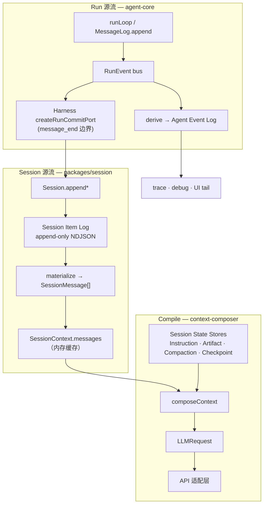

> **状态：** 2026-08 讨论稿（未决：Harness commit 协议）  
> **性质：** 澄清 Session Item Log 与 Run 观测的双源流模型，以及 materialize / compile / derive 边界；**不替代** [`context-composer.md`](../../spec/context-composer.md) Spec；**非**可直接执行的迁移计划。

## 1. 背景

### 1.1 常见误解

MoonTide 是否把 user input、tool result、model output、session log 全部统一为同一种 `Message[]`？

**否。** 运行时有多层类型（`SessionItem`、`SessionMessage`、`AgentMessage`、协议 `Message`、`RunEvent`），职责不同。

### 1.2 讨论中的「统一 message 事实」

对话里曾用 **MessageContext** / **FactLog** 指「append-only 会话事实」。在 MoonTide 中，其规范名称是 **Session Item Log**（`SessionItem` NDJSON）——不是裸 `{ role, content }[]`，也不涵盖 Artifact / CompactionSave / Checkpoint / Instruction State 的全文（那些是 **Session State Stores**）。

本文用 **Fact vs Compile**（[`context-composer.md` §1.4](../../spec/context-composer.md#14-术语一词一义)）组织讨论；过程动词统一为 **materialize**、**compile**、**derive**——**不用「投影 / Projection」** 指上述变换（Spec 明确避免）。

---

## 2. 核心结论

| 结论 | 说明 |
|------|------|
| **两条独立源流** | Session 事实（Item Log）与 Run 观测（RunEvent → Agent Event Log）**不是**同一 log 的上游/下游 |
| **语义消息处汇合** | `message_end` 等边界上，Harness 把 run transcript **桥接** 为 Session Item；两条流各保留不可互替的信息 |
| **Fact vs Compile** | Item Log append-only；`LLMRequest` 是 compile 产物，不是事实拷贝 |
| **materialize 边界** | `composeContext` 读 **已 materialize 的** `SessionMessage[]`，不读 NDJSON、不拥有 hydration |
| **Agent Core 不碰 Session 持久化** | `SessionItem` / `SessionItemCommitPort` 归 Harness + `packages/session`；core 只持有 run transcript 与 RunEvent 协议 |

---

## 3. 双源流架构

### 3.1 总览



### 3.2 Session 源流（事实 + materialize + compile）

```text
Session Item Log
  → messagesFromItems / applyItemToMessages     (materialize)
  → SessionMessage[] / SessionContext.messages
  → messagesFromContext                         (fold tool_result)
  → composeContext (+ Stores)                   (compile)
  → LLMRequest
```

代码锚点：

- materialize：[`packages/session/src/item-handlers.ts`](../../../packages/session/src/item-handlers.ts)
- compile：[`packages/context-composer/src/compose.ts`](../../../packages/context-composer/src/compose.ts)（入参 `input.messages: SessionMessage[]`）

### 3.3 Run 源流（transcript + derive）

```text
runLoop
  → MessageLog.append(AgentMessage)  +  publish(RunEvent)
  → RunEvent bus
  → createRunEventDeriveListener       (derive → Agent Event Log)
  → createRunCommitPort (Harness)      (message_end → Session.append*)
```

RunEvent 含 Session Item **无法重建** 的语义：`run_start/end`、`turn_start/end`、`tool_execution_*`、`message_update` delta、abort/error outcome 等（[`run-event.ts`](../../../packages/run-protocol/src/protocol/run-event.ts)）。

**Agent Event Log 不是 Session Item Log 的 derive 产物**；二者在语义消息边界 **并行消费** RunEvent，而非共享同一上游 log。

---

## 4. 类型与职责

| 类型 | 作用域 | 角色 |
|------|--------|------|
| **`SessionItem`** | session 持久化 | 一行 NDJSON 事实（带 `kind`） |
| **`SessionMessage`** | session 内存 | materialize 后的对话条目（含 `sessionId` / `turn` / `at` / item `id`） |
| **`AgentMessage`** | 单次 run | agent-core transcript（run 级时序内核） |
| **`Message`** | 单次 LLM 调用 | `LLMRequest.messages`（协议层，fold 后） |
| **`RunEvent`** | 单次 run | RunEvent bus 协议；derive 与 Harness bridge 的输入 |

**Non-goal：** 合并 `AgentMessage` ↔ `SessionMessage`。前者是 run 级内核状态；后者携带 durable provenance 与 session 身份。转换应 **显式、窄**（Harness `message-map.ts` / `createRunCommitPort`），不共型。

模块归属（[`architecture-remediation.md`](../runtime/architecture-remediation.md)）：

| 层 | 拥有 |
|----|------|
| **agent-core** | `MessageLog`、`RunEvent` 协议、run loop |
| **packages/session** | `SessionItem` 类型、materialize、IO |
| **packages/agent-cli Harness** | `SessionItemCommitPort` 注入、`AgentMessage → SessionItem` 桥接 |

---

## 5. Session Item 形状

### 5.1 kind 一览

| kind | 进 `SessionContext.messages`？ | 说明 |
|------|----------------------------------|------|
| `user_message` | 是 | 用户输入 |
| `assistant_message` | 是 | 模型输出（含 `ContentBlock[]`） |
| `tool_outcome` | 是（fold 为 user + `tool_result`） | tool 结果摘要 |
| `protocol_reminder` | 是（materialize 为 `role: user`） | 合成策略文本；**provenance 须与真实 user 输入可区分**（UI / eval / analytics） |
| `tool_invocation` | **否**（见 §5.2） | 冗余索引行 |
| `compaction` · `checkpoint_created` · `routing` | 否 | compose 元数据 |

### 5.2 `tool_invocation` 与 `assistant_message.blocks`

写盘时 `itemsFromMessage` 在 `assistant_message`（含 `tool_use` block）之外 **额外** append `tool_invocation` 行（[`items-from-message.ts`](../../../packages/session/src/transform/items-from-message.ts)）。

**Canonical 表示：** `assistant_message.blocks` 内的 `tool_use`。

materialize **忽略** `tool_invocation`（[`item-handlers.ts`](../../../packages/session/src/item-handlers.ts)；[`log-to-messages.test.ts`](../../../tests/log-to-messages.test.ts)）。新 consumer 若把两行都当独立 tool call，会 **重复计数**。

讨论稿 invariant（待 schema 迁移确认）：

1. materialize **不得**从 `tool_invocation` 产生额外 tool call。
2. 长期：`tool_invocation` 标为索引/derived record，或从写路径移除。

### 5.3 什么进 Item Log，什么不进

| 数据 | 进 Session Item Log？ | 存放 |
|------|----------------------|------|
| user / assistant / tool 结果 | 是 | Item |
| compaction / checkpoint / routing | 是 | Item + Store 指针 |
| protocol_reminder | 是 | Item |
| Artifact 全文 | 否 | ArtifactStore + `tool_outcome.artifactId` |
| CompactionSave / Checkpoint 快照体 | 否 | 各自 Store + Item id |
| Instruction State | 否 | 文件源；compose 注入 `system` |
| `message_update` delta | **否** | 渲染协议；不进 session 事实 |
| context metrics / trace | **否** | Agent Event Log（run 级） |
| `run_start` / `tool_execution_*` 等 | **否** | RunEvent only |

Session Item Log 是 **会话时序与引用索引**，不是 MoonTide 全部 payload 的物理仓库。

---

## 6. 写入与 commit（待决）

### 6.1 错误模型（本文 v1 已否决）

以下表述 **不正确**，勿作迁移依据：

- 「Agent Event Log 是 Session Item Log 的 derive」
- 「append 一次 → Item + RunEvent 同源」
- 「agent-core `append` 直接经 `SessionItemCommitPort` write-through」

### 6.2 现行实现与缺口

Harness 在 `message_end` 桥接 Session（[`run-commit-port.ts`](../../../packages/agent/src/agent/harness/run-commit-port.ts)）：

```ts
// message_end → void _commitMessage(session, ...)  // 未 await
```

已知缺口：

| 位置 | 行为 | 风险 |
|------|------|------|
| [`RunEventBus.publish`](../../../packages/agent-core/src/run-event-bus.ts) | `void listener(event)` | listener 失败不可见 |
| `createRunCommitPort` | 丢弃 persistence promise | 落盘失败不影响 run outcome |
| [`Session.pushMessage`](../../../packages/session/src/session.ts) | 先 `messages.push`，再 `await commit` | crash 后内存超前于 jsonl |

### 6.3 候选 Harness commit 协议（P1 讨论范围）

**所有权：** packages/agent-cli Harness（或注入的 provider-neutral **MessageCommitEffect**）；agent-core **不** import `SessionItem`。

建议 invariant（待实现前不写「定稿」）：

1. **分配稳定 item id**（与 SessionMessage.id 一致）。
2. **await 持久化** Session Item（`SessionItemCommitPort` / `FileSessionItemWriter` ack）。
3. **更新 materialized cache**（`SessionContext.messages`）——考虑改为 ack **之后** 再 push，或失败时回滚/标记 dirty。
4. **publish 语义完成**（`message_end` / RunEvent）在 session fact committed **之后**，或携带 `commitStatus` 供观测。
5. **按 id 重试幂等**。
6. **derive listener 失败不回滚** 已提交 session fact。

在协议定稿前，本文 **不是** 迁移计划。

### 6.4 agent-core 内「append → event」仍成立

run 内 transcript 仍遵循 [`agent-core.md`](../../spec/agent-core.md) §6：`MessageLog.append` 唯一变更路径，同步产出 `message_start` / `message_end`；**delta 不进 log**。这与 Session 持久化 **正交**。

---

## 7. 三路变换（canonical 用词）

### 7.1 materialize（Item Log → SessionMessage[]）

```
.moontide/sessions/<id>.jsonl
  → messagesFromItems
  → SessionMessage[]
  → SessionContext.messages（热路径缓存；冷启动以 jsonl 为准）
```

### 7.2 compile（SessionMessage[] + Stores → LLMRequest）

```
SessionContext.messages
  → messagesFromContext          // SessionMessage[] → 协议 Message[]
  → composeContext               // + system, tools, compaction, budget, ...
  → LLMRequest
```

`composeContext` **不**读取 Item Log NDJSON（[`compose.ts`](../../../packages/context-composer/src/compose.ts) 接收 `ComposeContextInput.messages`）。

compile 还依赖 Stores 与 RunConfig：`system`（Instruction State）、`tools`、`maxTokens`、`thinkingLevel`；`toolChoice` 已在 [`LLMRequest`](../../../packages/llm/src/protocol/types.ts) 类型与 adapter normalize 路径中，compose 热路径是否每轮设置属产品策略。

### 7.3 derive（RunEvent → Agent Event Log）

```
RunEvent bus
  → createRunEventDeriveListener
  → Agent Event Log（.moontide/runs/<runId>.active.jsonl）
```

观测持久化规则见 [`agent-events.md`](../../spec/agent-events.md)（64 KiB 截断、channel、metrics 不含完整 messages）。**不写回** Session Item Log。

---

## 8. 与现状对照

| 已有 | 讨论稿目标（未排期） |
|------|---------------------|
| Session Item Log + materialize + compose 骨架 | 保持 |
| RunEvent bus + derive + Harness `run-commit-port` | 保持双源流；**加强** await / 失败语义 |
| `SessionContext.messages` 作 compose 热路径缓存 | 明确「缓存」；jsonl 为 session 事实源 |
| `AgentMessage` ↔ `SessionMessage` 显式转换 | **不合并类型** |

行业参考（背景阅读，非 MoonTide 决策依据）：[`context-analysis.md`](../context/context-analysis.md)（OpenCode V2 durable event state、Reasonix revisioned log 等对比）。

---

## 9. 不变量（与 Spec 对齐）

1. **Session Item Log append-only** — 不 splice 删历史；compact 只改 compose 规则。
2. **composeContext 唯一 LLM 出口** — 热路径不 `readLog()` 全量重算。
3. **Composer 不拥有 persistence** — 不读 NDJSON；不负责 session 加载。
4. **Agent Event 不写回 Session** — derive 单向。
5. **RunEvent 与 Session Item Log 双源流** — 语义消息在 Harness 边界桥接，非单一上游 log。
6. **渲染与事实分离** — `message_update` delta 不进 Session Item Log。
7. **厂商中性中间态** — SessionMessage / Item 使用 MoonTide `ContentBlock`。
8. **agent-core 零 Session 持久化依赖** — commit 在 Harness。

---

## 10. 待决问题

1. **Harness commit 协议** — await 顺序、失败时 run outcome vs session 一致性、幂等键。
2. **`protocol_reminder` provenance** — materialize 为 `role: user` 时，UI/eval 如何区分合成与用户输入。
3. **`tool_invocation` 去留** — 保留为索引 vs 写路径只 emit `assistant_message`。
4. **`Session.pushMessage` 顺序** — 先 persist 再 cache，还是 optimistic + repair。
5. **跨 session handoff** — Item Log 不变；compose 按 consumer 编译（[`session-handoff.md`](session-handoff.md)）。

---

## 11. 相关文档

| 文档 | 关系 |
|------|------|
| [`context-composer.md`](../../spec/context-composer.md) | 主 Spec；Fact vs Compile；术语 §1.4 |
| [`session-domain-model.md`](session-domain-model.md) | 现行类型与模块表 |
| [`agent-core.md`](../../spec/agent-core.md) | MessageLog + append/event 配对 |
| [`agent-events.md`](../../spec/agent-events.md) | Agent Event Log vs Session Item Log |
| [`architecture-remediation.md`](../runtime/architecture-remediation.md) | Session port · 模块边界 |
| [`session-handoff.md`](session-handoff.md) | 为何 Item Log + Composer 是 handoff 前提 |
| [`context-analysis.md`](../context/context-analysis.md) | 行业背景 |

---

## 附录：讨论用语对照（非 canonical）

| 讨论用语 | 规范用语 |
|----------|----------|
| FactLog / MessageContext | **Session Item Log** |
| 「投影」 | **materialize / compile / derive**（按方向选用） |
| 「单写路径」 | Session 事实：**Harness 桥接后的** `Session.append*`；Run：**MessageLog.append**（二者不可混为一谈） |
