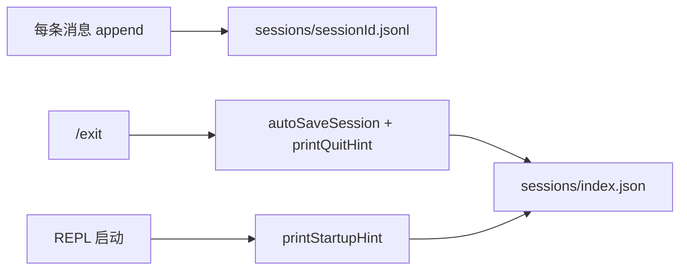

> **Session Item Log** 是对话事实源（append-only）；**Session Index** 是可发现性元数据，便于跨 REPL 重启列出与加载 session。实现位于 builtin plugin [`session-persistence`](../../../packages/agent/src/plugins/builtin/session-persistence/)。

## 两层存储

| 层 | 路径 | 职责 | 写入时机 |
|----|------|------|----------|
| **Session Item Log** | `.moontide/sessions/<sessionId>.jsonl` | 对话事实（user / assistant / tool / compaction / checkpoint 等） | 每条消息经 `SessionItemCommitPort` **即时 append** |
| **Session Index** | `.moontide/sessions/index.json` | session 书签（sessionId + 元数据；可选 `label?`） | `exit` / `/reset` 静默 upsert；`/save` 显式 upsert |

**结论：** 用户 **无需** 在 exit 前手动 save 才能保留对话正文；index 解决「下次如何找到这段对话」。

## Index 条目

```json
{
  "entries": [
    {
      "sessionId": "20260804-195300-a1b2c3d4",
      "label": "debug-mode",
      "savedAt": "2026-08-04T11:53:00.000Z",
      "messageCount": 12,
      "lastTurn": 4
    }
  ]
}
```

- **`sessionId`** — 主键；与 Item Log 文件名一致（`YYYYMMDD-HHmmss-<8 hex>`）
- **`label?`** — 可选；hint / list 有则附带 `(label)` 展示。**当前无 CLI 写入 label**（schema 预留）
- **upsert 规则** — auto-save / `/save` 不写 label；若条目已有 label，upsert **保留** label、只更新 `savedAt` / `messageCount` / `lastTurn`

## REPL 命令

| 命令 | 作用 |
|------|------|
| `/save` | 将当前 session 写入 index；输出 `saved <sessionId> · N messages` |
| `/save list` | 列出 index 条目 + 磁盘上未索引的 `*.jsonl`（标记 `not indexed`） |
| `/resume session <session-id>` | `AgentSession.open` 加载历史 session；可选第三参数 checkpoint id |
| `/resume <checkpoint-id>` | **同 session 内**回滚可见窗口（见 [context-composer §8](../../spec/context-composer.md#8-checkpoint)） |

## 生命周期



- **exit** — 有消息时 auto-save index，stderr 打印当前 sessionId 与 `/resume session <id>`
- **reset** — 仅静默 upsert index（不打印 quit hint）
- **启动 hint** — `Previous session: <id> · N messages` + `Resume: /resume session <id>`；index 优先，无 index 时 fallback `*.jsonl` mtime；无历史则不打印
- **`/reset`** — auto-save 旧 session 后内存换新 `sessionId`（旧 jsonl 仍保留）

## 与 Checkpoint 的区别

| | Session Index + `/resume session` | Checkpoint + `/resume <id>` |
|---|-----------------------------------|-----------------------------|
| **粒度** | 整场 session | 同 session 内某 turn 快照 |
| **范围** | 跨 REPL 重启 | 仅当前已加载的 session |
| **存储** | `index.json` + Item Log | `checkpoints/<id>.json` + Item Log 事件 |
| **典型用途** | 继续昨天的对话 | 回到 refactor 前的窗口 |

## Plugin 边界

| 模块 | 职责 |
|------|------|
| [`session-persistence/`](../../../packages/agent/src/plugins/builtin/session-persistence/) | index 读写、format、command handler、lifecycle |
| [`cli/session-persistence-glue.ts`](../../../packages/agent-cli/src/cli/session-persistence-glue.ts) | 注入 `SessionPersistenceDeps` |
| [`session/paths.ts`](../../../packages/session/src/paths.ts) | `sessionIndexPath` |
| [`cli/repl/run.ts`](../../../packages/agent-cli/src/cli/repl/run.ts) | 启动 hint、exit auto-save + quit hint |

Plugin **不 import** `cli/`（architecture-boundaries 测试覆盖）。

## 相关文档

| 文档 | 关系 |
|------|------|
| [context-composer.md §3–§4](../../spec/context-composer.md) | Session Item Log 主 Spec |
| [session-domain-model.md](session-domain-model.md) | Session 类型与 compose 数据流 |
| [agent-events.md](../../spec/agent-events.md) | run 级观测 vs session 事实 |
