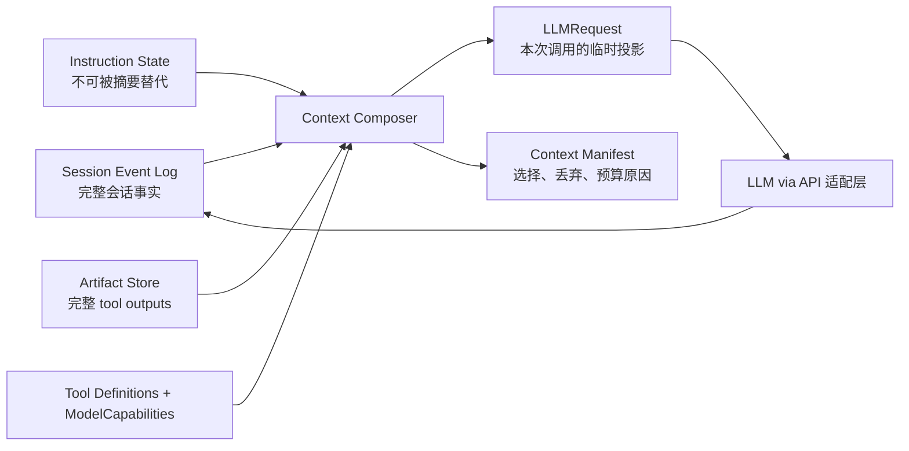

## 结论

截至 2026-07-30，行业内没有一个单独的“最佳 context window 算法”。真正逐渐收敛的 SOTA 架构是：

也就是说：

- Session history 是 source of truth（Oculeau：**Session Event Log**，见 [`context-composer.md`](context-composer.md)）。
- Model context 只是针对某次请求编译出来的 ephemeral projection（**LLMRequest**）。
- System instructions、permissions、用户约束不能依赖 conversation summary 存活。
- 大型 tool output 应先变成可寻址 artifact，而不是直接塞进 summary。
- Compaction 是有验证、有恢复能力的状态转换，不是对 `messages[]` 随手 `splice()`。

这也是我认为对 Oculeau 最重要的启发。

## 版本与身份边界

| 产品 | 当前状态 | 证据边界 |
|---|---|---|
| Claude Code | `2.1.220` 是 latest channel；`2.1.212` 是延迟发布的 stable channel | 最新版本核心已是 native binary，不能把旧版 sourcemap 当成最新 codebase；以下主要依据[官方文档与 changelog](https://code.claude.com/docs/en/changelog) |
| Codex CLI | stable `rust-v0.146.0`，另有 `v0.147.0-alpha.2` | 核心开源，可以审计到 `ContextManager`、compaction checkpoint 和 resume 实现；[stable release](https://github.com/openai/codex/releases/tag/rust-v0.146.0) |
| OpenCode | V1 当前 release `1.18.9`；“OpenCode 2.0”目前是 `@next`/`opencode2` beta | 不是已经稳定发布的 semver 2.0；[V2 migration](https://opencode.ai/v2/docs/migrate-v1) |
| CodeWhale | 当前 `v0.9.1` | 社区项目，原 DeepSeek-TUI，不是 DeepSeek 官方 CLI；[release](https://github.com/Hmbown/CodeWhale/releases/tag/v0.9.1) |
| Reasonix | 当前 npm `1.17.21` | 社区项目；被 DeepSeek ecosystem 列表收录不等于 DeepSeek 官方维护；[DeepSeek listing](https://github.com/deepseek-ai/awesome-deepseek-agent/blob/main/docs/reasonix.md) |

“DeepSeek CodeWhale”这个名字还存在另一个 Go 项目 `usewhale/DeepSeek-Code-Whale`，同样明确声明不是 DeepSeek 官方。讨论时需要先固定具体 repository。

## 各产品如何管理 context

| 产品 | 核心机制 | 最值得参考 | 明显限制 |
|---|---|---|---|
| Claude Code | 完整 JSONL transcript；稳定 prompt prefix；先清旧 tool outputs，再 summary compaction；root instructions 和 auto-memory 重新注入；subagent context 隔离 | 分层 prompt cache、progressive tool/skill loading、instruction reinjection | 最新源码不可审计；summary 仍然有损；path-scoped rules 在 compaction 后需要重新触发加载 |
| Codex CLI | `ContextManager` 独占 model-visible history；每次构建完整逻辑 prompt；remote opaque compaction 或 local summary；replacement checkpoint 可恢复 | Context ownership、server usage 优先、checkpoint/resume、保守 incremental request reuse | proactive check 尚不包含即将加入的大输入；部分 persistence 路径不是严格事务 |
| OpenCode V2 | durable event state；checkpoint + recent tail；独立 instruction epochs；prompt cache diagnostics | Instruction state 不依赖 conversation summary，是最有价值的新设计之一 | 仍是 beta；文档声称按最终 projected request 估算，但当前源码主要读取最近 provider usage，存在 docs/source drift |
| CodeWhale | model-aware threshold；cache-aligned compaction；固定保留最近消息、path/error/patch anchors；subagent 可 fresh/fork | 对 DeepSeek prefix cache、工作集和 tool pair 的工程化处理较深入 | 默认 live history 会被 summary 替换，没有 Reasonix 那样强的原始归档；机制较多，复杂度偏高 |
| Reasonix | provider 实际 token 驱动；50/60/80/90% 分级压力；compaction 前归档原始消息；revisioned event log；summary + anchors + tail | 当前几者中 recovery、traceability 和 compaction fallback 最完整 | 社区项目、变化快；memory/compaction/cache/recovery 子系统较重，不适合整体照搬 |

### Claude Code

Claude Code 官方公开的行为是：

- 每次调用仍发送完整逻辑 context，cache 依赖 exact prefix。
- 顺序稳定为：system/tools → project context → conversation。
- 接近上限时先清理旧 tool outputs，再进行 summary。
- Auto-compaction 大约在有效容量的 95% 附近触发。
- 根目录 `CLAUDE.md`、unscoped rules、auto memory 会在 compaction 后重新注入。
- nested/path-scoped rules 不会全部放进 summary，要等相关文件再次被访问。
- named subagents 使用隔离 context；fork 类型 agent 才继承父 context。
- 本地 JSONL 保存原始记录，但 resume 使用的是 compaction 后的 effective chain。

来源：[context window](https://code.claude.com/docs/en/context-window)、[prompt caching](https://code.claude.com/docs/en/prompt-caching)、[sessions](https://code.claude.com/docs/en/sessions)、[subagents](https://code.claude.com/docs/en/sub-agents)。

最关键的启发不是它的 summary prompt，而是：

> authoritative instructions 由磁盘状态重新注入，不要求 summary 准确记住它们。

### Codex CLI

Codex 是目前最适合做源码级参考的实现。

它的 `ContextManager`：

- 独占 model-visible history，并通过 copy-on-write snapshot 避免随意共享可变数组。
- 写入时已经对大型 tool/function outputs 做截断投影。
- 发送请求前规范化 tool call/result 配对及媒体内容。
- 优先使用 provider 返回的实际 token usage，本地估算只是补充。
- Remote Compaction V2 成功后产生 opaque compaction item，再和近期真实用户消息组合成 replacement history。
- 成功 replacement 会连同 window ID、checkpoint、后续 suffix 一起持久化；resume 从最近有效 checkpoint 重建。
- WebSocket 只有在 model、instructions、tools、reasoning、cache key 等都一致，而且新输入确实是旧请求的 append-only delta 时，才使用 `previous_response_id`。

源码：[history ownership](https://github.com/openai/codex/blob/6219b7c40fc9c702c0aef9964e72b492558f60e4/codex-rs/core/src/context_manager/history.rs#L38-L60)、[prompt construction](https://github.com/openai/codex/blob/6219b7c40fc9c702c0aef9964e72b492558f60e4/codex-rs/core/src/session/turn.rs#L333-L357)、[remote compaction](https://github.com/openai/codex/blob/6219b7c40fc9c702c0aef9964e72b492558f60e4/codex-rs/core/src/compact_remote_v2.rs#L439-L571)、[resume reconstruction](https://github.com/openai/codex/blob/6219b7c40fc9c702c0aef9964e72b492558f60e4/codex-rs/core/src/session/rollout_reconstruction.rs#L112-L186)。

对 Oculeau 最有价值的是 `ContextManager` 的 ownership，而不是 Rust 本身。

### OpenCode V2

OpenCode V2 是最明显朝 “context as compiled state” 转向的设计：

- 历史事件仍然 durable。
- Active model history 从最后一个成功 compaction checkpoint 开始。
- Compaction 输出结构化 checkpoint，包含 objective、important details、completed/active/blocked work、next move、relevant files。
- 保留约 8K recent tail。
- Instructions 使用单独的 hash/epoch 状态管理，在 compaction 发生的位置推进 instruction epoch。
- 旧 messages 仍然存在，不等于直接删除。
- 最终调用即使禁止继续调用工具，也尽量保留 tool definitions，以维持 cache prefix。

这是目前几者中最值得 Oculeau借鉴的抽象。不过它还是 beta，而且 threshold 的[当前源码](https://github.com/anomalyco/opencode/blob/f9de608dead252e1c50041feb42b69ddde43e34d/packages/core/src/session/compaction.ts#L344-L357)与[V2 文档](https://opencode.ai/v2/docs/compaction)并未完全一致，所以不应把它当成熟参考实现直接移植。

### CodeWhale 与 Reasonix

这两个项目体现的是 DeepSeek prefix-cache 环境下的两种方向。

CodeWhale 更偏 cache-aware：

- 尽量维持原始 request prefix。
- 保留最新四条消息以及 path/error/patch anchors。
- 先机械缩减旧 tool results，再生成 successor summary。
- 对大 context 使用 cache-aligned summary request。
- v0.9.1 增加更结构化的 successor brief 和 per-session recovery checkpoint。

Reasonix 更偏 durable/recoverable：

- 根据上一请求的实际 provider prompt tokens 判断压力。
- 逐级执行 notice、tool-result snip、normal compact、forced compact。
- Compaction 前先把被折叠内容写到 archive。
- Event log 带 revision、digest 和 writer identity，能处理 torn tail、stale writer 和 interrupted tool state。
- Summary 失败后还有 deterministic mechanical digest fallback。
- Subagent 默认 fresh context，只把最终结果返回 parent。

Reasonix 的设计更健壮，但它把 context、memory、recovery、cache、subagent 都做得较深。Oculeau 目前只适合选择其中一两个高 leverage seam，不适合照搬整个系统。

另外，DeepSeek 官方 API 当前 V4 Flash/Pro 是 1M context，并自动提供 exact-prefix disk cache；client 只能看到 hit/miss token，不能保证缓存驻留。[DeepSeek model limits](https://api-docs.deepseek.com/quick_start/pricing/)、[disk context cache](https://api-docs.deepseek.com/guides/kv_cache)。

## 我认为当前真正的 SOTA 实践

成熟生产实践已经基本收敛到：

1. Durable history 与 active prompt 分离。
2. Instructions、permissions、current task constraints 独立于 summary。
3. 先减少 tool/schema/output 压力，再做 conversation summary。
4. Structured checkpoint + recent verbatim tail，而不是 summary-only。
5. 使用 provider actual usage；估算 projected next request，并预留 output/reasoning/tool headroom。
6. 保持确定性的 prefix 顺序，但把 cache 当优化，不当 correctness boundary。
7. 完整 tool result 存进可寻址 artifact；prompt 中只放 receipt、preview 和重读方式。
8. Compaction replacement 必须 validate，再进行原子持久化和 active-state 切换。
9. 高输出研究任务放进 fresh subagent context，parent 只接收 bounded result。
10. 建立 Context Manifest 和多次 compaction 后的任务成功率测试。

仍属于 research frontier、暂不适合 Oculeau 第一版的包括：

- Gemini CLI 当前默认关闭的 context graph pipeline。
- Vector/semantic cross-run automatic memory。
- 后台并行 compaction daemon。
- 多级 seam manager/capacity controller。
- ARC 一类 addressable context graph。

相关研究也支持这种克制：

- 长 context 对中间位置的信息利用仍然明显下降：[Lost in the Middle](https://arxiv.org/abs/2307.03172)。
- 2026 年一项 preprint 报告 compaction 后约束遵守会持续衰减，而单独 pin constraints 能恢复表现：[Governance Decay](https://arxiv.org/abs/2606.22528)。这是 preprint，不应当作最终行业定论，但方向与生产系统的 instruction reinjection 一致。
- Addressable Retrieval Context 把完整 observation 存在可寻址存储中、active prompt 只保留引用，needle recall 很强，但在更综合 benchmark 上提升有限：[ARC](https://arxiv.org/abs/2607.25066)。它适合作为未来方向，不是当前必做。

## 对 Oculeau 的具体判断

当前实现是合格的 prototype，但还不是可持续的 context architecture：

- [`agent/loop.ts`](/Users/chenjiayu/code/agent-learning/oculeau/src/agent/loop.ts:20) 让 loop 直接持有并原地修改 `messages[]`。
- [`compact.ts`](/Users/chenjiayu/code/agent-learning/oculeau/src/context/compact.ts:145) 的 auto compact 只缩减旧 tool results 和 thinking；manual summary 使用通用 prompt，并把每条消息序列化后截到 4,000 字符。
- [`snapshot.ts`](/Users/chenjiayu/code/agent-learning/oculeau/src/context/snapshot.ts:6) 与 [`sessions.ts`](/Users/chenjiayu/code/agent-learning/oculeau/src/context/sessions.ts:39) 保存的是原数组引用，不是真正 snapshot。
- [`constants/llm.ts`](/Users/chenjiayu/code/agent-learning/oculeau/src/constants/llm.ts:9) 仍把 DeepSeek V4 设为 128K，与当前官方 1M 不一致。

建议保持克制，按这个顺序推进：

1. 修正 model profile，并区分 previous actual usage、projected next-input size、reserved output。Model Profile 对应 **ModelCapabilities**（[`llm-provider.md`](llm-provider.md) §9.4）；Session 中间态见 [`context-composer.md`](context-composer.md)。
2. 增加 **Context Composer** Module，让所有 LLM 请求只能从这里获得 `LLMRequest` 与 Manifest（Spec：[`context-composer.md`](context-composer.md)）。
3. 把 system/project/runtime instruction state 移出 conversation compaction。
4. 给 tool result 增加 full artifact + bounded prompt projection；先解决最大的 context 消耗来源。
5. 再实现 structured checkpoint + 最近完整 turns，验证成功后才替换 active context。
6. 建立多次 compaction、约束存活、exact path/error recall、tool pair、overflow、crash/resume、cache hit、latency/cost 测试。
7. 只有这些指标证明有必要，再考虑 graph、vector memory 或后台 compaction。

**演进特性 backlog**（分账、Structured IR、Compose 实验与 Deferred 项）见 [`context-features-backlog.md`](context-features-backlog.md)。

不需要因为 Codex 使用 Rust 就重写 Oculeau agent core。这个问题的主要矛盾是 state ownership、invariants、recovery 和 observability，TypeScript 完全能够正确实现。

完整的架构候选、before/after 图和优先级在这里：[architecture review](/private/tmp/architecture-review-20260730-agent-context-sota.html)。

Which of these would you like to explore?