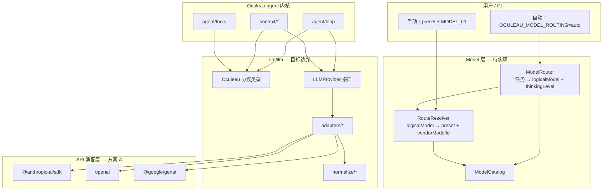

# Oculeau LLM Provider 与 Model 机制

> Oculeau 如何把「选模型、接 API、发请求」从 agent loop 里拆出来。  
> LLM 一次 input 的三参数对表见 [`llm-input-mapping.md`](llm-input-mapping.md)；context 组装见 [`context-window-analysis.md`](context-window-analysis.md)。

---

## 1. 两个概念

| 概念 | 是什么 | 例子 |
|------|--------|------|
| **Model（模型）** | 一次 LLM 调用使用的**具体能力实例** | `deepseek-v4-pro`、`claude-sonnet-4`、`anthropic/claude-sonnet-4`（OpenRouter 命名） |
| **Provider Preset（接入预设）** | **谁把请求送到模型** — 官方 API 通道或生态兼容口 | `deepseek`、`anthropic`、`openrouter`、`custom` |

关系：

```
Provider Preset（1） ──提供──▶ Model（N）
```

- 用户心智：**选用什么脑（Model）**；**从哪扇官方门进（Preset）** 可由系统解析，不必每次手动指定。
- **Model routing**（任务 → 选模型 + thinking）是 Oculeau 的差异化能力。
- **Provider routing**（同一 model 在多个 upstream 间竞价 / failover）**不是**本期目标；走 OpenRouter 时 upstream 选择交给网关。

---

## 2. 产品原则

1. **官方直连优先** — 提供若干主流厂商的 **官方 preset**，能力可预期、适合 production tool loop。
2. **OpenRouter 生态兼容** — 作为广谱 model 的兼容口，一个 key 访问多厂商命名空间；不取代官方。
3. **智能在 Model 层** — **Model Router** 按任务类型选逻辑 model 与 **thinking level**；不做应用内的 provider upstream 路由。
4. **Loop 不绑厂商** — agent 内核只依赖 Oculeau 协议类型 + `LLMProvider` 接口；SDK 类型关在 adapter 内。
5. **支持边界 ~20%** — 第一版 preset 覆盖 DeepSeek、Kimi、OpenAI、Anthropic、Gemini、OpenRouter 与用户自定义中转（`custom`），即可满足大多数用户；长尾怪协议在产品成熟前**不做**。

---

## 3. Provider Preset Catalog

实现上按 **协议族** 收敛为少量 adapter，不必每个品牌一套 loop。详见 [§8 Adapter 与 Normalize 设计](#8-adapter-与-normalize-设计)。

### 3.1 官方直连（默认推荐）

| Preset ID | 厂商 | 协议族 | API Key 环境变量 | 第一版 |
|-----------|------|--------|------------------|--------|
| `deepseek` | DeepSeek 官方 | `anthropic-messages` | `DEEPSEEK_API_KEY` | 是 |
| `kimi` | Moonshot / Kimi | `openai-chat-completions` | `MOONSHOT_API_KEY` | 是 |
| `openai` | OpenAI 官方 | `openai-chat-completions` / `openai-responses` | `OPENAI_API_KEY` | 是 |
| `anthropic` | Anthropic 官方 | `anthropic-messages` | `ANTHROPIC_API_KEY` | 是 |
| `gemini` | Google Gemini | `google-generate-content` | `GOOGLE_API_KEY` | 是 |
| `glm` | 智谱 GLM | `openai-chat-completions` | `ZHIPU_API_KEY` | 可选（第二期） |

### 3.2 生态兼容

| Preset ID | 定位 | 协议族 | API Key | 第一版 |
|-----------|------|--------|---------|--------|
| `openrouter` | 广谱 model；试新 model、无某家官方 key 时的后备 | `openai-chat-completions` @ `https://openrouter.ai/api/v1` | `OPENROUTER_API_KEY` | 是 |

OpenRouter 在 OpenRouter 命名空间下使用 model 字符串，例如 `anthropic/claude-sonnet-4`、`deepseek/deepseek-chat`。

**建议接入（第一版）：**

- 单 endpoint + OpenAI Chat 形状 adapter
- `MODEL_ID` + 可选 `OCULEAU_MODEL_FALLBACKS`
- `session_id` = `runId`（多轮 agent sticky / cache 友好）

**明确不做（第一版）：**

- 应用内配置 OpenRouter `provider.order` / latency 排序等 upstream 策略
- 同一 model 在官方 preset 与 OpenRouter 间自动竞价
- BYOK 向 OpenRouter 注入各厂商 key（可文档预留，后期再做）

### 3.3 用户自定义中转（custom）

| Preset ID | 定位 | 协议族 | 配置 | 第一版 |
|-----------|------|--------|------|--------|
| `custom` | 用户自建的 OpenAI 形或 Anthropic 形中转站 | 用户选 `anthropic-messages` 或 `openai-chat-completions` | `CUSTOM_API_KEY` + `OCULEAU_CUSTOM_BASE_URL` + `OCULEAU_CUSTOM_ADAPTER` | 是 |

`custom` **不是**第七套 adapter 实现，而是复用已有 adapter + 可变 `baseUrl`。中转站若声称兼容 OpenAI Chat 或 Anthropic Messages，应能直接工作；若有小差异，通过 [§7 compat](#7-低成本保险扩展性约束) 覆盖，而非新增协议族。

---

## 4. 架构



**调用链（目标）：**

```
用户输入
  → [可选] ModelRouter：任务分类 → logicalModel + thinkingLevel + reason
  → RouteResolver：查 catalog + env keys → { providerPresetId, vendorModelId }
  → resolveCapabilities(logicalModel)
  → LLMProvider.chat(LLMRequest)
  → normalize（跨协议语义）→ adapter 翻译协议 → 官方 SDK → HTTP
  → onLLMCall / JSONL 记录 providerPreset + model + routingReason
```

**硬规则：**

- `runLLM`、`compact` 摘要、`ping` **只经** `getLLMProvider()`；禁止在 `src/agent/`、`src/context/` 直连厂商 SDK。
- `@anthropic-ai/sdk`、`openai`、`@google/genai` 只允许出现在 `src/llm/adapters/**`（及 healthcheck 脚本）。

---

## 5. API 适配选型：方案 A

Oculeau 将 **Harness（loop + 中间态）** 与 **API 适配层（adapter 层）** 严格分离：后者负责把 `LLMRequest` 译为厂商 HTTP API 并发包（adapter + normalize + 官方 SDK）。API 适配层采用 **方案 A**，Harness 控制力可与 Pi Agent 同档——控制力来自自有 ModelInput / loop，不来自是否自研 HTTP。

### 5.1 三方案对比

| 方案 | 做法 | Oculeau 决策 |
|------|------|--------------|
| **A** | 4 协议族 × **官方 SDK** + 自管 `normalize/`（可摘录 Apache-2.0 纯函数） | **采用** |
| **B** | 仅 `@ai-sdk/*` + `provider-utils`，**不装** `ai` 包 | 不采用 |
| **C** | A/B 混搭；长尾 preset 走 `@ai-sdk/*` | 不采用（长尾现阶段抛弃） |

### 5.2 为何选 A

- **支持边界 ~20%**：DeepSeek、Kimi、三巨头官方、OpenRouter、`custom` 中转，全部落在 4 个 `AdapterFamily` 内；无需 Cherry 式 50+ relay Registry。
- **调试直观**：主路径读厂商官方 SDK 文档与类型；比整包 `ai` 的 `streamText` agent 范式更易与 Oculeau 自研 loop 对齐。
- **依赖最小**：不装 Vercel AI SDK（`ai` 包）；不默认引入 `@ai-sdk/*` provider 包。
- **与 Pi 同哲学**：中间态自控 + compat 配置；差别仅在 API 适配层用官方 SDK 而非 Pi 式全自研 HTTP——在既定 preset 范围内 **不牺牲** steering、session 连续、扩展 register。

### 5.3 竞品对照（简表）

| 产品 | Harness | API 适配 | Oculeau 定位 |
|------|---------|----------|--------------|
| **Pi Agent** | 自研 loop + `Context` 中间态 | 4 协议自研 HTTP | Harness 同档；adapter 层用方案 A 更省事 |
| **OpenCode / Cherry** | 自有 session / event | Vercel AI SDK + `ProviderTransform` | Oculeau **不用** `ai` 包作 loop 抽象 |
| **OpenRouter** | 无 agent harness | 网关 OpenAI Chat 形 | Oculeau 的一个 preset，非产品核心 |

### 5.4 normalize 摘录策略

跨协议语义（tool_call ↔ tool_use/tool_result、stream chunk 合并、handoff 块清洗、thinking 映射）放在 `src/llm/normalize/`，与 adapter 解耦。实现时可：

1. **自写**纯函数（首选，零额外依赖）；
2. **摘录** AI SDK / OpenCode 中 Apache-2.0 许可的 normalize 纯函数进仓库（注明来源）；
3. **可选**仅依赖 `@ai-sdk/provider-utils` 中极少数工具函数——仍属方案 A 变体，不是方案 B/C。

---

## 6. 支持边界与显式排除

### 6.1 第一版支持

| 类别 | 内容 |
|------|------|
| Preset | `deepseek` · `kimi` · `openai` · `anthropic` · `gemini` · `openrouter` · `custom` |
| 协议族 | `anthropic-messages` · `openai-chat-completions` · `openai-responses`（按需）· `google-generate-content` |
| 用户场景 | 官方 API key；OpenRouter 一个 key 试多 model；自建 OpenAI/Anthropic 形中转 |

### 6.2 第一版不支持（直接抛弃，等有真实用户 issue 再议）

| 类别 | 说明 | 用户替代路径 |
|------|------|--------------|
| 长尾怪协议 | 非 OpenAI Chat / Anthropic Messages 形的原生 API | OpenRouter 或官方 preset |
| 无官方 SDK 且非上述两形 | 某厂私有 gRPC / 独 JSON schema | 暂不支持 |
| Cherry 式大 Registry | 50+ 任意 relay + SQLite 动态注册 | `custom` + compat 或 OpenRouter |
| Provider upstream 竞价 | OpenRouter `provider.order` 等产品化 UI | 交给 OpenRouter 网关 |

### 6.3 升级路径（文档化，第一版不实现）

```
真实用户 issue
  → 引导 OpenRouter preset
  → custom preset + compat 条目
  → 单点薄 HTTP 或单包 @ai-sdk/*（按需评估）
```

仅需新增 `adapters/` 实现或 compat 配置行，**不改** `agent/loop` 与 Oculeau 协议。

---

## 7. 低成本保险（扩展性约束）

以下为 **Spec 级设计约束**，实现时落地为接口 + ESLint + 配置表，几乎不增加第一版工程量，但避免把升级路堵死。

| 约束 | 说明 |
|------|------|
| **`LLMProvider` 唯一入口** | `runLLM` / compact 摘要 / `ping` 均经 `getLLMProvider()`；loop 不见 SDK 类型 |
| **SDK import 白名单** | `src/agent/**`、`src/context/**` 禁止 import 厂商 SDK；仅 `src/llm/adapters/**` 允许 |
| **Preset 表驱动** | 新厂商 = `presets.ts` 新行 + catalog route，不改 loop |
| **`custom` 复用 adapter** | 用户选协议族 + `baseUrl`，不新增 adapter 分支 |
| **compat 外置** | `src/llm/compat/` 按 `presetId` 覆盖 header、model 前缀、tool 格式；默认空表 |
| **观测字段预留** | `onLLMCall` / JSONL 写入 `providerPresetId`、`vendorModelId`、`routingReason`（见 §9.5） |

### compat 配置（Spec）

```typescript
export interface CompatOverrides {
  /** 额外 HTTP headers，如 OpenRouter HTTP-Referer */
  headers?: Record<string, string>;
  /** 发给 API 的 model 字符串前缀/替换 */
  modelPrefix?: string;
  /** tool_call id 格式等小差异 */
  toolCallIdStyle?: "anthropic" | "openai";
}
```

按 `presetId` 查表；`custom` 可允许用户通过 env 或 `.oculeau/compat.json` 覆盖（实现细节待定）。

---

## 8. Adapter 与 Normalize 设计

### 8.1 Preset → Adapter 映射

| Preset | AdapterFamily | 官方 SDK | baseUrl（默认） |
|--------|---------------|----------|-----------------|
| `deepseek` | `anthropic-messages` | `@anthropic-ai/sdk` | `https://api.deepseek.com/anthropic` |
| `anthropic` | `anthropic-messages` | `@anthropic-ai/sdk` | `https://api.anthropic.com` |
| `kimi` | `openai-chat-completions` | `openai` | Moonshot 官方 endpoint |
| `openai` | `openai-chat-completions` / `openai-responses` | `openai` | `https://api.openai.com/v1` |
| `gemini` | `google-generate-content` | `@google/genai` | Google AI 官方 endpoint |
| `openrouter` | `openai-chat-completions` | `openai` | `https://openrouter.ai/api/v1` |
| `custom` | 用户选 anthropic 或 openai 形 | 同上 | `OCULEAU_CUSTOM_BASE_URL` |
| `glm`（可选） | `openai-chat-completions` | `openai` | 智谱官方 endpoint |

### 8.2 目标目录结构

```
src/llm/
  protocol/types.ts       # Oculeau Message / Tool / LLMRequest / LLMResponse
  normalize/
    index.ts              # extractText、handoff 清洗
    openai.ts             # tool_calls round-trip
    gemini.ts             # Gemini 块映射
    stream.ts             # stream chunk 合并（分期）
  provider.ts             # LLMProvider 接口 + getLLMProvider()
  catalog/
    presets.ts            # ProviderPreset 静态表
    models.json           # ModelCatalog（可先 TS 常量）
    resolve.ts            # env + catalog → ResolvedRoute
  adapters/
    anthropic-messages.ts
    openai-chat.ts
    gemini.ts
    index.ts              # adapterFamily → 实现
  compat/
    index.ts              # presetId → CompatOverrides
```

现状 [`src/llm/client/anthropic.ts`](../src/llm/client/anthropic.ts) 在实现时迁入 `adapters/anthropic-messages.ts` 并删除。

### 8.3 normalize 职责

| 模块 | 职责 |
|------|------|
| `extractText` | 从 `ContentBlock[]` 提取可见回复文本 |
| `openai` | OpenAI `tool_calls` ↔ Oculeau `tool_use` / `tool_result` |
| `gemini` | Gemini function call 块 ↔ Oculeau 块 |
| `handoff` | 换 preset/model 时清洗不兼容 block |
| `stream` | 统一 stream 事件供 trace / UI（分期） |

Adapter **只做** Oculeau 协议 ↔ 厂商 SDK 请求/响应形状；语义转换优先走 normalize，避免每个 preset 复制逻辑。

### 8.4 核心接口

```typescript
// src/llm/provider.ts
export interface LLMProvider {
  chat(request: LLMRequest): Promise<LLMResponse>;
  countTokens?(request: LLMRequest): Promise<number>;
}

export function getLLMProvider(route: ResolvedRoute): LLMProvider;
```

[`runLLM`](../src/agent/pipeline/runLLM.ts) 目标形态：接受/返回 Oculeau `LLMRequest` / `LLMResponse`；loop 判断 `stopReason === "tool_use"`，不再依赖 SDK 字段名 `stop_reason`。

---

## 9. 数据模型（Spec）

### 9.1 Oculeau 协议（内核唯一依赖）

与 Anthropic Messages 同构的第一版（adapter 内互转）：

```typescript
export type Role = "user" | "assistant";

export type ContentBlock =
  | { type: "text"; text: string }
  | { type: "thinking"; thinking: string }
  | { type: "tool_use"; id: string; name: string; input: Record<string, unknown> }
  | { type: "tool_result"; tool_use_id: string; content: string | ContentBlock[] };

export interface Message {
  role: Role;
  content: string | ContentBlock[];
}

export interface ToolDefinition {
  name: string;
  description: string;
  input_schema: Record<string, unknown>;
}

export interface LLMRequest {
  model: string;
  system: string;
  messages: Message[];
  tools: ToolDefinition[];
  maxTokens: number;
  thinkingLevel?: "off" | "low" | "medium" | "high";
  sessionId?: string;
  fallbacks?: string[];
}

export interface LLMResponse {
  content: ContentBlock[];
  stopReason: string;
  usage?: { inputTokens: number; outputTokens: number };
  model?: string;
}
```

Context Composer 产出 **`LLMRequest`**；见 [`context-composer.md`](context-composer.md)、[`llm-input-mapping.md`](llm-input-mapping.md)。

### 9.2 Provider Preset 配置

```typescript
export type AdapterFamily =
  | "anthropic-messages"
  | "openai-chat-completions"
  | "openai-responses"
  | "google-generate-content";

export interface ProviderPreset {
  id: string;
  displayName: string;
  adapter: AdapterFamily;
  baseUrl: string;
  apiKeyEnv: string;
  official: boolean;
}
```

### 9.3 Model Catalog（逻辑 model → 各 preset 上的 vendor ID）

Router 选 **逻辑 model**；Resolver 落到具体 preset 与厂商 model 字符串：

```json
{
  "claude-sonnet-4": {
    "displayName": "Claude Sonnet 4",
    "tier": "coding",
    "contextWindow": 200000,
    "supportsTools": true,
    "defaultThinking": "medium",
    "routes": {
      "anthropic": { "modelId": "claude-sonnet-4-20250514" },
      "openrouter": { "modelId": "anthropic/claude-sonnet-4" }
    },
    "prefer": ["anthropic", "openrouter"]
  },
  "deepseek-v4-pro": {
    "displayName": "DeepSeek V4 Pro",
    "tier": "coding",
    "contextWindow": 1000000,
    "supportsTools": true,
    "defaultThinking": "medium",
    "routes": {
      "deepseek": { "modelId": "deepseek-v4-pro" },
      "openrouter": { "modelId": "deepseek/deepseek-chat" }
    },
    "prefer": ["deepseek", "openrouter"]
  }
}
```

**Resolver 规则：**

1. 若用户显式 `OCULEAU_PROVIDER=xxx` → 使用该 preset（若 catalog 有对应 route）。
2. 若自动路由 → 按 `prefer` 顺序，选 **第一个有 API key 的 preset**。
3. 若仅 `OPENROUTER_API_KEY` → 可走 OpenRouter route。
4. `OCULEAU_OPENROUTER_FALLBACK=1`：无官方 key 时自动落到 OpenRouter。

### 9.4 ModelCapabilities

```typescript
export interface ModelCapabilities {
  logicalModelId: string;
  contextWindow: number;
  maxOutputTokens: number;
  supportsTools: boolean;
  supportsThinking: boolean;
  tokenCount: "api" | "estimate";
}
```

来源优先级：catalog → env 覆盖（`OCULEAU_CONTEXT_LIMIT`）→ default。Context Composer 的预算与 token 策略来自 **ModelCapabilities**；见 [`context-composer.md`](context-composer.md)。

### 9.5 RoutingDecision（观测）

```typescript
export interface RoutingDecision {
  logicalModelId: string;
  providerPresetId: string;
  vendorModelId: string;
  thinkingLevel: "off" | "low" | "medium" | "high";
  mode: "manual" | "auto";
  reason?: string;
}
```

写入 `onLLMCall` 与 run JSONL，供 statusline / 远期 multi-agent 监控（TODO #12）展示 `provider + model + routing reason`。

---

## 10. Model Router（差异化能力）

**不做：** OpenRouter 式 provider upstream 竞价。  
**要做：** 任务感知 → 选逻辑 model + thinking level。

| 任务类型（示意） | 模型倾向 | thinking |
|------------------|----------|----------|
| 简单编辑 / 单行 fix | 小、快 | off / low |
| 多文件 refactor | 强 coding | medium |
| 架构 / design 讨论 | 强 reasoning | high |
| 长 context 读 repo | 大 window | low（省 token） |

**放置位置：** Oculeau agent loop，**在 `runLLM` 之前**（`src/llm/router/` 或 `src/agent/routing/`）。

**分期：**

- **v1** — 规则 / 启发式（prompt 长度、文件引用、关键词、`/compact` 状态）
- **v2** — 可选小模型 classifier 或 cheap routing call
- **CLI** — `/model auto`、`/model status`、`/thinking high|low|off`

### Thinking level 与终端 trace 的区别

| 项 | 含义 | 今天 |
|----|------|------|
| `OCULEAU_THINKING` / `/thinking` | **终端 trace** 是否展示 thinking 块 | 已有 |
| `thinkingLevel`（Model Router 输出） | **发给模型的 reasoning 深度** | 未实现 |

各 adapter 将 `thinkingLevel` 映射为厂商参数（Anthropic extended thinking、OpenAI reasoning effort、Gemini thinking budget 等）；loop 只传枚举，不传厂商字段。

---

## 11. 配置面（目标）

### 11.1 官方直连（显式）

```bash
OCULEAU_PROVIDER=deepseek    # deepseek|kimi|openai|anthropic|gemini|openrouter|custom
MODEL_ID=deepseek-v4-pro     # 或 catalog 中的 logical id / vendor id

DEEPSEEK_API_KEY=sk-xxx
# MOONSHOT_API_KEY=...
# OPENAI_API_KEY=...
# ANTHROPIC_API_KEY=...
# GOOGLE_API_KEY=...
```

### 11.2 OpenRouter 兼容

```bash
OCULEAU_PROVIDER=openrouter
OPENROUTER_API_KEY=sk-or-...
MODEL_ID=anthropic/claude-sonnet-4
# OCULEAU_MODEL_FALLBACKS=openai/gpt-4o,deepseek/deepseek-chat
```

### 11.3 用户自定义中转（custom）

```bash
OCULEAU_PROVIDER=custom
OCULEAU_CUSTOM_ADAPTER=openai-chat-completions   # 或 anthropic-messages
OCULEAU_CUSTOM_BASE_URL=https://relay.example/v1
CUSTOM_API_KEY=sk-xxx
MODEL_ID=your-model-id
```

### 11.4 自动 Model Routing

```bash
OCULEAU_MODEL_ROUTING=auto
# 可选：无官方 key 时允许 OpenRouter
OCULEAU_OPENROUTER_FALLBACK=1
OPENROUTER_API_KEY=sk-or-...
```

### 11.5 能力覆盖（保留现有）

```bash
OCULEAU_CONTEXT_LIMIT=1000000
OCULEAU_CONTEXT_EXACT=0
```

完整示例见仓库根目录 [`.env.example`](../.env.example)。

---

## 12. 现状 vs 目标

| 项 | 现状 | 目标 |
|----|------|------|
| Client | 仅 [`src/llm/client/anthropic.ts`](../src/llm/client/anthropic.ts) | `LLMProvider` + `adapters/*` + `normalize/*` |
| API 适配 | 隐式 DeepSeek → Anthropic SDK | **方案 A**（§5） |
| Provider | `bootstrap.ts` 将 DeepSeek 映射为 Anthropic env | 显式 `ProviderPreset` + `resolveRoute()` |
| Model | `MODEL_ID` 字符串 + [`constants/llm.ts`](../src/constants/llm.ts) 硬编码 context | `ModelCatalog` + `ModelCapabilities` |
| 类型泄漏 | `@anthropic-ai/sdk` 约 17 处 | 仅 `src/llm/adapters/**` |
| Compact / ping | `compact.ts` 直连 `getClient()` | 经 `LLMProvider` |
| 路由 | 无 | Model Router + Route Resolver |
| 观测 | statusline 仅 `model` | `providerPreset` + `logicalModel` + `routingReason` |
| custom 中转 | 仅文档级 Anthropic 兼容 env | `custom` preset + compat |

---

## 13. 后续实现分期（代码指引）

> **本节描述代码落地顺序，非当前文档交付范围。** 实现时按小 PR 推进，行为每阶段可验收。

| 阶段 | 内容 | 验收 |
|------|------|------|
| **A** | Oculeau 协议类型；SDK import 收到 adapter 白名单 | typecheck + test 全绿，行为不变 |
| **B** | `LLMProvider`；`runLLM` / compact / ping 统一入口 | mock provider 单测 |
| **C** | `ModelCatalog` + `ModelCapabilities`；context limit 来自 catalog | 换 MODEL_ID 阈值随之变 |
| **D** | Preset：`deepseek` + `anthropic` + `openai` 官方 adapter | `.env` 切换 preset 可跑 tool loop |
| **E** | Preset：`kimi` · `glm`（可选）· `gemini` | 各一家 smoke test |
| **F** | Preset：`openrouter` + `custom` + compat 骨架 + `session_id` | OR / 中转 / 官方 preset 可切换 |
| **G** | Model Router v1 + `RoutingDecision` 观测 | `/model auto` + JSONL 可复盘 |
| **H** | `thinkingLevel` 各 adapter 映射 + ESLint 边界 rule | 与 trace 开关分离可测 |

**与 Session Event Log 的顺序：** 先完成 A–C（类型 + Provider + Capabilities），再动 Session Event Log / Context Composer（TODO #6 / Bruma），避免 session 事实存厂商专有类型。

**各阶段均不做（显式排除）：**

- Cherry 式 50+ 任意 relay Registry + SQLite
- Vercel AI SDK（`ai` 包、`streamText`、`stopWhen`）作为 harness loop
- `@ai-sdk/*` provider 包（除非未来单点按需引入，见 §6.3）
- OpenRouter provider upstream 细粒度路由的产品化 UI
- 同一 model 跨 preset 自动竞价
- 非 OpenAI/Anthropic 形的原生协议（产品成熟前）

---

## 14. 与相关文档的关系

| 文档 | 关系 |
|------|------|
| [`llm-input-mapping.md`](llm-input-mapping.md) | 一次 LLM 调用的 `system` / `tools` / `messages`；目标产出 `LLMRequest`；Provider 层负责 **谁执行** `chat()` |
| [`context-composer.md`](context-composer.md) | Session Event Log、Context Composer、Compaction / Checkpoint；产出 `LLMRequest` |
| [`context-window-analysis.md`](context-window-analysis.md) | 行业 SOTA；ModelCapabilities 与 Tool Definitions 进入 Composer |
| [`VISION.md`](VISION.md) | 产品名 Oculeau；run 观测需 provider + model 字段 |
| [`EVENTS.md`](EVENTS.md) | `RoutingDecision` 写入 run event log |

---

## 15. 一句话

**API 适配方案 A：4 协议族 × 官方 SDK + 自管 normalize；官方六家 + OpenRouter + custom 中转 = Preset Catalog（~20% 覆盖大多数用户）；Oculeau 做 Model Routing（任务 + thinking），不做 Provider upstream 路由与长尾怪协议；loop 只认 Oculeau 协议与 `LLMProvider`。**
