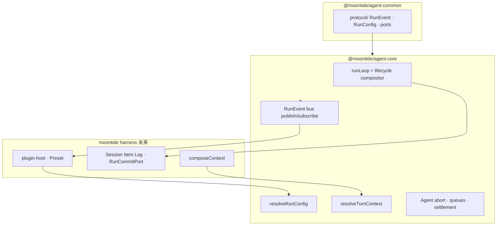

> **文档性质：** notes（开发计划，非实现承诺）  
> **设计 Spec：** [`docs/agent-core-design.md`](../agent-core-design.md) · **术语：** [`AGENTS.md`](../../AGENTS.md) §7.2  
> **执行入口：** 根 [`TODO.md`](../../TODO.md) §16  
> **策略：** 终局形态、clean break；无 derive / HookPhase 双轨

---

## 1. 目标

从 MoonTide harness 抽离 **冻结的 agent 时序内核**，pnpm workspace 两包：

| 包 | 职责 |
|----|------|
| `@moontide/agent-common` | 共享契约：`protocol/`（RunEvent、RunConfig、Effect 端口） |
| `@moontide/agent-core` | Temporal core、RunEvent bus、resolveRunConfig、resolveTurnContext、runLoop、Agent 类 |

MoonTide 主包（CLI、Session、compose、plugin-host）**依赖**上述两包，不反向依赖。

---

## 2. 非目标（本计划内不做）

- Session Item Log / `composeContext` 迁入 core
- Plugin host / MCP / sidecar IPC 迁入 core
- LLM provider 实现（类似 Pi `pi-ai` 另包）
- 渐进双写 legacy `channel/kind` AgentEvent
- 运行时 HookPhase 注册；插件定义新 lifecycle phase

---

## 3. 架构（终局）



**单向依赖：** `agent-core` 零依赖 `src/session/`、`src/context/`、`src/plugins/`。

---

## 4. 术语（与 AGENTS.md §7.2 一致）

| 术语 | 时机 | 说明 |
|------|------|------|
| **RunEvent bus** | run 全程 | loop publish；UI / JSONL / 测试 subscribe |
| **resolveRunConfig** | run 开始前一次 | Preset + adapter → frozen RunConfig |
| **resolveTurnContext** | 每 turn、LLM 前 | transformContext → convertToLlm |
| **composeContext** | 产品层 | Session + stores → LLMRequest；≠ resolveTurnContext |

---

## 5. RunEvent 协议 v1

```typescript
type RunEvent =
  | { type: "run_start" }
  | { type: "run_end"; outcome: Outcome }
  | { type: "turn_start" }
  | { type: "turn_end"; message: AgentMessage; toolResults: readonly ToolResultMessage[] }
  | { type: "message_start"; message: AgentMessage }
  | { type: "message_update"; message: AgentMessage; delta: StreamDelta }
  | { type: "message_end"; message: AgentMessage }
  | { type: "tool_execution_start"; toolCallId: string; toolName: string; args: unknown }
  | { type: "tool_execution_update"; toolCallId: string; partialResult: unknown }
  | { type: "tool_execution_end"; toolCallId: string; toolName: string; result: unknown; isError: boolean };
```

**Conformance：** golden event sequence 测试；`message_update` 仅 assistant；throw/abort 路径仍有 `run_end`。

---

## 6. RunConfig（冻结扩展面）

| 回调 | 组合语义 |
|------|----------|
| `resolveModel?` | first |
| `getApiKey?` | first |
| `transformContext?` | waterfall（resolveTurnContext 内） |
| `convertToLlm` | 必填 |
| `beforeToolCall?` | blockable |
| `afterToolCall?` | 字段 override |
| `shouldStopAfterTurn?` | decision |

Sidecar：**tools** + 白名单 adapter fold 进 resolveRunConfig；**subscribe(RunEvent)** 只读。

---

## 7. 实施顺序

| 步骤 | 交付 | 验收 |
|------|------|------|
| **M1** | pnpm workspace + `agent-common/protocol` 类型 | 零 runtime 依赖；类型导出 |
| **M2** | RunEvent bus + lifecycle + golden tests | `run_end` 不变量 |
| **M3** | runLoop + StreamFn + tool 序列 + `message_update` | mock stream 全绿 |
| **M4** | resolveRunConfig + Agent 类 | frozen config；settlement |
| **M5** | harness：RunCommitPort、`composeContext` 接入 | E2E prompt；Session 与 RunEvent 同序 |
| **M6** | RunEvent JSONL EventOutput；Slint subscribe | 流式 UI |
| **M7** | plugin-host 窄 IPC；删 HookPhase / derive | `pnpm check`；conformance 更新 |

---

## 8. 删除清单（M7）

| 删除 | 替代 |
|------|------|
| `HookPhase` / `HookDispatcher` | RunConfig + RunEvent bus |
| observe 返回 `EventDraft` | publish RunEvent |
| `run-event-derive` | loop 同栈 publish + RunCommitPort |
| `channel/kind` run 观测 | RunEvent JSONL |

---

## 9. 测试门禁

| 包 | 测试 |
|----|------|
| `agent-common` | 类型导出快照（可选） |
| `agent-core` | loop golden · lifecycle · StreamFn 契约 · resolveRunConfig freeze |
| `moontide` | agent-core 零 moontide 反向依赖 · Preset → RunConfig conformance |

---

## 10. 文档同步

| 文档 | 动作 |
|------|------|
| [`AGENTS.md`](../../AGENTS.md) §7.2 | 术语（已维护） |
| [`spec/agent-events.md`](../spec/agent-events.md) | 重写为 RunEvent JSONL（M6） |
| [`notes/agent-run-hooks.md`](agent-run-hooks.md) | M7 归档；指向本计划 + run-config |
| [`agent-core-design.md`](../agent-core-design.md) | 标注 agent-common/core 实现对照 |

---

## 11. 参考

- Pi：[`packages/agent`](https://github.com/earendil-works/pi/tree/main/packages/agent)（loop + AgentEvent + AgentLoopConfig；core 不依赖 provider 包的方式可借鉴，LLM 用注入 StreamFn）
- MoonTide legacy：[`src/agent/agent-run.ts`](../../apps/moontide/src/agent/agent-run.ts) · [`src/log/event-hub.ts`](../../packages/log/src/event-hub.ts)

---

## 12. 后续：根 `src/` monolith 消除（TODO §17）

**目标：** 不是删掉 MoonTide，而是 **Modular monorepo + package by bounded context** — 按域迁入 `packages/*`，入口缩到 `apps/moontide`，**删除根 `src/` monolith**。

| 阶段 | 内容 |
|------|------|
| **§16** | 先 `agent-common` + `agent-core`；根 `src/` 仍承载 harness |
| **§17** | 迁 `session` · `context-composer` · `llm` · `plugin-host` · `tools` · `cli`；架构边界测试扩到 package 级 |
| **终局** | `apps/moontide` 只 Preset 装配 + REPL；无根 `src/` |

详阶段表见 Cursor plan「终局：根 src/ 是否消除」· Pi 参考：`packages/agent` + `packages/ai` + `packages/coding-agent`。

**§17 前置：** §16 M7 完成。

