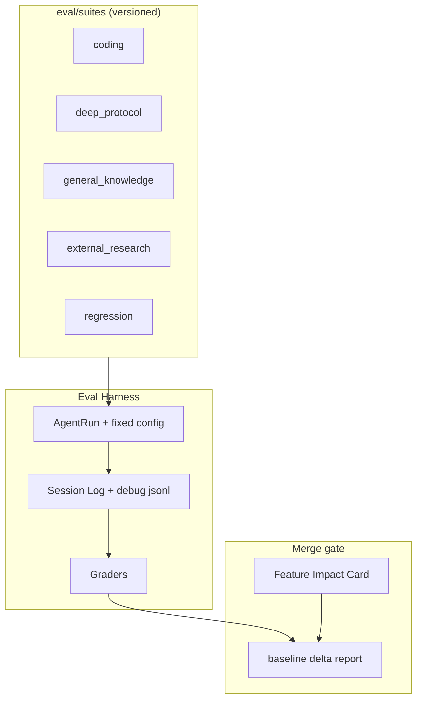

> **状态：** 2026-08 定稿 · **部分实现**（[`packages/evals`](../../packages/evals/) v2）  
> **动机：** 单元测试只能证明 feature「机制正确」，不能证明「对 agent 能力有 good impact」；Deep Task Mode 外研对比实验（地铁题）表明同一 feature 在不同任务类型上 impact 符号可能相反。  
> **入口：** 根 [`TODO.md`](../../TODO.md) §7 · §8  
> **关联：** [`agent-eval-task-taxonomy.md`](agent-eval-task-taxonomy.md)（case 分类 / 判分设计依据） · [`deep-mode.md`](deep-mode.md) · [`deep-mode-redesign.md`](deep-mode-redesign.md) · [`web-content-retrieval-discussion.md`](web-content-retrieval-discussion.md) · [`agent-events.md`](../spec/agent-events.md) · [`context-inspect-debug.md`](context-inspect-debug.md)

**范围：** MoonTide TS harness（`AgentRun` / REPL / Session Log / debug jsonl）。**不含** Rust UI、第三方 leaderboard 托管。

---

## 1. 问题陈述

| 现状 | 缺口 |
|------|------|
| Vitest + mock LLM 覆盖 compose、protocol reminder、tool handler | 无「任务成功 / 答案质量 / 成本」评估 |
| 设计文档有 deep mode 验收 checklist | 无自动化 task suite + baseline 对比 |
| REPL 手动对比（如两 session 地铁题） | 不可复现、无 guard metrics |
| TODO §7 提到 SWE-bench / DSBench | 未与 feature 准入机制挂钩 |

**目标：** 建立 **分桶任务集 + 分层 grader + baseline delta + Feature Impact Card** 的流水线，使每个新 feature 能回答：「在对的场景变好了吗？在错的场景拖累了吗？」

---

## 2. 评测分层（L0–L3）

| 层 | 问什么 | 运行频率 | 现有 / 计划 |
|----|--------|----------|-------------|
| **L0 机制** | gate、compose、tool 注册是否正确？ | 每 PR（CI） | ✅ `tests/agent-run-deep-*.test.ts` 等 |
| **L1 协议** | harness 协议（outline / note / decision）是否可观测？ | 每 PR（mock LLM 脚本） | 部分；扩 **eval v0** |
| **L2 任务** | 固定 prompt 下成功率、rubric 分、效率如何？ | Nightly / pre-release | **eval v1+** |
| **L3 能力** | 整体 coding agent 能力 vs 公开 benchmark | 周期（周/发布前） | 对齐 TODO §7（SWE-bench 等） |

**原则：** 新 feature PR 必须声明主要提升 **L1 或 L2 的哪条 primary metric**；L0 绿灯不足以 merge。

---

## 3. 架构概览



**每次 eval run 固定产出：**

| 产物 | 内容 |
|------|------|
| `eval/manifest.json` | model id、env flags、feature toggles、git sha、suite 版本 |
| `eval/runs/<id>/` | session jsonl + debug compose（可复现） |
| `eval/report.json` | 逐题分数、聚合指标、相对 baseline 的 delta |

---

## 4. Task Suite（分桶）

同一 feature 在不同桶 impact 可能相反；**禁止单一总分**。

| 桶 | ID | 用途 | 示例 | 主要验证 feature |
|----|-----|------|------|-------------------|
| **Coding** | A | 仓库内读改查 | 「AgentRun 如何注入 Working Set？」 | compose、grep、context budget |
| **Deep protocol** | B | 测 harness 行为，非答案文学质量 | `deep:` + 多步调查题 | deep mode、work_mem、reminder |
| **General knowledge** | C | 测是否 over-tool | 地铁左右行、三句话概念题 | 路由、禁止不必要 deep_research |
| **External research** | D | 外研 toolchain | 需联网 factual（**recorded fixtures**） | deep_research、http_fetch、artifact |
| **Regression** | E | 基线不回归 | 单文件 read、简单解释 | **任何新 feature 必跑** |

**与 TODO §7 对齐：**

| 外部 benchmark | 对应桶 | 说明 |
|----------------|--------|------|
| **SWE-bench**（子集） | A + L3 | coding 能力锚点；周期跑，非每 PR |
| **DSBench** 任务形态 | A + B | 对照 terminal / multi-tool / 长链路形态设计自建题；**不替代** SWE-bench leaderboard |
| **Prompts 评分**（TODO §8） | C + L2 | rubric grader 输入；与 suite C 合并 |

---

## 5. Graders

### 5.1 确定性 Grader（CI / v0，无真 LLM）

从 Session Log + debug manifest 抽取：

```text
deep_protocol_score =
  outline_refined_by_turn_2
  + note_count_with_ref
  + decision_before_end
  - synthesize_reminder_fired

efficiency_score =
  turn_count
  + tool_call_count
  + artifact_spawn_count
  + compose_input_tokens (manifest)
```

**基础设施失败**（artifact 嵌套、HTTP 429）单独计 **infra_penalty**，与 feature 分解耦（见 [`web-content-retrieval-discussion.md`](web-content-retrieval-discussion.md)）。

### 5.2 Rubric Grader（nightly / v2）

- 每题 golden bullets + 扣分项  
- LLM-as-judge 或人工抽检；对齐 TODO §8  
- 例：地铁题必须含「道路习惯 / 铁路传统 / 首线锁定」；扣分「无来源却声称已调研」

### 5.3 Outcome Grader（L3 / v3）

- 补丁是否通过测试（SWE-bench mini）  
- 对齐 TODO §7 公开 benchmark

---

## 6. Feature Impact Card（准入机制）

每个 feature PR 附一页 **Eval Impact Card**（可嵌 PR template）：

| 字段 | 说明 |
|------|------|
| **Hypothesis** | 本 feature 假设提升什么 |
| **Primary metric** | 如 B 桶 `deep_protocol_score` |
| **Guard metrics** | 如 C 桶 rubric 不降、E 桶 `turn_count` 增幅 ≤20% |
| **Suite version** | `eval/suites/vX/` |
| **Baseline** | `main` @ sha 或 feature flag off |

**合并规则（示意）：**

```text
primary_delta ≥ +5% (或绝对阈值)
AND all guard_delta ≥ -2%
AND L0/L1 CI green
```

Primary 升、guard 降 → **文档标注适用桶** 或 **默认 flag off**，禁止 silent 全量开启。

---

## 7. 流水线分档

| 档位 | 触发 | 内容 | 成本 |
|------|------|------|------|
| **PR** | 每 push | Mock LLM 脚本 + L0/L1 + deterministic grader（B/E 桶子集） | 低 |
| **Nightly** | cron | 真 LLM + 全 suite + rubric grader + baseline delta | 中 |
| **Release** | tag 前 | + SWE-bench 子集（L3） | 高 |

**Harness 入口：** `AgentSession.run` + `applyDeepPromptGate`；复用 [`tests/helpers/mock-llm.ts`](../../tests/helpers/mock-llm.ts)（PR 档）与现有 debug compose 记录（nightly）。

---

## 8. 实现分期

| 阶段 | 内容 | 用户可感知 |
|------|------|------------|
| **v0** | 10–20 题手写 suite；`protocol.ts` + `efficiency.ts` grader；CLI 批量跑 + 读 session log | 可本地对比两 branch |
| **Harness Eval 1.0** | [`@moontide/evals`](../../packages/evals/) + [`docs/spec/harness-eval-1.0.md`](../spec/harness-eval-1.0.md) | feature A/B、B/E seed suite、`pnpm eval:pr` |
| **v1（进行中）** | `baseline.json` · `--merge-gate` · subprocess agent worker · session 落盘 | feature PR 有客观准入参考 |
| **v2（进行中）** | `external_research` + HTTP VCR · protocol/efficiency/rubric grader · v2 六类 58 case | 外研题可复现 |
| **v3** | SWE-bench mini + TODO §7 DSBench 形态对照；nightly dashboard | 能力回归可见 |

**建议目录（实现时）：**

```text
packages/evals/          # @moontide/evals（1.0 实现）
  suites/v1/             # A–E 分桶 JSON
  src/graders/           # protocol · efficiency · regression
  scripts/run-evals.ts   # CLI
  runs/                  # 产物（gitignore）

eval/                    # 规划别名；1.0 已落在 packages/evals
  baseline.json          # v1.1
```

---

## 9. 与现有测试边界

| 保留在 `tests/` | 迁到 `eval/` |
|-----------------|--------------|
| 单模块 handler、compose 不变量 | 多 turn 端到端任务 |
| mock LLM 固定 1–2 轮协议 | 真 LLM + 统计聚合 |
| 快速、确定性、无 API key | 允许 flaky 网（D 桶用 fixture） |

不替代 `pnpm test`；`pnpm eval`（或 `pnpm eval:pr` / `pnpm eval:nightly`）为独立命令。

---

## 10. 非目标

- 替代 SWE-bench 官方 leaderboard 提交  
- 每 PR 跑全量真 LLM suite  
- 用单一总分决定 feature 生死  
- 评测 UI（远期 Fleet / Tide 可消费 `eval/report.json`）

---

## 11. 开放问题

- [ ] eval runner：独立 CLI vs `pnpm test` 子命令？  
- [ ] baseline 存储：repo 内 JSON vs CI artifact 库？  
- [ ] DSBench 公开后是否直接接入 L3？  
- [ ] Feature flag 与 eval manifest 如何一一对应？  
- [ ] 是否与 §15 Normalization 的 postflight metrics 合并？

---

## 12. 变更记录

| 日期 | 说明 |
|------|------|
| 2026-08 | 初稿：L0–L3 分层、分桶 suite、grader、Impact Card、与 TODO §7/§8 对齐 |
| 2026-08 | v2 suite（58 case）· HTTP VCR · baseline/merge-gate · [Impact Card](../../.github/eval-impact-card.md) |
