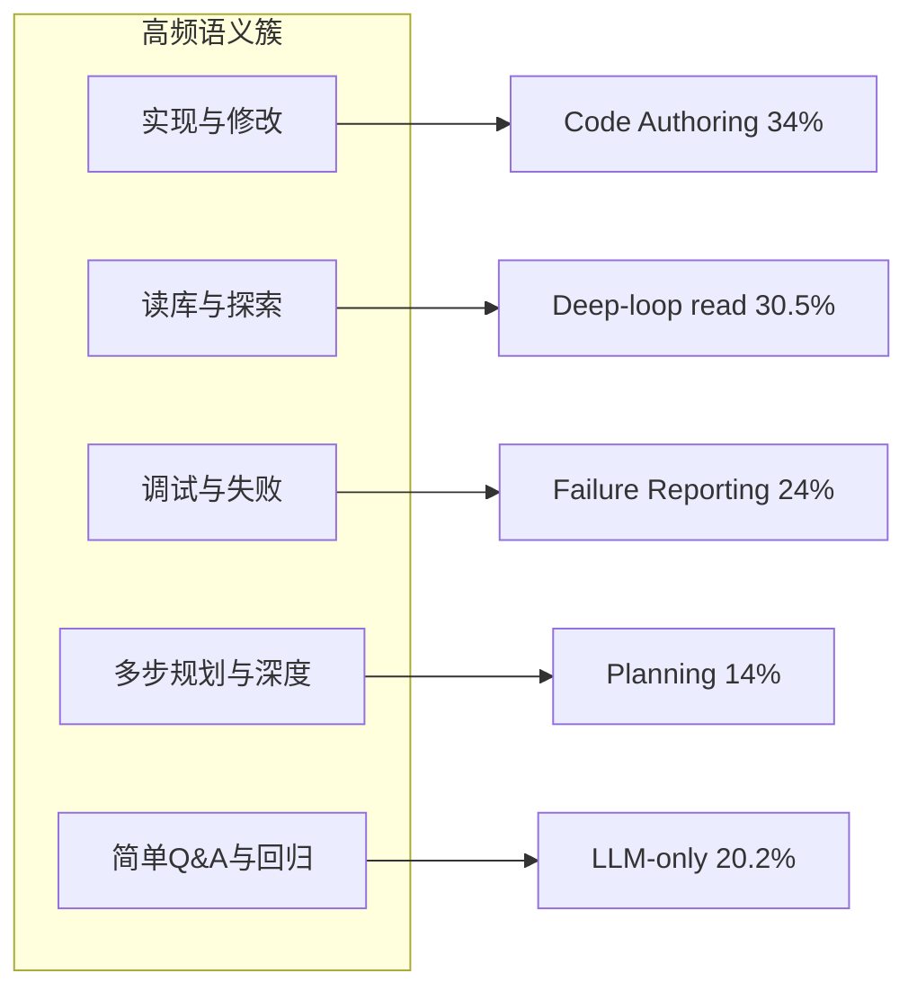

> **状态：** 2026-08 调研备忘 · **notes**（非 Spec）  
> **用途：** Feature A/B eval 的 **test case 分类** 与 **判分模式** 设计依据  
> **关联：** [`harness-eval-1.0.md`](../spec/harness-eval-1.0.md) · [`agent-eval-roadmap.md`](agent-eval-roadmap.md) · [`feature-ab-eval-guide.md`](../feature-ab-eval-guide.md) · [`packages/evals`](../../packages/evals/)

---

## 1. 问题

MoonTide `@moontide/evals` 需要回答：

1. **case 按什么维度分类？** 几类够用？与业界生产流量是否同构？
2. **有明确答案 vs 主观题** 如何判分？
3. **一轮 merge 前 eval** 每类多少题、judge 是否 batch？

本文汇总 **公开资料** 中的 task taxonomy，并给出 MoonTide **eval 可操作** 的设计结论（非产品 telemetry 规范）。

---

## 2. 公开资料是否存在？

**有，但没有统一行业标准。**

各厂/论文公开形态通常是：

- Research report（session 占比、趋势）
- PDF **Appendix 中的 classifier prompt**（完整 label 列表）
- Benchmark 论文中的 **分布图**（Figure 4 等）

**很少**放出可 SQL 的原始 telemetry 或内部 Dashboard 定义。第三方博客若无法追溯到 primary source，不应作为 taxonomy 依据。

### 2.1 可信度分层

| 层级 | 来源 | 公开内容 |
|------|------|----------|
| **A** | Anthropic [Claude Code expertise](https://www.anthropic.com/research/claude-code-expertise) | ~40 万 session → **9 work modes** + 时间序列占比 |
| **A** | OpenAI [Shift to Agentic (PDF)](https://cdn.openai.com/pdf/5d1e1489-21c0-43e4-9d42-f87efdbf0082/the-shift-to-agentic-ai-evidence-from-codex.pdf) | Codex **两级 task taxonomy**（Appendix E）+ 用量 Figure 5 / A3 / A4 |
| **A** | Microsoft [Agentic Coding in the Wild (PDF)](https://www.microsoft.com/en-us/research/wp-content/uploads/2026/08/ghcp_traces-6.pdf) | Copilot 3.2M 用户 / 13M session → **6 turn workflow** + **5 user archetypes** |
| **A** | [REAP](https://arxiv.org/html/2604.01527v3) (ASE 2026) | 生产 agent session → **17 task types**（testable/untestable）+ Harvest 分布 |
| **A** | [Programming by Chat](https://arxiv.org/html/2604.00436v1) | 11,579 IDE session → **7 主类 / 20 子类** message intent + **% 分布** |
| **B** | Anthropic [Economic Index Jan 2026](https://www.anthropic.com/research/anthropic-economic-index-january-2026-report) | O\*NET 职业、任务复杂度、成功率（非 coding 细类） |
| **C** | Anthropic [2026 Agentic Coding Trends](https://resources.anthropic.com/2026-agentic-coding-trends-report) | 趋势 + case study；**无完整 task 占比表**（门控下载） |
| **D** | [tokenscape](https://pypi.org/project/tokenscape/) 等 | 本地 session 解析 → 13 activity category；**非厂商官方** |

### 2.2 Benchmark 侧（非生产 telemetry，但定义「工程活动」）

| 来源 | 分类轴 |
|------|--------|
| [LongCLI-Bench](https://aclanthology.org/2026.findings-acl.1497/) | From Scratch / Feature Addition / Bug Fix / Refactoring |
| [EvoCode-Bench](https://arxiv.org/html/2605.24110) | construction、spec evolution、review、migration… |

---

## 3. 各来源 taxonomy 摘录

### 3.1 Anthropic — 9 work modes（session 单标签）

样本：~400,000 Claude Code sessions，~235,000 用户（2025-10 ~ 2026-04）。

| Work mode | 含义（简述） | 占比趋势 |
|-----------|--------------|----------|
| Building new code | 从零或新功能 | ~25% |
| Fixing broken code | 修 bug / 回归 | **33% → 19%** |
| Testing / orchestrating | 测代码或编排 agent | ~5% |
| Operating software | deploy、config、pipeline、监控 | **14% → 21%** |
| Planning / exploring | 理解系统、改前规划 | ~14% |
| Data analysis | 分析数据 | 合计 ~10% → ~20% |
| Writing documents | 非代码 prose | （同上） |

**解读：** agent 用法从「纯修 bug」转向「围绕代码的操作、分析与写作」；taxonomy 是 **session 目标**，不是 message 意图。

### 3.2 OpenAI Codex — 两级 task taxonomy

Classifier 按 **用户请求 outcome** 标注（非 incidental tool use）。Appendix E 给出完整 label 列表；一级族例如：

- Code Understanding / Code Implementation / Code Validation
- Engineering Operations / Application Management
- Data Analysis / Research / Knowledge Artifacts / Collaboration / Business Function Workflows

二级高频示例：

- Bug Fixing、Refactoring、Backend/Frontend Features、App Prototypes
- Code Q&A、Planning、Testing、Code Review、Security Audit
- Repo Management、Environment Configuration、Production Monitoring
- Documents、Presentations、Message Drafting、Codex Configuration…

**用量（Figure 5）：** Organizational 用户 **Engineering Operations 占比最高**；OpenAI 内部用户更偏 research、web search、app config。

**对 eval 的启示：** 生产任务谱极宽；feature eval 应 **粗分 + 按需子集**，不宜一次覆盖 Appendix E 全量 40+ label。

### 3.3 Microsoft Copilot — turn 级 workflow archetypes

基于 tool 组合、LLM 深度、token 聚类（2026-06 生产 trace）。

| Archetype | Share | 特征 |
|-----------|-------|------|
| Deep-loop read | **30.5%** | ~9 LLM calls；多读少改 |
| LLM-only | 20.2% | 无 tool；推理/解释 |
| Multi-cycle edit | 19.0% | 读→改→build 循环 |
| Multi-cycle other | 13.2% | 读为主 |
| Deep-loop w/failures | 9.1% | 失败重试放大算力 |
| Deep-loop run | 8.1% | terminal 为主 |

**用户 archetypes（Table 7）：** Readers 41.7%、Coders 30.4%、Terminal 11%、Deep-loop 9.2%、Chat-only 7.6%。

**对 eval 的启示：** 「探索读库」与「多轮编辑」是独立高频形态，应各有 case 覆盖。

### 3.4 Programming by Chat — message 级 intent（7+20）

74,998 messages，multi-label。

| 主类 | % Msg |
|------|-------|
| Code Authoring | **34.53** |
| Failure Reporting | **24.00** |
| Inquiry | 19.17 |
| Context Specification | 14.08 |
| Delegation | 16.48 |
| Workflow Control | 11.47 |
| Validation | **3.99** |

20 子类含：Iterative Modification、Log Paste、Symptom Description、Planning & Consultation、Project Comprehension、Toolchain Operation…

**对 eval 的启示：** 「写代码」与「报失败/贴 log」合计近 60% message；Validation 仅 ~4%，客观可验证题在生产对话中是少数但 eval 中应 **over-sample** 作 guard。

### 3.5 REAP — 17 类（生产 prompt → testability）

LLM classifier（Claude Sonnet 4.5）对首条 user message 分类；**正文未列全 17 名**，已知 partition：

**Testable 示例：** bug fix、feature request、refactoring、type/build/linting fixes、dead-code removal（部分）

**Untestable 示例：** documentation-only、code explanation、UI-only

Harvest benchmark 分布：**refactoring + feature request 领先**；单类 <25%；与 issue-derived benchmark（bug fix 主导）不同。

**对 eval 的启示：** 业界生产 eval pipeline 普遍做 **testable / untestable 二分**；MoonTide 的 `gradingMode: objective | subjective` 与此同构。

---

## 4. 跨来源收敛

各家 **标注粒度** 不同（session / turn / message / diff），但语义簇高度重叠：



| 语义簇 | 代表证据 |
|--------|----------|
| 实现/修改代码 | Code Authoring 34%；Codex Implementation |
| 读库/探索 | Deep-loop read 30.5%；Inquiry·Comprehension |
| 调试/失败 | Failure Reporting 24%；Codex Bug Fixing |
| 多步规划/深度 | Claude planning ~14%；MoonTide `deep:` 协议 |
| 简单 Q&A / guard | LLM-only 20.2%；Chat-only 7.6% |

**结论：** MoonTide feature eval 用 **5 类粗分** 有公开数据支撑；不必复制 OpenAI 40+ label 或 REAP 17 类。

---

## 5. MoonTide 设计：case 分类

### 5.1 两个正交维度

| 维度 | 字段 | 作用 |
|------|------|------|
| **任务形态** | `category` | 决定 prompt/setup 形态、judge system prompt |
| **判分方式** | `gradingMode` | `objective`（checks）vs `subjective`（pairwise） |

与业界对应：

- `category` ≈ 粗粒度 task type / workflow archetype
- `gradingMode` ≈ REAP testable vs untestable；Programming by Chat 中 Validation vs Authoring

### 5.2 五类 `category`（eval v2 拟定）

| `category` | 对齐的业界簇 | 典型 prompt | 默认 `gradingMode` |
|------------|-------------|-------------|-------------------|
| `coding` | Implementation + Validation（有 oracle） | Read/edit 单文件 | **objective** |
| `exploration` | Deep-loop read；Inquiry·Comprehension | Find / grep / 读结构 | **objective** |
| `deep_task` | Planning + multi-step；MoonTide `deep:` | deep: investigate / decide | **subjective** |
| `general` | LLM-only Q&A | 常识、解释 | **subjective**（可标 objective） |
| `regression` | Guard；Chat-only baseline | 极简任务 | **objective** |

`regression` 是 **guard 桶**（测 feature 是否误伤简单能力），可与其它类 prompt 形态重叠。

**按需跑子集：** feature 若只影响 deep 协议，merge 前可全量 `deep_task` + `regression`，其余 smoke。

### 5.3 `gradingMode` 细则

#### objective — 有明确可验证标准

- Case 带声明式 `expectedChecks`（非长 rubric）：

```json
{
  "expectedChecks": [
    { "kind": "reply_contains", "value": "runLoop" },
    { "kind": "file_contains", "path": "out.txt", "value": "ok" }
  ]
}
```

- Runner：**先确定性 checks**（零 LLM）；双方均过或仅一方过 → 直接判 winner
- checks 无法区分 → **fallback 一次 pairwise LLM**（prompt 内嵌 checklist）

#### subjective — 无单一标准答案

- **必须** baseline vs candidate pairwise
- Judge 输出：1–5 分 + `baselineGood/Bad` + `candidateGood/Bad` + `rationale`
- 固定 A=baseline、B=candidate，减少 position bias

### 5.4 规模建议

| 阶段 | 每类 case | repetitions | 用途 |
|------|-----------|-------------|------|
| 开发迭代 | 3–5 | 1–2 | 调 harness / judge |
| **合并决策** | **10–20** | **2–3** | 主决策区间 |
| 重要 feature 对外 | 15–20 | 3 | 更强信号 |

粗算：5 类 × 15 case × 2 rep × 2 harness ≈ **300 agent runs**；与 [`feature-ab-eval-guide.md`](../feature-ab-eval-guide.md)「总计 30–50 case」同量级（5×10=50）。

### 5.5 Judge batch

单 case 单次 judge 适合 debug；整轮 50+ 题应 **batch**（同 `category` + `gradingMode`，默认 8 条/次）：

- 减少 RTT；长上下文模型可一次评多 pair
- 解析失败 → 整批降级逐条 retry
- **不跨 category 混 batch**（system prompt 不同）
- 单条 response 截断（如 8k chars）防撑爆 context

---

## 6. 与现有 MoonTide 文档关系

| 文档 | 职责 |
|------|------|
| **本文（notes）** | 业界调研 + case 分类 / 判分 **设计依据** |
| [`harness-eval-1.0.md`](../spec/harness-eval-1.0.md) | 实现 Spec **1.1**（pairwise judge、schema、runner） |
| [`agent-eval-roadmap.md`](agent-eval-roadmap.md) | L0–L3 路线、分桶 A–E、Impact Card |
| [`feature-ab-eval-guide.md`](../feature-ab-eval-guide.md) | 工作流与成本；Pi upstream 参考 |

---

## 7. 参考文献（primary source）

1. Anthropic — *How Claude Code is used in practice* — https://www.anthropic.com/research/claude-code-expertise  
2. OpenAI — *The Shift to Agentic: Evidence from Codex* — https://cdn.openai.com/pdf/5d1e1489-21c0-43e4-9d42-f87efdbf0082/the-shift-to-agentic-ai-evidence-from-codex.pdf  
3. Microsoft Research — *Agentic Coding in the Wild* — https://www.microsoft.com/en-us/research/wp-content/uploads/2026/08/ghcp_traces-6.pdf  
4. REAP — *Automatic Curation of Coding Agent Benchmarks from Interactive Production Usage* — https://arxiv.org/html/2604.01527v3  
5. Programming by Chat — https://arxiv.org/html/2604.00436v1  
6. LongCLI-Bench — https://aclanthology.org/2026.findings-acl.1497/  
7. EvoCode-Bench — https://arxiv.org/html/2605.24110  
