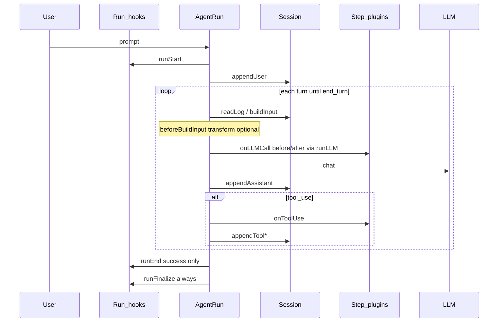

# Agent 运行时 Hook 设计

> **文档性质：** notes（设计讨论，非 Spec）  
> **问题：** Ocula agent 在运行过程中，扩展点（hooks）应如何划分生命周期、定义语义、注册与卸载？  
> **当前代码：** Run 级 [`RunHooks`](../../src/agent/run-hooks.ts) + Step 级 [`AgentPlugin`](../../src/agent/pipeline/types.ts)（两套机制并存）；目标形态 **HookRegistry + HookRunner**（未实现）  
> **平台策略：** Release 与 sidecar 边界见 [`platform-strategy.md`](../product/platform-strategy.md) · Plugin host 见 [`plugin-host.md`](plugin-host.md)

---

## 1. 设计目标

Hook 机制应满足：

1. **内核稳定** — `AgentRun` 只表达「写日记 → 拼输入 → 调模型 → 记结果」；扩展逻辑不堆进主文件。
2. **职责分离** — 改对话事实（Session log）、改观测（Agent events）、改 LLM 输入、拦截 tool，各走明确通道。
3. **可组合** — 多个扩展（trace、audit、metrics、UI）可独立注册，互不 import。
4. **可测试** — 测试可关掉观测或注入 spy，而不 mock 整个 loop。
5. **失败隔离** — 扩展抛错默认不拖垮用户对话（与现有 plugin 行为一致）。

**不是目标：** 用 hook 替代所有模块边界；工具定义、CLI 命令、Slint UI 插件不应硬塞进 agent loop hook 表。

---

## 2. 先定生命周期：四个粒度

扩展点必须挂在**明确的粒度**上，否则 hook 会重复或遗漏。

```text
Session          一次 REPL 会话（多个 prompt，同一 sessionId）
  └── Run        用户按一次 Enter（一个 runId）
        └── Turn  Run 内一次 LLM 往返（含后续 tool 链，直到 end_turn）
              └── Step   单次 LLM 调用 或 单次 tool 执行
```

| 粒度 | 边界 | 典型 hook 用途 | 持久化 |
|------|------|----------------|--------|
| **Session** | `/reset` 或新 REPL | 加载记忆、sidecar 预热 | Session Log（`.jsonl`） |
| **Run** | 每次 `AgentSession.run(prompt)` | runId、user/final 事件、run 归档 | Agent Event Log |
| **Turn** | `runTurn` 递增 | 上下文 manifest、turn 级 metrics | 可选写 Session |
| **Step** | 每次 `runLLM` / `runToolUse` | trace、audit、tool_result 追加 | Agent events |

**原则：** Session 级 hook 少而稳；Run / Step 级 hook 多而细。不要把 Session 级逻辑绑在 Run hook 里（例如整段 REPL 只初始化一次的东西）。

相关 Spec：[agent-events](../spec/agent-events.md)（Run 观测）、[context-composer](../spec/context-composer.md)（Session 日记）。

---

## 3. Hook 的四种语义（建议统一词汇）

业界（Pi harness、Middleware）常见四类，**注册 API 应让人一眼看出属于哪类**：

| 类型 | 作用 | 返回值 | 典型例子 |
|------|------|--------|----------|
| **Observe** | 旁路通知，不改变主流程 | 忽略 | metrics、日志、Slint 刷新 |
| **Transform** | 顺序改写某次输入/输出 | 合并链式结果 | 改 messages、改 system prompt |
| **Decide** | 允许 / 拒绝 / 短路 | 第一个 block 生效 | tool 权限、compact cancel |
| **Around** | 包住整段执行 | 包裹内层 | 超时、重试、trace span |

**实践：**

- **Observe 与 Transform 不要混用一个回调** — 否则无法保证「只读 listener」不意外改状态（Pi 的 `observe` vs `on` 分工）。
- **Decide 必须文档化 fail-open / fail-closed** — 例如 tool 权限 fail-closed，metrics hook fail-open。
- **Around 慎用** — 仅用于真正的横切（超时、cancel）；业务逻辑用 Transform / Decide。

---

## 4. 什么该用 Hook，什么不该

| 机制 | 适合 | 不适合 |
|------|------|--------|
| **Hook** | 生命周期上的观测、拦截、改写 | 静态能力注册 |
| **Registry** | tools、CLI 命令、provider、渲染器 | 每次 run 的时序逻辑 |
| **Session API** | 对话事实的读写（`append*` / `readLog`） | 观测事件 |
| **Core loop** | 固定顺序的业务步骤 | 可插拔业务 |

**Ocula 当前分工（合理部分）：**

- **Registry：** [`tools/store`](../../src/tools/store.ts)、[`AgentPlugin` 注册表](../../src/agent/pipeline/registry.ts)
- **Session：** 对话唯一事实源
- **RunHooks：** Run 级观测（events + finalize）
- **AgentPlugin：** Step 级 LLM / tool 观测

**常见反模式（应避免）：**

- 在 hook 里直接 `messages.push` / `splice` — 应写 Session 或返回 Transform 结果
- 每个四阶段步骤都加 hook — 主流程变成「钩子驱动」，难以阅读
- 扩展之间互相 import — 应通过 `HookContext` 上的共享 state 或 event

---

## 5. 生命周期与建议 hook 点

下面是一张 **完整地图**（含已实施与候选）。实施状态见 §7。



### Run 级（一次 user prompt）

| Hook | 语义 | 时机 | 当前 |
|------|------|------|------|
| `runStart` | Observe | `execute` 开始；分配 runId | `onRunStart` ≈ |
| `runEnd` | Observe | 成功得到 reply | `onRunEnd` ≈ |
| `runFinalize` | Observe | `finally`；归档 run | `finalizeRunFromHooks` ≈ |
| `runError` | Observe | 未捕获错误 | 无 |

### Turn 级（run 内每轮 LLM，候选）

| Hook | 语义 | 时机 | 当前 |
|------|------|------|------|
| `beforeBuildInput` | Transform | 拼好 messages 之后、调 LLM 之前 | 无（compact 未来） |
| `turnStart` / `turnEnd` | Observe | 每 `runTurn` | 无 |

### Step 级（已实施）

| Hook | 语义 | 时机 | 当前 |
|------|------|------|------|
| `onLLMCall` | Observe (+ emit events) | 每次 `runLLM` | `AgentPlugin` |
| `onToolUse` | Observe (+ modelAppend) | 每次 tool | `AgentPlugin` |
| tool 权限 | Decide | tool 执行前 | [`checkPermission`](../../src/agent/pipeline/permission/index.ts)（内核，非 plugin） |

### Session 级（跨 run，候选 / 扩展）

| Hook | 语义 | 例子 |
|------|------|------|
| `sessionStart` / `sessionReset` | Observe | REPL 启动、`/reset` |
| `sessionBeforeCompact` | Decide | 是否允许 compact |

Session 级更适合 **REPL / 扩展宿主** 注册，不必塞进 `AgentRun.execute`。

---

## 6. 注册与上下文：建议实践

### 6.1 谁注册、何时注册

| 扩展来源 | 建议注册时机 | 生命周期 |
|----------|--------------|----------|
| 内置（trace、audit） | 进程启动时，全局 registry | 随进程 |
| CLI / REPL | `setupEventPipeline()` 或 REPL 启动 | 随 REPL session |
| 测试 | 每个 test case `beforeEach` | 用例级 |
| 第三方扩展（远期） | 扩展加载器 | `clear()` / dispose |

**建议：** Run 级 hook 用 **全局 registry + 命名 tap**（`events`、`metrics`）；测试里 `registry.clear()` 或保存 dispose 函数。  
**不必** 每次 `run()` 新建整套 hook 对象，除非要 per-run 隔离。

### 6.2 注册 API 形态（推荐演进方向）

统一为 **emit 单入口 + 显式注册**，避免内核散落 `emitUserPrompt`：

```typescript
// 目标形态（概念，非当前代码）

// 注册：返回 dispose
const off = agentHooks.on("runStart", "events", (ctx) => {
  emitUserPrompt(ctx.userPrompt);
});

// 内核：只 emit
await agentHooks.emit({ type: "runStart", userPrompt, session, runId });
```

对比现状：

```typescript
// 当前：工厂里写死回调
createDefaultRunHooks() → { onRunStart, onRunEnd }
```

### 6.3 HookContext（扩展只依赖 facade）

扩展 handler 应接收 **稳定上下文**，而不是 `AgentRun` 内部字段：

```typescript
interface RunHookContext {
  session: Session;
  runId: string;
  userInteraction: UserInteraction;
  signal?: AbortSignal;  // 取消
  // 可选：turn、runTurn、只读 config
}
```

**实践：** Context 在 run 开始时 `setContext`，facade 方法优于深层 getter 迷宫（Pi 同旨）。

### 6.4 错误策略

| 场景 | 建议 |
|------|------|
| Observe（metrics、trace） | **continue** — 记日志，不中断对话 |
| Decide（权限、compact cancel） | **按业务** — tool 权限 fail-closed |
| Transform | **continue** — 单个 handler 失败跳过，或 abort 本 turn（需文档） |

与 [`notifyPlugins`](../../src/agent/pipeline/notify.ts) 一致：plugin 抛错记 `PluginFailureRecord`，不 stop loop。

### 6.5 卸载

- 每个 `on()` / `observe()` 返回 **dispose**
- Registry 提供 **`clear()`**（测试、热重载）
- 借鉴 VS Code `subscriptions`，不借鉴 contribution manifest

---

## 7. 与当前代码的对照

| 设计层 | 建议 | 当前实现 | 差距 |
|--------|------|----------|------|
| Run Observe | `emit` + `on("runStart")` 等 | `RunHooks` 两个 callback | 缺多 listener、缺 `observe` |
| Step Observe | 同上或保持 plugin | `AgentPlugin` + 全局 registry | 形态与 Run 不一致 |
| Transform | `beforeBuildInput` 等 | 无 | compact 未接入 |
| Decide | tool 权限、未来 compact | 权限在内核 | 可 eventual 迁到 hook |
| Registry | tools、plugins 分开 | 已分开 | 保持 |
| 事实源 | Session only | 已迁移 | — |

**当前 Run 流程（简化）：**

```text
onRunStart → appendUser → [loop: buildInput → runLLM → append/tool] → onRunEnd → finalize
```

代码入口：[`agent-run.ts`](../../src/agent/agent-run.ts) · [`run-hooks.ts`](../../src/agent/run-hooks.ts)

---

## 8. 推荐演进路径（非承诺）

按风险从小到大：

1. **统一词汇** — 文档与代码注释采用 Observe / Transform / Decide / Around 四类。
2. **RunHooks → RunHookRegistry** — `on(type, name, handler)` + dispose；默认 listener 注册 `events`。
3. **补 `runError`** — 失败路径可观测。
4. **Turn 级** — 仅当 compact / manifest 需要时加 `beforeBuildInput`（Transform）。
5. **Session 级** — 在 REPL 宿主挂 `sessionStart` / `sessionReset`，不塞进 AgentRun。

**暂不引入：** npm `tapable`（除非 Transform 链复杂度超预期）；VS Code contribution 驱动 loop。

---

## 9. 开放问题（设计层）

1. Run 与 Step 是否共用一套 `HookRegistry` 类型，还是两个 registry？
2. `AgentPlugin` 是否 eventual 改名为 Step hook 并统一 `on("llmCall")` 风格？
3. Transform 的合并语义是否在 Spec 层写死（类似 Pi 每 event 一份 reduce 规则）？
4. 扩展来源 metadata（哪个扩展抛错）是否必需 — Pi 用 source scope。

（实现层开放问题见 §14。）

---

## 10. 参考

**Ocula 代码：** [agent-run.ts](../../src/agent/agent-run.ts) · [run-hooks.ts](../../src/agent/run-hooks.ts) · [pipeline/types.ts](../../src/agent/pipeline/types.ts)

**Ocula 文档：** [platform-strategy.md](../product/platform-strategy.md) · [plugin-host.md](plugin-host.md) · [session-log-migration.md](session-log-migration.md) · [agent-events.md](../spec/agent-events.md)

**外部：** [Pi AgentHarness hooks](https://github.com/badlogic/pi-mono/blob/main/packages/agent/docs/hooks.md) · [harness-pi hook phases](https://github.com/chasey-myagi/harness-pi/blob/main/packages/core/README.md) · [Pi createLoopConfig](https://github.com/badlogic/pi-mono/blob/main/packages/agent/src/harness/agent-harness.ts)

---

## 11. 内部架构：四层模型

Loop **不应** 直接 `for (const h of hooks)` 或调用 `runBeforeLLM()`。成熟做法是 **loop 只依赖窄接口**，扩展在外部注册，由 **Runner** 在固定点调用。

```text
Layer 4  Extension API（对外）
           api.on("beforeBuildInput", …) · registerTool
              ↓ 启动时注册
Layer 3  HookRegistry + HookRunner（机制，只实现一次）
           parallel / waterfall / bail · dispose · clear
              ↓ 每次 run 创建 RunHookScope
Layer 2  LoopConfig 适配器（Harness / AgentRun）
           transformContext ← runner.waterfall("beforeBuildInput")
           beforeToolCall   ← runner.bail("beforeToolUse")
              ↓ 注入
Layer 1  纯 loop（AgentRun / 未来 runAgentLoop）
           while { buildInput → llm → recordOutcome }
           只 call config.xxx 和 emit(AgentEvent)
```

**两种「事件」分工：**

| 机制 | 用途 |
|------|------|
| **AgentEvent + emit** | loop 生命周期事实（`message_end`、`turn_end`）→ Session 持久化、UI tail |
| **Hook phase + runner** | 扩展改写/拦截（`beforeBuildInput`、tool 权限） |

Pi 对照：Harness 只 `hooks.emit(event)`；`createLoopConfig()` 把 hook 译成 `AgentLoopConfig` 回调（见 §12）。

**反模式：** loop 内 import trace/compact；每种 hook 手写 for 循环；Observe 与 Transform 共用一个 callback。

---

## 12. LoopConfig 与 phase 映射

### 12.1 Ocula phase → Runner 语义

| Phase | 语义 | Runner 方法 | fail 策略 |
|-------|------|-------------|-----------|
| `runStart` / `runEnd` / `runError` / `runFinalize` | Observe | `parallel` | continue |
| `turnStart` / `turnEnd` | Observe | `parallel` | continue |
| `beforeBuildInput` | Transform | `waterfall` | continue（单 tap 失败跳过） |
| `llmCall` / `toolUse` | Observe | `parallel` | continue（同 [`notifyPlugins`](../../src/agent/pipeline/notify.ts)） |
| `beforeToolUse` | Decide | `bail` | fail-closed（block） |

注册 API 目标形态（概念）：

```typescript
const off = agentHooks.on("beforeBuildInput", "compact", handler, { enforce: "pre" });
```

`enforce: "pre" | "post"` 映射为 tap `stage`（pre = -100，default = 0，post = +100）。

### 12.2 与 Pi `createLoopConfig` 对照

| Pi `AgentLoopConfig` | Ocula phase | 时机 |
|----------------------|-------------|------|
| `transformContext(messages)` | `beforeBuildInput`（或 alias `context`） | compose 之后、`chat()` 之前 |
| `beforeToolCall` | `beforeToolUse` | tool 执行前 |
| `afterToolCall` | `toolUse`（Observe + patch 合并） | tool 执行后 |
| `prepareNextTurn` | `turnEnd` + flush + 新 snapshot | 每 turn 结束 save point |
| `emitHook(before_agent_start)` | Run 头（注入 messages / systemPrompt） | `runStart` 后、loop 前 |

Pi 源码入口：[agent-harness.ts `createLoopConfig`](https://github.com/badlogic/pi-mono/blob/main/packages/agent/src/harness/agent-harness.ts)。

### 12.3 Harness 伪代码（目标）

```typescript
// Layer 2：AgentRun 或 AgentHarness 构造 LoopConfig
function createLoopConfig(runner: HookRunner, getSnapshot, setSnapshot): LoopConfig {
  return {
    transformContext: async (messages) =>
      runner.waterfall("beforeBuildInput", { messages, runTurn: getSnapshot().runTurn },
        (acc, r) => r?.messages ?? acc, messages),

    beforeToolCall: async (call) => {
      const blocked = await runner.bail("beforeToolUse", call);
      return blocked ? { block: true, reason: blocked.reason } : undefined;
    },

    afterToolCall: async (record) => {
      await runner.parallel("toolUse", { type: "toolUse", record });
      return undefined;
    },

    prepareNextTurn: async () => {
      await runner.parallel("turnEnd", { runTurn: getSnapshot().runTurn });
      setSnapshot(await buildNextSnapshot(getSnapshot()));
    },
  };
}
```

```typescript
// Layer 1：loop 正文（无 hook 名字）
while (true) {
  let messages = await buildComposedMessages();
  messages = await config.transformContext?.(messages) ?? messages;
  const response = await streamLLM(messages, config);
  // … tools via config.beforeToolCall / afterToolCall …
  await config.prepareNextTurn?.();
  if (endTurn) break;
}
```

---

## 13. 迁移路径（TS 实现 →  eventual Rust 同构）

与 [`platform-strategy.md`](../product/platform-strategy.md) §8 对齐：TS 先落地 Hook 机制，Rust release 时 **复用 phase 名与语义**，不必复用 TS 类型。

### 13.1 现状 → 目标

| 现状 | 目标 |
|------|------|
| [`RunHooks`](../../src/agent/run-hooks.ts) 两个 callback | registry taps：`runStart` / `runEnd` / `runFinalize` |
| [`createDefaultRunHooks()`](../../src/agent/run-hooks.ts) | `registerDefaultAgentHooks()` 进程启动一次 |
| [`notifyPlugins`](../../src/agent/pipeline/notify.ts) | `runner.parallel("llmCall" \| "toolUse", …)` |
| [`checkPermission`](../../src/agent/pipeline/permission/index.ts) 在内核 | 默认 `beforeToolUse` tap `"permission"` |
| [`agent-run.ts`](../../src/agent/agent-run.ts) 直接 `this.hooks.onRunStart` | `runScope.emitParallel("runStart", …)` |

### 13.2 推荐 PR 顺序（风险从小到大）

1. **HookRunner + agentHooks.on** — parallel/waterfall/bail；测试用 `clear()`。
2. **RunHooks → 默认 taps** — `events` tap 替代 `createDefaultRunHooks`。
3. **AgentPlugin → 同一 registry** — `llmCall` / `toolUse` phase；保留 `parsePluginEvents` 行为。
4. **`runError` + `runFinalize` phase** — 失败路径可观测。
5. **`beforeBuildInput`** — compact 接入；compose 之后 waterfall。
6. **（可选）抽 `runAgentLoop.ts`** — `AgentRun` 只做 Harness；与 Pi 双层一致。
7. **Rust CLI** — 同 phase 表；TS 作 conformance tests。

### 13.3 Node sidecar 注意

若扩展跑在 **Node sidecar**（见 [`platform-strategy.md`](../product/platform-strategy.md) L2 与 [`plugin-host.md`](plugin-host.md) §9），in-process Transform 变为 **IPC RPC**：handler 看不到共享对象引用；Observer 看不到 Transform 中间态（与 Pi `observe` 限制同旨）。可能需额外 phase（如 `afterBuildInput`）或 sidecar 内完成 compact 后以结果 RPC 返回。

---

## 14. 开放问题（实现层）

1. Run 与 Step 是否共用一套 `HookRegistry`（推荐：**一个 registry，按 phase 分派**）？
2. Sidecar IPC 下 Transform 的合并与超时/取消语义是否在 Spec 写死？
3. Rust release 时 hook 错误策略：TS 为 Observe continue；Harness 级 hook throw 是否统一为可配置 `errorMode`（Pi 建议 default `continue`）？
4. `AgentEvent` 订阅与 Hook phase 是否暴露给 UI sidecar 同一 NDJSON 流，还是双通道？

（设计层问题见 §9。）
