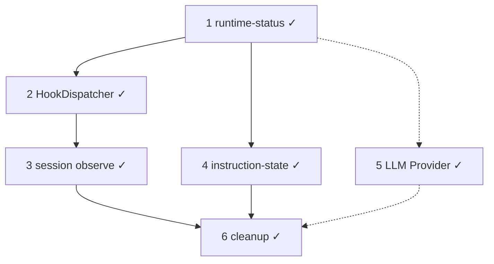
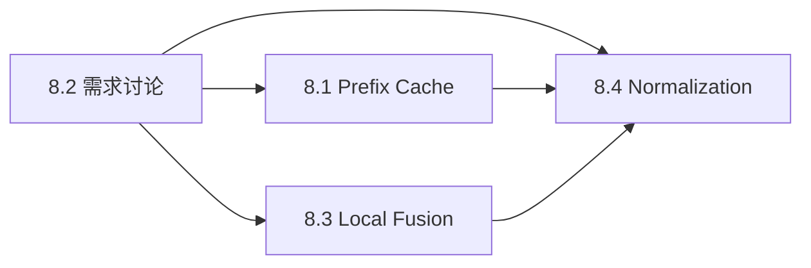

> **状态：** 2026-08 定稿 · **#1–#6 主体 done** · **#5 A–C done** · **Context Budget Tiers done**（[`context-composer.md` §16](../spec/context-composer.md#16-context-budget-tiersmvp--2026-08)）· **§8 后续四条轨 planned**  
> **Spec：** [`context-composer.md`](../spec/context-composer.md) C0–C6  
> **Hook：** [`agent-run-hooks.md`](agent-run-hooks.md) · **Agent Event：** [`agent-events.md`](../spec/agent-events.md) · **Utils：** [`utils-infrastructure.md`](utils-infrastructure.md)

**范围：** TypeScript harness。**不含** Rust crates、Slint UI。

---

## 工作清单（六件事）

| # | 工作项 | 目标 | 状态 |
|---|--------|------|------|
| **1** | **runtime-status** | 运行时观测缓存，删 `sessions.ts` 镜像 | **done** |
| **2** | **Hook 机制终局** | `HookDispatcher` + sidecar phase；删 RunHooks/AgentPlugin/observe registry | **done** |
| **3** | **Session Observe（C6）** | commit port 落盘、Agent Event 派生、dedup | **done** |
| **4** | **instruction-state** | `load/resolve` + compose 接入；AGENTS.md / rules | **done** |
| **5** | **LLM Provider 完善** | 协议 → Provider → model registry（C0 A–C） | **done**（A–C；D–I backlog） |
| **6** | **Legacy / deprecated 清理** | 删 `@deprecated` alias、utils 抽离、event-hub 改名 | **done**（TS harness） |



**下一步（2026-08 起）：** 见 **§8 后续计划** — Prompt Prefix Cache · 需求讨论 · Local Fusion · Conversation Normalization。择项 backlog 仍见 [`context-backlog.md`](context-backlog.md)（Structured Session IR、Agent Activity Model 等）；LLM Provider **D–I** 择项 backlog。

---

## 8. 后续计划（2026-08 起）

> **入口：** 根 [`TODO.md`](../../TODO.md) §15 · 本文为详表。

六件事与 Context Budget Tiers 完成后，下一阶段按下列四条轨推进：

| # | 工作项 | 目标 | 状态 |
|---|--------|------|------|
| **8.1** | **Prompt Prefix Cache** | 稳定 prefix（system / instruction / tool defs）复用，降 latency / input cost | planned |
| **8.2** | **需求讨论** | Activity Model、Normalization、Local Fusion 边界与验收对齐 | planned |
| **8.3** | **Local Fusion** | 本地微调小模型 + edge 路由，降 cloud token 成本（类比 OpenRouter Fusion，但 local） | planned |
| **8.4** | **Conversation Normalization** | Preflight / Postflight：request 前 Projection + Manifest；turn 后 metrics / state | planned |



| 轨 | 详设 |
|----|------|
| **8.1** | [`context-backlog.md` §15](context-backlog.md) · [`context-normalization.md` §13](context-normalization.md) |
| **8.2** | [`agent-activity-model-discussion.md`](agent-activity-model-discussion.md) · 各轨一页纸 spec |
| **8.3** | [`edge-local-models.md`](edge-local-models.md) · [`llm-provider.md`](../spec/llm-provider.md) §3.4 |
| **8.4** | [`context-normalization.md`](context-normalization.md) |

**8.3 Local Fusion 要点：** 设备侧 tier 路由（router → local general → cloud frontier），**不是** OpenRouter 式的 provider upstream 竞价；用户 opt-in 下载 MoonTide 签名 catalog（`moontide/router-v1` 等），简单任务本地完成，coding / 复杂 reasoning 仍走 cloud。

**8.2 需求讨论范围：** Agent Activity Model 7a–7c 开放问题、Normalization preflight/postflight 边界、Prefix Cache 与 Composer stable prefix 契约、Local Fusion 成本/延迟 SLA。

---

## 7. Agent 活动模型（Cursor 对照 · backlog）

> **来源：** 对照 Cursor 终端 activity（read / grepped / explored / thought）的讨论结论（2026-08）。  
> **性质：** 观测与编排演进，**非**复制 Cursor 工具名；详设见 [`context-backlog.md` §8](context-backlog.md#8-backlogagent-activity-model认知动作--广度阶梯) · 讨论备忘 [`agent-activity-model-discussion.md`](agent-activity-model-discussion.md)。

Cursor 四类对应 **认知动作模型**：用户关心 agent「在干什么」，不是「调了哪个 API」。MoonTide 已有 thought 与 read/grep 工具面 + 三档观测（`/thinking` · `/verbose` · `/debug`）；缺口主要在 **explore 编排** 与 **trace 语义标签**。

| # | 工作项 | 说明 | 状态 |
|---|--------|------|------|
| **7a** | **工具 registry 与 activity class 解耦** | Registry 仍用 `read_file` / `grep` / `bash`…；trace / statusline / event 叠一层语义：`gather.read` · `gather.search` · `gather.explore` · `act.shell` · `act.edit` · `reason.think` | backlog |
| **7b** | **Agent 指令写清「广度阶梯」** | 在 `AGENTS.md` / rules 约定：已知路径 → read；已知 pattern → grep；范围未知 → 并行 gather 或 explore；大 dump → spill + `read_artifact` | backlog |
| **7c** | **Explore MVP（无完整 subagent）** | 轻量：单次 run 内并行 tool batch，或 sidecar 固定 prompt + bounded 摘要回传；完整 fork/fresh subagent 与 [`session-handoff.md`](session-handoff.md) 对齐 | backlog |

**非目标：** 不新增 `explored` / `thought` 假工具；不把 explore 与 `deep_research` 混为一谈（前者 context 隔离广搜，后者长链路研究）。


## 架构修复（与 #5 并行）

与功能轨独立的 **架构修复 PR 序列**，详见 [`architecture-remediation.md`](architecture-remediation.md)。

| Phase | 内容 | 与六件事关系 |
|-------|------|--------------|
| **A P0** | §1 Session port、§10 Writer、§2 LLM Provider | §2 **即** #5 A–C |
| **B P1** | §3–§7、§9、§16 + 规范单测 | 独立 PR 序列 |
| **C P2** | §8、§11–§13、§15 | backlog 之后 |

---

## 开发者快速入口

### 阅读顺序

1. 本文（工作项 + 现状）
2. [`session-domain-model.md`](session-domain-model.md) — 类型与数据流
3. [`agent-run-hooks.md`](agent-run-hooks.md) — HookDispatcher · phase · sidecar
4. [`utils-infrastructure.md`](utils-infrastructure.md) — fs / process / storage 分层
5. [`ecosystem-compat.md`](ecosystem-compat.md) — MCP/Codex 兼容
6. [`context-composer.md`](../spec/context-composer.md) — C0–C6 Spec

### 代码锚点（按工作项）

| # | 主要目录 | 说明 |
|---|----------|------|
| **1** | `context/runtime-status.ts`（历史；已移除） | manifest/report 缓存 |
| **2** | [`agent/hooks/`](../../apps/moontide/src/agent/hooks/) | phases · dispatcher · registry · defaults |
| **3** | [`run-event-derive.ts`](../../apps/moontide/src/log/run-event-derive.ts) · [`tool-use-log/`](../../apps/moontide/src/plugins/builtin/tool-use-log/) | RunEvent → AgentEvent（legacy log-sync 已删） |
| **4** | [`instruction-state/`](../../apps/moontide/src/instruction-state/) | load · resolve · epoch |
| **5** | [`llm/protocol/`](../../packages/llm/src/protocol/) · [`llm/presets/`](../../packages/llm/src/presets/) · [`llm/models/registry.ts`](../../packages/llm/src/models/registry.ts) · [`llm/routing/resolve.ts`](../../packages/llm/src/routing/resolve.ts) | Provider A–C done |
| **6** | [`utils/`](../../packages/shared/src/utils/) · [`storage/`](../../packages/shared/src/storage/) | 基础设施抽离；`log/event-hub.ts` |

### CLI 入口

```
src/main.ts → cli/repl/run.ts → agent/agent-run.ts → composeContext → runLLM
```

---

## 1. runtime-status — done

`runtime-status.ts`（历史）替代 `sessions.ts` 镜像 messages；只存 manifest/report。现行见 `@moontide/context-composer` manifest 与 `@moontide/session` stores。

---

## 2. Hook 机制终局 — done

| 组件 | 状态 |
|------|------|
| `HookDispatcher` + `PHASE_DEFS` | done — [`src/agent/hooks/`](../../apps/moontide/src/agent/hooks/) |
| default sidecar 模块 | done — tool-use-log、context metrics |
| `beforeToolUse` decide | done — permission 后、execute 前 |
| 删除遗留 | done — RunHooks、AgentPlugin、pipeline/registry、session/observe、audit |

Sidecar transport：**stdio pipe IPC**（非 HTTP）；终局 UDS 见 [`plugin-host.md`](plugin-host.md)。

---

## 3. Session Observe（C6）— done

| Observer | 实现 |
|----------|------|
| Item 落盘 | Harness `SessionItemCommitPort` → `FileSessionItemWriter` |
| Agent Event 派生 | `sessionItem` → `run-event-derive` |
| context metrics | `llmCall` → context sidecar |
| tool use log | `toolUse` → tool-use-log sidecar |

**Invariant：** Agent Event **never** 反向写 Session Item Log。

---

## 4. instruction-state — done

```
src/instruction-state/
  types.ts · load.ts · resolve.ts · index.ts
```

- 读 `AGENTS.md` / `CLAUDE.md` / `.moontide/rules/*.md`
- `resolveInstructionState(workdir)` 带 per-run 缓存（`prepareRun` 时 reset）
- compose 经 `buildSystemFromInstructionState`

---

## 5. LLM Provider 完善（C0 A–C）— done

见 [`llm-provider.md`](../spec/llm-provider.md) §13。**D–I**（多协议 adapter、OpenRouter、Model Router）仍 backlog。

| 子阶段 | 内容 | 状态 |
|--------|------|------|
| **A** | MoonTide 协议类型；SDK import 限 adapter | **done** |
| **B** | `LLMProvider` + `resolveRoute()`；runLLM / compact / ping | **done**（`deepseek` + `anthropic` preset，单 adapter） |
| **C** | model 注册表 + `ModelProfile` 驱动 context limit | **done** |

---

## 6. Legacy / deprecated 清理 — done（TS harness）

### 6.1 已完成

- 删除 `SessionLog*` 等 `@deprecated` type alias（`session/types.ts`）
- 删除 `readLog` / `appendToolResult` / `appendCompaction` 等 deprecated 方法
- 删除 `log-to-messages.ts`、`trace/collector.ts`、`log/conversation.ts`
- `bus.ts` → **`event-hub.ts`**
- **Utils 基础设施抽离** — 见 [`utils-infrastructure.md`](utils-infrastructure.md)

### 6.2 仍待（backlog 择项）

- 删除 `composeContextV1`（零引用后）
- Context Budget Tiers、Session handoff P0、`read_artifact` tool
- Rust crates 命名对齐（`SessionLog` 协议层保留）

---

## 现状快照

| 项 | 状态 |
|----|------|
| Session Item Log + composeContext | done |
| Stores / compact / checkpoint CLI | done |
| runtime-status | done |
| HookDispatcher + sidecar defaults | done |
| instruction-state | done |
| Plugin host `kind: sidecar` | done — [`plugin-host.md`](plugin-host.md) |
| Utils / storage 分层 | done — [`utils-infrastructure.md`](utils-infrastructure.md) |
| Provider A–C | **done** — [`llm/models/registry.ts`](../../packages/llm/src/models/registry.ts) · [`llm/routing/resolve.ts`](../../packages/llm/src/routing/resolve.ts) |
| MCP client | 待 R2 |

---

## 相关文档

| 文档 | 关系 |
|------|------|
| [architecture-remediation.md](architecture-remediation.md) | Phase A–C 架构修复 |
| [context-composer.md](../spec/context-composer.md) | C0–C6 Spec |
| [agent-run-hooks.md](agent-run-hooks.md) | Hook 生命周期 |
| [utils-infrastructure.md](utils-infrastructure.md) | fs / process / event-hub |
| [session-log-migration.md](session-log-migration.md) | C1b、runtime-status |
| [context-backlog.md](context-backlog.md) | #5 之后演进 · §8 Activity Model · §15 Prefix Cache |
| [agent-activity-model-discussion.md](agent-activity-model-discussion.md) | Activity Model 讨论备忘与开放问题 |
| [context-normalization.md](context-normalization.md) | §8.4 Conversation Normalization |
| [edge-local-models.md](edge-local-models.md) | §8.3 Local Fusion |
| [TODO.md](../../TODO.md) | 根 TODO · §15 后续四条轨 |
