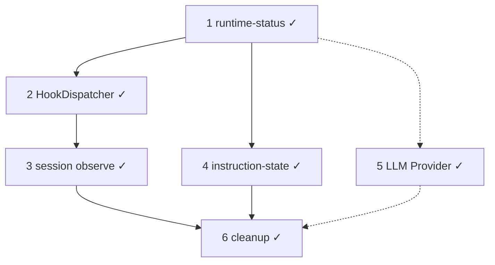

# Context Window 后续开发计划

> **状态：** 2026-08 定稿 · **#1–#6 主体 done** · **#5 A–C done** · **下一步 Context Budget Tiers / backlog**  
> **Spec：** [`context-composer.md`](../spec/context-composer.md) C0–C6  
> **Hook：** [`agent-run-hooks.md`](agent-run-hooks.md) · **Agent Event：** [`agent-events.md`](../spec/agent-events.md) · **Utils：** [`utils-infrastructure.md`](utils-infrastructure.md)

**范围：** TypeScript harness。**不含** Rust crates、Slint UI。

---

## 工作清单（六件事）

| # | 工作项 | 目标 | 状态 |
|---|--------|------|------|
| **1** | **runtime-status** | 运行时观测缓存，删 `sessions.ts` 镜像 | **done** |
| **2** | **Hook 机制终局** | `HookDispatcher` + sidecar phase；删 RunHooks/AgentPlugin/observe registry | **done** |
| **3** | **Session Observe（C6）** | commit port 落盘、Agent Event 派生、dedup | **done** |
| **4** | **instruction-state** | `load/resolve` + compose 接入；AGENTS.md / rules | **done** |
| **5** | **LLM Provider 完善** | 协议 → Provider → model registry（C0 A–C） | **done**（A–C；D–I backlog） |
| **6** | **Legacy / deprecated 清理** | 删 `@deprecated` alias、utils 抽离、event-hub 改名 | **done**（TS harness） |



**下一步：** **Context Budget Tiers**（见 [`context-backlog.md`](context-backlog.md)）；LLM Provider **D–I**（多 preset adapter、Model Router）择项 backlog。

---

## 架构修复（与 #5 并行）

与功能轨独立的 **架构修复 PR 序列**，详见 [`architecture-remediation.md`](architecture-remediation.md)。

| Phase | 内容 | 与六件事关系 |
|-------|------|--------------|
| **A P0** | §1 Session port、§10 Writer、§2 LLM Provider | §2 **即** #5 A–C |
| **B P1** | §3–§7、§9、§16 + 规范单测 | 独立 PR 序列 |
| **C P2** | §8、§11–§13、§15 | backlog 之后 |

---

## 开发者快速入口

### 阅读顺序

1. 本文（工作项 + 现状）
2. [`session-domain-model.md`](session-domain-model.md) — 类型与数据流
3. [`agent-run-hooks.md`](agent-run-hooks.md) — HookDispatcher · phase · sidecar
4. [`utils-infrastructure.md`](utils-infrastructure.md) — fs / process / storage 分层
5. [`ecosystem-compat.md`](ecosystem-compat.md) — MCP/Codex 兼容
6. [`context-composer.md`](../spec/context-composer.md) — C0–C6 Spec

### 代码锚点（按工作项）

| # | 主要目录 | 说明 |
|---|----------|------|
| **1** | [`context/runtime-status.ts`](../../src/context/runtime-status.ts) | manifest/report 缓存 |
| **2** | [`agent/hooks/`](../../src/agent/hooks/) | phases · dispatcher · registry · defaults |
| **3** | [`plugins/builtin/log-sync/`](../../src/plugins/builtin/log-sync/) · [`tool-use-log/`](../../src/plugins/builtin/tool-use-log/) | SessionItem → AgentEvent |
| **4** | [`instruction-state/`](../../src/instruction-state/) | load · resolve · epoch |
| **5** | [`llm/protocol/`](../../src/llm/protocol/) · [`llm/presets/`](../../src/llm/presets/) · [`llm/models/registry.ts`](../../src/llm/models/registry.ts) · [`llm/routing/resolve.ts`](../../src/llm/routing/resolve.ts) | Provider A–C done |
| **6** | [`utils/`](../../src/utils/) · [`storage/`](../../src/storage/) | 基础设施抽离；`log/event-hub.ts` |

### CLI 入口

```
src/main.ts → cli/repl/run.ts → agent/agent-run.ts → composeContext → runLLM
```

---

## 1. runtime-status — done

[`runtime-status.ts`](../../src/context/runtime-status.ts) 替代 [`sessions.ts`](../../src/context/sessions.ts) 镜像 messages；只存 manifest/report。

---

## 2. Hook 机制终局 — done

| 组件 | 状态 |
|------|------|
| `HookDispatcher` + `PHASE_DEFS` | done — [`src/agent/hooks/`](../../src/agent/hooks/) |
| default sidecar 模块 | done — tool-use-log、log-sync、context metrics |
| `beforeToolUse` decide | done — permission 后、execute 前 |
| 删除遗留 | done — RunHooks、AgentPlugin、pipeline/registry、session/observe、audit |

Sidecar transport：**stdio pipe IPC**（非 HTTP）；终局 UDS 见 [`plugin-host.md`](plugin-host.md)。

---

## 3. Session Observe（C6）— done

| Observer | 实现 |
|----------|------|
| Item 落盘 | Harness `SessionItemCommitPort` → `FileSessionItemWriter` |
| Agent Event 派生 | `sessionItem` → `log-sync/derive-observer` |
| context metrics | `llmCall` → context sidecar |
| tool use log | `toolUse` → tool-use-log sidecar |

**Invariant：** Agent Event **never** 反向写 Session Item Log。

---

## 4. instruction-state — done

```
src/instruction-state/
  types.ts · load.ts · resolve.ts · index.ts
```

- 读 `AGENTS.md` / `CLAUDE.md` / `.moontide/rules/*.md`
- `resolveInstructionState(workdir)` 带 per-run 缓存（`prepareRun` 时 reset）
- compose 经 `buildSystemFromInstructionState`

---

## 5. LLM Provider 完善（C0 A–C）— done

见 [`llm-provider.md`](../spec/llm-provider.md) §13。**D–I**（多协议 adapter、OpenRouter、Model Router）仍 backlog。

| 子阶段 | 内容 | 状态 |
|--------|------|------|
| **A** | MoonTide 协议类型；SDK import 限 adapter | **done** |
| **B** | `LLMProvider` + `resolveRoute()`；runLLM / compact / ping | **done**（`deepseek` + `anthropic` preset，单 adapter） |
| **C** | model 注册表 + `ModelProfile` 驱动 context limit | **done** |

---

## 6. Legacy / deprecated 清理 — done（TS harness）

### 6.1 已完成

- 删除 `SessionLog*` 等 `@deprecated` type alias（`session/types.ts`）
- 删除 `readLog` / `appendToolResult` / `appendCompaction` 等 deprecated 方法
- 删除 `log-to-messages.ts`、`trace/collector.ts`、`log/conversation.ts`
- `bus.ts` → **`event-hub.ts`**
- **Utils 基础设施抽离** — 见 [`utils-infrastructure.md`](utils-infrastructure.md)

### 6.2 仍待（backlog 择项）

- 删除 `composeContextV1`（零引用后）
- Context Budget Tiers、Session handoff P0、`read_artifact` tool
- Rust crates 命名对齐（`SessionLog` 协议层保留）

---

## 现状快照

| 项 | 状态 |
|----|------|
| Session Item Log + composeContext | done |
| Stores / compact / checkpoint CLI | done |
| runtime-status | done |
| HookDispatcher + sidecar defaults | done |
| instruction-state | done |
| Plugin host `kind: sidecar` | done — [`plugin-host.md`](plugin-host.md) |
| Utils / storage 分层 | done — [`utils-infrastructure.md`](utils-infrastructure.md) |
| Provider A–C | **done** — [`llm/models/registry.ts`](../../src/llm/models/registry.ts) · [`llm/routing/resolve.ts`](../../src/llm/routing/resolve.ts) |
| MCP client | 待 R2 |

---

## 相关文档

| 文档 | 关系 |
|------|------|
| [architecture-remediation.md](architecture-remediation.md) | Phase A–C 架构修复 |
| [context-composer.md](../spec/context-composer.md) | C0–C6 Spec |
| [agent-run-hooks.md](agent-run-hooks.md) | Hook 生命周期 |
| [utils-infrastructure.md](utils-infrastructure.md) | fs / process / event-hub |
| [session-log-migration.md](session-log-migration.md) | C1b、runtime-status |
| [context-backlog.md](context-backlog.md) | #5 之后演进 |
