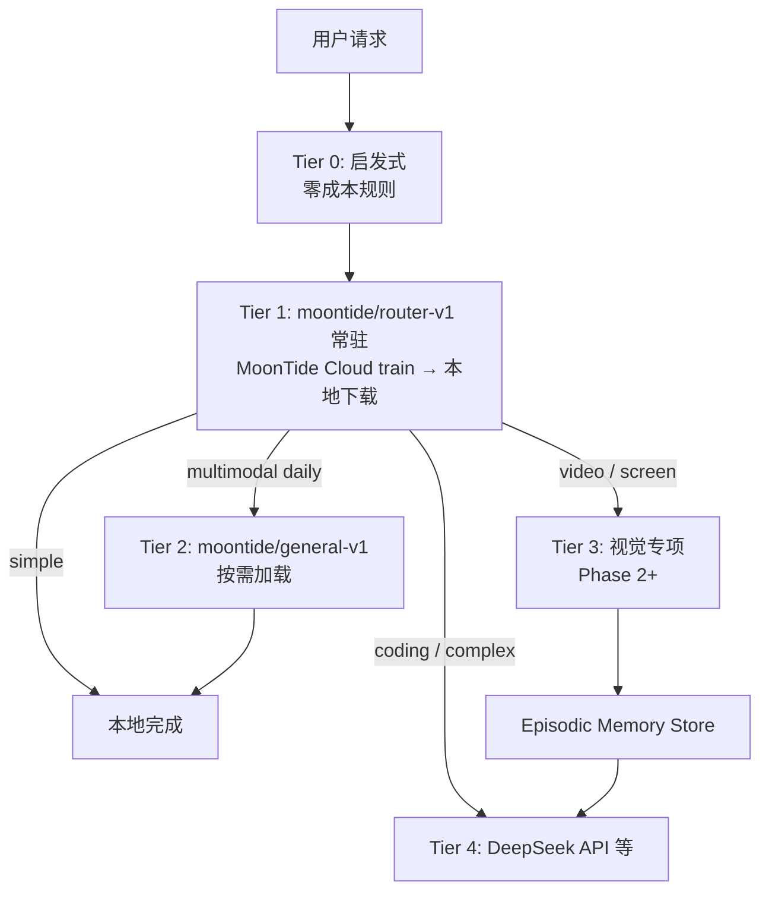

# Edge 本地小模型与混合推理（Edge Local Models）

> 产品讨论备忘：在用户设备部署量化小模型，处理简单任务以降低 cloud token 消耗、提升体验。  
> **非实现承诺** — 与 [`llm-provider.md`](../spec/llm-provider.md) Model Router 及 [`runtime-multilang.md`](runtime-multilang.md) 对齐的演进候选。

**已定产品原则（2026-08）：**

- **Local = inference only** — 用户设备只 download + run，不提供本地 train。
- **Train = MoonTide Cloud**（或 CI）— 用户不可见 train 管线。
- **Download = opt-in ability** — 用户显式开启本地模型；catalog **仅 MoonTide 签名白名单**。
- **Runtime** — Rust `moontide-infer` sidecar + direct GGUF（llama.cpp），**不用 Ollama/vLLM 套壳**。

**阅读顺序：** [`llm-provider.md`](../spec/llm-provider.md) §3.4 / §10 → [`runtime-multilang.md`](runtime-multilang.md) §5.5 → [`kocoro-architecture.md`](kocoro-architecture.md) §6.5。

---

## 1. 问题陈述

与 agent 交互时，大量请求并不需要 frontier cloud model：

- 日常闲聊、简单问答
- 文件整理（rename / 分类 / 短摘要）
- 图片 / 文档内容识别与总结
- 情景记忆（了解用户最近在做什么）
- 意图识别与路由（决定何时调用 cloud）

**核心诉求：** 在用户设备 edge deploy 小模型，把低复杂度任务留在本地，降低 DeepSeek 等 API 的 token 预算，同时降低延迟。

**候选基座（上游 foundation，MoonTide Cloud train 的起点）：**

1. **Qwen3.5-0.8B**
2. **Gemma 4 E4B-IT**
3. **Mage-VL-4B**（专项，Phase 2+）

---

## 2. 结论先行

**方向有价值**，但实现形态不是「用一个本地小模型替代 DeepSeek」，而是 **分层混合推理（Hybrid Inference）**：



用户侧见到的不是 raw HF 模型名，而是 **MoonTide catalog id**（如 `moontide/router-v1`），背后映射到固定基座 GGUF。

---

## 3. 任务分档：哪些适合 local？

| 场景 | 适合 local？ | 说明 |
|------|-------------|------|
| 意图分类 / 路由 | ✅ 强适合 | 短 prompt、结构化输出、可常驻 |
| 日常闲聊 | ✅ 适合 | 低 stakes |
| 文件整理（rename / 分类 / 摘要） | ✅ 适合 | MoonTide train 的 general 模型 |
| 文档总结（短文档） | ✅ 适合 | 本地读文件 → 本地 summarize |
| 图片 OCR / 内容描述 | ⚠️ 中号 VLM | E4B 档 general 模型 |
| 视频理解 | ⚠️ 专项 VLM | Phase 2+ |
| 情景 memory 抽取 | ✅ 分层做 | router / extractor catalog 模型 |
| Agent tool loop / 多文件 coding | ❌ 留 cloud | 需强 reasoning + 可靠 tool call |

---

## 4. 候选基座调研（上游）

> 以下为 **MoonTide Cloud train 的 foundation 选型参考**；用户设备加载的是 train 后的 **MoonTide catalog 产物**，不是让用户自行选 HF repo。

### 4.1 Qwen3.5-0.8B（Alibaba，2026-02）

| 维度 | 数据 |
|------|------|
| 参数量 | 0.8B（~873M） |
| Context | 262K native（edge 实际 8K–16K） |
| 模态 | 文本 + 图像 |
| 许可 | **Apache 2.0** |
| 内存 | Q4_K_M ~0.5 GB VRAM |

**MoonTide Cloud train 首选基座：** router、memory intent、轻量抽取。
**用户 catalog 示例：** `moontide/router-v1`（基于 Qwen3.5-0.8B Q4 GGUF + MoonTide 路由数据 train）。

**不适合：** 完整 agent tool loop、复杂 coding（仍 cloud）。

---

### 4.2 Gemma 4 E4B-IT（Google，2026-04）

| 维度 | 数据 |
|------|------|
| 有效参数 | 4.5B effective |
| 模态 | 文本 + 图像 + 音频 |
| 许可 | **Gemma License**（MoonTide 审后再分发） |
| 内存 | Mobile QAT ~2.2–2.5 GB |

**MoonTide Cloud train 用途：** 多模态 general、`moontide/general-v1` 档。
**Phase：** P2 以后 catalog 条目。

---

### 4.3 Mage-VL-4B（Microsoft，2026-07）

**Phase 2+ 视觉专项**；MVP 不进 catalog。生态与 codec pipeline 工程量大。

---

## 5. 三基座对比矩阵

| | Qwen3.5-0.8B | Gemma 4 E4B | Mage-VL-4B |
|---|:---:|:---:|:---:|
| **MoonTide tier** | Tier 1 常驻 | Tier 2 按需 | Tier 3 专项 |
| **首 catalog** | ✅ `router-v1` | P2 `general-v1` | 远期 |
| **License** | Apache 2.0 | Gemma Terms | Apache 2.0 |
| **Edge 内存** | 0.5–1 GB | 2.2–2.5 GB | 8 GB+ GPU |

---

## 6. 运行时架构：download + run（无 local train）

借 Kocoro **memory bundle pull** 模式，映射为 **model catalog pull**：

```text
┌─────────────────────────────────────────────────────────────┐
│ Layer A — Node 编排                                          │
│  Model Router → tier + cloud vs local                        │
│  LLMProvider「local-direct」→ IPC                            │
│  infer 未 Ready / 超时 → cloud fallback（默认）              │
└──────────────────────────┬──────────────────────────────────┘
                           │ UDS / NDJSON
┌──────────────────────────▼──────────────────────────────────┐
│ Layer B — Rust `moontide-infer`                                 │
│  Scheduler（pin router / LRU evict）                           │
│  llama.cpp + GGUF mmap                                       │
│  只加载 registry 白名单                                       │
└──────────────────────────┬──────────────────────────────────┘
                           │
┌──────────────────────────▼──────────────────────────────────┐
│ Layer C — ~/.moontide/models/                                   │
│  registry.json（本地已 pull 条目）                            │
│  remote catalog ← MoonTide 签名 catalog（定期 fetch）             │
└─────────────────────────────────────────────────────────────┘

┌─────────────────────────────────────────────────────────────┐
│ Layer D — MoonTide Cloud / CI（用户不可见）                      │
│  train → eval → export GGUF → 发布 catalog 条目               │
└─────────────────────────────────────────────────────────────┘
```

与 [`runLLM.ts`](../../src/agent/pipeline/runLLM.ts) 衔接：`local-direct` 是 `LLMProvider` 的一种实现，loop 不改。

```typescript
// 演进候选：local-direct preset（非 Ollama HTTP）
interface LocalDirectPreset {
  id: "local-direct";
  transport: "unix" | "stdio";
  socketPath: string; // e.g. ~/.moontide/run/infer.sock
  // catalog 白名单由 infer sidecar 强制，Node 只传 moontide/* model_id
}
```

---

## 7. 模型仓库与下载管理

### 7.1 目录布局

```text
~/.moontide/models/
├── registry.json           # 本地：已 pull 条目 + active 指针
├── catalog.cache.json      # 远程 MoonTide catalog 缓存
├── moontide/
│   └── router-v1/
│       ├── 1.0.0/
│       │   └── model.gguf
│       └── current → 1.0.0
└── cache/downloads/*.part  # 断点续传
```

### 7.2 Catalog 条目（远程 + 本地 merge）

```json
{
  "id": "moontide/router-v1",
  "role": "router",
  "tier": 1,
  "pin": true,
  "base_foundation": "qwen3.5-0.8b-q4",
  "moontide_train_revision": "2026-08-01",
  "files": [{
    "url": "https://models.moontide.dev/moontide/router-v1/1.0.0/model.gguf",
    "sha256": "…",
    "size_bytes": 524288000
  }],
  "vram_mb": 600,
  "context_default": 8192,
  "license": "apache-2.0"
}
```

### 7.3 下载流程

```text
ensure_model("moontide/router-v1")
  → 读 catalog / registry
  → 若 sha256 匹配 → skip
  → HTTPS 断点续传 → 校验 → 原子写入 version 目录
  → 更新 current 指针
  → 通知 infer reload（若已运行）
```

**触发：** 用户 `moontide model pull`；或 `local.infer=on` 时懒下载；catalog 版本 bump 时后台 pull（类似 Kocoro 24h bundle）。

### 7.4 infer 调度

| 规则 | 说明 |
|------|------|
| **pin** | `role=router` 且 catalog `pin:true` — 常驻 |
| **按需 load** | general / vision 首次请求时 load |
| **LRU evict** | 超 `local.vram_budget_mb` 卸载非 pin |
| **lazy start** | 首次 local route 才 spawn `moontide-infer` |
| **白名单** | infer **拒绝** registry / catalog 外路径 |

### 7.5 用户 ability（opt-in）

```yaml
local:
  infer: off | on              # 默认 off
  models:                      # 仅允许 catalog id
    - moontide/router-v1
```

- ❌ 不提供 `moontide model train`
- ❌ 不提供任意 HF URL（dev flag 除外）
- ✅ `moontide model list` 仅列 MoonTide 签名 catalog
- ✅ 下载前展示：体积、VRAM、license、用途

---

## 8. Train 策略（Cloud only，非用户设备）

### 8.1 为何不做用户本地 train

| 问题 | 说明 |
|------|------|
| 硬件碎片化 | M 系 / Intel / 无 GPU — 体验与支持成本极高 |
| 工程 tax | Python/torch 打包、失败诊断、发热与耗时 |
| 质量不可控 | 小数据过拟合；无统一 eval |
| 产品焦点 | MVP 应是 pull + run + Router，不是 notebook |

**结论：** 本地 train **不作为 v1–v2 能力**；远期若做个性化，也是 **opt-in 上传 → Cloud train → 下发 user-scoped catalog id**，而非设备上 train。

### 8.2 MoonTide Cloud train 管线（用户不可见）

```text
固定基座（Qwen0.8B / Gemma E4B / …）
  → 脱敏聚合数据 + 人工标注 + 合成数据
  → train / eval / 回归门禁
  → export GGUF + manifest + sha256
  → 发布 catalog 条目（moontide/router-v1@1.0.1）
```

| 产物 | 用途 | 典型 catalog id |
|------|------|-----------------|
| Router | 意图 / tier 分类 | `moontide/router-v1` |
| Memory extractor | QueryIntent / 结构化抽取 | `moontide/extract-v1`（可选） |
| General | 闲聊 / 轻 multimodal | `moontide/general-v1` |

**隐私：** v1 下发 **全局共享** train 产物（不含用户原文）；个性化 catalog **以后**单独 opt-in。

### 8.3 与 Kocoro 对照

| Kocoro | MoonTide |
|--------|-------|
| memory bundle Cloud train → 本地 pull | **model catalog** Cloud train → 本地 pull |
| `tlm` sidecar + UDS | `moontide-infer` sidecar + UDS |
| 用户不 train memory index | 用户不 train GGUF |

见 [kocoro-architecture.md](kocoro-architecture.md) §6.5。

---

## 9. 情景 memory 与 local 模型分工

| 层 | 组件 | 作用 |
|----|------|------|
| L0 | 文件 watcher + git activity | 结构化信号 |
| L1 | embedding catalog 模型（远期） | 语义检索 |
| L2 | `moontide/extract-v1` 或 router | memory facts 抽取 |
| L3 | `moontide/general-v1` | 截图 / 文档理解 |
| Store | 本地 store + Session Log | Composer attach |

---

## 10. 风险与诚实边界

| 风险 | 说明 |
|------|------|
| **Tool call 可靠性** | 小模型 agent bench 弱；必须 cloud fallback |
| **Catalog 运维** | MoonTide 需维护 train/eval/回滚 |
| **Gemma License** | general 档需 legal 审后再分发 |
| **infer 未 ready** | 必须默认 cloud，不阻塞 loop |
| **质量感知** | UI 明示 local vs cloud routing |

---

## 11. 分阶段建议

| 阶段 | 交付 | 备注 |
|------|------|------|
| **P0** | catalog schema + `moontide model pull` + infer spike 单模型 | 可先用手动放置 GGUF 验证 infer |
| **P1** | `LLMProvider local-direct` + Router 规则 + cloud fallback | 默认 cloud |
| **P2** | Scheduler + status API + `moontide/router-v1` Cloud train 首发 | 用户 opt-in 下载 |
| **P3** | `moontide/general-v1` + 多模态 load | Gemma 基座 |
| **P4** | 视觉 catalog + memory sidecar 联动 | Mage-VL 等 |
| **Deferred** | 用户本地 train | **不做** |
| **Deferred** | 用户 scoped Cloud train（个性化 catalog） | opt-in，P4+ |

---

## 12. CLI 面（草案）

```bash
moontide model list              # 仅 MoonTide catalog
moontide model pull moontide/router-v1
moontide infer status
MOONTIDE_LOCAL_INFER=on          # ability 总开关
```

**明确不提供：** `moontide model train` / `export` / 任意 URL import（产品路径）。

---

## 13. 与现有文档的关系

| 文档 | 关系 |
|------|------|
| [`llm-provider.md`](../spec/llm-provider.md) | Model Router、`local-direct` preset、`RoutingDecision` |
| [`runtime-multilang.md`](runtime-multilang.md) | Rust host、`moontide-infer` sidecar |
| [`kocoro-architecture.md`](kocoro-architecture.md) | bundle pull、sidecar supervise |
| [`session-handoff.md`](session-handoff.md) | memory 指针 |
| [`context-backlog.md`](context-backlog.md) | episodic memory |

---

## 14. 待决问题

1. **Catalog 托管** — `models.moontide.dev` vs HuggingFace org？
2. **Catalog 刷新间隔** — startup + weekly vs 每次 pull 检查？
3. **Router fallback 阈值** — 本地低置信何时 retry cloud？
4. **Gemma general 档** — 是否首发仅 Apache 基座（Qwen）？
5. **个性化 catalog** — 何时启动 opt-in Cloud train（非 MVP）？

---

## 15. 讨论来源

- 2026-08-01：edge 小模型调研、direct GGUF、Kocoro 架构对照。
- 2026-08-01：**产品决策** — 不做用户本地 train；Cloud train + catalog pull only；local = inference only。
