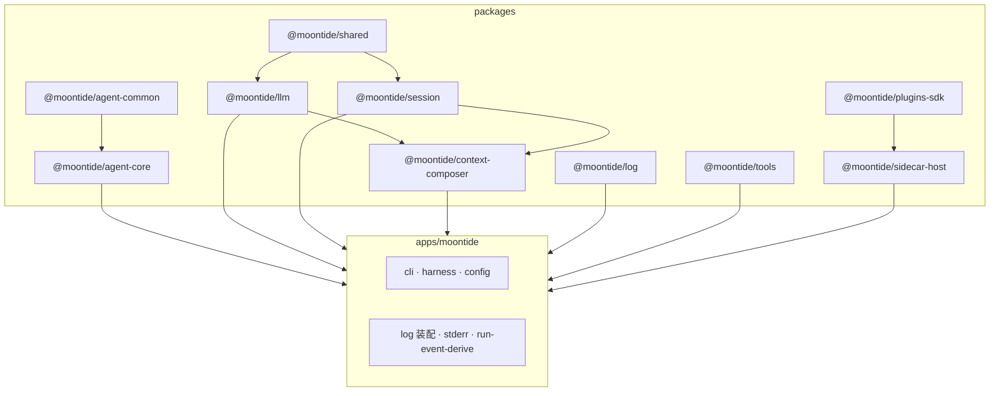

> **状态：** §17 完成（2026-08）— 根无 `src/` monolith；产品装配在 `apps/moontide`，域包在 `packages/*`。
> **相关：** [agent-core-roadmap](agent-core-roadmap.md) §12 · [architecture-remediation](architecture-remediation.md)

---

## 依赖图（简）



---

## 包一览

| 包 | 路径 | 职责 |
|----|------|------|
| **moontide** | `apps/moontide/` | CLI、REPL、harness（`agent/`）、config、instruction-state、context-inspect、log **装配**（stderr、modes、RunEvent→AgentEvent derive） |
| **@moontide/shared** | `packages/shared/` | utils、constants、errors、storage 原语 |
| **@moontide/llm** | `packages/llm/` | protocol、models、provider、routing、adapters、`runLLM` |
| **@moontide/session** | `packages/session/` | Session Item Log、stores、io、transform |
| **@moontide/context-composer** | `packages/context-composer/` | `composeContext`、budget、compaction、manifest |
| **@moontide/log** | `packages/log/` | Agent Event hub、JSONL 持久化、enrich（**无**终端渲染） |
| **@moontide/tools** | `packages/tools/` | Tool registry、builtins、extensions（code-repl、deep-research、work-mem） |
| **@moontide/plugins-sdk** | `packages/plugins-sdk/` | `defineSidecarPlugin`、sidecar hook/tool 类型 |
| **@moontide/sidecar-host** | `packages/sidecar-host/` | manifest、sidecar attach、stdio IPC、`run-sidecar` runner |
| **@moontide/agent-common** | `packages/agent-common/` | RunEvent / RunConfig protocol |
| **@moontide/agent-core** | `packages/agent-core/` | `runLoop`、RunEvent bus、resolveRunConfig / resolveTurnContext |

**文档别名：** 设计笔记中的 **plugin-host** 指 sidecar 加载与 attach；实现包名为 **`@moontide/sidecar-host`**（见 [plugin-host.md](plugin-host.md) 文首说明）。

---

## 路径对照（迁移后）

| 原 monolith `src/` | 现位置 |
|--------------------|--------|
| `src/utils/` · `constants/` · `errors/` · `storage/` | `@moontide/shared` |
| `src/llm/` | `@moontide/llm` |
| `src/session/` | `@moontide/session` |
| `src/context/composer/` | `@moontide/context-composer` |
| `src/log/event-hub` · `persist` · `jsonl` | `@moontide/log` |
| `src/log/format/` · `modes` · `stderr-renderer` | `apps/moontide/src/log/` |
| `src/tools/builtins/` · `extensions/` | `@moontide/tools` |
| `src/tools/register-defaults`（薄包装） | `apps/moontide/src/tools/` |
| `src/plugins/host/` | `@moontide/sidecar-host` |
| `src/plugins/sdk/` | `@moontide/plugins-sdk` |
| `src/agent/` · `cli/` · `config.ts` | `apps/moontide/src/` |
| `src/plugins/builtin/log-sync/` | **已删除**（M6）— Agent Event 改 RunEvent → [`run-event-derive.ts`](../../apps/moontide/src/log/run-event-derive.ts) |

---

## Agent Event 派生（M6+）

| 时期 | 机制 | 状态 |
|------|------|------|
| Legacy | `sessionItem` hook → `plugins/builtin/log-sync/` | **已删除**（M6） |
| 现行 | RunEvent bus → `createRunEventDeriveListener`（`apps/moontide/src/log/run-event-derive.ts`） | **生产路径** |

Hook manifest **不再**注册 `sessionItem/agent-event-derive`（见 `tests/conformance/hook-manifest.test.ts`）。集成不变量见 `tests/log-sync.test.ts`（文件名保留；测 RunEvent derive 路径）。

---

## 硬边界（architecture-boundaries）

- `@moontide/session` · `@moontide/context-composer` · `@moontide/shared`：零 `config` / 零 `agent/`
- `@moontide/agent-core` · `@moontide/agent-common`：零 session / composer / tools / sidecar
- `@moontide/sidecar-host` · `@moontide/plugins-sdk`：零 `agent/`
- 根目录无 `src/`（§17 门禁）

---

## 命令

```bash
pnpm dev          # apps/moontide REPL
pnpm run check    # lint + typecheck(core+app) + test
pnpm run build    # build:core + apps/moontide dist
```

Workspace 根：`moontide-workspace`（`package.json`）；可执行应用包名：`moontide`（`apps/moontide/package.json`）。
