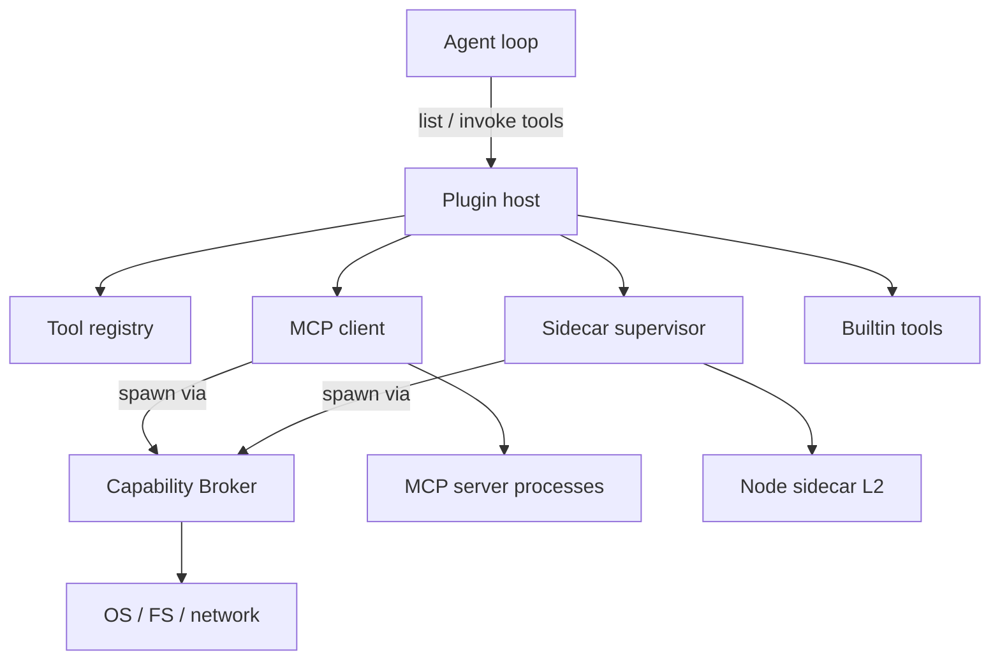

# Plugin Host — 扩展加载与 MCP 集成

> **文档性质：** notes（架构候选，非 Spec、非实现承诺）  
> **Doc Map：** [`docs/README.md`](../README.md) · 用词规范见 [`agent.md`](../../agent.md)  
> **分工：** Release 方向见 [`platform-strategy.md`](../product/platform-strategy.md)；Desktop IPC / sidecar 监管见 [`runtime-multilang.md`](runtime-multilang.md)；Hook 与 loop 边界见 [`agent-run-hooks.md`](agent-run-hooks.md) §11+

---

## 1. 术语

| 术语 | 定义 | 不负责 |
|------|------|--------|
| **Plugin host** | Rust agent core 内负责 **扩展发现、附着（attach）、tool registry 合并、子进程生命周期** 的模块 | LLM 调用、Context Composer、Session append |
| **MCP client** | 实现 [Model Context Protocol](https://modelcontextprotocol.io/) 的客户端：`tools/list`、`tools/call`；传输为 stdio 或 Streamable HTTP | 权限决策（交给 Capability Broker） |
| **Capability Broker** | 系统能力入口：读文件、spawn 进程、网络、Desktop 审批 UI；见 [`runtime-multilang.md`](runtime-multilang.md) §4 | MCP 协议解析 |
| **Sidecar supervisor** | 对 **Node sidecar**（L2 Ocula Plugin SDK）的 spawn、handshake、健康检查、cancel、重启；见 [`runtime-multilang.md`](runtime-multilang.md) §5 | MCP server 通用监管（由 Plugin host 内的 MCP client 连接管理承担） |
| **Tool registry** | 当前 session 可见的 tool 定义集合（builtin + MCP + sidecar 暴露）；Composer 解析为 `LLMRequest.tools` | tool 执行逻辑 |

**一词一义：** 本文不使用未定义的「Broker」总称。历史对话中的「Extension Broker」= 本文 **Plugin host** + **MCP client** +（Desktop 下）**Capability Broker** 的组合，落盘时拆开写。

**当前代码：** TS harness 已实现 [`src/plugins/host/`](../../src/plugins/host/)（manifest · `kind: sidecar` attach · in-process + stdio transport）与 [`ToolRegistry`](../../src/agent/runtime/tool-registry.ts)（经 `AgentRuntime.tools`）；**MCP client 尚未实现**。

---

## 2. 问题陈述

Rust release CLI **不在 core 内 embed Node**，但仍需支持：

1. **灵活：** agent Ready 后 **runtime attach** Node MCP（`npx` / `node`）。
2. **性能：** 启动时 **startup assembly** 已构建的 Go / Rust **MCP server binary**。
3. **深度扩展（可选）：** Node **sidecar** 承载 Ocula Plugin SDK（hook、npm 插件），经 Sidecar supervisor 监管。

Agent loop 只应调用窄接口（列出 tools、执行 tool、权限查询），不应内联 `spawn(npx …)` 或 `dlopen(…)`。

---

## 3. 目标架构



**调用方向（不变量）：**

```text
Agent loop → Plugin host → { Builtin | MCP client | Sidecar supervisor }
                         → Capability Broker（需系统能力时）
```

Loop **不出现** MCP、sidecar、attach 等扩展名；与 [`agent-run-hooks.md`](agent-run-hooks.md) §11 四层模型一致。

---

## 4. 扩展层（对齐 platform-strategy）

兼容承诺见 [`ecosystem-compat.md`](ecosystem-compat.md)。

| 层 | 机制 | Plugin host 职责 |
|----|------|------------------|
| **L1 MCP** | 独立 MCP server 进程 | attach、连接、tool 合并、重连 |
| **L2 Ocula Plugin SDK** | Node sidecar | Sidecar supervisor；sidecar 经自有 RPC 注册 tools / hooks |
| **L0 WASM（可选）** | in-process sandbox | Plugin host 加载 `.wasm` 为 builtin 类 provider；见 [`scratchpad.md`](scratchpad.md) |
| **L3 Adapter** | 社区包装 | 不承诺零改；通常仍表现为 MCP 或 sidecar |

**非目标：** OpenCode / Pi **in-process** `import` npm；VS Code Extension Host API。

---

## 5. 两种 attach 生命周期

同一 **plugin manifest**，用 `attach` 字段区分：

| `attach` | 名称 | 时机 | 典型场景 |
|----------|------|------|----------|
| `startup` | **Startup assembly** | agent 进入 Ready 之前（或 REPL 首次 prompt 前） | 锁版本的 Rust/Go MCP binary bundle |
| `runtime` | **Runtime attach** | agent 已 Ready；用户或配置触发 | `/mcp add`、开发调试、按需 Node MCP |
| `manual` | 仅登记不自动加载 | 用户显式 enable | 高危或实验插件 |

### 5.1 Startup assembly

```text
读取 .ocula/plugins.toml（或 manifest.lock）
  → 并行 spawn MCP server（Capability Broker 批准 command）
  → MCP client handshake + tools/list
  → 写入 Tool registry
  → loop 开始时 tools 已就绪
```

适合：Go/Rust 编译的 MCP server、官方 plugin pack、离线/air-gapped。

### 5.2 Runtime attach

```text
用户: /mcp add … 或 API attach_plugin(manifest)
  → Plugin host 校验 manifest + 用户 confirm（若需）
  → spawn MCP server 或连接 HTTP endpoint
  → merge tools（冲突策略见 §8）
  → 可选 append Session log: plugin_attached
  → 当前及后续 turn 可见新 tools
```

适合：`npx @vendor/mcp-server`、临时试验、不污染冷启动路径。

**默认 MVP（零 Node）：** 仅 `startup` + builtin + HTTP MCP；`runtime` + Node 依赖 **node runtime pack**（按需下载，见 [`runtime-multilang.md`](runtime-multilang.md) §9）。

---

## 6. MCP server 产物形态

MCP 协议与 server 实现语言无关。Plugin host 通过 **MCP client** 连接，不区分「binary」与「runtime」，仅 manifest 中 `command` 不同：

| 产物 | `command` 示例 | Node 依赖 | 冷启动 |
|------|------------------|-----------|--------|
| **Rust / Go binary** | `["${OCULA_PLUGINS}/bin/fs-mcp", "--root", "."]` | 无 | 快 |
| **Node runtime** | `["npx", "-y", "@vendor/server"]` 或 node pack 内 `node` | 是（pack 或 PATH） | 较慢 |
| **HTTP MCP** | `transport: http`, `url: …` | 视 server | 无本地 spawn |

**Bundle 目录（构建期）：**

```text
plugins/bundle/
├── manifest.lock      # 固定版本 + SHA-256
└── bin/
    ├── fs-mcp         # Rust static / Go binary
    └── git-mcp
```

CLI（候选）：`ocula plugin pack` 锁依赖并产出 bundle；`ocula plugin verify` 校验签名。非 R0 范围。

**与 in-process dynamic link 的区别：** MCP 始终是 **独立进程 + JSON-RPC**；`.so` / `dlopen` 属于 L0 in-process provider，不走 MCP，仅官方或 WASM 优先（见 [`runtime-multilang.md`](runtime-multilang.md) §10 优先级）。

---

## 7. Plugin manifest（候选 schema）

路径：`.ocula/plugins.toml` 或 workdir 内 `plugins/manifest.toml`。**非 Spec**，实现前可修订。

```toml
[[plugins]]
id = "fs-mcp"
kind = "mcp"
attach = "startup"
transport = "stdio"
command = ["${OCULA_PLUGINS}/bin/fs-mcp", "--root", "${WORKSPACE}"]
capabilities = ["fs.read", "fs.list"]

[[plugins]]
id = "vendor-npm-mcp"
kind = "mcp"
attach = "runtime"
requires = ["node-runtime"]
transport = "stdio"
command = ["npx", "-y", "@vendor/mcp-server"]
capabilities = ["network"]

[[plugins]]
id = "deep-research"
kind = "sidecar"
attach = "startup"
requires = ["node-runtime"]
entry = "plugins/deep-research/index.js"
capabilities = ["network", "fs.read"]
```

| 字段 | 说明 |
|------|------|
| `id` | 稳定标识；tool 命名空间前缀 `mcp__{id}__{tool}`（候选） |
| `kind` | `mcp` \| `sidecar` \| `wasm` |
| `attach` | `startup` \| `runtime` \| `manual` |
| `requires` | `node-runtime` 等；缺失时 Plugin host 提示安装 pack |
| `capabilities` | 供 Capability Broker 预检与用户 disclosure |

Runtime attach 成功后，可选 **持久化** 到用户 config，下次 `attach = startup` 等价。

---

## 8. Tool registry 合并与冲突

Plugin host 向 **Tool registry** 提供统一视图：

```text
effective_tools = builtins ⊕ mcp_tools ⊕ sidecar_tools
```

| 策略 | 规则 |
|------|------|
| 命名冲突 | 后 attach 失败或要求 `--force`；startup 顺序由 manifest 声明 |
| 撤销 | `detach` 移除该 plugin 贡献的 tools；进行中的 tool call 允许完成或 cancel |
| Composer | 只读 registry 快照；attach 后下一 turn 生效（或当前 turn 若尚未 `buildInput`） |

权限：**每次 tool invoke** 仍经 Capability Broker + `beforeToolUse` hook（见 [`agent-run-hooks.md`](agent-run-hooks.md)）；MCP server 进程 **无** 直接 FS 权限，除非 broker 代理。

---

## 9. 与 Sidecar supervisor 的分工

| | MCP server（L1） | Node sidecar（L2） |
|--|------------------|-------------------|
| 协议 | MCP | Ocula Plugin SDK（NDJSON / UDS，见 runtime-multilang） |
| 能力 | 主要为 **tools** | tools + **hooks**（Transform 经 IPC） |
| 监管 | Plugin host 内连接池 + 子进程 reap | Sidecar supervisor 状态机 |
| npm | 仅在 MCP server 进程内 | 在 sidecar 进程内 `import` |

Rust CLI **R0–R2** 可仅实现 MCP + Plugin host；**R3** 再加 Sidecar supervisor（[`platform-strategy.md`](../product/platform-strategy.md) §8）。

---

## 10. 观测与 Session log

候选 Session 事件（非 Spec，待并入 [`context-composer.md`](../spec/context-composer.md) 或 agent-events）：

| 事件 | 时机 |
|------|------|
| `plugin_attached` | runtime / startup attach 成功 |
| `plugin_detached` | 用户或失败移除 |
| `plugin_error` | MCP handshake 失败、进程退出 |

Agent Event Log 可 mirror 运行级摘要，供 UI tail。

---

## 11. REPL / CLI 命令（候选）

```text
/mcp list
/mcp add npm @vendor/server
/mcp add binary ~/bin/my-mcp
/mcp detach fs-mcp
/plugin status
```

等价配置：`ocula config plugins …`（TBD）。

---

## 12. 演进与 Rust 模块边界（候选）

| 阶段 | Plugin host 范围 |
|------|------------------|
| **R0** | Builtin tools only；registry 接口预留 |
| **R2** | MCP client + startup assembly + runtime attach |
| **R3** | Sidecar supervisor + L2 SDK |
| **R4** | Desktop：Capability Broker 与 Rust Host 合并监管 |

候选 crate 切分（Rust，非承诺）：

```text
ocula-plugin-host/     # manifest、registry、attach 调度
ocula-mcp/             # MCP client 协议
ocula-capability/      # Capability Broker（CLI 可先简化）
ocula-sidecar/         # Sidecar supervisor（R3+）
```

TS 仓库：现有 tests + fixture manifest 作 **conformance**；[`ToolRegistry`](../../src/agent/runtime/tool-registry.ts) 行为对齐 registry 语义。

---

## 13. 开放问题

1. HTTP MCP 与 stdio MCP 是否统一为同一 `McpConnection` trait？
2. Tool 命名空间：`mcp__` 前缀是否写进 Spec？
3. Runtime attach 是否允许 mid-turn（LLM 已发出 tool_calls 之后）？
4. Sidecar hook Transform 与 MCP tools 合并顺序是否在 Plugin host 单层完成？
5. Plugin manifest 是否纳入 workdir git commit（团队共享）vs 用户 global config？

---

## 14. 相关文档

| 文档 | 关系 |
|------|------|
| [`platform-strategy.md`](../product/platform-strategy.md) | L1/L2/L3、Rust release、非目标 |
| [`runtime-multilang.md`](runtime-multilang.md) | Capability Broker、Sidecar supervisor、20MB 分发 |
| [`agent-run-hooks.md`](agent-run-hooks.md) | Loop 与 hook；§13.3 sidecar Transform |
| [`scratchpad.md`](scratchpad.md) | L0 WASM 候选 |
| [`kocoro-architecture.md`](kocoro-architecture.md) | 参考 sidecar 监管 |
| [`agent.md`](../../agent.md) | 术语规范 |

---

## 15. Status

- **方向：** Plugin host + MCP client 双 attach 模式（startup assembly / runtime attach）；Capability Broker 与 Sidecar supervisor 职责分离。
- **TS harness（已实现）：**
  - [`src/plugins/host/`](../../src/plugins/host/) — manifest 解析 · `kind: sidecar` attach
  - [`src/plugins/host/sidecar/`](../../src/plugins/host/sidecar/) — **stdio pipe IPC**（`process-transport` · `bridge` · NDJSON 协议）
  - [`src/plugins/sdk/`](../../src/plugins/sdk/) — `defineSidecarPlugin` · hook 注册
  - [`src/agent/runtime/tool-registry.ts`](../../src/agent/runtime/tool-registry.ts) — tool registry（`AgentRuntime.tools`）
  - default sidecar：tool-use-log、log-sync、context metrics（见 [`agent-run-hooks.md`](agent-run-hooks.md)）
- **未实现：** MCP client（R2）· Rust Plugin host · UDS transport（终局，与 TS 同协议）
- **下一步：** R2 MCP client stub；manifest 字段 stabilise 为 Spec 或 ADR
