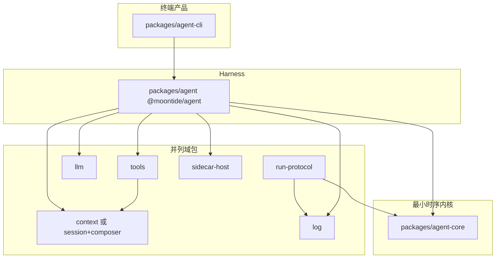

> **文档性质：** notes（开发计划，非实现承诺）
> **状态：** 草案 / 待执行（TODO §18）· **2026-08 review 两轮已吸收**（输出契约、run-protocol 命名、范围分轨、Phase 0 evals、同 Phase 文档更新）
> **设计 Spec：** [`docs/spec/agent-core.md`](../../spec/agent-core.md) · [`docs/spec/context-composer.md`](../../spec/context-composer.md)
> **术语：** [`AGENTS.md`](../../../AGENTS.md) §7.2（RunEvent bus · **resolveRunConfig** · **resolveTurnContext**；不用 sink / fold）
> **执行入口：** 根 [`TODO.md`](../../../TODO.md) §18 · 包索引 [`monorepo-packages.md`](monorepo-packages.md) §18

---

## 1. 背景

§17 已完成域包拆分：`session`、`context-composer`、`llm`、`agent-core` 等已在 `packages/*`，根目录无 `src/` monolith。

[`packages/agent-cli/src/`](../../../packages/agent-cli/src/) 仍同时承载 harness 与 CLI。

### 1.1 §18 主目标 vs 并列决策记录

| 轨道 | 问题 | 终局 | 与主目标关系 |
|------|------|------|----------------|
| **§18 主轨** | harness 与 CLI **物理拆包** | `agent-core` → `@moontide/agent` → `packages/agent-cli` | **本里程碑核心**；**不依赖** DR-B 即可执行 Phase 1–2（DR-A **已完成** → `@moontide/run-protocol`） |
| **DR-A** | Run 协议包 **命名与 bounded context** | `@moontide/run-protocol` ← 现 `agent-common` | **独立可执行**；非 harness 拆包前提；失败归因 DR-A，不归 §18 主轨 |
| **DR-B** | Session + Composer **是否合并一包** | `@moontide/context`（可选） | **独立可执行、默认 defer**；见 §3.2 收益与 go/no-go；失败归因 DR-B |

**风险模型：** 把 DR-A / DR-B 与主轨绑在同一 Phase 链会模糊验收归属。实施时 **三条轨道分别 PR、分别验收**；[`TODO.md`](../../../TODO.md) 用 18.0 / 18.0b / 18.1–18.3 区分。



**与 §16 的关系：** §16.5 已完成 harness **逻辑**接入 `agent-core`（RunCommitPort、`composeContext`）。§18 **主轨**只做 harness / CLI **物理迁包**；DR-A / DR-B 为 **并列包结构决策**，各有独立 rationale（§3.1 · §3.2）。

---

## 2. 三层定义

| 层 | 包 | 唯一问题 | 不应包含 |
|----|-----|----------|----------|
| **agent-core** | `@moontide/agent-core` | 这次 run **下一步是什么**？ | Session 落盘、`composeContext`、CLI |
| **agent（harness）** | `@moontide/agent` | MoonTide **默认怎么接线**？ | REPL、stderr 渲染、slash 命令 |
| **agent-cli** | `packages/agent-cli` | 终端里 **用户怎么交互**？ | `runLoop`、Provider adapter、Session transform |

**命名说明：** 文档中 **harness** 与 **agent（包）** 同义；**agent ≠ agent-core**。包名采用 `@moontide/agent`（MoonTide Preset 装配层）。

### 2.1 RunConfig 槽位 vs compose 实现

| | **resolveTurnContext**（core 调用） | **RunConfig.compileTurnContext**（harness 实现） |
|---|-------------------------------------|--------------------------------------------------|
| 调用方 | `agent-core` `runLoop` 每 turn | harness 在 `compileTurnContext` 回调内 |
| 输入 | 内存 `AgentMessage[]` + turn | 同上（经可选 `transformContext`） |
| 输出 | **`TurnCompileResult`** | 内部调 `composeContext` 后映射为 `TurnCompileResult` |
| 职责 | 分派 transform / compile 槽位 | checkpoint、compaction、budget、manifest |

`TurnCompileResult` 含 **`system`、`tools`、`messages`（LlmMessage[]）、`attachment`**（如 `protocolMessages`），不是仅 `Message[]`。StreamFn 用 attachment 调 `runLLM`（见 [`stream-fn.ts`](../../../packages/agent/src/agent/harness/stream-fn.ts)）。

### 2.2 每 turn 实际控制流（与代码一致）

```text
runLoop（agent-core）
  → resolveTurnContext(config, transcript, turn)
      → [可选] config.transformContext
      → config.compileTurnContext（@moontide/agent / harness）
          → composeContext（@moontide/context-composer 或 DR-B 后 @moontide/context/composer）
          → 映射为 TurnCompileResult { system, tools, messages, attachment }
  → streamFn(compiled) → runLLM（@moontide/llm，用 attachment.protocolMessages）
  → toolExecutor → transcript 追加 → 下一 turn 重复 compose
```

**要点：** `composeContext` 在 **`compileTurnContext` 回调内部**，不是 runLoop 之前的独立步骤；tool loop 内 **每 turn 重新 compose**。

---

## 3. 并列域包（不进 agent 包）

以下 package **不由 harness 吸收**，仅被 harness 装配：

| 包 | 职责 |
|----|------|
| `@moontide/run-protocol` | **Run 栈契约**（RunEvent · RunConfig · AgentMessage · StreamFn；见 §3.1） |
| `@moontide/shared` | utils、errors、storage **原语与操作**（非 Run 协议形状） |
| `@moontide/session` · `@moontide/context-composer` **或** `@moontide/context` | **上下文域**（DR-B；见 §3.2） |
| `@moontide/llm` | Provider preset、adapters、`runLLM`；**LLM 契约留本包** |
| `@moontide/log` | Agent Event hub、JSONL（**无**终端渲染） |
| `@moontide/tools` | Tool registry、builtins、extensions |
| `@moontide/sidecar-host` · `@moontide/plugins-sdk` | 扩展 attach |

**非目标：** Run 协议、Session、LLM 契约收进同一「项目 types 桶」；context 或 run-protocol 并入 `agent` / `agent-core` / `agent-cli`。

现有 conformance：`session` 零 `agent/` import；`context-composer` 零 `agent/`；core 零 context / tools 实现依赖（DR-B 合并后路径见 §3.2）。

### 3.1 DR-A — `@moontide/run-protocol`（`agent-common` 重命名）

**子问题：** Run 栈各层交换的数据 **长什么样**？（bounded context = **run protocol**，不是全项目 types）

| | **`@moontide/run-protocol`** | **`@moontide/shared`** |
|---|------------------------------|------------------------|
| 内容 | RunEvent / RunConfig / AgentMessage / StreamFn 等 **契约** | `readFile`、`toMessage`、错误 factory |
| 非纯 type | `PROTOCOL_VERSION`、`isAssistantMessage` **保留**（与现 `agent-common` 一致） | — |
| 依赖 | **零** `@moontide/*` 实现包 | Node / FS 原语 |
| **不归本包** | SessionItem、LLM Message、ToolSpec 等 — **留在 `@moontide/session` · `@moontide/llm` · `@moontide/tools`** | — |

**迁移（已完成）：** `@moontide/agent-common` → `@moontide/run-protocol`；源码在 [`packages/run-protocol/src/protocol/`](../../../packages/run-protocol/src/protocol/)。

**Export：**

| Export | 内容 |
|--------|------|
| `@moontide/run-protocol` | 现 `agent-common` 公开面（含 `PROTOCOL_VERSION`、`isAssistantMessage`） |

**消费者 import 变更：**

| 现行 | 目标 |
|------|------|
| `@moontide/agent-common` | `@moontide/run-protocol` |
| `@moontide/agent-common/protocol` | `@moontide/run-protocol`（无独立 `/protocol` subpath，除非 Phase 0 显式保留） |

**依赖方向：**

```text
@moontide/run-protocol  ←  agent-core, log, agent（harness）, evals, tests
@moontide/run-protocol  ↛  session | llm | tools | shared（契约层不反向依赖域包）
```

**Conformance（Phase 0 / DR-A）：**

- `packages/run-protocol/src` 不得 import `@moontide/*`（除自身）
- `@moontide/log` 只依赖 `@moontide/run-protocol`（+ `shared`），**不**为契约依赖 `agent-core`

**同 Phase 文档（必做，非 Phase 3）：** [`AGENTS.md`](../../../AGENTS.md) §7.2 · [`docs/spec/agent-core.md`](../../spec/agent-core.md) · [`agent-core-roadmap.md`](agent-core-roadmap.md) · [`monorepo-packages.md`](monorepo-packages.md) · [`TODO.md`](../../../TODO.md) §16/§18 — `agent-common` → `run-protocol`。

**明确不做（DR-A 非目标）：** 新建 `@moontide/types` 或把 `llm/protocol`、Session 类型迁入「统一 types 包」。

### 3.2 DR-B — `@moontide/context`（session + composer 合并，**可选**）

**现状：** [`@moontide/session`](../../../packages/session/) 与 [`@moontide/context-composer`](../../../packages/context-composer/) **已**用 package 边界强制 `session ↛ composer`；合并 **不会**增强模块内聚（两模块问题仍不同），且 **削弱** package 级 enforcement（只剩目录 + conformance 扫描）。

**合并要解决的问题（须验收，否则保持分包）：**

| 问题 | 指标 |
|------|------|
| harness / evals / CLI 对上下文域 **双 package 依赖**与版本锁步成本 | `@moontide/agent` · `@moontide/evals` 的 `package.json` 中 context 相关依赖 **从 2 行 → 1 行** |
| 文档与口头已把 session+composer 称为 **context 域** | 新开发者 `pnpm why @moontide/context-composer` 次数 **归零**（grep 验收） |
| 合并后边界不丢 | conformance 仍断言 `packages/context/src/session` **零** `composer/` import（与现 `@moontide/session` 规则等价） |

**go/no-go：** 若仅「少一个 package 目录」而无上表可测收益，**取消 DR-B**，保留 `@moontide/session` + `@moontide/context-composer` 直至有独立动机。

**若执行 DR-B — 包内两模块：**

| 模块 | 路径 | 只回答 |
|------|------|--------|
| **session** | `packages/context/src/session/` | **记什么** — Item Log、stores、materialize |
| **composer** | `packages/context/src/composer/` | **发什么** — `composeContext`、budget、compaction、manifest |

**Export（保持窄 import）：** `@moontide/context` · `@moontide/context/session` · `@moontide/context/composer` · stores / block-registry subpath（同前计划）。

**同 Phase 文档（必做）：** [`docs/spec/context-composer.md`](../../spec/context-composer.md) · [`monorepo-packages.md`](monorepo-packages.md) · architecture-boundaries 扫描路径。

---

## 4. 终端与观测输出边界（实施前必做）

现行代码中以下模块 **耦合 terminal / stderr 渲染**，不可原样迁入 `@moontide/agent`：

| 源文件 | 终端耦合 | 终局归属 |
|--------|----------|----------|
| [`log/setup.ts`](../../../packages/agent-cli/src/log/setup.ts) | `StderrRenderer`、`resetTerminalRenderState` | **agent-cli** |
| [`errors/report.ts`](../../../packages/agent-cli/src/errors/report.ts) | `writeStderrBlock`、`formatErrorTerminal`、debug emit | **stderr / debug 分支 → agent-cli**；**结构化 emit → harness** |
| [`agent/hooks/failures.ts`](../../../packages/agent/src/agent/hooks/failures.ts) | 现 **直接** `import reportError` | **改 harness 内 `publishAgentError`**（只 emit，不 stderr） |
| [`agent/agent-run.ts`](../../../packages/agent/src/agent/agent-run.ts) | 每 run 调用 `configureOutputs()` | **删除**；outputs 在 bootstrap **注入一次** |
| [`session-persistence/lifecycle.ts`](../../../packages/agent/src/plugins/builtin/session-persistence/lifecycle.ts) | `printStartupHint` / `printQuitHint` → `writeStderrLine` | **逻辑留 agent**；**hint 输出留 agent-cli** |

### 4.1 唯一契约（禁止双轨）

**选定一种** output / error 注册方式 — **经 `bootstrapAgentPlatform` 依赖注入**，不用进程级 `setAgentEventOutputs()`，也不允许「CLI 在 bootstrap 前偷偷 configure」与 harness 内 global 并存。

```typescript
/** @moontide/agent — 平台 bootstrap 入参（示意） */
export interface AgentEventPipeline {
  /** 注册到 @moontide/log hub；含 JsonlWriter、StderrRenderer 等 */
  outputs: EventOutput[];
  /** 结构化错误：emit AgentEvent（plugin_error 等）；不 write stderr */
  publishError: (record: ErrorRecord, route?: AgentErrorRoute) => void;
}

export interface AgentPlatformOptions {
  workdir: string;
  runtime: AgentRuntime;
  pipeline: AgentEventPipeline;
}

export async function bootstrapAgentPlatform(opts: AgentPlatformOptions): Promise<void>;
```

| 层 | 职责 |
|----|------|
| **`@moontide/agent`** | `emitHookError` / `logHookFailure` → **`pipeline.publishError`**（或 run 级 deps，同源）；RunEvent derive + hub；**`AgentRun.execute` 只 publish RunEvent，不 mutate 全局 output 表** |
| **`packages/agent-cli`** | 构造 `pipeline`：`outputs = [JsonlWriter, StderrRenderer, …]`；`publishError` 实现 = emit +（可选）CLI 侧 `ErrorPresentationOutput` 写 stderr；**整模块** [`report.ts`](../../../packages/agent-cli/src/errors/report.ts) 终端/format/debug 分支 |

**迁移步骤（Phase 1 内，可先于迁包在 app 验证）：**

1. 从 [`failures.ts`](../../../packages/agent/src/agent/hooks/failures.ts) 移除对 `reportError` 的 import；改为注入的 `publishAgentError`
2. 从 [`agent-run.ts`](../../../packages/agent/src/agent/agent-run.ts) 移除 `configureOutputs()`；[`bootstrap.ts`](../../../packages/agent/src/app/bootstrap.ts) 的 `setupAgentEventPipeline` 改为接收 `pipeline.outputs`
3. agent-cli 启动：`bootstrapAgentPlatform({ workdir, runtime, pipeline: createCliEventPipeline(workdir) })`

**Conformance：** `packages/agent/src` 不得 import `terminal/`、`log/format/`、`log/outputs/`、`errors/report.ts`；不得 `process.stderr.write`；session-persistence 不得 `reply`。

### 4.2 已落地（R1 + R2）

| 项 | 状态 |
|----|------|
| Session persistence 去 REPL 形状 | **已落地** — Harness：`SessionLifecycleAccess`、`saveActiveSessionToIndex`、`openSessionFromIndex`；CLI：`session-save.ts`、`resume.ts` |
| `printStartupHint` / `printQuitHint` | **已落地** — 仍在 agent-cli（[`session-hints.ts`](../../../packages/agent-cli/src/cli/session-hints.ts)）；plugin lifecycle 无 stderr |
| Debug 终端经 pipeline | **已落地** — `AgentEventPipeline.writeDebugTerminal`；`emitDebugRecord` 无默认 stderr；`createTestEventPipeline` 在 `@moontide/agent/testing` |

---

## 5. 文件迁移映射

基于 [`packages/agent-cli/src/`](../../../packages/agent-cli/src/) 顶层目录。**clean break**，不保留转发 shim。

### 5.1 → `@moontide/agent`（harness）

| 源路径 | 说明 |
|--------|------|
| [`agent/`](../../../packages/agent/src/agent/) | 含 `harness/`、`AgentSession`、`agent-run`、pipeline、hooks、`runtime/` |
| [`instruction-state/`](../../../packages/agent/src/instruction-state/) | compose 输入（`AGENTS.md`、rules） |
| [`plugins/`](../../../packages/agent/src/plugins/) | MoonTide builtin 装配（**不含** lifecycle 的 stderr hint；见 §4） |
| [`tools/register-defaults.ts`](../../../packages/agent/src/tools/register-defaults.ts) · [`always-allow-mode.ts`](../../../packages/agent/src/tools/always-allow-mode.ts) · [`index.ts`](../../../packages/agent/src/tools/index.ts) | 产品级 tool 注册 |
| [`app/bootstrap.ts`](../../../packages/agent/src/app/bootstrap.ts) · [`app/index.ts`](../../../packages/agent/src/app/index.ts) | 平台 bootstrap（**不含** stderr renderer 接线） |
| [`context-inspect/`](../../../packages/agent/src/context-inspect/) | debug 观测（与 harness hook 耦合） |
| [`log/run-event-derive.ts`](../../../packages/agent/src/log/run-event-derive.ts) | RunEvent → AgentEvent derive |
| [`log/index.ts`](../../../packages/agent-cli/src/log/index.ts) 中 derive / hub re-export | event pipeline **无** `configureOutputs` |
| [`config.ts`](../../../packages/agent-cli/src/config.ts) · [`config/workspace-config.ts`](../../../packages/agent-cli/src/config/workspace-config.ts) | workdir 等产品配置 |
| [`bootstrap.ts`](../../../packages/agent-cli/src/bootstrap.ts) | 非 env 的 harness 侧 bootstrap（若与 CLI 入口分离） |

**明确不迁入 agent（原 §4.1 误列）：** [`log/setup.ts`](../../../packages/agent-cli/src/log/setup.ts) · [`errors/report.ts`](../../../packages/agent-cli/src/errors/report.ts) — 见 §4。

### 5.2 → `packages/agent-cli`

| 源路径 | 说明 |
|--------|------|
| [`main.ts`](../../../packages/agent-cli/src/main.ts) · [`bootstrap-env.ts`](../../../packages/agent-cli/src/bootstrap-env.ts) | 进程入口、workspace / `.env` |
| [`cli/`](../../../packages/agent-cli/src/cli/) | REPL、slash 命令、statusline |
| [`terminal/`](../../../packages/agent-cli/src/terminal/) | 终端 IO |
| [`i18n/`](../../../packages/agent-cli/src/i18n/) | 终端文案 |
| [`log/format/`](../../../packages/agent-cli/src/log/format/) · [`log/outputs/`](../../../packages/agent-cli/src/log/outputs/) · [`log/modes.ts`](../../../packages/agent-cli/src/log/modes.ts) · [`log/repl-conversation-stream.ts`](../../../packages/agent-cli/src/log/repl-conversation-stream.ts) | Agent Event **终端呈现** |
| [`log/setup.ts`](../../../packages/agent-cli/src/log/setup.ts) | `resetEventPlatform` re-export（`configureOutputs` 已删除） |
| [`errors/report.ts`](../../../packages/agent-cli/src/errors/report.ts) · [`errors/cli.ts`](../../../packages/agent-cli/src/errors/cli.ts) | 错误上报与 CLI fatal |
| [`config/ui-settings.ts`](../../../packages/agent-cli/src/config/ui-settings.ts) · [`config/status-line.ts`](../../../packages/agent-cli/src/config/status-line.ts) | 纯 UI 配置 |

### 5.3 灰色地带与资产

| 项 | 决策 |
|----|------|
| [`cli/session-persistence-glue.ts`](../../../packages/agent-cli/src/cli/session-persistence-glue.ts) | **留 agent-cli** — 注入 `SessionLifecycleAccess` |
| `printStartupHint` / `printQuitHint` | **留 agent-cli**（[`repl/run.ts`](../../../packages/agent-cli/src/cli/repl/run.ts)）；plugin 内 stderr 调用删除或改为 callback |
| **code-repl templates** | **不迁入 agent-cli**。模板由 [`@moontide/tools`](../../../packages/tools/package.json) build 复制到 `dist/`；[`packages/agent-cli` build 的 copy 为重复，**删除** |
| `locale.ts`（[`i18n/locale.ts`](../../../packages/agent-cli/src/i18n/locale.ts)） | 随 **agent-cli** |

### 5.4 公开 API 与 CLI 依赖策略

#### `@moontide/agent` exports（Phase 1 必须）

| 导出 | 来源 | 消费者 |
|------|------|--------|
| `runAgent` · `continueReplAgent` | [`agent/loop.ts`](../../../packages/agent/src/agent/loop.ts) | REPL · evals |
| `AgentSession` | [`agent/agent-session.ts`](../../../packages/agent/src/agent/agent-session.ts) | REPL · slash |
| `LoopContext` · `createDefaultLoopContext` | [`agent/deps.ts`](../../../packages/agent/src/agent/deps.ts) | REPL · evals |
| `getAgentRuntime` · `setAgentRuntime` · `AgentRuntime` | [`agent/runtime/index.ts`](../../../packages/agent/src/agent/runtime/index.ts) | REPL · evals |
| `AgentEventPipeline` · `AgentPlatformOptions` · `bootstrapAgentPlatform` · **`teardownAgentPlatform`** | §4.1 + [`app/bootstrap.ts`](../../../packages/agent/src/app/bootstrap.ts) | REPL · evals · agent-cli |
| `getWorkdir` · `setWorkdir` | [`config.ts`](../../../packages/agent-cli/src/config.ts) | CLI · evals |
| `prepareRun` | [`agent/hooks/index.ts`](../../../packages/agent/src/agent/hooks/index.ts) | harness |
| `setupToolsPorts` | [`agent/tools-setup.ts`](../../../packages/agent/src/agent/tools-setup.ts) | REPL · evals |
| `applyDeepPromptGate` · deep-mode reset helpers | [`agent/deep-mode.ts`](../../../packages/agent/src/agent/deep-mode.ts) | REPL · evals |
| **`@moontide/agent/testing`**（subpath） | eval overrides、`reset*` 组合 | **`@moontide/evals` Phase 1 必用** |

Phase 1 完成前：**枚举** [`cli/repl/run.ts`](../../../packages/agent-cli/src/cli/repl/run.ts) 与各 slash 命令的 import，对照上表 + §5.4b，缺项补 export 或写测试。

#### 5.4b `agent-cli` 对域包的依赖（允许）

Run 路径：**只**经 `@moontide/agent`（**禁止**直 import `agent-core`）。

Slash / 诊断命令 **允许** 直接依赖域包（避免过度包装）：

| 命令 / 模块 | 允许 import | 示例 |
|-------------|-------------|------|
| `/compact` 等 | `@moontide/context` · `@moontide/llm` · `@moontide/tools` | 现 [`compact.ts`](../../../packages/agent-cli/src/cli/commands/compact.ts) |
| REPL stream | agent-cli 本地 `repl-conversation-stream` | 监听 RunEvent |
| 错误呈现 | agent-cli `errors/report` | stderr + optional emit |

**可选收敛（非 Phase 1）：** `createMoonTideHarness()` 门面。

---

## 6. 依赖硬规则

```text
agent-cli  →  @moontide/agent  →  @moontide/agent-core  →  @moontide/run-protocol
agent-cli  →  session/context-composer 或 context（slash；见 §5.4b）
@moontide/agent  →  session+composer 或 context, llm, tools, sidecar-host, log, shared, run-protocol
@moontide/log  →  run-protocol, shared
@moontide/tools  →  session（或 context/session）, shared, llm（按需）
@moontide/context-composer / composer  →  session, llm, shared
@moontide/evals  →  @moontide/agent（+ `/testing` · `loadWorkspaceEnv`）, llm, log, session, shared, tools
```

| 禁止 | 原因 |
|------|------|
| `context` / `tools` / `llm` → `@moontide/agent` 或 `agent-cli` | 能力层不依赖编排层 / 终端层 |
| `agent-core` → `context` / tools | 时序内核保持最小 |
| `context/session` → `context/composer` | 事实层不依赖 compile 策略 |
| `@moontide/agent` → `terminal/` · `log/format/` · `log/setup` | harness 无终端 I/O（§4） |
| `agent-cli` → `agent-core` 直接 import | run 路径只经 agent |
| `@moontide/run-protocol` → 任何 `@moontide/*` 实现包 | run 契约层不依赖域实现 |

**允许（例外）：** `agent-cli` → `@moontide/context` · `@moontide/llm` · `@moontide/tools` **仅** slash / 诊断（§5.4b），不用于替代 `@moontide/agent` run。

**Conformance 扩展：**

- `packages/agent/src` — 同 §4 终端边界
- `packages/agent-cli/src` — 不得 import `@moontide/agent-core`
- 新包写入 [`package-exports.test.ts`](../../../tests/conformance/package-exports.test.ts) `listMoontidePackages`；**build 后** Node `import()` smoke（`pnpm --filter @moontide/agent run build` 等），因 `pnpm check` 的 app typecheck **不**自动 build 新包

---

## 7. 分 Phase 实施

**三条轨道可并行 PR；推荐顺序：** §18 主轨 Phase 1 可 **不等待** DR-A/DR-B。**DR-A 与 DR-B 互不依赖。**

| 轨道 | Phase | 验收 |
|------|-------|------|
| DR-A | Phase 0 | `pnpm run check`（含 **`eval:test`**） |
| DR-B | Phase 0b（可选） | 同左 + §3.2 go/no-go |
| §18 主轨 | Phase 1 → 2 | 同左 |

### Phase 0 — DR-A：`@moontide/run-protocol`

1. 重命名 `packages/agent-common/` → `packages/run-protocol/`；`name: @moontide/run-protocol`
2. 更新 **全部消费者**：`agent-core`、`log`、`packages/agent-cli`、**`packages/evals`**（`vitest.config.ts` 中 `@moontide/agent-common` alias → `run-protocol`；`package.json` dependencies；源码 import）、tests
3. 更新 [`tsconfig.dev.json`](../../../tsconfig.dev.json) paths；[`package-exports.test.ts`](../../../tests/conformance/package-exports.test.ts)
4. **同 PR 更新权威文档：** [`AGENTS.md`](../../../AGENTS.md) §7.2 · [`docs/spec/agent-core.md`](../../spec/agent-core.md) · [`agent-core-roadmap.md`](agent-core-roadmap.md) · [`monorepo-packages.md`](monorepo-packages.md) · [`TODO.md`](../../../TODO.md)
5. **验收：** `pnpm run check`（**必须含 `eval:test`** — evals vitest alias 在 Phase 0 即生效）

### Phase 0b — DR-B：`@moontide/context`（**可选**）

**前置：** §3.2 go/no-go 通过。

1. 新建 `packages/context/`；session + composer 迁入 `src/session/` · `src/composer/`
2. 全仓库 import → `@moontide/context/*`；**含** `packages/evals/vitest.config.ts` alias
3. 删除 `packages/session`、`packages/context-composer`
4. **同 PR 更新：** [`context-composer.md`](../../spec/context-composer.md) · architecture-boundaries · [`monorepo-packages.md`](monorepo-packages.md)
5. **验收：** `pnpm run check`

**不阻塞 §18 主轨：** Phase 1 可继续依赖 `@moontide/session` + `@moontide/context-composer`。

### Phase 1 — §18 主轨：`@moontide/agent` + evals + §4 输出拆分

1. **先** 按 §4.1 完成 pipeline 注入（app 内验证：`failures.ts` 不再 import `reportError`；`AgentRun` 不再 `configureOutputs()`）
2. 新建 `packages/agent/`；按 §5.1 迁移（**不含** §4 禁止项）
3. 实现 §5.4 exports + `@moontide/agent/testing` subpath
4. **同步** 迁移 [`packages/evals`](../../../packages/evals) harness import → `@moontide/agent`（**不可**留 `packages/agent-cli/src`）
5. 更新 tests / conformance；过渡期 `packages/agent-cli` 依赖 `@moontide/agent`
6. 新包 build + package-exports / dist import smoke
7. **同 PR 更新：** harness 相关 Spec / notes 中 `packages/agent-cli/src/agent` 路径 → `@moontide/agent`
8. **验收：** `pnpm run check`（含 `eval:test`）

### Phase 2 — §18 主轨：`packages/agent-cli`

1. 新建 `packages/agent-cli/`；按 §5.2 迁移（含 §4 终端模块、`createCliEventPipeline`）
2. CLI 启动：`bootstrapAgentPlatform({ workdir, runtime, pipeline: createCliEventPipeline(workdir) })`
3. 根 scripts filter → `agent-cli`；更新 [`dev-startup.test.ts`](../../../tests/conformance/dev-startup.test.ts)
4. 删除 [`packages/agent-cli`](../../../packages/agent-cli) 及 code-repl template 重复 copy
5. **同 PR 更新：** [`monorepo-packages.md`](monorepo-packages.md) Dev 启动 · [`README.md`](../../../README.md) · [`TODO.md`](../../../TODO.md) §18 勾选
6. **验收：** `pnpm run check` · `pnpm dev` · `pnpm eval:test`

### Phase 3 — 非权威清理（可选）

- notes 内 **历史链接**、已删除路径的 grep 清扫
- **不再**在此 Phase 才改 AGENTS / Spec / roadmap（已在各 Phase 同 PR 完成）

---

## 8. 验收标准

### §18 主轨

- [ ] 三层 run 栈：`agent-core` · `@moontide/agent` · `packages/agent-cli`
- [ ] `@moontide/agent` 零 terminal / `log/format` / `errors/report` import；**`AgentEventPipeline` 经 bootstrap 注入**；`AgentRun` 不调用 `configureOutputs()`（M7 已完成 pipeline 注入）
- [x] `@moontide/evals` 零 `packages/agent-cli/src` import
- [x] 新包 exports + **dist** import smoke（`package-exports.test.ts` run-stack 段）
- [ ] `pnpm dev` REPL 行为与迁移前一致
- [ ] `log-sync` · `hooks-order` · `agent-core-harness` · `dev-startup` · `eval:test` 全绿

### DR-A（若执行 Phase 0）

- [x] `@moontide/agent-common` 已重命名为 `@moontide/run-protocol`；**无** `@moontide/types` 包
- [ ] `packages/evals/vitest.config.ts` alias 已更新
- [ ] AGENTS / agent-core Spec / roadmap **同 PR** 已改

### DR-B（若执行 Phase 0b）

- [ ] §3.2 指标满足；`session/` 仍零 `composer/` import（conformance）
- [ ] `@moontide/session` · `@moontide/context-composer` 已删除

---

## 9. 非目标

- 新建 `@moontide/types` 或 Phase 0 内迁入 `llm/protocol`、Session 类型
- DR-B 未过 go/no-go 仍强行合并 context
- `@moontide/context` 或 run-protocol 并入 `agent` / `agent-core`
- 包内合并 `session/` 与 `composer/` 为单目录
- 将 code-repl templates 复制到 agent-cli（**属 tools 包**）
- legacy HookPhase 删除（TODO §16.7）— **已完成 M7**
- 进程级 `configureOutputs` 与 bootstrap pipeline **双轨并存** — **已删除 configureOutputs**

---

## 10. 参考

- [`monorepo-packages.md`](monorepo-packages.md) — 包索引与 Dev 启动
- [`agent-core-roadmap.md`](agent-core-roadmap.md) — core 迁移
- [`architecture-remediation.md`](architecture-remediation.md) — Session port、Composer 与 harness 分目录
- **架构 review 2026-08 第一轮** — 终端边界、控制流、evals Phase 1、package 解析 → §2.2 · §4 · §5 · §7
- **架构 review 2026-08 第二轮** — 输出契约、run-protocol、范围分轨、Phase 0 evals、同 Phase 文档 → §1.1 · §3 · §4.1 · §7 · §8
