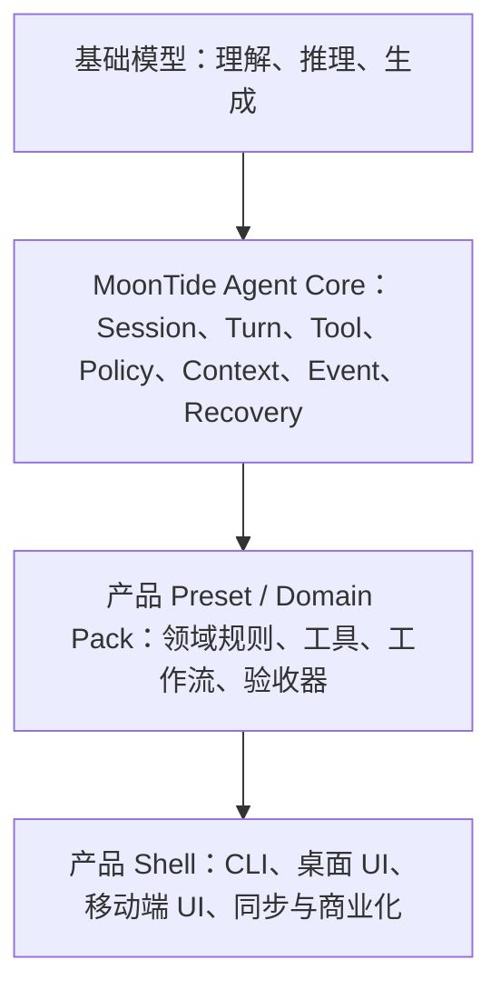

# Agent Runtime 与产品方向讨论

> **文档性质：** notes（方向记录，非实现 Spec、非近期交付承诺）  
> **状态：** 2026-08 讨论稿  
> **关联：** 当前 [`agent-core-design`](../../../crates/docs/agent-core.md) · [`agent-core-roadmap`](agent-core-roadmap.md) · [`platform-strategy`](../../product/platform-strategy.md) · [`spark`](../../product/spark.md) · [`vision`](../../product/vision.md)

## 1. 当前结论

MoonTide 要解决的不是某一个垂直领域中的单个问题，而是把用户的模糊意图推进为**可执行、可验证、可恢复的结果**。

Coding 是当前最适合作为验证场景的领域，因为文件变更、测试结果、工具轨迹和最终产物都相对可观察；它不是 Agent Runtime 的最终领域边界。

当前**不以 MoonTide Desktop coding 的完整垂直切片作为近期验收目标**。MoonTide Agent CLI 与 runtime 仍在建设中，现阶段先明确产品族与内核边界，避免过早为垂直产品扩展实现范围。

## 2. “元 agent”问题的定义

这里的“元 agent”不指一个专门管理其他 agent 的嵌套 agent。Agent Core 也不应知道“子 agent”存在；多 agent 编排属于组合层。

本记录中的“元 agent 问题”是指：Agent 不只生成答案，还要组织一条问题解决闭环：

1. 识别真正的目标、约束和未知项；
2. 将目标分解为可执行步骤，并选择合适的工具和信息来源；
3. 执行步骤，观察工具结果和环境变化；
4. 根据证据检查结果，而不是只根据语言流畅度判断完成；
5. 失败时恢复、重试、缩小范围或请求用户决策；
6. 持久化事实、产物和运行轨迹，使任务可继续、可审计、可迁移。

因此，基础模型主要提供理解、推理和生成能力；MoonTide Agent Runtime 负责把这些能力组织成受约束的执行系统。

## 3. 稳定内核与可变产品

未来产品不应复制一套完整 Agent，而应共享同一个 runtime contract：

### 3.1 Agent Core 负责什么

- 唯一的 Turn / Step 时序；
- `TurnConfig`、`resolveTurnConfig` 和决策回调；
- `resolveTurnContext`、`StreamFn`、`ToolExecutor` 等窄端口；
- `TurnEvent` protocol 与 TurnEvent bus；
- abort、队列、settlement、错误边界和恢复语义；
- 通过 Effect port 调用模型、工具和持久化能力；
- 为 UI、CLI、RPC、持久化和评测提供稳定事件与结果。

Core 不拥有产品领域事实，不直接决定某个垂直产品的工作流，也不把所有产品的 Session、Composer 或 Plugin Host 吸收进来。

### 3.2 产品层负责什么

产品层通过 Preset / Domain Pack 装配 runtime：

- 领域目标与术语；
- 领域工具与权限策略；
- 工作流、任务模板和默认行为；
- Context Composer 与 Session 事实如何进入本产品的 `LLMRequest`；
- 结果验收器、评分器和产品级 artifact；
- 面向用户的配置、交互和商业边界。

所以，产品之间共享的是 Agent Runtime 的执行契约，不是同一套界面、同一套任务模型或同一套产品流程。

### 3.3 CLI、桌面端与移动端的关系

CLI 是 Agent Runtime 的一个宿主和交互边界，不等于 Core 本身。桌面 Shell 可以直接调用 Core，也可以通过本地 RPC 调用；移动端不必嵌入完整的 coding runtime。

这一区分允许 MoonTide 继续向 native CLI / desktop runtime 演进，同时保留 TS harness、sidecar 和产品实验能力，而不把每一种产品形态都绑定到同一个进程模型。

## 4. 产品族的初步边界

这些方向仍是产品假设，不是当前实现承诺。

| 产品 | 主要职责 | 与 Agent Runtime 的关系 | 明确不做 |
|---|---|---|---|
| **MoonTide** | 桌面 Agent Shell；coding、project、research 等深度工作 | 完整 Agent Runtime 的主要宿主与验证场景 | 现阶段不把完整 coding 垂直切片作为近期验收目标 |
| **Spark / 随形** | 移动端 capture、draft、轻量协同、同步 | 共享身份、同步、spark 原语和 Turn 触发协议；按需把任务交给深度 runtime | 不做“手机版 MoonTide coding agent” |
| **Lyra** | 远期独立 Agent Harness 产品线候选 | 可复用 runtime 和 Preset 体系，但必须有独立用户和工作流 | 只做 MoonTide 的换名或换皮 |
| **Zephyr** | 跨 Agent 的会话、配置和产物迁移 | 依赖稳定的 Session、Artifact、TurnEvent 和互操作协议 | 不先做成另一个垂直执行 Agent |
| **Bruma** | 远期以事实、历史和上下文为中心的产品线候选 | 依赖 Session Event Log、provenance 和 Context Composer | 在 MoonTide 内作为模块名替代正式技术术语 |

Spark 当前应保持“capture + 轻 AI + sync 到桌面”的边界；深度任务由 MoonTide 或其他具备完整 runtime 的宿主承接。

## 5. 为什么基础模型变强后内核仍有价值

基础模型能力提升，会把更多“如何分析问题”的工作移入模型，但不会自动解决以下工程问题：

- 哪些工具可以调用，调用前是否需要授权；
- 哪些状态是事实，哪些只是上下文编译产物；
- 如何中断一次 Turn，以及恢复和重放 Session 事实；
- 如何判断任务已经完成；
- 如何把结果和证据交给 UI、同步服务或下一个 Agent；
- 如何在成本、隐私、延迟和可靠性之间做产品级取舍。

因此，MoonTide 的长期差异化不应表述为“拥有一个更聪明的模型”，而应表述为：

> 将不断增强的模型能力组织成可执行、可审计、可恢复、可迁移的工作系统。

## 6. 需要保持可证伪的假设

“元 agent”不能停留在宏大叙事。后续评测应分别验证：

- **问题识别：** 是否正确抽取目标、约束、未知项和验收标准；
- **计划质量：** 计划是否可执行，是否减少无效步骤；
- **执行结果：** 产物、测试、事实引用或用户目标是否达成；
- **过程可靠性：** 工具调用、权限、错误恢复和中断是否符合协议；
- **效率与成本：** token、工具次数、时延和人工介入是否可接受；
- **可追溯性：** 是否能从 Session / Artifact / TurnEvent 解释结果如何产生。

Coding 适合作为第一批验证任务，但评测目标应是上述通用闭环，不是把“coding 分数”误认为整个 Agent Runtime 的能力。

## 7. 当前非目标

- 现在为 Spark、Lyra、Zephyr、Bruma 同时设计完整实现；
- 把 Agent Core 扩展成包含所有 Session、Composer、Provider 和 Plugin Host 的“大平台”；
- 把“元 agent”实现成隐式的嵌套 agent 层；
- 在 MoonTide CLI 尚未完成前，以某个完整垂直产品切片作为整体架构验收；
- 因为产品愿景而提前改变现有 `Session Event Log`、`Context Composer`、`TurnEvent` 等正式技术边界。

## 8. 下一步

下一步不是启动所有垂直产品，而是形成一份 **Agent Runtime Contract**，明确三份边界：

1. Core 保证的 Turn / Event / Effect 语义；
2. Preset / Domain Pack 可以装配和改变的策略；
3. Shell 必须自己负责的 UI、同步、产品数据和商业边界。

完成这三份边界后，再用 MoonTide CLI 当前已有的最小任务流验证 runtime contract；这一步不等同于完成 MoonTide Desktop coding 垂直产品。
