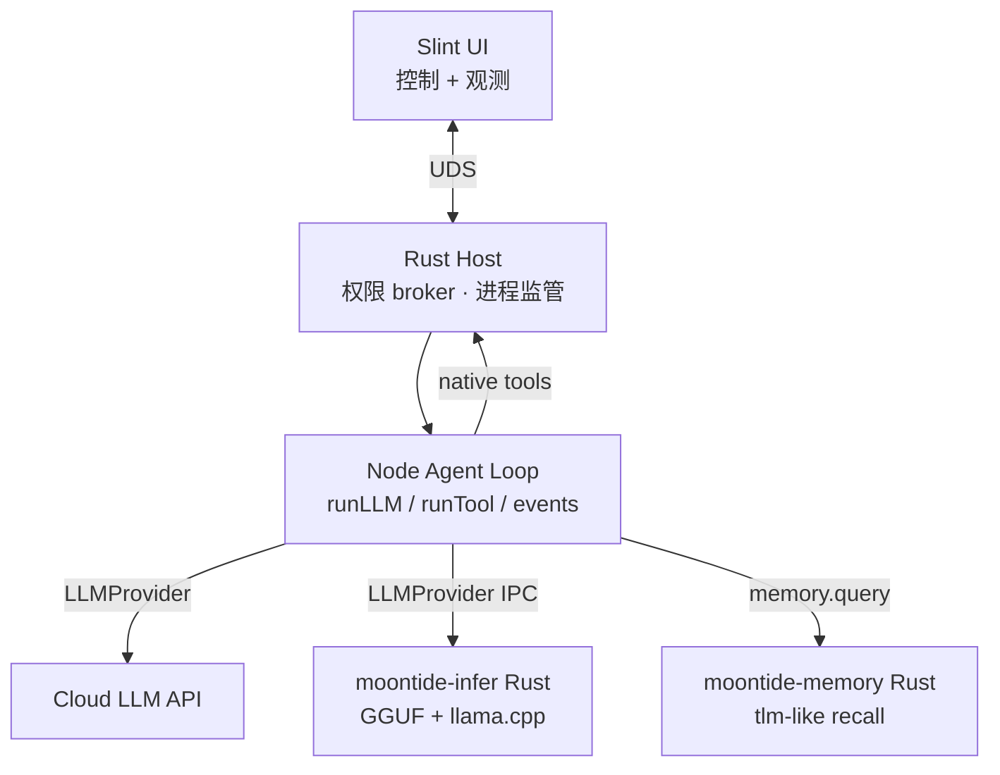

> 竞品 / 参考实现分析：[Kocoro](https://github.com/Kocoro-lab/Kocoro)（本地 agent runtime）与 [Shannon](https://github.com/Kocoro-lab/Shannon)（企业多 agent 编排）。  
> **非实现承诺** — 用于校准 MoonTide 多进程、sidecar、memory、router 等方向；不表示照搬其技术栈。

---

## 1. 是什么

| 项目 | 定位 | 开源范围 |
|------|------|----------|
| **Kocoro** | macOS-first 本地 AI cowork agent；`shan` CLI + daemon | Engine + daemon 开源；**Kocoro Desktop** GUI 闭源 |
| **Shannon** | 企业级多 agent 编排（Temporal、预算、WASI 沙箱） | 全栈开源；Docker 自托管 + Cloud SaaS |

关系：Kocoro 构建在 Shannon 生态上 — 本地 **执行面**（文件、终端、GUI、MCP）在 `shan` daemon；复杂编排、频道 SaaS、memory bundle 训练可走 **Shannon Cloud**。

主路径（生产）：

```text
Slack/LINE/… ──▶ Shannon Cloud ──WebSocket──▶ shan daemon (Go, macOS)
                                                  ├─ agent loop + local tools
                                                  ├─ memory sidecar (UDS)
                                                  └─ HTTP :7533 ◀ Desktop / scripts
```

---

## 2. 同心圆平台模型

[Wayland Zhang — Chapter 33](https://waylandz.com/ai-agent-book-en/chapter-33-building-on-the-harness-shanclaw/) 将 Kocoro 描述为在 **Harness（agent loop）** 之上的同心扩展：

| Ring | 内容 | 职责 |
|------|------|------|
| **1** | Named Agents | 多 persona：各自 instructions、memory、tools、model |
| **2** | Skills / Memory / Sessions | 可插拔能力；有界 memory；session 持久化 |
| **3** | Daemon / Scheduler / Watcher | Agent-as-a-service；cron / heartbeat / 文件 watcher |
| **4** | MCP / Cloud | 工具生态；重任务上云 delegate |

**关键 invariant：** 外圈 **additive**，内圈仍是同一 Harness loop — 不是每个 ring 重写 agent 内核。

---

## 3. 多语言 / 多进程分工

### 3.1 Kocoro 本地（单用户桌面）

| 组件 | 实现 | 职责 |
|------|------|------|
| **Agent loop + tools + daemon** | **Go** 单二进制 `shan` | 编排、HTTP API、WS、权限、MCP、session SQLite |
| **Memory recall** | **`tlm` sidecar** + Unix socket | 结构化情景 memory 查询；daemon supervise 生命周期 |
| **GUI / TCC 能力** | **Kocoro Desktop**（native，闭源） | UI；EventKit 日历等 |
| **Desktop ↔ daemon** | **反向 RPC**（UDS，length-prefixed JSON） | daemon 调 Desktop 的 Calendar API |
| **本地 LLM** | Ollama OpenAI-compatible client | 可选本地模型；非 direct GGUF |

Go module 地图（摘自 upstream `AGENTS.md`）：

```text
internal/agent      — core loop（compact、approval、watchdog、tool batch）
internal/daemon     — HTTP :7533、Cloud WS、routing、launchd
internal/tools      — file/shell/GUI/memory/MCP/cloud/…
internal/memory     — sidecar client/supervisor、bundle pull
internal/session    — JSON 持久化 + SQLite FTS
internal/permissions— shell 安全模型
internal/mcp        — MCP client/server
internal/skills     — skill registry、marketplace
```

**切进程的依据**（不是「每种语言一块业务」）：

- **Crash 域** — memory sidecar 挂掉不拖 daemon
- **权限域** — EventKit 必须在 .app；daemon 是子进程
- **依赖体积** — Playwright / 重 ML 不进主二进制
- **生命周期** — sidecar 可独立 restart、schema 升级

### 3.2 Shannon 企业自托管（多租户 / 服务器）

```text
Client → Gateway (Go) → Orchestrator (Go) → Agent Core (Rust) → LLM Service (Python) → Providers
              │                  │                    │                      │
              Auth/限流      Temporal 工作流      WASI 沙箱            MCP + agent loop
                              预算/复杂度路由      token 强制            Provider 抽象
```

| 语言 | 角色 | 典型理由 |
|------|------|----------|
| **Go** | 网关、编排、工作流 | 并发、RPC、长期运行服务 |
| **Rust** | 强制层、WASI 沙箱 | 安全边界、确定性资源 |
| **Python** | LLM 服务、Playwright | Provider SDK、快速迭代 |

**WASM 位置：** Shannon **Agent Core (Rust)** 的 WASI — **沙箱代码执行**，不是 LLM inference。

---

## 4. 值得细看的工程设计

### 4.1 Memory sidecar + implicit preflight

- Structured memory 在 **独立进程** `tlm`，经 **`~/.shannon/memory.sock`** 通信
- Daemon **`internal/memory`** 负责 spawn、readiness、restart、24h bundle pull
- **`memory_recall` tool** → sidecar query；未 ready 时降级 session search + `MEMORY.md`
- **Implicit preflight：** 主模型 turn 前，**小 tier helper** forced `tool_use` 生成 `QueryIntent` → sidecar → 注入 `<private_memory>` 块
- **Invariant：** `<private_memory>` **仅当 turn 有效** — 不写入 transcript、不进入 compaction summary；audit 只记 content-free 计数

### 4.2 Daemon 作为 integration hub

- Cloud 频道、Desktop、TUI、MCP、schedule **共用同一 Harness**
- Named Agents + 路由 precedence：session → thread → sender → agent → channel
- 本地 HTTP `POST /message` + SSE；能力通过 WS handshake **capability token** 协商

### 4.3 Agent loop 生产细节（`internal/agent`）

非 demo 级 loop，包含：

- Tool **并发安全**分组（只读 bash 可并行；metachar 强制串行）
- **三层 spill/budget** — 单结果 spill、turn 聚合 spill、跨 turn 持久 map
- **ValidationError** + loop detector — 防 tool 必填缺失导致死循环
- **Deferred tools** + BM25 `tool_search` — 控制 schema 体积
- **Interrupted turn auto-resume** — checkpoint + route pin + unattended 工具限制
- **Thinking blocks** — 跨 compact 保留；sync 上传前 strip

### 4.4 权限与 approval

- Shell：hard-block → deny → always-ask → allow → default
- High-risk 工具拒绝 persisted auto-approval
- Attended vs **unattended** 双 deny-list（schedule / IM / MCP 无 UI 时更严）

### 4.5 Native UI 与引擎分离

- 开源：**Go engine + daemon**
- 闭源：**Desktop** spawn daemon，`desktop_rpc/` 反向 RPC 补 TCC 能力
- Slint/MoonTide 现状是 sidecar **观测**；Kocoro 是 **控制面也走 socket**

---

## 5. 与 MoonTide 对照

| 维度 | Kocoro | MoonTide（现状 / 讨论方向） |
|------|--------|-------------------------|
| Agent loop | Go monolith (`internal/agent`) | Node/TS [`loop.ts`](../../../packages/agent/src/agent/loop.ts) |
| LLM seam | Provider 接口（Cloud gateway / Ollama） | [`runLLM`](../../../packages/llm/src/pipeline/runLLM.ts) → `LLMProvider` |
| UI | 闭源 native Desktop | 开源 Slint sidecar（tail JSONL + status） |
| 本地 LLM | Ollama 套壳 | 倾向 Rust direct GGUF（见 [edge-local-models.md](../llm/edge-local-models.md)） |
| Memory | `tlm` sidecar + UDS + cloud bundle | Session Event Log spec；episodic backlog |
| IPC | HTTP、WS、memory UDS、Desktop RPC | file watch；规划 NDJSON / UDS |
| 观测 | daemon SSE / WS events | Agent Event Log JSONL |
| Cloud | Shannon Cloud 深度绑定 | 多 vendor preset，无自建 cloud |
| 沙箱 | Shannon WASI（企业） | QuickJS / WASM scratch（规划） |

**不必学：** 整体迁 Go loop、绑 Shannon Cloud、Ollama 路径。  
**应该学：** sidecar 切法、memory preflight、daemon-as-service、loop 周围 production 厚度。

---

## 6. 对 MoonTide 的启发

### 6.1 架构原则

**① 按 crash / 权限 / 体积 / 生命周期切进程，不是按语言切功能**

Kocoro 本地主体是 **一个 Go 二进制**，只在 memory、Desktop RPC、Cloud 处拆进程。MoonTide 可保持 **Node loop**，但应新增：

```text
Node loop（编排）
  ├─ UDS → moontide-infer（Rust，GGUF）
  ├─ UDS → moontide-memory（Rust 或专用 recall 服务）
  └─ UDS ↔ Slint/Rust host（权限 UI、将来 Calendar 类能力）
```

**② Harness 单一；平台能力外圈 additive**

Named Agents、Skills、Daemon、MCP 不应重写 loop。MoonTide 应对齐：**Session Event Log 为事实层**，Composer / Router / Memory inject 为外圈。

**③ 三类 compute 分开**

| 类型 | MoonTide 对应 | 参考 Kocoro |
|------|-----------|-------------|
| 编排 | Node `agentLoop` | Go `internal/agent` |
| 推理 / memory 索引 | Rust `moontide-infer` + catalog GGUF | `tlm` + Ollama client（MoonTide **不**走 Ollama） |
| 沙箱短计算 | WASM / QuickJS scratch | Shannon WASI |

Infer **不要**进 WASM；沙箱 **不要**扛 GB 权重。

### 6.2 可落地的具体启发

| # | Kocoro 做法 | MoonTide 建议 | 关联 Spec / 模块 |
|---|-------------|-----------|------------------|
| 1 | Memory sidecar + daemon supervise | `moontide-memory` 独立进程；Node 只调 `memory.query` IPC | [context-backlog.md](../context/context-backlog.md)、[session-handoff.md](../session/session-handoff.md) |
| 2 | `<private_memory>` 当 turn 注入、不落 transcript | Composer 支持 **ephemeral inject block** + Manifest 审计 | 历史 [context-composer.md](../../archive/spec/context-composer.md) |
| 3 | Small-tier preflight before main LLM | Model Router v2：0.8B 本地做 intent / memory intent | [edge-local-models.md](../llm/edge-local-models.md)、历史 [llm-provider.md](../../archive/spec/llm-provider.md) §10 |
| 4 | `runLLM` 是唯一 LLM 出口 | 已实现 seam；cloud / local-direct 都走 `LLMProvider` | [`runLLM.ts`](../../../packages/llm/src/pipeline/runLLM.ts) |
| 5 | Tool spill 三层 budget | 对齐 tool artifact + prune；避免 `messages[]` splice 丢事实 | 历史 [context-composer.md](../../archive/spec/context-composer.md) |
| 6 | Deferred tools + search | 工具多时 schema 预算；与 Composer tool 解析一致 | 历史 [llm-input.md](../../archive/spec/llm-input.md) |
| 7 | Daemon HTTP + SSE 本地 API | 远期：MoonTide daemon 模式（IM / 自动化），不只 REPL | [runtime-multilang.md](runtime-multilang.md) |
| 8 | Desktop reverse RPC for TCC | Slint host UDS：审批 UI、系统 API broker | `ui/` Rust、`runtime-multilang.md` |
| 9 | Capability token on handshake | WS/IPC 版本协商；避免 UI 与 engine 耦合 | 历史 [agent-events.md](../../archive/spec/agent-events.md) 观测字段扩展 |
| 10 | Interrupted turn resume + route pin | Checkpoint + Session Log；多来源 session 串行 | 历史 [context-composer.md](../../archive/spec/context-composer.md) § Checkpoint |
| 11 | Content-free memory audit | `memory_preflight` 式 audit：只记 outcome/count，不记 query 正文 | 历史 [agent-events.md](../../archive/spec/agent-events.md) |
| 12 | 本地 LLM 仍走统一 provider 接口 | `local-direct` preset → Rust IPC，**不**在 loop 里绑 Ollama | [edge-local-models.md](../llm/edge-local-models.md) |

### 6.3 建议的 MoonTide 目标架构（综合 Kocoro + 前述讨论）



与 Kocoro **刻意不同**处：

- Loop 留 **Node**（MCP/npm/SDK 生态）
- 本地 infer 用 **direct GGUF**，非 Ollama
- UI **开源 Slint**，非闭源 Desktop
- 无强制 Shannon Cloud；可选 remote worker（Go，远期）

### 6.4 优先级建议（受 Kocoro 验证过的顺序）

| 优先级 | 项 | 理由 |
|--------|-----|------|
| **P0** | `LLMProvider` + Model Router 规则 | small+main 分层 |
| **P0** | Session / Event 事实层 | spill、inject、resume |
| **P1** | `moontide-infer` + **catalog pull**（无 local train） | 差异化；Kocoro bundle 同构 |
| **P1** | Memory sidecar 协议 | 情景 memory |
| **P2** | Cloud train 首发 `moontide/router-v1` | 用户 opt-in 下载 |
| **P3** | Daemon / Slint 控制面 UDS | 权限 UI |

### 6.5 模型 catalog pull（借 memory bundle 模式）

Kocoro 用户不 train memory index；daemon **pull bundle → sidecar 查询**。MoonTide 本地小模型采用同一产品形态：

| Kocoro | MoonTide |
|--------|-------|
| Cloud 训练 memory bundle | **MoonTide Cloud train** → GGUF catalog |
| `tlm` sidecar + UDS | `moontide-infer` + UDS |
| 24h bundle pull + sha256 | catalog pull + sha256 + `current` 指针 |
| 未 Ready → 降级 | infer 未 Ready → **cloud fallback** |

**明确不做：** 用户设备上 train（见 [edge-local-models.md](../llm/edge-local-models.md) §8）。用户 ability 仅为 **opt-in 下载 MoonTide 签名 catalog**（如 `moontide/router-v1`），非开放 HF 任意权重。

### 6.6 反模式（Kocoro 有、MoonTide 应慎学）

| 做法 | 风险 | MoonTide 态度 |
|------|------|-----------|
| 全栈绑 Cloud 才能用 memory bundle | 供应商 lock-in | Memory 本地 bundle 优先；cloud 训练可选 |
| 本地 LLM 仅 Ollama | 多一层、难 direct weight | Rust infer + catalog GGUF |
| 用户本地 train 小模型 | 硬件/support 成本 | **Cloud train only**；用户只 pull catalog |
| Go 重写整个 loop | 放弃 TS agent 生态 | 保持 Node loop |
| Desktop 闭源 | 社区无法贡献 UI | Slint 开源 |
| Shannon 式 microservices 上桌面 | 运维过重 | 桌面 = 少量 sidecar，非 5 容器 |

---

## 7. 延伸阅读

| 资源 | 内容 |
|------|------|
| [Kocoro README](https://github.com/Kocoro-lab/Kocoro) | Daemon、memory、Named Agents、工具体系 |
| [Kocoro AGENTS.md](https://github.com/Kocoro-lab/Kocoro/blob/main/AGENTS.md) | Module map、invariants |
| [Shannon README](https://github.com/Kocoro-lab/Shannon) | 企业多语言微服务、WASI、Temporal |
| [Chapter 33 — Kocoro](https://waylandz.com/ai-agent-book-en/chapter-33-building-on-the-harness-shanclaw/) | 同心圆平台模型 |
| [edge-local-models.md](../llm/edge-local-models.md) | MoonTide catalog pull、Cloud train only、local infer |
| [runtime-multilang.md](runtime-multilang.md) | MoonTide 多语言进程边界讨论 |
| [session-handoff.md](../session/session-handoff.md) | 跨 agent 上下文与 memory 指针 |

---

## 8. 讨论来源

2026-08-01：Kocoro/Shannon 多语言分层架构调研；与 MoonTide edge infer、sidecar、情景 memory 讨论交叉对照。
2026-08-01：补充 **Cloud train + catalog pull only**、不做用户本地 train（见 [edge-local-models.md](../llm/edge-local-models.md) §8）。
