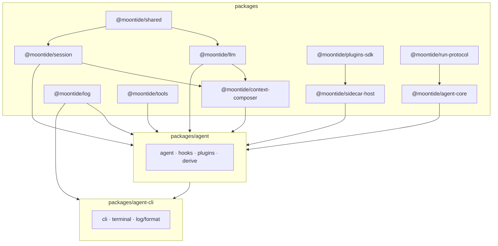

> **状态：** §17 完成（2026-08）— 根无 `src/` monolith；域包在 `packages/*`。
> **§18 主轨完成** — `@moontide/run-protocol` · `@moontide/agent` · `@moontide/agent-cli`（DR-B `@moontide/context` 可选 defer，见 [agent-harness-cli-split](agent-harness-cli-split.md) §3.2）
> **相关：** [agent-harness-cli-split](agent-harness-cli-split.md) · [agent-core-roadmap](agent-core-roadmap.md) §12 · [architecture-remediation](architecture-remediation.md)

Run 相关五包 README：[`run-protocol`](../../../packages/run-protocol/README.md) · [`agent-core`](../../../packages/agent-core/README.md) · [`llm`](../../../packages/llm/README.md) · [`agent`](../../../packages/agent/README.md) · [`agent-cli`](../../../packages/agent-cli/README.md)

---

## 依赖图（简）



---

## 包一览

| 包 | 路径 | 职责 |
|----|------|------|
| **@moontide/agent-cli** | `packages/agent-cli/` | CLI 产品：REPL、slash、statusline、stderr/JSONL **终端渲染** |
| **@moontide/agent** | `packages/agent/` | Harness：`agent/`、hooks、plugins、instruction-state、RunEvent→AgentEvent derive |
| **@moontide/agent-core** | `packages/agent-core/` | 时序内核：`runLoop`、RunEvent bus、resolveRunConfig / resolveTurnContext |
| **@moontide/run-protocol** | `packages/run-protocol/` | RunEvent / RunConfig protocol |
| **@moontide/shared** | `packages/shared/` | utils、constants、errors、storage 原语 |
| **@moontide/llm** | `packages/llm/` | protocol、models、provider、routing、adapters、`runLLM` |
| **@moontide/session** | `packages/session/` | Session Item Log、stores、io、transform |
| **@moontide/context-composer** | `packages/context-composer/` | `composeContext`、budget、compaction、manifest |
| **@moontide/log** | `packages/log/` | Agent Event hub、JSONL 持久化、enrich（**无**终端渲染） |
| **@moontide/tools** | `packages/tools/` | Tool registry、builtins、extensions（code-repl、deep-research、work-mem） |
| **@moontide/plugins-sdk** | `packages/plugins-sdk/` | `defineSidecarPlugin`、sidecar hook/tool 类型 |
| **@moontide/sidecar-host** | `packages/sidecar-host/` | manifest、sidecar attach、stdio IPC、`run-sidecar` runner |
| **@moontide/evals** | `packages/evals/` | Harness feature A/B eval（dev-tool；依赖 `@moontide/agent`） |

**文档别名：** 设计笔记中的 **plugin-host** 指 sidecar 加载与 attach；实现包名为 **`@moontide/sidecar-host`**（见 [plugin-host.md](plugin-host.md) 文首说明）。

---

## 路径对照（迁移后）

| 原 monolith `src/` | 现位置 |
|--------------------|--------|
| `src/utils/` · `constants/` · `errors/` · `storage/` | `@moontide/shared` |
| `src/llm/` | `@moontide/llm` |
| `src/session/` | `@moontide/session` |
| `src/context/composer/` | `@moontide/context-composer` |
| `src/log/event-hub` · `persist` · `jsonl` | `@moontide/log` |
| `src/log/format/` · `modes` · `stderr-renderer` | `packages/agent-cli/src/log/` |
| `src/tools/builtins/` · `extensions/` | `@moontide/tools` |
| `src/tools/register-defaults`（薄包装） | `packages/agent/src/tools/` |
| `src/plugins/host/` | `@moontide/sidecar-host` |
| `src/plugins/sdk/` | `@moontide/plugins-sdk` |
| `src/agent/` · `instruction-state/` · `plugins/` · `context-inspect/` | `packages/agent/src/` |
| `src/cli/` · `terminal/` · `i18n/` | `packages/agent-cli/src/` |
| `src/plugins/builtin/log-sync/` | **已删除**（M6）— Agent Event 改 RunEvent → [`run-event-derive.ts`](../../../packages/agent/src/log/run-event-derive.ts) |

---

## Agent Event 派生（M6+）

| 时期 | 机制 | 状态 |
|------|------|------|
| Legacy | `sessionItem` hook → `plugins/builtin/log-sync/` | **已删除**（M6） |
| 现行 | RunEvent bus → `createRunEventDeriveListener`（`packages/agent/src/log/run-event-derive.ts`） | **生产路径** |

Hook manifest **不再**注册 `sessionItem/agent-event-derive`（见 `tests/conformance/hook-manifest.test.ts`）。集成不变量见 `tests/log-sync.test.ts`（文件名保留；测 RunEvent derive 路径）。

---

## 硬边界（architecture-boundaries）

- `@moontide/session` · `@moontide/context-composer` · `@moontide/shared`：零 `config` / 零 `agent/`
- `@moontide/agent-core` · `@moontide/run-protocol`：零 session / composer / tools / sidecar
- `@moontide/agent`：零 `terminal/` · `log/format/` · `errors/report`
- `@moontide/agent-cli`：零 `@moontide/agent-core` direct import
- `@moontide/sidecar-host` · `@moontide/plugins-sdk`：零 `agent/`
- 根目录无 `src/`（§17 门禁）

---

## 命令

```bash
pnpm dev                 # packages/agent-cli REPL（tsx + tsconfig.dev.json）
pnpm run test:conformance  # 规范单测（tests/conformance/）
pnpm run check           # lint + typecheck(core+app) + test
pnpm run build           # build:core + packages/agent-cli dist
```

Workspace 根：`moontide-workspace`（`package.json`）；CLI 应用包名：`@moontide/agent-cli`（`packages/agent-cli/package.json`）。

---

## Dev 启动

Monorepo 下 `pnpm dev` 的 cwd 为 `packages/agent-cli`，与仓库根目录分离。产品层通过 [`bootstrap-env.ts`](../../../packages/agent-cli/src/bootstrap-env.ts) 在 `main.ts` 最早阶段完成：

| 步骤 | 行为 |
|------|------|
| 查找 workspace | 向上读取 `pnpm-workspace.yaml` |
| 加载 `.env` | 先 workspace 根、后 `packages/agent-cli/`（后者覆盖） |
| 默认 workdir | 未设 `MOONTIDE_WORKDIR` 时设为 workspace 根（非 `packages/agent-cli` cwd） |
| tsx 路径 | 根 [`tsconfig.dev.json`](../../../tsconfig.dev.json) → `packages/*/src`（与 Vitest alias 应对齐） |
| 工具装配 | `setupToolsPorts()` **先于** `getAgentRuntime()`（REPL 与 `runAgent`） |

**配置约定：** `.env` 放仓库根（与 `.env.example` 同级）；`config.ts` 必须在 `bootstrap.ts` 之后 import（workdir 在模块加载时冻结）。

**规范单测：** [`tests/conformance/`](../../../tests/conformance/) — 含 `dev-startup.test.ts`（bootstrap / tools 顺序 / resolveRoute / 冷启动 `runAgent`）、`package-exports.test.ts`（wildcard export 与 Node/tsx 运行时解析）。pre-commit 跑 `pnpm run test:conformance`。

**生产路径：** `pnpm --filter @moontide/agent-cli run build` 后 `pnpm start`（`node dist/main.js`），经 workspace `exports` 解析各 `@moontide/*` 包，不经过 `tsconfig.dev.json`。

---

## §18 与可选 DR-B

详计划：[`agent-harness-cli-split.md`](agent-harness-cli-split.md) · 执行：根 [`TODO.md`](../../../TODO.md) §18

| 轨道 | 状态 |
|------|------|
| DR-A `@moontide/run-protocol` | done |
| §18 主轨 agent · agent-cli | done |
| DR-B `@moontide/context`（合并 session + composer） | **可选 defer**（§3.2 go/no-go） |

### import 链（现行）

```
@moontide/agent-cli → @moontide/agent → @moontide/agent-core → @moontide/run-protocol
                              ↘ @moontide/llm · session · context-composer · tools · …
```

| 项 | 现行 |
|----|------|
| `pnpm dev` filter | `@moontide/agent-cli` |
| harness import | `@moontide/agent` |
| context import | `@moontide/session` · `@moontide/context-composer`（DR-B 未执行则不变） |
| run 类型 | `@moontide/run-protocol` |
