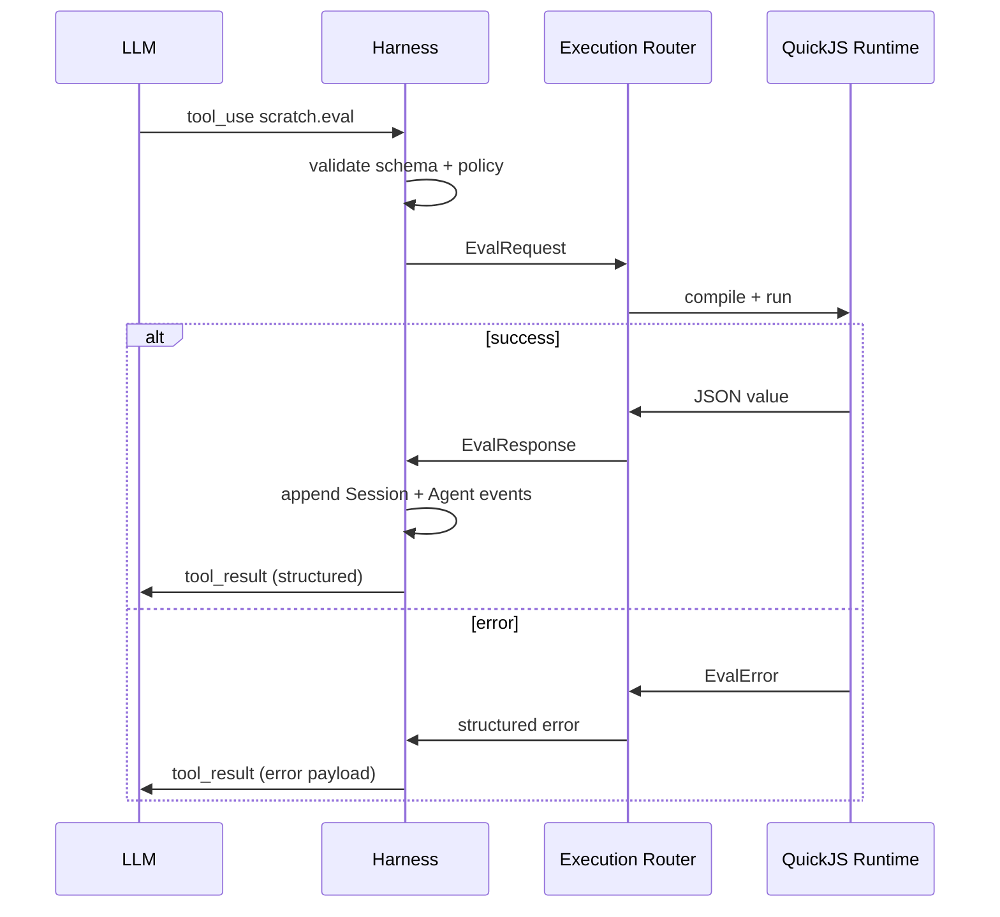
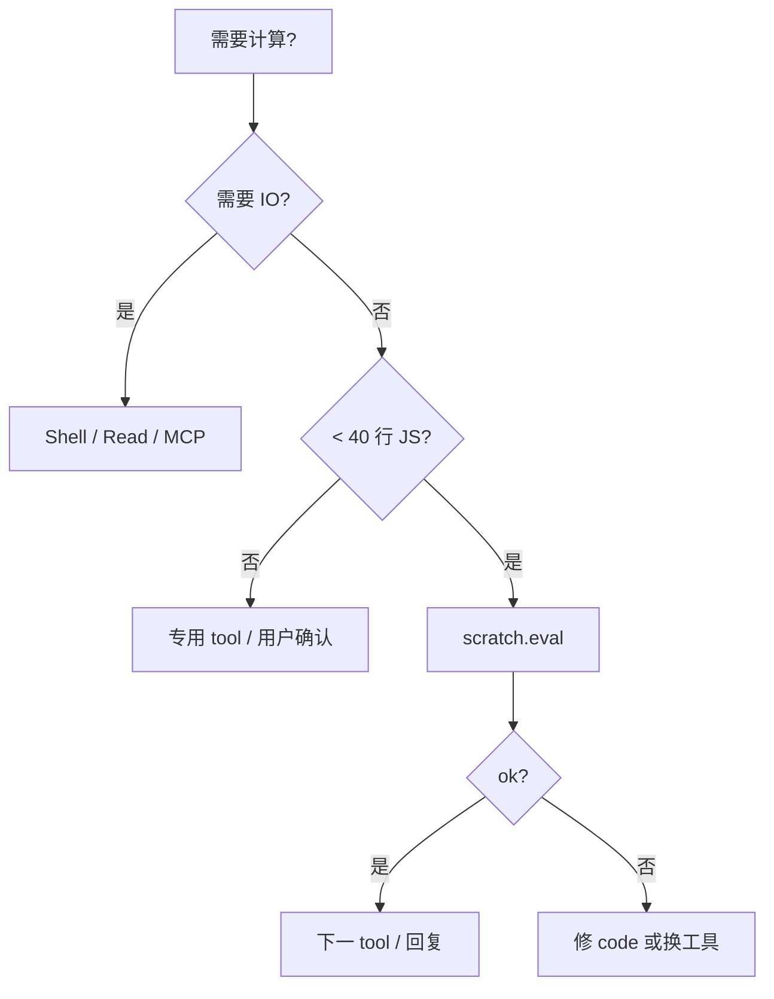

# Feature Doc：Executable Scratchpad

> **状态：** Backlog / 特性候选  
> **关联：** [`runtime-multilang.md`](runtime-multilang.md)（WASM 沙箱定位）、[`context-composer.md`](../spec/context-composer.md)（Session Event Log）、[`agent-events.md`](../spec/agent-events.md)（Agent Event Log）  
> **工具名：** `scratch.eval`  
> **非实现承诺** — 排期与 MVP 边界以本文 §16–§18 为准，落地前需与 Harness / Tool Definitions 对齐。

---

## 1. 特性概述

**Executable Scratchpad** 为 Ocula Agent 提供一种 **短生命周期、沙箱化、可重复执行** 的 JavaScript 计算面，通过单一工具 **`scratch.eval`** 暴露给模型。

Agent 在以下场景不必为一次性逻辑新建文件、调用 Shell、或请求用户手动计算：

- 正则匹配与提取
- 路径拼接、规范化与 glob 映射
- JSON / 文本的结构化变换
- 为后续 tool call 构造参数
- 对 tool result 做轻量过滤与聚合

Scratchpad **不是** REPL、不是项目脚本 runner、不是持久化 notebook。它是 **Harness 内的 ephemeral compute cell**：输入代码 + 上下文 → 输出结构化结果 → 立即销毁运行时状态（除可选 session-scoped scratch state，见 §10）。


**一句话定义：**  
> `scratch.eval` 是 Agent 在对话 turn 内使用的 **受控 JavaScript 沙箱**，用于完成小步、确定性、可审计的数据与字符串计算，避免 Shell 副作用与文件污染。

---

## 2. 背景与问题

### 2.1 现状：Agent 的「小计算」路径低效

Coding Agent 在真实任务中频繁遇到 **体量小但逻辑具体** 的计算需求，例如：

| 需求类型 | 常见 Agent 做法 | 问题 |
|----------|-----------------|------|
| 正则提取 log 字段 | 写临时 `.js` / `.py` 文件再 Shell 执行 | 污染工作区；文件生命周期难管理 |
| 路径映射 | 在 assistant 文本里手算或猜测 | 易错；不可复现；无结构化输出 |
| 构造 tool 参数 | 多轮 read + grep + 人工拼接 JSON | token 浪费；延迟高 |
| 过滤 tool result | 把整段 stdout 塞回 context | context 膨胀；模型二次解析不稳定 |
| 单位 / 日期 / 数值转换 | 依赖模型心算 | 幻觉；边界 case 漏判 |

这些操作 **不值得** 占用 Shell tool（进程 spawn、环境依赖、注入面）或 **不值得** 为单次逻辑创建源码文件。

### 2.2 与 Shell / 文件工具的职责冲突

Ocula 架构倾向 **program + argv[]** 而非自由 Shell 字符串（见 [`runtime-multilang.md` §2.2](runtime-multilang.md)）。但许多「小计算」本质上是 **纯函数**：

```text
f(inputs) → value
```

把纯函数强行映射到 Shell 或文件 IO，会导致：

1. **副作用域扩大** — 临时脚本残留、chmod、路径错误
2. **可观测性下降** — Shell 输出是非结构化文本
3. **安全面扩大** — 即使「只跑 node -e」，仍继承 Node 进程权限与模块解析
4. **Agent 策略失焦** — 模型把「算一下」和「改仓库」混在同一工具链

### 2.3 与 WASM / 插件战略的对齐

[`runtime-multilang.md` §4.4](runtime-multilang.md) 将 WASM 定位为：

- 第三方插件
- 不可信代码沙箱
- Parser / Transform / Rule Engine

Executable Scratchpad 是 **第一类 party（Agent 自身）** 对同一能力的内部消费：  
在 MVP 阶段用 **QuickJS（可编译为 WASM）** 提供 JS 语义，未来可统一到 Component Model，但不阻塞 MVP。

### 2.4 用户可见痛点（归纳）

1. Agent 为 5 行逻辑创建临时文件 — 用户 diff 噪音
2. Agent 在回复中「心算」JSON — 用户难以验证
3. 同一 session 内重复相同小计算 — 无 session-scoped 缓存
4. 出错时只有 stderr 文本 — 难以区分语法错、超时、策略拒绝

Scratchpad 针对以上痛点，提供 **专用、可审计、结构化** 的计算通道。

---

## 3. 目标与非目标

### 3.1 目标

| ID | 目标 | 说明 |
|----|------|------|
| G1 | **Ephemeral JS 执行** | 单次 `scratch.eval` 调用在沙箱内完成，默认不写入工作区 |
| G2 | **结构化 I/O** | 输入输出均为 JSON-serializable；与 Tool Definitions schema 对齐 |
| G3 | **确定性优先** | 同 code + inputs + scratch state → 同 result（Modulo 浮点） |
| G4 | **低延迟** | 冷启动 P99 < 50ms（MVP 桌面目标）；热路径复用 runtime 实例 |
| G5 | **可观测** | 每次 eval 写入 Agent Event Log（audit + trace）；可选 metrics |
| G6 | **安全默认** | 无网络、无 FS、无 native 模块；CPU / 内存 / 时间配额 |
| G7 | **Agent 可组合** | 输出可直接作为下一 tool 的 input；支持 `bindings` 注入 |
| G8 | **Session scratch state** | 可选键值状态，供同 session 多轮 eval 共享（见 §11） |

### 3.2 非目标（MVP 及近期）

| ID | 非目标 | 理由 |
|----|--------|------|
| NG1 | **通用 Shell 替代品** | 长命令、git、包管理仍走现有 Shell / program 工具 |
| NG2 | **持久化 .js 文件生成** | 不默认写盘；用户若需脚本应显式用 Write / 编辑工具 |
| NG3 | **完整 Node.js 兼容** | 无 `require`、无 npm、无 `fs`/`net`/`child_process` |
| NG4 | **用户-facing REPL UI** | 无独立 Scratchpad 面板（远期 MoonTide 可另议） |
| NG5 | **任意语言** | MVP 仅 JavaScript；Python/WASM 组件为 Phase 3+ |
| NG6 | **LLM 内嵌代码执行** | 不在 Provider API 侧执行；仅在 Ocula Harness |
| NG7 | **跨 session 持久状态** | scratch state 不 survive session；不替代 Artifact Store |
| NG8 | **替代 Context Composer** | 不 inline 大段 eval 历史进 `LLMRequest`；结果摘要进对话 |

---

## 4. 用户与 Agent 场景

### 4.1 场景 A：正则提取

**触发：** Agent 从 tool result 或 user 粘贴文本中提取字段。

```javascript
// code（示意）
const { text, pattern } = inputs;
const re = new RegExp(pattern, 'g');
const matches = [...text.matchAll(re)].map(m => m[1] ?? m[0]);
return { matches, count: matches.length };
```

**输入 bindings：**

```json
{
  "text": "error: auth failed id=abc123 retry=2",
  "pattern": "id=([a-z0-9]+)"
}
```

**价值：** 避免 `grep -P` 跨平台差异；输出 `{ matches, count }` 可直接喂给下一 tool。

### 4.2 场景 B：路径映射与规范化

**触发：** 将 user 口语路径转为 workspace 相对路径或统一分隔符。  
**code 要点：** `paths.map(p => p.replace(/\\/g,'/'))` → `{ normalized: unique }`。  
**价值：** 减少 Windows / macOS 路径风格失误。

### 4.3 场景 C：构造 tool 参数

**触发：** 合并多步 read 的结构化信息，生成单次 tool call 的 input。  
**code 要点：** 返回 `{ program: 'git', args: ['diff', '--', ...paths] }`。  
**价值：** 中间推理可验证；符合 program + argv[] 方向。

### 4.4 场景 D：tool result 轻量变换

**触发：** Shell / MCP 返回大 JSON，Agent 只需子集。  
**code 要点：** `payload.items.filter(...).map(...)` → 小对象。  
**价值：** 缩小回灌 context；变换逻辑留在 eval 的 `code` 供 audit。

### 4.5 场景 E：数值 / 单位 / 日期转换

**触发：** 配置解析、版本号比较、ISO 日期差。  
**code 要点：** 版本比较、单位换算、日期 parse — 显式 JS 替代模型心算。  
**价值：** 降低算术幻觉；边界 case 可测。

### 4.6 场景 F：Session 内累积状态

**触发：** 多轮 eval 共享计数器或聚合 map（见 §10 `scratch.state`）。  
**code 要点：** `scratch.get/set` 累加计数；返回当前快照。  
**价值：** 避免重复传输完整历史 inputs；state 受 128 KiB 配额限制。

### 4.7 场景 G：Agent 策略 — 「先算再调 tool」

推荐策略（§10）：

```text
1. 若逻辑 < ~40 行、无 IO → 优先 scratch.eval
2. 若需读文件 → 先 read，再 scratch 变换 result
3. 若需改仓库 → 禁止 scratch；走 Write / patch
4. 若需网络 → 走专用 connector，不走 scratch
```

### 4.8 反例场景（应拒绝或引导）

| 场景 | 正确处理 |
|------|----------|
| 下载 URL 内容 | 拒绝；提示用 HTTP / MCP tool |
| 读取 `.env` | 拒绝；提示用 read_file（带 audit） |
| 执行 `git commit` | 拒绝；走 Shell / git tool |
| 1000 行数据处理 | 建议 Artifact + 分批；或专用 worker |

---

## 5. 产品行为

### 5.1 工具可见性

- `scratch.eval` 注册于 **Tool Definitions**（`tools/`），与 Shell、Read、Write 同级
- 默认 **对 coding agent 启用**；可通过 Instruction State 或 env 关闭
- Tool description 需明确：纯计算、无 IO、有超时

### 5.2 调用生命周期



### 5.3 与用户工作区的关系

| 行为 | 是否允许 |
|------|----------|
| 读取 workspace 文件 | **否**（MVP） |
| 写入 workspace 文件 | **否** |
| 读取 `inputs` / `bindings` | **是** |
| 读取 session scratch state | **是**（可选） |
| 修改 scratch state | **是**（受配额） |

Agent **不应** 向用户声称 Scratchpad「已修改某文件」；任何持久化变更必须经 Write / patch 工具。

### 5.4 失败语义

| 失败类型 | 用户 / Agent 可见 | 是否 retry |
|----------|-------------------|------------|
| 语法错误 | `error.kind: SyntaxError` + 行列 | Agent 可修正 code |
| 运行时异常 | `error.kind: RuntimeError` + message | 可 retry |
| 超时 | `error.kind: Timeout` | 可拆分逻辑 |
| 内存超限 | `error.kind: ResourceLimit` | 应缩小 inputs |
| 策略拒绝 | `error.kind: PolicyViolation` | 换工具 |
| 输出不可序列化 | `error.kind: NonSerializableReturn` | 改 return 值 |

所有失败 **不** 导致 Harness crash；错误作为正常 tool_result 回灌。

### 5.5 与 Context / 多 turn

- `tool_result` 进 Session Event Log（大输出走 Artifact 阈值，与现有 tool 一致）
- scratch state **不** inline 进 system prompt；Compaction 可摘要 eval 历史（Phase 4 Structured IR）
- 每次 eval 默认无跨 turn 局部变量；仅 `scratch.state` 持久于 session store

---

## 6. 执行模型

### 6.1 语言与运行时

| 项 | MVP 选择 | 说明 |
|----|----------|------|
| 语言 | **JavaScript（ES2020 子集）** | Agent 训练语料丰富；JSON 原生 |
| 引擎 | **QuickJS** | 轻量、可嵌入 Rust、可编译 WASM |
| 部署 | Rust crate 内嵌；可选 `quickjs-wasm` 路径 | 与 Execution Router 同进程（MVP） |
| 模块系统 | **无** | 禁止 `import` / `require` |
| 异步 | **同步 MVP** | 无 `async/await`、无 Promise 微任务队列（Phase 2 评估） |

### 6.2 执行形态

每次 eval 采用 **IIFE 包装**：

```javascript
(function (inputs, scratch, helpers) {
  // user code body — 必须 return 或最后一表达式
  // ...
})(inputs, scratch, helpers);
```

- `inputs`：来自 tool call 的 `bindings`（只读对象）
- `scratch`：session state 接口（§10）
- `helpers`：白名单内置函数（§6.4）

User code 由 Agent 提供在 `code` 字段；Harness **不** 自动包裹 `return`，若 body 无 return 则取 IIFE  completion value。

### 6.3 资源配额（MVP 默认）

| 配额 | 默认值 | 可配置 |
|------|--------|--------|
| wall timeout | 1000 ms | env / Instruction |
| max code length | 16 KiB | 是 |
| max input JSON size | 256 KiB | 是 |
| max output JSON size | 64 KiB | 是 |
| max scratch state | 128 KiB / session | 是 |
| memory soft limit | 16 MiB | 是 |

超限 → `ResourceLimit` 或 `Timeout`；Router 强制终止 isolate。

### 6.4 白名单 helpers（MVP）

| 名称 | 签名 | 说明 |
|------|------|------|
| `helpers.atob` | `(s: string) => string` | base64 decode |
| `helpers.btoa` | `(s: string) => string` | base64 encode |
| `helpers.jsonParse` | `(s: string) => unknown` | 安全 parse，抛 RuntimeError |
| `helpers.jsonStringify` | `(v: unknown, space?: number) => string` | 限深限长 |
| `helpers.clamp` | `(n, min, max) => number` | 数值 |
| `helpers.hashFNV1a` | `(s: string) => string` | 非加密 hash，用于 dedupe |

**禁止：** `eval`、`Function` 构造器（二次 eval）、`Proxy`（Phase 2 再评估）、`Atomics`、wasm memory。

### 6.5 确定性与 WASM 路径

- 不暴露 `Date.now()` / `Math.random()`（MVP）；Phase 2 可由 Harness 注入 `seededRandom`
- 浮点遵循 IEEE-754；跨平台可能有 1 ULP 差异
- QuickJS 可编译为 WASM，与 native backend 共用 EvalRequest ABI；MVP 仅 Rust 内嵌

---

## 7. Tool API

### 7.1 工具元数据

```json
{
  "name": "scratch.eval",
  "description": "Run sandboxed JavaScript for small deterministic transforms (regex, path mapping, JSON filter). No filesystem or network. Returns JSON-serializable value.",
  "input_schema": { "$ref": "#/ScratchEvalRequest" }
}
```

### 7.2 Request Schema

```typescript
/** scratch.eval 请求 */
export interface ScratchEvalRequest {
  /** 要执行的 JS 函数体（IIFE 内层 body，非完整文件） */
  code: string;

  /** 注入的只读变量，映射为 runtime 的 `inputs` */
  bindings?: Record<string, unknown>;

  /** 可选：期望返回 JSON Schema（仅 audit / 校验 hint，MVP 不强制 validate） */
  expect?: {
    description?: string;
    schema?: Record<string, unknown>;
  };

  /** 执行选项 */
  options?: ScratchEvalOptions;
}

export interface ScratchEvalOptions {
  /** 覆盖默认 timeout ms */
  timeoutMs?: number;

  /** 是否允许读写 session scratch state；默认 true */
  useScratchState?: boolean;

  /** eval 标识，便于日志关联；默认由 Harness 生成 */
  label?: string;
}
```

**示例：**

```json
{
  "code": "const re = new RegExp(inputs.pattern, 'g'); return [...inputs.text.matchAll(re)].map(m => m[1]);",
  "bindings": {
    "text": "id=foo id=bar",
    "pattern": "id=(\\w+)"
  },
  "options": { "label": "extract-ids", "timeoutMs": 500 }
}
```

### 7.3 Response Schema（成功）

```typescript
export interface ScratchEvalSuccess {
  ok: true;

  /** 返回值，必须 JSON-serializable */
  value: unknown;

  /** 诊断信息 */
  meta: {
    durationMs: number;
    /** 序列化后的 output 字节数 */
    outputBytes: number;
    /** 是否 mutates scratch state */
    scratchMutated: boolean;
    engine: "quickjs";
    engineVersion: string;
  };
}
```

### 7.4 Response Schema（失败）

```typescript
export type ScratchEvalErrorKind =
  | "SyntaxError"
  | "RuntimeError"
  | "Timeout"
  | "ResourceLimit"
  | "PolicyViolation"
  | "NonSerializableReturn"
  | "InternalError";

export interface ScratchEvalFailure {
  ok: false;
  error: {
    kind: ScratchEvalErrorKind;
    message: string;
    /** 语法错时可带行列 */
    location?: { line: number; column: number };
    /** 运行时 stack（截断） */
    stack?: string;
  };
  meta: {
    durationMs: number;
    engine: "quickjs";
  };
}
```

### 7.5 统一 tool_result 包装

Harness 将 success / failure **均** 作为 JSON 字符串或 structured block 写入 `tool_result`（与现有 tool 管道一致）。Agent Event Log `trace/tool_result` 存 `{ toolName: "scratch.eval", body, charCount }`。

### 7.6 Schema 版本

- Request / Response 带 **`schemaVersion: 1`**（MVP）
- 破坏性变更递增；Router 拒绝未知 major version

---

## 8. Runtime 架构：Rust Execution Router

### 8.1 定位

**Execution Router** 是 Rust Host 内的 **计算请求路由与沙箱生命周期管理器**。Scratchpad 是其 **第一个内置 backend**；未来可注册 WASM Component、Python micro-eval 等。

```text
┌─────────────────────────────────────────┐
│ Node.js Harness (agent loop)            │
│  Tool Definitions · scratch.eval handler   │
└──────────────────┬──────────────────────┘
                   │ IPC / napi / sidecar RPC
┌──────────────────▼──────────────────────┐
│ Rust Execution Router                   │
│  · policy check                         │
│  · quota / timeout                      │
│  · runtime pool                         │
│  · scratch session store                │
└──────────────────┬──────────────────────┘
                   │
         ┌─────────▼─────────┐
         │ QuickJS Backend   │
         │ (isolate per eval │
         │  or pooled)       │
         └───────────────────┘
```

### 8.2 模块划分（建议 crate 布局）

| 模块 | 职责 |
|------|------|
| `execution_router::Router` | 对外 `eval(req) -> EvalOutcome` |
| `execution_router::policy` | 代码模式扫描、禁用 API 列表 |
| `execution_router::pool` | Runtime 实例池化、warm start |
| `execution_router::scratch_store` | Session-scoped KV |
| `execution_router::backends::quickjs` | QuickJS 嵌入 |
| `execution_router::metrics` | 延迟、失败率 histogram |

### 8.3 与 Node Harness 的边界

**推荐（MVP）：** Node agent loop 通过 **napi-rs / sidecar RPC** 调用 Router，不在 Node 内嵌 vm2 — 与多语言 Runtime 战略一致，统一 audit 点。

### 8.4 Runtime 池化

| 策略 | 说明 |
|------|------|
| **Pool size** | 默认 = min(4, CPU cores) |
| **Isolate 复用** | 同一 pool slot 连续服务多 eval；每次 eval 后 reset globals（保留 scratch store 句柄） |
| **Contamination** | eval 后清理由 QuickJS 新 context 或 `JS_RunGC` + 清 global |
| **Crash 隔离** | 单 eval panic 仅废掉当前 slot，不拖垮 Host |

### 8.5 Policy 层

Router 在 compile 前 / 运行中检查：

- 禁止 identifier 访问 `process`、`globalThis` 上非常规属性（MVP：冻结 global）
- 代码长度、嵌套深度（可选 AST walk）
- 静态 regex：`/\bimport\s|\brequire\s|\bfetch\s|\bXMLHttpRequest\b/`

违规 → `PolicyViolation`，不启动执行。

### 8.6 错误映射

QuickJS 异常 → 统一 `ScratchEvalFailure`；内部 Rust error → `InternalError`（带 correlation id，message 对用户 sanitized）。

---

## 9. Agent 策略

### 9.1 Instruction State 建议片段

```markdown
## scratch.eval 使用准则

- 用于纯计算：正则、路径、JSON 变换、构造 program+args。
- 禁止：网络、文件、Shell、超过 40 行复杂逻辑。
- 优先返回小 JSON 对象，勿返回长字符串。
- 失败时阅读 error.kind，SyntaxError 修正 code，Timeout 拆分或缩小 inputs。
- 需要持久化到仓库的脚本，使用 Write 工具，不要用 scratch。
```

### 9.2 决策树



### 9.3 编排与模型假设

- Tool description 含 **3 正例 + 2 反例**；失败摘要进 recent tail，不 expand 完整 code history
- 典型链：`read_file → scratch 过滤 → write`；`grep → scratch 构造 args → Shell`
- 模型应能写 ES2020 子集；弱模型 Instruction 限制为 bindings + helpers

---

## 10. 状态模型

### 10.1 Scratch Session Store

**Scope：** 单个 `sessionId`  
**Storage：** 内存 + 可选 `.ocula/sessions/<sessionId>/scratch-state.json`（Phase 2 持久化）

```typescript
interface ScratchStateAPI {
  get(key: string): unknown | undefined;
  set(key: string, value: unknown): void;
  delete(key: string): boolean;
  keys(): string[];
  /** 返回当前 store 序列化字节数 */
  bytes(): number;
}
```

- 每次 `set` 后检查 **128 KiB** 上限
- 值必须 JSON-serializable
- Session 结束或用户 `/clear` → store 清空

### 10.2 与 Session Event Log 的关系

| 数据 | 存储位置 |
|------|----------|
| 每次 eval 的 code + bindings + result | Session Event Log `tool_use` / `tool_result` |
| scratch state 快照 | **不** 默认写入 Event Log（仅 `scratchMutated: true` flag） |
| scratch state 全量 | Phase 2 可选 checkpoint |

### 10.3 与 Agent Event Log 的关系

| 事件 | channel/kind | payload 要点 |
|------|--------------|--------------|
| eval 开始 | `audit/tool_use` | `{ toolName: "scratch.eval", label }` |
| eval 结束 | `trace/tool_result` | 截断 body；大 output → Artifact |
| eval 指标 | `trace/scratch_metrics` | `{ durationMs, ok, errorKind }`（Phase 1） |

### 10.4 生命周期

```text
session start → empty scratch store
  → eval (optional mutate)
  → ...
session end / clear → store dropped
```

**Invariant：** scratch state ** never** 影响 Instruction State 或 Tool Definitions。

---

## 11. 可观测性

### 11.1 Metrics（Prometheus 风格命名建议）

| 指标 | 类型 | 标签 |
|------|------|------|
| `ocula_scratch_eval_total` | counter | `ok`, `error_kind` |
| `ocula_scratch_eval_duration_ms` | histogram | — |
| `ocula_scratch_output_bytes` | histogram | — |
| `ocula_scratch_pool_active` | gauge | — |

### 11.2 Trace

每次 eval 生成 **`evalId`**（UUID），贯穿 Router → Backend → Event Log。UI tail 可过滤 `toolName=scratch.eval`。

### 11.3 Debug 与告警

- `OCULA_SCRATCH_DEBUG=1`：Event Log 保留完整 code；Router 输出 policy 决策
- 告警：Timeout 突增 → warn；PolicyViolation 突增 → 查 injection；pool 耗尽 → 扩 pool 或 queue

---

## 12. 安全要求

### 12.1 威胁模型

| 威胁 | 缓解 |
|------|------|
| Agent 被注入恶意 JS | Policy + 无 IO API + 超时 |
| 用户诱导 Agent  exfiltrate | 无 network；bindings 仅 Harness 注入 |
| CPU / 内存 DoS | 配额 + pool 隔离 |
| 二次 eval | 禁 `eval` / `Function` |
| 原型链污染 | 冻结 Object.prototype（QuickJS 初始化脚本） |
| scratch state 膨胀 | 128 KiB cap |

### 12.2 信任边界与审计

- **不可信：** LLM 生成的 code；**可信：** Router、bindings 来源、helpers
- 所有 eval 记 `audit/tool_use`；失败也审计；bindings 含 secret 时 Phase 2 redaction
- 落盘遵循 `.ocula/` retention（见 [`plan.md`](../product/plan.md)）

---

## 13. 反模式

| 反模式 | 为何错误 | 正确做法 |
|--------|----------|----------|
| 用 scratch 读 `.env` | 无 FS；且绕过 read audit | read_file |
| 用 scratch 发 HTTP | 无 network | MCP / fetch tool |
| 把 500 行业务逻辑塞 scratch | 难 debug；易 timeout | 写正式脚本或模块 |
| 在 scratch 里 `while(true)` | DoS | timeout；算法优化 |
| 依赖 scratch state 做唯一真相 | session 级、易丢 | 重要状态写文件或 Event Log |
| 每次 eval 复制巨大 bindings | 浪费 | Artifact 引用 + 轻量 keys |
| 用 scratch 替代 Shell 一行 cat | 增加复杂度 | Shell program+args |
| 返回不可序列化对象 | tool 管道 break |  plain JSON |

---

## 14. 成功指标

### 14.1 产品指标（MVP 后 4 周）

| 指标 | 目标 |
|------|------|
| 含 scratch 的 session 占比 | ≥ 15% coding session |
| scratch 成功率（ok=true） | ≥ 92% |
| 因 scratch 减少的临时文件创建 | 相对 baseline ↓ 30%（抽样） |
| 用户负向反馈（diff 噪音） | 无显著上升 |

### 14.2 技术指标

| 指标 | 目标 |
|------|------|
| P99 eval latency（warm） | < 50 ms |
| P99 eval latency（cold） | < 200 ms |
| Router crash rate | 0 per 10k evals |
| PolicyViolation 误杀率 | < 1%（人工抽样） |

### 14.3 Agent 质量

「心算 JSON 错误」retry ↓ 20%；同任务 token ↓ 10%（前置过滤）。

---

## 15. MVP 范围

### 15.1 包含

`scratch.eval` 注册；Rust Execution Router + QuickJS；Request/Response/Error schema；bindings + IIFE；timeout 与 output limit；policy（禁 import/require/fetch）；helpers 基础集；内存 scratch store；Agent Event Log audit/trace；Instruction 策略片段。

### 15.2 不包含

WASM 部署；scratch state 磁盘持久化；async/Promise；用户 UI；expect schema 强制校验；多语言 backend。

### 15.3 依赖

Tool Definitions（`tools/`）、Rust Host（Router 挂载）、Session Event Log、Agent Event Log。

---

## 16. 未来阶段（Phase 1–5）

### Phase 1 — 加固与观测（MVP + 4–6 周）

- scratch state 可选落盘 + session restore
- `trace/scratch_metrics` 事件
- expect schema 软校验（warning）
- 更细 stack trace 映射
- Property-based tests for Router

### Phase 2 — 能力与性能

- Runtime pool 优化；queue 当 pool 满
- `seededRandom` / 固定 `Date` 注入（可重复 eval）
- bindings 支持 **Artifact 引用**（lazy load 片段）
- Redaction：bindings 中 secret key 模式打码
- 可选 `async` 子集（仅 Promise.resolve 链，禁 timer）

### Phase 3 — WASM 与插件对齐

- QuickJS → WASM backend 与 native backend 可切换
- 与 WASM Component Model 共用 WIT 接口
- 第三方 **只读 transform 插件** 与 scratch 共用 Router

### Phase 4 — 多语言与扩展

- Python 表达式 eval backend（RestrictedPython 或 starlark-go 评估）
- Structured IR：scratch 历史摘要进 Compaction Record
- UI：MoonTide panel 展示最近 eval（只读）

### Phase 5 — 高级 Agent 模式

- **Scratchpad 模板库** — 常用 regex / path 模板 id 化，Agent 传 `templateId + bindings`
- 跨 session **只读** 模板（非 state）
- Eval 结果 cache（hash code+bindings）
- Federation：remote Router（Go worker）用于超大 batch transform

---

## 17. 开发任务分解

### 17.1 P0 — 阻塞 MVP

| ID | 任务 | 产出 | 估时 |
|----|------|------|------|
| P0-1 | QuickJS 嵌入 spike | `execution_router` crate POC | 3d |
| P0-2 | EvalRequest / EvalOutcome types | Rust + TS 共享 schema | 1d |
| P0-3 | IIFE 包装与 bindings 注入 | 单测覆盖 | 2d |
| P0-4 | Policy：禁 import/require | 单测 | 1d |
| P0-5 | Timeout + output limit | 单测 | 1d |
| P0-6 | Node handler `scratch.eval` | 集成 harness | 2d |
| P0-7 | Event Log audit/trace | 符合 agent-events.md | 1d |
| P0-8 | Tool Definitions 注册 + description | 含示例 | 0.5d |
| P0-9 | Instruction 策略片段 | AGENTS.md / rules | 0.5d |
| P0-10 | E2E：regex + path 场景 | 自动化测试 | 2d |

**P0 合计：** ~14 人日

### 17.2 P1 — MVP 质量

| ID | 任务 | 产出 |
|----|------|------|
| P1-1 | Runtime pool | 性能 benchmark |
| P1-2 | scratch store + 128KiB cap | 单测 |
| P1-3 | helpers 全集 | 文档 |
| P1-4 | Error location（SyntaxError 行列） | UX |
| P1-5 | code / bindings 截断策略 | Event Log |
| P1-6 | Metrics histogram | 可选 exporter |
| P1-7 | 安全 review checklist | docs |

### 17.3 P2 — Phase 1 预备

| ID | 任务 |
|----|------|
| P2-1 | scratch-state.json 持久化 |
| P2-2 | Artifact 引用 bindings |
| P2-3 | expect schema 软校验 |
| P2-4 | WASM backend feature flag |
| P2-5 | 模板 id API 设计草案 |

---

## 18. 验收标准

### 18.1 功能验收

1. Agent 可通过 `scratch.eval` 完成 §4.1–§4.5 示例，且 tool_result 为合法 JSON
2. 含 `import` 的 code 返回 `PolicyViolation`，Harness 不 crash
3. 无限 loop 在 `timeoutMs` 内返回 `Timeout`
4. 返回 `BigInt` 或 circular object 返回 `NonSerializableReturn`
5. scratch store `set` 超 128KiB 返回 `ResourceLimit`
6. 每次 eval 在 Agent Event Log 有 `audit/tool_use` 记录

### 18.2 非功能与安全验收

- 1000 次 warm eval P99 < 50ms；单 eval panic 不拖垮后续 eval
- 无 workspace 文件创建/修改；Tool schema 通过 JSON Schema validator
- fetch / require / fs 不可用；原型链污染 PoC 无效
- 本文档、[`docs/README.md`](../README.md) 索引、Agent 策略与实现一致

---

## 19. 最终定义

**Executable Scratchpad** 是 Ocula 为 Agent 提供的 **沙箱化 JavaScript 计算工具链**，核心对外接口为 **`scratch.eval`**。

它由 **Rust Execution Router** 调度 **QuickJS**（远期 WASM）执行 Agent 提交的短代码，在 **无文件、无网络、有配额** 的前提下，将 **bindings** 映射为结构化 **value** 或 **typed error**，并可选维护 **session-scoped scratch state**。

其存在意义是：让「小步、确定性、可审计的计算」脱离 Shell 与临时文件，降低 context 噪音与 Agent 算术错误，并与 Ocula 多语言 Runtime 战略中的 **WASM 沙箱层** 对齐。

**Done 的含义（MVP）：**  
用户在 coding session 中观察到 Agent 合理使用 `scratch.eval` 完成正则、路径与 JSON 变换，工作区无临时脚本污染，失败可理解且可 retry，Event Log 可追踪每次 eval。

---

## 附录：交叉引用、术语与 Open Questions

| 文档 / 术语 | 说明 |
|-------------|------|
| [`runtime-multilang.md`](runtime-multilang.md) | WASM / Sidecar / 权限边界 |
| [`context-composer.md`](../spec/context-composer.md) | tool_result → Session Event Log |
| [`agent-events.md`](../spec/agent-events.md) | Agent Event Log payload |
| **Scratchpad / scratch.eval** | 特性名与对外 Tool API |
| **Execution Router** | Rust eval 路由与沙箱管理器 |
| **bindings / scratch state / helpers** | 只读输入 / Session KV / 白名单内置函数 |

**Open Questions：** Q1 Router napi vs sidecar（MVP napi）；Q2 单行 expression 省略 return（允许）；Q3 tool_result echo code（默认否）；Q4 与 `/compact`（Phase 4）；Q5 `/scratch show|clear`（Phase 2）。

---

*文档版本：1.0 · 最后更新：2026-07-31*
