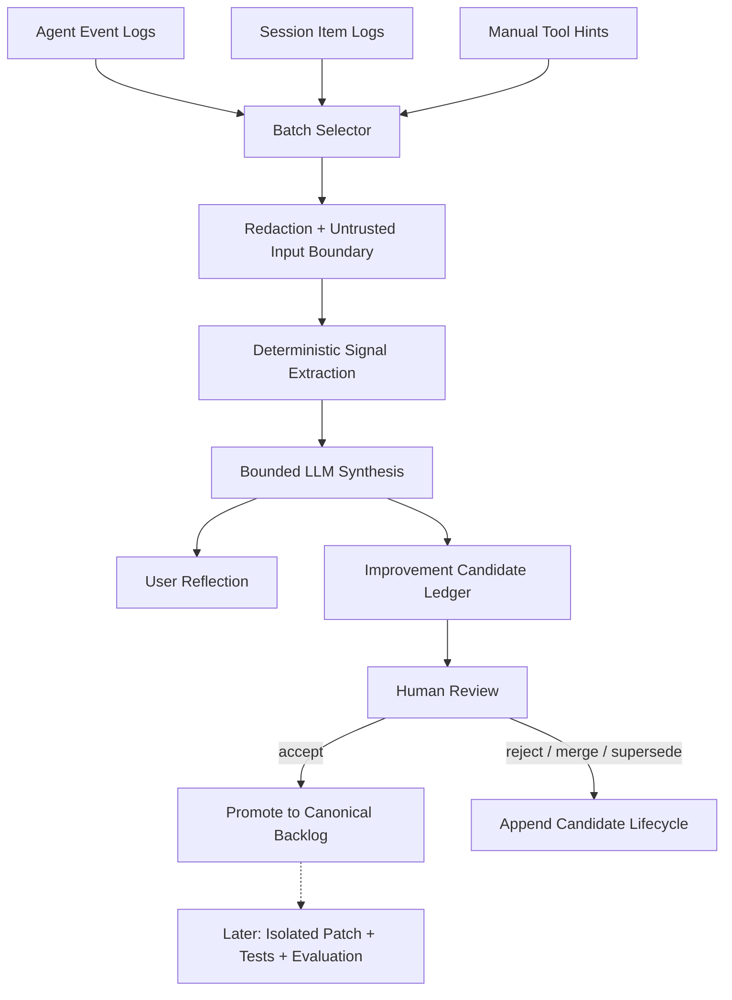

> **状态：** Backlog / discussion note  
> **版本目标：** 先验证自动 review 与改进候选是否有用；不实现自动修改或启用 Agent 代码  
> **非实现承诺：** 本文用于保留想法、明确边界，并为后续研究和设计讨论提供起点。

## 1. 一句话

MoonTide 在用户明确启用后，持续消费已有使用日志，周期性生成两类有证据的派生产物：面向用户的 Reflection，以及面向 Agent 开发的 Improvement Candidates。

第一版应命名为 **Self-Review Mode**。真正修改 Agent 代码并启用新版本的 **Controlled Self-Update** 属于后续阶段。

## 2. 为什么值得讨论

Agent 在长期使用中会积累大量具有产品价值的信号：

- 用户反复纠正的行为；
- 经常失败、重试或被拒绝的 tool 调用；
- 用户频繁采用的工作方式与偏好；
- 重复出现但缺少专用 tool 的任务；
- context、permission、UX、性能或架构产生的 recurring friction；
- 已存在但模型经常无法发现或正确调用的能力；
- Agent 多次使用 workaround 绕过的设计边界。

这些信号目前分散在 Agent Event Log、Session Item Log、tool hints 和人的记忆中。Self-Review Mode 的价值是把它们变成 **可检查、可追溯、可拒绝、可提升** 的候选，而不是让 Agent 在无治理条件下自我修改。

## 3. 两类输出

### 3.1 User Reflection

面向用户的周期性回顾，可包含：

- 最近完成的任务和主要主题；
- 重复出现的阻塞与失败；
- 用户多次表达的工作偏好；
- 尚未完成或长期悬而未决的问题；
- tool、token、context、retry 与 permission 趋势；
- 建议用户确认、忽略或继续跟进的事项。

Reflection 不是 durable memory。只有经过用户确认的内容，才可以由独立流程提升为 preference 或 memory。

### 3.2 Agent Improvement Candidates

面向 MoonTide 开发和产品设计的改进候选：

| category | 示例 |
|----------|------|
| `tool` | 新增专用 tool、修正 schema、改善 tool description |
| `prompt` | 修正易误用的 instruction 或 protocol reminder |
| `workflow` | 减少重复步骤、增加明确状态或确认点 |
| `context` | working set、compaction、prefix cache、预算策略改进 |
| `permission` | 降低误拦截或补足高风险保护 |
| `observability` | 增加可定位错误的结构化事件或指标 |
| `ux` | 改善命令、反馈、恢复和解释体验 |
| `performance` | 降低 latency、token、重复读取或无效 tool call |
| `architecture` | 修复反复产生 workaround 的 ownership / boundary 问题 |
| `documentation` | 补足模型和开发者都难以发现的契约 |

单一用户习惯不能直接升级为通用产品需求。每条候选必须标记 scope：

```text
user-specific
workspace-specific
provider-specific
general-product
```

## 4. 现有基础与 source of truth

Self-Review Mode 不新增另一套原始日志。

| 数据 | 现有 owner | 在 Self-Review 中的用途 |
|------|------------|--------------------------|
| Agent Event Log | `.moontide/runs/` | run 级 usage、trace、tool、错误、context 指标 |
| Session Item Log | `.moontide/sessions/` | 必要时引用完整 session 事实与 item IDs |
| Tool hints | `docs/notes/tool-hints/` | 人工提交的改进候选来源 |
| Self-Review 派生数据 | `.moontide/self-review/` | batch、reflection、candidate 生命周期 |

默认分析应优先使用 Agent Event 的结构化、最小化字段。只有在明确需要且符合隐私策略时，才读取更完整的 Session 内容或 tool output。

## 5. 数据流



日志与 tool output 必须被视为 **不可信数据**，不能让其中的自然语言指令改变 review job 的系统规则或获得执行权限。

## 6. 触发与调度

不建议只使用单一文件 size 触发。候选策略：

```text
满足任一：
- 新增 N 个 completed runs
- 新增可消费日志超过 X MiB
- 距离上次 review 超过 N 天

并且同时满足：
- Agent 当前 idle
- 不存在未完成 review job
- 未超过 token / latency / cost budget
- 用户没有暂停 Self-Review Mode
```

`runFinalize` hook 只负责将 `runId` 写入 durable queue。它不应同步调用 LLM，也不应阻塞前台 Agent。

实际消费由 process-scoped builtin plugin / worker 负责：

```text
runFinalize hook
  → enqueue completed run
  → idle worker claims batch
  → redact / extract / synthesize
  → persist reflection and candidates
```

队列与 cursor 必须在 Agent Event retention 删除旧 run 前建立明确语义，避免 completed run 未消费就被清理。

## 7. 信号提取

优先由确定性代码提取结构化信号，再让模型归纳。候选信号包括：

- 同一 tool 或 error code 重复失败；
- 连续 retry、timeout 或 fallback；
- permission 被频繁拒绝；
- 用户多次纠正同一类行为；
- Agent 频繁用 bash 绕过专用 tool；
- 相同文件、artifact 或信息被重复读取；
- context 多次因同一类内容触发 compaction；
- working set 经常遗漏同类事实；
- 用户反复手工完成 Agent 可以结构化执行的步骤；
- 某类任务具有稳定输入输出但缺少专用能力；
- 某个模块边界反复产生跨层 workaround；
- 功能已经存在，但 tool selection 或 documentation 使其难以被正确使用。

高频不是唯一标准：一次高严重度的权限绕过、数据损坏或恢复失败，也应生成候选。

## 8. Improvement Candidate 契约

示意 schema：

```ts
interface ImprovementCandidate {
  id: string;
  category:
    | "tool"
    | "prompt"
    | "workflow"
    | "context"
    | "permission"
    | "observability"
    | "ux"
    | "performance"
    | "architecture"
    | "documentation";
  scope: "user" | "workspace" | "provider" | "product";
  problem: string;
  evidence: EvidenceRef[];
  occurrenceCount: number;
  severity: "low" | "medium" | "high";
  confidence: number;
  proposedChange: string;
  expectedBenefit: string;
  risks: string[];
  acceptanceCriteria: string[];
  status:
    | "candidate"
    | "accepted"
    | "rejected"
    | "superseded"
    | "implemented"
    | "evaluated"
    | "rolled_back";
}
```

`EvidenceRef` 至少可以引用：

- run ID；
- session item ID；
- tool use ID；
- error code；
- 时间范围；
- 已脱敏的短证据摘要。

没有 evidence 的模型判断不能进入候选 ledger。

## 9. 派生数据存储

建议布局：

```text
.moontide/self-review/
  state.json
  queue.jsonl
  batches/
    <batchId>.json
  reflections/
    <reflectionId>.json
  candidates.jsonl
```

| 文件 | owner / 语义 |
|------|--------------|
| `state.json` | trigger 配置、消费 cursor、上次成功 review |
| `queue.jsonl` | 待消费 completed runs；append-only claim/result 事件 |
| `batches/` | 本次消费范围、redaction policy、模型、成本、输入摘要 |
| `reflections/` | 面向用户的派生报告 |
| `candidates.jsonl` | candidate 状态变化；append-only lifecycle |

Self-Review 输出默认不写入仓库 `TODO.md` 或 `docs/`。只有显式 promotion 才能进入 canonical backlog，避免低质量候选污染项目事实。

## 10. Review 与 promotion

候选交互可先以命令形式存在：

```text
/self-review status
/self-review run
/self-review reflections
/self-review candidates
/self-review accept <id>
/self-review reject <id>
/self-review promote <id>
/self-review pause
/self-review delete-data
```

推荐生命周期：

```text
observe
  → propose
  → human review
  → accept / reject / supersede
  → promote to backlog
  → optional isolated implementation
  → evaluate
  → activate or rollback
```

`promote` 应生成包含 problem、evidence、scope、risk、acceptance criteria 的 backlog 条目，而不是只复制一句建议。

## 11. Hook / Plugin / Core 边界

| 层 | 职责 |
|----|------|
| Hook | 在 `runFinalize` 等稳定 phase enqueue；不做长任务 |
| Builtin plugin / worker | batch、redaction、signal extraction、LLM synthesis、派生存储 |
| Core logs/session | 继续拥有原始事实，不依赖 Self-Review 才能正确运行 |
| UI / CLI | 显示状态、报告、候选与用户决策；不拥有候选事实 |
| Canonical docs | 只接收用户显式 promote 的内容 |

Self-Review plugin 可以失败、暂停或被卸载，不能影响正常 Agent execution。

## 12. Privacy 与安全

这是本 feature 的首要约束。

- 默认关闭，必须由用户显式 opt-in；
- 默认本地处理；云端分析需要单独许可和可见成本；
- 分析前执行 secret、credential、PII 和敏感路径 redaction；
- 默认排除 thinking trace；
- 默认不把完整 tool output 提交给分析模型；
- 用户能预览本次 batch 将消费的范围；
- 用户能暂停、删除和导出全部 Self-Review 派生数据；
- review model 默认没有 write、bash、network 或任意 tool execution 权限；
- 日志中的 prompt injection 只能作为被分析文本，不能变成指令；
- retention、redaction policy 和 cloud/local route 写入 batch manifest；
- 跨 Session、跨 workspace 聚合需要单独 scope 与许可。

## 13. 分阶段路线

### V0：Manual Self-Review

- `/self-review run` 手动消费最近 N 个 completed runs；
- 输出一份 User Reflection；
- 输出带 evidence 的 Improvement Candidates；
- 不自动触发；
- 不写 canonical backlog；
- 不修改代码。

### V1：Automatic Review

- 基于 run count、bytes、time 和 idle 状态触发；
- durable queue、cursor 和 exactly-once batch；
- candidate review 生命周期；
- pause、status、delete-data；
- 前台 Agent latency 不受影响。

### V2：Backlog Promotion

- 将用户接受的候选转换为正式 backlog；
- 自动生成 evidence、scope、risk 和 acceptance criteria；
- 必须经过显式确认。

### V3：Controlled Self-Update

只处理已经接受并 promote 的候选：

```text
candidate
  → isolated branch / worktree
  → implementation
  → tests and evaluation
  → user review
  → activate
  → monitor
  → rollback if needed
```

即使进入 V3，也不自动合并主分支，不自动替换正在运行的 Agent，不绕过测试和用户批准。

## 14. MVP 验收标准

- 相同 completed run 不会被成功 batch 重复消费；
- interrupted job 可以恢复，不生成半成品 candidate；
- 每份 Reflection 和 Candidate 都可追溯 evidence；
- active / incomplete run 默认不参与；
- secret redaction、thinking exclusion 和 prompt-injection isolation 有自动测试；
- review job 没有 write / exec / network 能力；
- 不影响前台 run latency；
- 有明确 token、时间、频率和成本上限；
- 用户能查看、暂停、重跑和删除；
- candidate 不能绕过 review 自动进入 canonical docs；
- scope 能区分个人习惯和通用产品需求；
- duplicate candidates 可以 merge / supersede；
- plugin 缺失或失败不影响 Agent correctness。

## 15. 评估指标

| 指标 | 目的 |
|------|------|
| Reflection usefulness | 用户是否认为回顾真实且有帮助 |
| Candidate acceptance rate | 候选是否值得进入 backlog |
| Evidence coverage | 候选是否可追溯，而非模型空想 |
| Duplicate rate | 是否重复生成同类建议 |
| False-generalization rate | 是否把个人偏好错误泛化为产品需求 |
| Secret leakage rate | redaction 与输入选择是否可靠 |
| Foreground latency impact | 是否影响正常 Agent 使用 |
| Review cost per batch | token、时间、本地/云端成本 |
| Implemented candidate outcome | 实施后是否通过验收并产生预期收益 |

## 16. 明确非目标

- 不把 Self-Review 输出自动写成 durable user memory；
- 不把单一用户习惯直接升级为通用产品设计；
- 不把 raw logs 整包直接交给 LLM；
- 不允许 review model 执行日志中的指令；
- 不自动修改、合并、发布或热替换 Agent 代码；
- 不因追求“自我进化”而绕过 permission、schema、tests、review 和 rollback；
- 不在 MVP 引入跨用户遥测、中央训练管线、向量 memory 或后台多 Agent swarm；
- 不与 Session compaction、durable memory extraction 混成同一生命周期。

## 17. 需要进一步研究的问题

- User Reflection 的最小有用周期是按 runs、时间还是项目 milestone？
- 哪些事件字段足以提取信号，哪些 raw body 可以默认排除？
- 本地小模型能否承担分类、去重和证据抽取，云模型只做最终 synthesis？
- 如何区分“用户偏好”“工作区约束”“provider 特性”和“产品缺陷”？
- candidate 去重应依赖 deterministic fingerprint、embedding，还是二阶段策略？
- promotion 应进入统一产品 backlog，还是按 tool/context/UX 分域？
- 如何评估一个已实施候选是否真的改善，而不是只让代码更复杂？
- Controlled Self-Update 是否应该始终作为独立产品能力，而不是 Self-Review 的默认终点？

## 18. 相关文档

| 文档 | 关系 |
|------|------|
| [`agent-events.md`](../spec/agent-events.md) | Agent Event Log schema、retention 与 recovery |
| [`context-composer.md`](../spec/context-composer.md) | Session facts 与 request projection 边界 |
| [`agent-run-hooks.md`](agent-run-hooks.md) | `runFinalize`、hook mode 与 sidecar/plugin 边界 |
| [`plugin-host.md`](plugin-host.md) | process-scoped builtin plugin / worker 承载方式 |
| [`tool-hints/README.md`](tool-hints/README.md) | 现有人工改进候选入口；未来可并入 Candidate Ledger |
| [`context-normalization.md`](context-normalization.md) | 完整 turn postflight 与下一轮 context 状态 |
| [`session-handoff.md`](session-handoff.md) | redaction、export 与数据外泄边界 |

## 19. 当前决策

**记录并保留 Self-Review Mode 作为 feature backlog：先自动消费已有日志，生成 User Reflection 与有证据的 Agent Improvement Candidates；自动代码更新仅作为后续 Controlled Self-Update 研究方向。**
