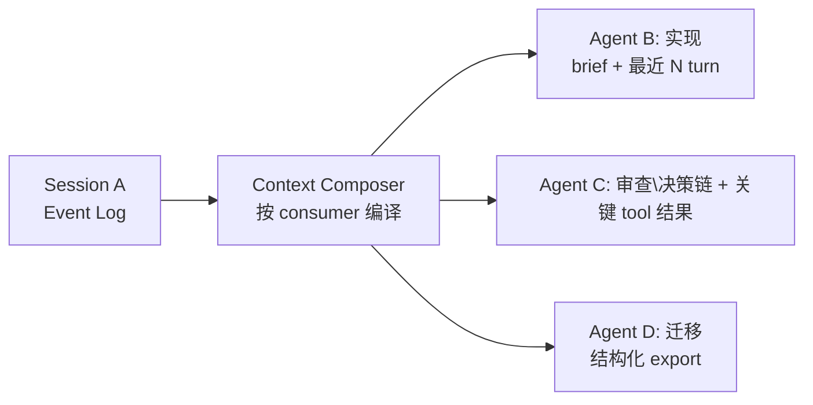

> 产品讨论备忘：对话内容是否有价值共享给其他 agent、如何处理、业界为何未将其做成一等 feature。  
> **非实现承诺** — 与 [`context-composer.md`](../spec/context-composer.md) 主路径对齐的演进候选。

---

## 1. 问题陈述

在与 agent 完成多轮对话后，常见需求：

- 将对话内容交给**另一个 agent** 阅读或继续
- 来源可能是 ChatGPT、Claude、Cursor 等，对话轮次多、信息密度高
- 目标可能是继续实现、审查决策、或跨工具迁移

核心问题不是「能不能 copy/paste」，而是：**如何把 Session 作为可复用知识资产，按不同 consumer 编译成可消费的 context**。

---

## 2. 需求是否有价值

**结论：有价值，且是 agent 协作的基础设施，不是边缘功能。**

| 场景 | 例子 |
|------|------|
| **角色切换** | 探索型 agent 聊完架构，实现型 agent 接手写代码 |
| **跨工具迁移** | ChatGPT 里讨论完方案，MoonTide / Cursor 里继续执行 |
| **审查 / 第二意见** | review agent 读完整决策过程，而非只看最终结论 |
| **并行分工** | A 做调研，B 做实现，共享已达成共识的上下文 |
| **避免重复解释** | 新 session 不必从头复述 20 轮对话 |

本质：对话是一种**可复用的知识资产**；当前多数产品将其锁在单个 session、单个窗口内。

---

## 3. 难点：不能直接整段 dump

长对话原样塞给另一个 agent，通常有三类问题：

1. **窗口不够** — 多轮 + tool 输出易超 context 上限
2. **信噪比低** — 失败尝试、跑题、重复确认对下游 agent 是噪音
3. **消费方式不同** — 实现 agent 要决策与约束；review agent 要 reasoning 链；迁移 agent 只要结论与未决项

关键不是「能不能 share」，而是 **share 什么形态、给谁看**。

---

## 4. 分层方案

按「信息保真度 vs 可消费性」分层：

```
┌─────────────────────────────────────────────────────────┐
│  L0  原始 transcript（全量 replay）                      │
│  L1  结构化 Session Log（可筛选 turn / 去掉 tool 噪音） │
│  L2  Handoff Brief（摘要 + 决策 + 待办 + 引用）          │
│  L3  指针引用（sessionId / artifact 路径，按需拉取）     │
└─────────────────────────────────────────────────────────┘
         保真度高 ←────────────────→ 更易消费
```

### 4.1 L2：Handoff Brief（轻量，今天可用）

将当前对话压成交接文档，供新 agent 读取。Cursor 生态已有 **handoff skill**（本地 skill：将对话 compact 成交接文档，含 suggested skills 与脱敏要求）。

**适合：** 继续同一条工作线，不需要完整 replay。

**应包含：**

- 目标与当前状态
- 已做决策及理由
- 未决问题
- 产物引用（PR、文件路径、issue）— **不重复粘贴已有 artifact**
- 建议调用的 skills
- 敏感信息脱敏（API key、PII）

### 4.2 L0/L1：Session 作为可共享资产（中期）

与 [`context-composer.md`](../spec/context-composer.md) 架构一致：

| 组件 | 路径 / 职责 |
|------|-------------|
| **Session Event Log** | `.moontide/sessions/<id>.jsonl` — append-only 事实源 |
| **Compaction Record** | structured / summary 压缩产物 |
| **Checkpoint** | 某 turn 可恢复快照 |
| **Context Composer** | 按目标 agent 窗口与用途**编译 LLMRequest**，非整包塞入 |

跨 agent 共享的理想形态：



另一个 agent 读的不是「原始 chat」，而是 **针对它编译过的 LLMRequest + Context Manifest**。

MoonTide `StructuredPayload` 已预留 handoff 相关字段（[`context-composer.md` §6.3](../spec/context-composer.md#63-compaction-record)）：

```typescript
export interface StructuredPayload {
  goals: string[];
  decisions: string[];
  openQuestions: string[];
  fileAnchors: string[];
}
```

OpenCode V2 compaction checkpoint 含 objective、blocked work、next move、relevant files，是业界最接近 explicit handoff 的内部形态（见 [`context-analysis.md`](context-analysis.md) § OpenCode V2）。

### 4.3 外部对话（如 ChatGPT）：Import → Normalize → Compile

```
ChatGPT export (JSON)
    → 归一化为 SessionLogEntry
    → 可选：自动 compaction / 提取 brief
    → 新 session 或 attach 到当前 session 的「外部上下文」槽
    → Composer 只编译相关 slice
```

用户侧 UX 候选：

- `moontide session import chatgpt.json`
- 当前 session：`/attach-session <id>` 或 `@session:abc turns 12-45`

与 [`vision.md`](../product/vision.md) 中 **Zephyr**（跨 agent 产品切换与迁移）为同一类问题的不同切面。

---

## 5. 产品形态建议（优先级）

| 优先级 | 能力 | 用户动作 |
|--------|------|----------|
| **P0** | Handoff / Brief 一键生成 | 「生成交接文档给下一个 agent」 |
| **P0** | Session 导出（markdown / jsonl） | 手动 attach 或给其他工具 |
| **P1** | 选择性引用 | 「让 agent 读 session X 的 turn 10–30」 |
| **P1** | 外部 import（ChatGPT、Claude 等） | 上传 export 文件 |
| **P2** | 跨 session compose | 当前 turn 的 context 可挂载 foreign session |
| **P2** | 多 agent 并行读同一 session | Fleet / 多 panel（MoonTide 愿景） |

P0 覆盖约 80% 痛点；P1/P2 依赖 Session Event Log + Composer 落地。

---

## 6. 设计原则

1. **Share ≠ Dump** — 默认 brief + 引用；全量 transcript 按需拉取
2. **Fact vs Compile 分离** — Session Log 是事实；给不同 agent 的是不同 **LLMRequest 编译产物**（Composer invariant）
3. **Redaction 默认开启** — export / handoff 时脱敏 API key、PII
4. **显式消费意图** — 「继续干活」vs「审查」vs「迁移」产出不同 brief 模板
5. **指针优于复制** — `@session:abc#turn-42`、`docs/plan.md` 优于重复粘贴长文本

---

## 7. 业界为何未将其做成一等 feature

**更准确的说法：业界在做相邻能力，但很少做成用户主导的「一键交给另一个 agent 读」。**

### 7.1 各家实际做了什么

| 产品 | 实际能力 | 与「跨 agent share」的关系 |
|------|----------|---------------------------|
| **Codex** | `ContextManager` 独占 history；remote compaction → replacement checkpoint；**同 session resume** | 解决会话续命，非跨 agent 移交 |
| **Claude Code** | 本地 JSONL 全量 transcript；subagent **fork** 继承 / **fresh** 隔离 | 同生态内父子 agent |
| **OpenCode V2** | compaction checkpoint 含 objective、blocked work、next move | 最接近 handoff brief，但给**同一产品**内用 |
| **CodeWhale v0.9.1** | structured successor brief | 内部交接 |
| **ChatGPT** | share link（给人看） | 给人，不给 agent；格式不适合编程消费 |

Gap 在于：行业优先 **「同 agent 续命」**，而非 **「跨 agent 移交」**。

### 7.2 未优先做的原因

**1. 产品边界 — session 是单线程资产**

Codex、Claude Code、Cursor 核心 loop：

```
一个 harness → 一个 session → 一个 context 窗口 → 继续干
```

工程投入集中在 compact、resume、tool output 截断/归档 — 延续**同一条工作线**。  
「Session A 编译成 Agent B 能读的 LLMRequest」需 consumer model/tools/instructions 参与，复杂度跳档。

**2. 商业 — 跨产品 share = 迁移，非 retention**

ChatGPT share link 面向传播与拉新，非 export 到其他 coding agent。  
跨平台互读符合用户利益，不一定是平台第一优先级（Zephyr 填此洞，故为远期保留名）。

**3. Subagent 编排替代用户发起 share**

```
父 agent 派生子 agent → 子 agent 完成 → 父 agent 只收 bounded result
```

- Claude Code：fork = 继承 context；fresh = 干净上下文
- Reasonix：subagent 默认 fresh，只回传结果

这是**系统内编排**，非用户主导的跨 session / 跨工具共享。

**4. 问题定义不清 — share 给谁、什么形态**

| 意图 | 形态 |
|------|------|
| 继续干活 | Handoff brief（L2） |
| 审查 / 审计 | 筛选 turn range（L1） |
| 跨平台迁移 | Import pipeline（L0→L1） |

单一「Export conversation」难以同时满足；厂商倾向内部 checkpoint + 用户 copy/paste。

**5. 技术债 — 老架构不支持优雅 share**

传统 `messages[]` 可变数组与 model input 混为一体时，share = 复制噪音大、超 window、格式绑死厂商。

**Session Event Log + Context Composer** 才是正确前提（MoonTide spec、OpenCode V2 beta 方向）。迁移完成前，优雅 share 难成一等 feature。

**6. 安全与合规**

对话含 API key、内部路径、PII；export = data exfiltration 面。Enterprise 需 ACL、audit、redaction — 不做比半吊子 export 更安全。

**7. Workaround 暂时够用**

- 手写 summary 贴新 chat
- handoff skill 生成交接文档
- ChatGPT export JSON 手动喂入
- 结论外化到 `docs/plan.md`

Multi-agent 工作流未成为主流前，friction 不足以驱动平台投入。

### 7.3 业界投入分布（示意）

```
高投入 ████████████████████  同 session resume / compact / checkpoint
中投入 ████████░░░░░░░░░░░░░░  同产品 subagent（fork / fresh）
低投入 ██░░░░░░░░░░░░░░░░░░░░  结构化 handoff brief（OpenCode / CodeWhale 在探）
极低   ░░░░░░░░░░░░░░░░░░░░░░  跨产品 import / 用户发起 share（基本空白）
```

---

## 8. 对 MoonTide 的启示

1. **不必等 Codex** — 其优化目标是单 agent coding loop，非 cross-agent knowledge transfer
2. **P0 即可差异化** — handoff brief + session export + `@session:id` 选择性 attach；不必等完整 Zephyr
3. **架构走对路** — Session Event Log 是 share 前提；Composer 按 consumer 编译是实现；与 compaction/resume 共用基础设施
4. **命名** — 内部：checkpoint / successor brief / fork context；用户侧：「交接」「引用会话」「attach context」比泛化「share」更准

---

## 9. 与现有文档的关系

| 文档 | 关系 |
|------|------|
| [`context-composer.md`](../spec/context-composer.md) | Session Event Log、Compaction Record、Checkpoint、Composer 编译 — handoff 的实现基础 |
| [`context-analysis.md`](context-analysis.md) | 竞品 resume / compaction / subagent 对比 |
| [`context-backlog.md`](context-backlog.md) | 演进特性排期；handoff 可作为 Backlog 独立 feature |
| [`vision.md`](../product/vision.md) | Zephyr = 跨产品迁移远期方向 |
| [`edge-local-models.md`](edge-local-models.md) | 情景 memory L2–L3 与 local extract / general 分工 |
| [`kocoro-architecture.md`](kocoro-architecture.md) | memory bundle pull 模式；sidecar 监管参考 |

---

## 10. 待决问题（后续 spec 可展开）

1. **Handoff brief 模板** — 按 consumer 意图（implement / review / migrate）分几套？
2. **跨 session attach API** — `ComposeContextInput` 是否增加 `attachedSessionIds` + turn range？
3. **外部 import 格式** — 首批支持 ChatGPT JSON export？归一化到 `SessionLogEntry` 的映射表？
4. **与 Checkpoint 边界** — handoff 产出写 Compaction Record 还是独立 `HandoffRecord`？
5. **CLI / 命令** — `/handoff`、`moontide session export`、`moontide session import` 的 UX 草案

---

## 11. 讨论来源

2026-08-01 产品讨论：跨 agent 共享对话的价值、处理方式、以及 Codex / 业界未优先做的原因分析。
