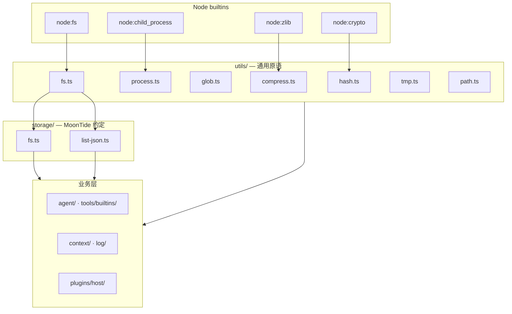

# Utils 基础设施层

> **状态：** 2026-08 · **已实现**（TS harness）  
> **原则：** 通用 Node/OS 原语集中在 `utils/`；MoonTide 持久化约定在 `storage/`；业务层不直接 `import fs` / `child_process`。

---

## 1. 分层



| 层 | 职责 | 允许 touch Node builtins |
|----|------|-------------------------|
| **`utils/*`** | 跨平台 IO、子进程、glob、压缩、哈希、临时目录 | 是（仅此层 + 见下） |
| **`storage/*`** | NDJSON append、JSON pretty、`listJsonRecords` | 否（委托 `utils/fs`） |
| **domain** | Agent、stores、manifest、JsonlWriter | 否 |

**例外（有意保留）：**

- `code-repl/templates/bodies/*` — 注入沙箱的用户脚本，保持原生 Node 写法
- `plugins/host/sidecar/process-transport.ts` — sidecar IPC spawn（stdio pipe，非 HTTP）

---

## 2. 模块一览

| 模块 | 主要 API | 典型消费方 |
|------|----------|------------|
| [`utils/fs.ts`](../../src/utils/fs.ts) | `readText` · `writeText` · `exists` · `readLines` · `listDir` · `stat` · `renameFile` | storage、builtins、jsonl、manifest |
| [`utils/process.ts`](../../src/utils/process.ts) | `spawnCollect` · `execFileCollect` · `execShell` | grep、git、bash、code-repl |
| [`utils/glob.ts`](../../src/utils/glob.ts) | `globFiles` | instruction-state、tools/builtins/fs |
| [`utils/compress.ts`](../../src/utils/compress.ts) | `gzipBuffer` · `gunzipBuffer` | log/outputs/jsonl |
| [`utils/hash.ts`](../../src/utils/hash.ts) | `sha256Hex` · `sha256UInt32Be` | instruction-state epoch |
| [`utils/tmp.ts`](../../src/utils/tmp.ts) | `createTmpDir` · `removeTmpDir` | tests、code-repl tmp script |
| [`utils/path.ts`](../../src/utils/path.ts) | `joinPath` · `resolveWorkspacePath` · `dataPath` | 全仓 |
| [`storage/fs.ts`](../../src/storage/fs.ts) | `appendNdjsonLine` · `readJson` · `writeJsonPretty` | stores、session IO |
| [`storage/list-json.ts`](../../src/storage/list-json.ts) | `listJsonRecords<T>` | compaction-store、checkpoint-store |

---

## 3. Agent Event 分发（event-hub）

观测事件不走 `utils/`，而由 [`src/log/event-hub.ts`](../../src/log/event-hub.ts) 负责：

| API | 说明 |
|-----|------|
| `emitDraft(draft)` | 填充 `id/seq/runId/ts` 后 fan-out |
| `setOutputs(outputs)` | 注册 JsonlWriter、StderrRenderer |
| `subscribe(listener)` | 测试 / 扩展监听 |

Hook observe 返回值中的 `EventDraft` 由 `HookDispatcher` 统一 `emitDraft`；Session 派生见 `plugins/builtin/log-sync/`。

Spec：[`agent-events.md`](../spec/agent-events.md)

---

## 4. 约束（code review）

```bash
# 业务层不应直接 import node:fs（template bodies 除外）
rg 'import fs from "node:fs"' src/ --glob '!**/templates/bodies/**'

# 子进程统一走 utils/process（sidecar transport 除外）
rg 'node:child_process' src/
```

---

## 5. 相关文档

| 文档 | 关系 |
|------|------|
| [`context-window-roadmap.md`](context-window-roadmap.md) | #6 cleanup 含 deprecated + utils 抽离 |
| [`agent-run-hooks.md`](agent-run-hooks.md) | Hook → event-hub 观测链 |
| [`plugin-host.md`](plugin-host.md) | sidecar transport 与 utils/process 边界 |
