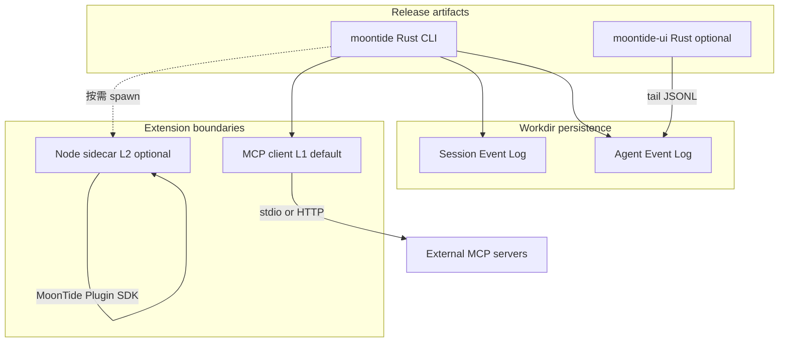

> **文档性质：** product（方向与发布策略，非 Spec、非实现承诺）  
> **Doc Map：** [`docs/README.md`](../README.md) · 命名与保留产品名见 [`vision.md`](vision.md)  
> **分工：** Desktop IPC / sidecar 细节见 [`runtime-multilang.md`](../notes/runtime/runtime-multilang.md)；竞品 context 机制见 [`context-analysis.md`](../notes/context/context-analysis.md)；历史 Hook 候选见 [`agent-run-hooks.md`](../archive/notes/runtime/agent-run-hooks.md) §11+；历史插件加载与 MCP 集成见 [`plugin-host.md`](../archive/notes/runtime/plugin-host.md)

---

## 1. 一句话定位

**MoonTide** 是轻量 **native coding agent**：Session 事实源与 context 编译边界见当前 [`agent-core.md`](../../crates/docs/agent-core.md)；历史 Context Composer 方案见 [`context-composer.md`](../archive/spec/context-composer.md)。**MCP** 为默认工具扩展面，**可选 Node sidecar** 承载深度 TS 插件；**release 不嵌入 JavaScript runtime**，也不绑定单一云厂商。

---

## 2. 市面 agent 怎么做

2025–2026 主流大致分两 camp：

| Camp | 代表 | 核心 runtime | 扩展方式 | 与 npm 生态 |
|------|------|--------------|----------|-------------|
| **Native core + MCP** | Codex CLI、Claude Code | Rust 或 native SEA（Claude 仍内嵌 Bun，~200MB 级） | MCP、hooks、`AGENTS.md`、skills | npm 多用于 **MCP server**（`npx …`），非 core 内 `require` |
| **JS core + in-process 插件** | OpenCode、Pi coding-agent | Node / Bun | TS 插件 hook、`registerTool` | **in-process** 可 `import` 任意包 |
| **IDE 扩展** | Cursor、Cline、Continue | VS Code Extension Host | Editor API + MCP | 编辑器生态，非 CLI agent 插件 |

| 产品 | 分发 | 备注 |
|------|------|------|
| **Codex CLI** | Rust 单 binary | MCP client + 内置 tools + plugins 市场；开源可审计 |
| **Claude Code** | 平台 native binary | 不依赖系统 Node；harness 极深；MCP / hook 脚本 |
| **OpenCode** | Node/Bun 产品 | 启动时 Bun install 插件依赖；in-process hook 体验最好 |
| **Pi Agent** | Node harness | `ExtensionAPI`：tools/commands/events registry |

**趋势：** core 变 native 或 fat binary；**工具互操作收敛到 MCP**；in-process TS 插件仍存在于开发者向产品，代价是必须带 JS 运行时。

---

## 3. MoonTide 架构决策

### 3.1 Release：`moontide` = Rust CLI（无 embedded Node）

| 决策 | 理由 |
|------|------|
| **用户-facing CLI 用 Rust 单 binary** | 冷启动、体积、分发简单；与 Codex 同属 native camp |
| **不把 Node SEA / Bun `--compile` 作为主路径** | 产物仍含 V8/JS 运行时，与「无 embedded runtime」目标冲突 |
| **TypeScript 仓库保留** | dev harness、conformance tests、Node sidecar 参考实现 |
| **Tauri + 轻量 Web UI** | WebView 前端负责 RenderState，Rust bridge 保持 Host / protocol ownership；推荐 Svelte + TypeScript |

### 3.2 目标架构

**内核职责（Rust）：** agent loop、Session append/read、Context Composer、LLM HTTP adapter、内置 tools、MCP client、权限 broker、Agent Event JSONL。

**不在 Rust core 内：** 任意 npm 包、OpenCode/Pi 兼容 in-process hook、VS Code 扩展 API。

---

## 4. 三层扩展互操作

历史兼容分层（P0/P1/P2）见 [`ecosystem-compat.md`](../archive/notes/runtime/ecosystem-compat.md)。

| 层 | 机制 | 用户需 Node？ | 兼容承诺 |
|----|------|---------------|----------|
| **L1 MCP** | Rust MCP client；配置 stdio / HTTP server | stdio 时通常要（`npx`）或 remote HTTP | 与 Codex/Claude **工具 server 生态**对齐 |
| **L2 MoonTide Plugin SDK** | 可选 **Node sidecar**；TS 插件 + hook | sidecar pack 或 PATH 有 node | **MoonTide 自有协议**；承载 tool-use-log / context / code-repl 等 |
| **L3 Adapter** | `pi-compat` / 社区包装 | 视 adapter | **不承诺** OpenCode/Pi 插件零改即用 |

**「无缝 npm 生态」的诚实定义：**

- **能 seamless：** MCP 工具 server（行业正在标准化）、MoonTide 官方 sidecar 插件。
- **不能 seamless：** OpenCode in-process hook、Pi `ExtensionAPI` 同进程语义、VS Code 扩展、任意 `npm install` 进 Rust loop。

Sidecar 是 **受控 Node 能力域**（Rust spawn/kill、权限经 broker），不是第二个完整 fork 的 harness。

---

## 5. Release 硬指标（目标，非现状）

| 指标 | 有竞争力目标 | 说明 |
|------|--------------|------|
| CLI binary 体积 | macOS arm64 **&lt; 25MB** stripped | 对比 Claude Code ~200MB 级 native |
| 冷启动 | REPL 提示 **&lt; 50ms** 量级 | 无 V8 初始化 |
| 默认安装 | **零 Node** 可 ping + builtins + LLM | MCP stdio 需用户自备 Node 或改用 HTTP MCP |
| Session compose | **增量读 log**，非全量 sync read | C1b 后 Rust/TS 均须满足 |
| Sidecar | **可选**；未安装时 MVP 完整 | 见 [`runtime-multilang.md` §9](../notes/runtime/runtime-multilang.md) |
| Desktop 主 Bundle | 以 Tauri + 前端实际构建和 system WebView 测量为准 | 不把宣传数字当作验收事实；Node runtime pack 仍按需下载 |

当前实现仍为 **TypeScript + `node dist/main.js`**；上表为 **Rust release 验收门槛**。

---

## 6. 竞争力 SWOT（浓缩）

### Strengths

- Rust CLI + Rust UI：**一条 native 栈**
- Session / Agent **双 log** + Composer Spec：文档领先 prototype
- MCP + 可选 sidecar：**不 embed Node 又能接生态**
- 多 provider / workdir 本地优先：历史方案见 [`llm-provider.md`](../archive/spec/llm-provider.md)

### Weaknesses

- TS prototype 与 Rust release **双轨成本**
- Sidecar IPC：Transform/hook 比 in-process 难一个数量级
- MCP 冷启动、`npx` 依赖用户环境

### Opportunities

- 用户厌倦超大 agent CLI → **小 binary** 传播点
- MCP 标准化 → L1 不必自建工具生态
- Desktop：Tauri system WebView + Rust Host 避免 bundled Chromium，但前端资源和平台 WebView 差异必须实测

### Threats

- Codex/Claude 加强 MCP + plugins，native 不稀缺
- OpenCode V2 context-as-compiled-state 若成熟，压「只有 loop 的 harness」
- Sidecar 做不好 → 两头不靠

### 与主要对手

| 对手 | 可能赢的点 | 可能输的点 |
|------|------------|------------|
| **Codex** | 更小 binary、Session/Composer Spec 透明、sidecar UI 一体 | 功能广度、品牌、资源 |
| **Claude Code** | 体积、无 vendor lock、开源/workdir | harness 深度、模型 |
| **OpenCode** | 更轻、hard native 分发 | in-process 插件开发者体验 |
| **Pi** | 同等哲学 + 更强观测 Spec | 早期扩展数量 |

**适合打的标签：** 轻量 native CLI + 清晰 Session/Context 架构 + MCP。  
**不适合打的标签：** 插件生态最全、无缝 npm、大厂默认 agent。

---

## 7. 非目标

- **不在 release 中 embed Node / Bun / V8**
- **不承诺** OpenCode / Pi / VS Code 插件零改兼容
- **不把** 任意 npm 包 `require` 进 Rust agent loop
- **不用** Node SEA / Bun compile 作为用户-facing 主分发
- **Go 不做主 CLI**（远期 worker / 调度见 [`kocoro-architecture.md`](../notes/runtime/kocoro-architecture.md)）
- **不把** Desktop sidecar IPC 细节写进本文（见 runtime-multilang）

---

## 8. 演进阶段（方向，非排期承诺）

| 阶段 | 内容 |
|------|------|
| **R0** | Rust CLI MVP：loop + Session JSONL + LLM fetch + builtins；无 sidecar |
| **R1** | 体积/启动 benchmark；Session 增量读；Composer 读 Session（C1b invariant） |
| **R2** | MCP client；配置形态对齐 Codex 文档习惯 |
| **R3** | 可选 Node sidecar pack + **MoonTide Plugin SDK**（非 OpenCode 兼容承诺） |
| **R4** | Rust Host 监管 sidecar + Tauri desktop（对齐 runtime-multilang Phase 1–2） |

**TS 仓库角色：** R0 之前与并行期 — 参考实现、测试金标准、sidecar 宿主；release 二进制以 Rust 为准。

**Hook 内核候选：** 见归档 [`agent-run-hooks.md`](../archive/notes/runtime/agent-run-hooks.md)；当前 Rust 以 event README/DESIGN 为准。

---

## 9. 相关文档

| 文档 | 关系 |
|------|------|
| [`vision.md`](vision.md) | 产品名、保留产品名 |
| [`plan.md`](plan.md) | 当前优先级、JSONL 存储 |
| [`context-composer.md`](../archive/spec/context-composer.md) | TypeScript 历史 Session / Composer 方案 |
| [`context-analysis.md`](../notes/context/context-analysis.md) | 竞品 context 深度对比 |
| [`runtime-multilang.md`](../notes/runtime/runtime-multilang.md) | Desktop IPC、20MB 分发、sidecar 监管 |
| [`kocoro-architecture.md`](../notes/runtime/kocoro-architecture.md) | Go daemon / sidecar 参考 |
| [`agent-run-hooks.md`](../archive/notes/runtime/agent-run-hooks.md) | 历史 Hook 候选 |
| 历史 [`plugin-host.md`](../archive/notes/runtime/plugin-host.md) | Plugin host、MCP attach、tool registry |
| [`event`（DESIGN#event）](../../crates/agent-core/DESIGN.md#event) | 当前 Rust Turn 级事件与 legacy Agent Event 边界 |

---

## 10. Status

- **方向已定：** Rust release CLI、MCP L1、可选 Node sidecar L2、不 embed JS runtime。
- **实现状态：** 当前以 Rust `agent-core`、`agent-tools`、`agent` 和 `cli` 为实现基线；Desktop Shell v0.1 正在补齐流式 UI、宿主事件、approval、取消清理与 Session 恢复。TypeScript 内容仅作为历史参考，sidecar 仍后置。
- **修订：** 随 release 里程碑更新 §5 指标与 §8 阶段。
