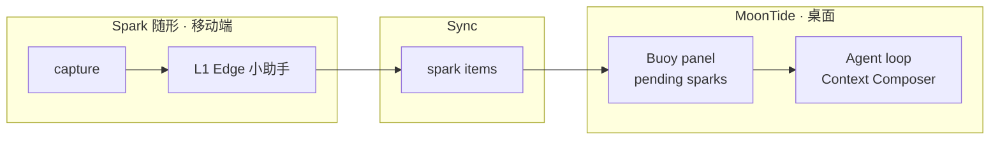

> **文档性质：** product（方向与产品定义，非 Spec、非实现承诺）  
> **Doc Map：** [`docs/README.md`](../README.md) · 命名登记见 [`vision.md`](vision.md)  
> **关联：** [`platform-strategy.md`](platform-strategy.md) · [`edge-local-models.md`](../notes/llm/edge-local-models.md) · 历史 [`context-composer.md`](../archive/spec/context-composer.md)

---

## 1. 一句话定位

**Spark（随形）** 是 **OceanSpark** 的移动端产品：AI 时代的 **随手记 / draft / 备忘录** — 不是「缩小版 MoonTide Agent」，而是 **capture + 轻 AI 协同 + sync 到桌面生态** 的成长型助手。

**中文显示名：** 随形  
**英文产品名：** Spark  
**内容原语：** `spark`（一条未定型 idea / draft / 备忘输入）

---

## 2. 启发与切割（相对 Hynote 类）

Hynote 等产品的路径是 **移动端全能 AI 笔记**（写、聊、整理全在手机完成）。

Spark 的路径是 **移动端专用 capture 层 + 桌面 MoonTide 深度协同**：

| | Hynote 类 | Spark + MoonTide |
|---|-----------|------------------|
| 移动端职责 | 尽量全覆盖 | **只做好 capture 与日常陪练** |
| AI 深度 | 云端全能订阅 | **L1 本地 + L2 按需 DeepSeek + L3 桌面 Agent** |
| 定价 | 全能笔记订阅 | **Spark 低价 / freemium；深度用量可控** |
| 终点 | 在手机里「做完」 | **spark sync → 桌面 Buoy → Agent Turn** |

**非目标：** 把 MoonTide coding agent loop 搬进手机；与 Hynote 打「全能笔记」正面战。

---

## 3. 产品定义

### 3.1 三条用户心智

1. **3 秒 spark** — 想法、草稿、一句备忘；不要求结构完整  
2. **AI 随手协同** — 本地小助手：tag、摘要、出题、掌握度估计  
3. **不是终点** — spark 同步到 MoonTide **Buoy**，用户或 Agent 再深化

### 3.2 与传统备忘录的差异

| | 传统随手记 / Draft | Spark |
|---|-------------------|-------|
| 单位 | note / 文件 | **spark**（可被 Agent 消费的意图） |
| 写完以后 | 列表归档 | **pending** → tag → sync → processed |
| AI | 可选润色 | **默认参与**分类、关联、复习、升档建议 |
| 设备 | 各端同质 | 手机 **capture**；桌面 **compose + Agent** |

### 3.3 spark 内容形态（MVP 起）

| 形态 | 场景 | 轻 AI（L1） |
|------|------|-------------|
| 文字 spark | 灵感、待办一句、draft 开头 | tag + 一行摘要 |
| 语音 spark | 走路、会议间隙 | ASR + 短摘要 |
| 图片 spark | 白板、书页、截图 | OCR + 分类建议 |
| 卡片 spark | 碎片学习 | 正反面临时版 |
| 链接 spark | 稍后读 | 摘要 + 「是否深聊」 |

建议 Session Item：`kind: "spark"`，`status: draft | tagged | synced | processed`（实现 Spec 另文）。

---

## 4. 生态位置

- **Spark** — 独立 App（不同交互、可不同定价）；共享 Session / spark sync 协议  
- **Buoy** — MoonTide 内 **组件代号**（非独立产品）：桌面 pending sparks 收件箱  
- **MoonTide** — spark 的下游：深度 Turn、Project、tool use

**Slogan 候选：**

- 中文：随形 — 随手 spark，深度工作在 MoonTide  
- 英文：Spark it now. Agent it on MoonTide.

---

## 5. 智力分层（成长助手）

个人成长不靠单一模型 IQ，而靠 **分层 + 路径 + 用户自愿加深**。

| 层级 | 载体 | 模型 | 角色 |
|------|------|------|------|
| **L1** | Spark 设备端 | Edge **Qwen3.5-0.8B**（可领域微调） | **贴身小助手**：tag、摘要、出题、复习提醒、掌握度估计 — **解放重复人工** |
| **L2** | Spark / 轻量会话 | **DeepSeek API**（如 V4 Flash） | **深度陪练**：讲透一题、mock、错题剖析、周复盘 — **用户点「深聊」或 path 关卡触发** |
| **L3** | MoonTide 桌面 | Agent + 云 frontier | **跃迁与落地**：项目练习、长文、代码、research Turn |

**原则：**

- **默认浅（L1）** — 新 spark 不上云；敏感内容可 **local only**  
- **显式加深（L2）** — 用户知情；成本可控（DeepSeek 已足够便宜）  
- **advanced 由路径定义** — curriculum 描述「进阶长什么样」；L1 日常 + L2 深聊 + L3 项目共同达成  

**社会背景（产品叙事）：** 国内许多组织 **用人多于育人**；有成长意愿的人需 **自建进阶路径**。Spark 提供低门槛日常循环，MoonTide 提供突破瓶颈的 Agent 能力 — **补充自学，不宣称替代组织培训或专业资质**。

详设 Local Fusion 与 catalog 见 [`edge-local-models.md`](../notes/llm/edge-local-models.md)。

---

## 6. 目标用户

### 6.1 主叙事（对外只讲 5 条）

| 叙事 | 包含群体 | 一句话 |
|------|----------|--------|
| **考 · 背 · 刷** | 考研考公、雅思托福、在职考证、语言学习 | 碎片 spark + 卡片；桌面 Agent 规划 |
| **记 · 不漏** | 记录习惯者、ADHD、系统备忘录迁移 | 随形随手记，AI 归类 |
| **会 · 场** | 办公、秘书/助理、销售、PM | 录音摘要；MoonTide 纪要跟办 |
| **读 · 想 · 写** | 知识工作者、Notion/Flow/MN/XMind 用户 | spark 是 inbox，深度在桌面 |
| **省 · 私 · 轻** | 独立用户、隐私敏感、嫌全能笔记贵 | 本地 L1 + 低价 + 按需 L2 |

### 6.2 Persona 清单（含扩展）

**Tier 1 — MVP 优先**

- 备考 / 语言 / 在职考证  
- 有记录习惯 + 工具党（Notion、Obsidian、Anki、flomo 等）  
- 会议多：办公、PM、销售、咨询  

**Tier 2 — P1 功能后**

- 秘书 / 助理 · 科研 / 研究生 · 创作者 / 记者  

**Tier 3 — 长尾 / 合规**

- 法律 / 医疗 / 外勤 · 企业团队 inbox  

完整 persona 表见本文档 git 历史或产品讨论备忘；实现阶段 **对外 explicit 3 个**：备考、会议办公、随手记工具党。

---

## 7. MVP 范围（方向，非排期）

**P0**

1. 文字 + 语音 spark → local tag / 摘要（L1）  
2. spark → Session Item sync → 桌面 Buoy 展示  
3. 可选 L2：单条 spark「深聊一下」（DeepSeek，用户 key 或额度包）

**P1**

4. 卡片 spark + SRS  
5. 会议录音分段摘要  
6. Growth Path 首条（如雅思 / 考研选一）

**P2**

7. 多 path 商店 · streak / 掌握度仪表盘 · 团队 shared Buoy  

---

## 8. 代号与命名登记

### 8.1 已登记（见 [`vision.md`](vision.md)）

| 类型 | 名称 | 用途 |
|------|------|------|
| **公司** | **OceanSpark** | 法人 / 品牌母题（海洋 + 火花） |
| **现行产品** | **MoonTide** | 桌面 coding agent CLI + Slint；本仓库主交付 |
| **保留产品名** | **Spark** | 移动端 capture / 成长助手（随形） |
| **保留产品名** | **Ciel** | 产品家族 / 天象母题总称（远期） |
| **保留产品名** | **Lyra** | 独立 agent harness 产品线（远期） |
| **保留产品名** | **Zephyr** | 跨 agent 产品切换与迁移（远期） |
| **保留产品名** | **Bruma** | Session 事实为 source of truth 产品线（远期；MoonTide 内仍用 Session Event Log） |
| **组件代号** | **Tide** | MoonTide 内：日常 action 摘要 panel |
| **组件代号** | **Fleet** | MoonTide 内：多 agent 运行监控 panel |
| **组件代号** | **Buoy** | MoonTide 内：pending sparks / Pin notes 收件箱 |
| **内容原语** | **`spark`** | Item / 协议层：idea、draft、未整理输入（小写，非产品名） |

### 8.2 命名母题

- **MoonTide 线：** 天象 / 海洋 — Ciel、Lyra、Zephyr、Bruma、Buoy、Tide、Fleet  
- **OceanSpark 线：** **Spark** / 随形 — 公司名 **Spark** 下钻到移动端「火花入口」  
- **已弃：** Atoll、Estuary、Loom、Spool 等（见 vision §Naming non-goals）

### 8.3 技术标识（待定，实现前冻结）

| 用途 | 建议 |
|------|------|
| App bundle id | `com.oceanspark.spark`（示例） |
| sync 协议 / crate | `spark-sync` 或 `oceanspark-spark`（示例） |
| Session Item kind | `spark` |

### 8.4 不可用 / 已占用

- **MoonTide** — 仅桌面 agent，不作移动端 App 名  
- **Buoy** — 仅桌面 panel，不作独立 App 名（与 Spark 承接关系）  
- **Bruma** — 不作模块代号；Spec 层用 Session Event Log  
- **Ciel / Lyra / Zephyr** — 保留给其他产品线，不作 Spark 别名  

---

## 9. 非目标

- 移动端完整 Agent loop（tool use、长 context coding）  
- 与 Notion / Hynote 同构的全能笔记  
- 宣称 0.8B alone 达到各行业 expert 级  
- 替代持证培训、医疗 / 法律等专业意见  
- 在本仓库（MoonTide）内实现 Spark 原生 App（独立 repo / 工程待定）

---

## 10. 相关文档

| 文档 | 关系 |
|------|------|
| [`vision.md`](vision.md) | Spark 保留名登记；MoonTide / Buoy 组件 |
| [`platform-strategy.md`](platform-strategy.md) | 桌面 native、sidecar、不 embed Node |
| [`edge-local-models.md`](../notes/llm/edge-local-models.md) | L1 catalog、Local Fusion、Qwen3.5-0.8B |
| [`context-composer.md`](../archive/spec/context-composer.md) | TypeScript 历史 spark Item 与 Session 方案 |
| [`llm-provider.md`](../archive/spec/llm-provider.md) | TypeScript 历史 L2 DeepSeek API 方案 |
| [`TODO.md`](../../TODO.md) | §2 Buoy · §15.3 Local Fusion |

---

## 11. Status

- **方向已定（2026-08）：** Spark / 随形；capture + 成长助手；L1/L2/L3 分层；MoonTide 协同。  
- **实现状态：** 无独立移动端 repo；Buoy / spark Item schema 未实现。  
- **修订：** 随 MVP persona 与 sync Spec 冻结更新 §7、§8.3。
