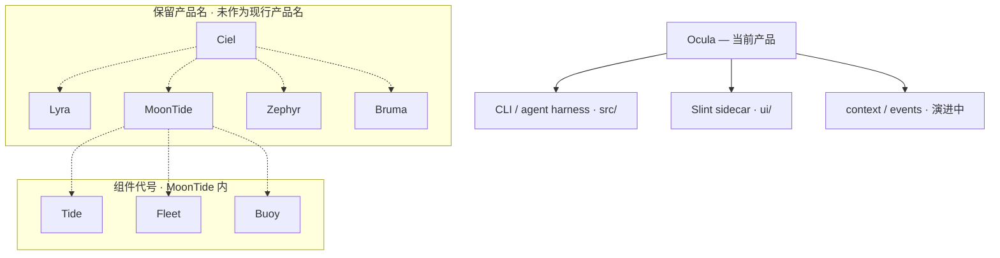

# Ocula — Product Vision

**当前产品名：Ocula** · 读音 **/AH-kyoo-lah/**（重音第二音节）

> Doc Map：[`docs/README.md`](../README.md) · 任务清单：[`TODO.md`](../../TODO.md)

本仓库交付的是 **Ocula** — 最小可用的 coding agent CLI + Slint sidecar。  
**Ocula** 来自 *oculus*（眼 / 观测），与 AgentEvent、trace、tool use log 等观测语义一致。

文档、代码、CLI、配置目录（`.ocula/`）、环境变量（`OCULA_*`）统一使用 **Ocula**。不使用下文**保留产品名**或**组件代号**指称当前产品或实现模块。

---

## 保留产品名（未来产品线，当前不用）

以下名称已登记为 **未来产品线保留名**，仅供愿景与 TODO 引用；**不是**本仓库现行产品名，也不应在 user-facing 文案、README 或实现注释中替代 Ocula。

| 保留产品名 | 天象意象 | 设想方向（远期） |
|------------|----------|------------------|
| **Ciel** | 天 | 产品家族 / 天象母题总称 |
| **Lyra** | 天琴（星） | 独立 agent harness 产品线（若与 Ocula 分叉） |
| **MoonTide** | 月潮 | 多 panel / 多窗口 desktop shell |
| **Zephyr** | 风 | 跨 agent 产品切换与迁移 |
| **Bruma** | 雾 | Session 事实为 source of truth（技术 Spec：**Session Event Log**，见 [`context-composer.md`](../spec/context-composer.md)） |

**Bruma 用法：** 仅指远期独立产品线方向。Ocula 内演进 Session Event Log / Context Composer 时，**产品名仍称 Ocula**，spec 与实现用 **Session Event Log**、**Context Composer**——**不把 Bruma 当作架构或模块代号**。

---

## 组件代号（MoonTide 内 panel，当前不用）

以下名称是 **MoonTide 产品内的组件代号**，不是独立产品线保留名：

| 组件代号 | 所属 | 设想 |
|----------|------|------|
| **Tide** | MoonTide | 日常 action 摘要 panel |
| **Fleet** | MoonTide | 多 agent 运行监控 panel |
| **Buoy** | MoonTide | Pin notes |

---

虚线表示 **愿景关联**，不表示本 repo 已以该名称对外发布。

### 备忘（非现行规格）

- **Bruma** — Session 完整事实为 source of truth（**Session Event Log**）；model context 仅为 **`LLMRequest` 编译产物**。Spec：[`context-composer.md`](../spec/context-composer.md)；在 Ocula 中由 `src/context/` 等模块逐步演进。
- **MoonTide / Tide / Fleet / Buoy** — 桌面 shell 与 panel 设想，见 [`TODO.md`](../../TODO.md)。
- **Zephyr** — 跨 Cursor / Claude Code / Codex 等工具的会话管理与迁移，远期。
- **Lyra** — 曾为 harness 候选名；若未来单独发产品线再启用，当前 harness 即 **Ocula**。

---

## 命名母题（保留产品名共用）

**天象层**：天 · 星 · 月潮 · 风 · 雾。

- 英文保留名有隐喻，避免 Code / Studio 等直白命名
- 不走地理分类感（Atoll / Estuary 等已弃）
- 不走织物系（Loom / Spool / Motif / Swatch 等已弃）
- **Aster** 曾为 harness 候选，已由 **Lyra** 保留名取代（二者均未用于现行产品名）

## Naming non-goals

不用于产品 / 保留名登记：

- Code / Studio（过直白）
- Current（显 low）
- Atoll / Estuary / Archipelago（地理古板）
- Loom / Spool / Weave / Shuttle / Motif / Swatch（织物系，已弃）
- Eauland / Oceanland / Ocean Realm（地理感 + 泛化）

---

## Status

- **对外与实现：Ocula**
- **技术标识：`ocula/` repo、`.ocula/`、`OCULA_*`、npm `ocula`**
- **保留产品名：仅文档 / TODO / 愿景，不替代当前产品名，不作实现模块代号**
- **组件代号：仅 MoonTide 愿景内 panel 指称**
- 发布架构与竞争定位见 [`platform-strategy.md`](platform-strategy.md)
- 无计划将 CLI 二进制或 npm 包改名为 Lyra、Bruma 等保留产品名
