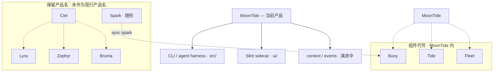

**当前产品名：MoonTide** · 读音 **/MOON-tide/**

> Doc Map：[`docs/README.md`](../README.md) · 任务清单：[`TODO.md`](../../TODO.md)

本仓库交付的是 **MoonTide** — 最小可用的 coding agent CLI + Slint sidecar。
**MoonTide** 以月潮为意象，承载 AgentEvent、trace、tool use log 等运行观测能力。

对外文案、CLI 展示和产品文档统一使用 **MoonTide**。已有技术标识（`moontide-*` crate、`.moontide/`、`MOONTIDE_*`）保留，以避免破坏已有配置和工作区数据。

---

## 保留产品名（未来产品线，当前不用）

以下名称已登记为 **未来产品线保留名**，仅供愿景与 TODO 引用；**不是**本仓库现行产品名，也不应在 user-facing 文案、README 或实现注释中替代 MoonTide。

| 保留产品名 | 意象 | 设想方向（远期） |
|------------|------|------------------|
| **Spark** | 火花（OceanSpark 下钻） | 移动端 capture / 成长助手（**随形**）；见 [`spark.md`](spark.md) |
| **Ciel** | 天 | 产品家族 / 天象母题总称 |
| **Lyra** | 天琴（星） | 独立 agent harness 产品线（若与 MoonTide 分叉） |
| **Zephyr** | 风 | 跨 agent 产品切换与迁移 |
| **Bruma** | 雾 | Session 事实为 source of truth（技术 Spec：**Session Event Log**，见 [`context-composer.md`](../spec/context-composer.md)） |

**Bruma 用法：** 仅指远期独立产品线方向。MoonTide 内演进 Session Event Log / Context Composer 时，**产品名仍称 MoonTide**，spec 与实现用 **Session Event Log**、**Context Composer**——**不把 Bruma 当作架构或模块代号**。

---

## 组件代号（MoonTide 内 panel，当前不用）

以下名称是 **MoonTide 产品内的组件代号**，不是独立产品线保留名：

| 组件代号 | 所属 | 设想 |
|----------|------|------|
| **Tide** | MoonTide | 日常 action 摘要 panel |
| **Fleet** | MoonTide | 多 agent 运行监控 panel |
| **Buoy** | MoonTide | Pin notes · 桌面 pending **spark** 收件箱（对接 Spark 移动端） |

---

虚线表示 **愿景关联**；MoonTide 是本仓库当前对外产品名。

### 备忘（非现行规格）

- **Bruma** — Session 完整事实为 source of truth（**Session Event Log**）；model context 仅为 **`LLMRequest` 编译产物**。Spec：[`context-composer.md`](../spec/context-composer.md)；在 MoonTide 中由 `src/context/` 等模块逐步演进。
- **Spark** — OceanSpark 移动端 capture / 成长助手（**随形**）；内容原语 **`spark`**；详 [`spark.md`](spark.md)。
- **MoonTide / Tide / Fleet / Buoy** — MoonTide 桌面 shell 与 panel 设想；**Buoy** 承接 Spark sync，见 [`TODO.md`](../../TODO.md)。
- **Zephyr** — 跨 Cursor / Claude Code / Codex 等工具的会话管理与迁移，远期。
- **Lyra** — 曾为 harness 候选名；若未来单独发产品线再启用，当前 harness 即 **MoonTide**。

---

## 命名母题（保留产品名共用）

**天象 / 海洋层**：天 · 星 · 月潮 · 风 · 雾 · **火花（Spark / OceanSpark）**。

- 英文保留名有隐喻，避免 Code / Studio 等直白命名
- 不走地理分类感（Atoll / Estuary 等已弃）
- 不走织物系（Loom / Spool / Motif / Swatch 等已弃）
- **Aster** 曾为 harness 候选，已由 **Lyra** 保留名取代（二者均未用于现行产品名）

## Naming non-goals

不用于产品 / 保留名登记：

- Code / Studio（过直白）
- Current（显 low）
- Atoll / Estuary / Archipelago（地理古板）
- Loom / Spool / Weave / Shuttle / Motif / Swatch（织物系，已弃）
- Eauland / Oceanland / Ocean Realm（地理感 + 泛化）

---

## Status

- **对外与实现：MoonTide**
- **技术标识：`moontide/` repo、`.moontide/`、`MOONTIDE_*`、`moontide-*` Rust crates；npm 包名 `moontide`**
- **公司：OceanSpark**
- **保留产品名：仅文档 / TODO / 愿景，不替代当前产品名，不作实现模块代号**
- **组件代号：仅 MoonTide 愿景内 panel 指称**
- 发布架构与竞争定位见 [`platform-strategy.md`](platform-strategy.md)
- 无计划将 CLI 二进制或 npm 包改名为 Lyra、Bruma 等保留产品名
