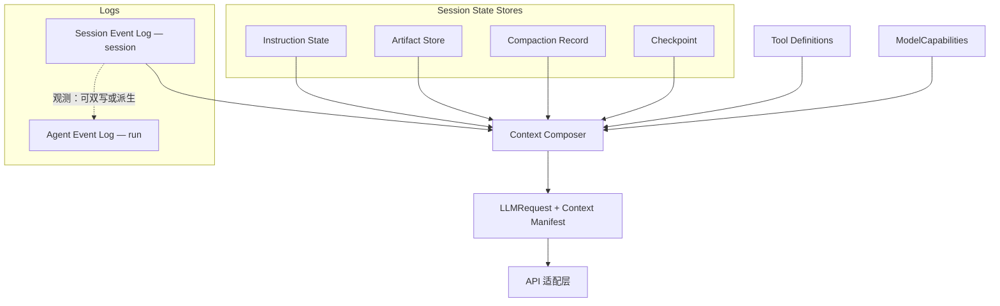

# Ocula Context Composer 与 Session 中间态

> Context window 的数据组成、持久化边界与编译流程。  
> 一次 API 调用的出口类型见 [`llm-provider.md`](llm-provider.md)（`LLMRequest`）；三参数对表见 [`llm-input.md`](llm-input.md)；行业背景见 [`context-analysis.md`](../notes/context-analysis.md)。

---

## 1. 目的与边界

### 1.1 定位

Ocula 的 context window 不是「一个可变 `messages[]`」，而是：

```
Session Event Log + Session State Stores + Tool Definitions + ModelCapabilities
        ↓
Context Composer（含 Compaction 投影策略）
        ↓
LLMRequest + Context Manifest
        ↓
API 适配层 → 厂商 API
```

**Context Composer** 是唯一允许产出「发给模型的 immutable input」的模块。Harness（`agent/loop`、tool 执行）只 append 会话事实、调用 Composer、再调 `LLMProvider`。

### 1.2 与相关文档的分工

| 文档 | 职责 |
|------|------|
| [`llm-provider.md`](llm-provider.md) | `LLMRequest` / Ocula 协议、API 适配层、ModelCapabilities 来源 |
| [`llm-input.md`](llm-input.md) | `system` / `tools` / `messages` 对表与现状缺口 |
| [`context-analysis.md`](../notes/context-analysis.md) | 行业 SOTA 与竞品参考 |
| [`agent-events.md`](agent-events.md) | **Agent Event Log**（run 级观测） |
| 本文 | **Session Event Log**、Session State Stores、Composer、Manifest |

### 1.3 设计 Invariant（五条）

1. **Session Event Log append-only** — 不 `splice` 删历史；compact 只改投影，不改事实。
2. **投影 immutable** — 每 turn 新建 `LLMRequest`；adapter 只读，不 mutate Composer 产出。
3. **Instruction State 独立于对话摘要** — `system` 每轮从 Instruction State 重建，不依赖 summary 记得规则。
4. **Compaction ≠ Checkpoint** — 前者调整 context 预算投影；后者保存可恢复快照；互不必然伴随。
5. **厂商中性** — Session 中间态使用 Ocula `ContentBlock`（见 [`llm-provider.md` §9.1](llm-provider.md#91-ocula-协议内核唯一依赖)），不存 SDK 专有类型。

---

## 2. 架构总览



---

## 3. 术语表

| 术语 | 定义 | 持久化 | 典型路径 / 模块 |
|------|------|--------|-----------------|
| **Agent Event Log** | 单次 run 的观测事件（trace、metrics、audit） | 是 | `.ocula/runs/<runId>.jsonl` |
| **Session Event Log** | 整场 session 的 append-only 事实 | 是 | `.ocula/sessions/<sessionId>.jsonl` |
| **Instruction State** | 拼进 `LLMRequest.system` 的规则与 prompt 来源 | 部分（文件源） | 内存 + `AGENTS.md` / `.ocula/rules`（远期） |
| **Artifact Store** | 大 tool 输出全文 | 是 | `.ocula/artifacts/<sessionId>/<artifactId>` |
| **Compaction Record** | summary / structured 压缩的持久产物 | 是 | `.ocula/sessions/<sessionId>/compaction/<id>.json` |
| **Checkpoint** | 某 turn 的可恢复快照 | 是 | `.ocula/sessions/<sessionId>/checkpoints/<id>.json` |
| **Compaction** | 调整 Composer 投影策略的操作（过程） | 事件写入 Session Event Log | — |
| **Tool Definitions** | 本轮 `LLMRequest.tools` 的 schema 集合 | 否（运行时快照） | `Tool Registry.schemas()` → Composer |
| **ModelCapabilities** | context 上限、token 计数策略等 | 配置 / catalog | [`llm-provider.md` §9.4](llm-provider.md#94-modelcapabilities) |
| **Context Composer** | 编译 `LLMRequest` + `Context Manifest` | 否 | 目标：`src/context/composer/` |
| **Context Manifest** | 本轮投影决策与预算说明 | 可选持久 / 观测 | 随 turn 写入 Agent Event Log 或内存 |
| **Bruma** | vision 保留代号，指 Session 事实为 source of truth 的产品方向 | — | 技术 Spec 用 **Session Event Log** |

---

## 4. Agent Event Log 与 Session Event Log

| | **Agent Event Log** | **Session Event Log** |
|---|---------------------|------------------------|
| **Scope** | 单次 **run** | 整场 **session**（可跨多个 run） |
| **路径** | `.ocula/runs/<runId>.active.jsonl` | `.ocula/sessions/<sessionId>.jsonl` |
| **职责** | trace、context metrics、audit、UI tail | **source of truth**：user、assistant、tool、compaction、checkpoint 等事实 |
| **是否 append-only** | 是（按 run 分段压缩） | 是 |
| **与模型 input 关系** | 观测镜像；**不是**唯一事实源 | 事实源；Composer **读取**后投影，不整包等于 `LLMRequest` |

**关系（目标）：**

- Session Event Log 为权威；Agent Event Log 可从其 **派生** 或 **双写** 观测字段。
- 第一版实现可并存；不得以 Agent Event Log 反向覆盖 Session Event Log。

详见 [`agent-events.md`](agent-events.md)。

---

## 5. Session Event Log — 条目 Spec

每行一条 JSON（NDJSON）。条目厂商中性；assistant / tool 块对齐 Ocula `ContentBlock`。

```typescript
export type SessionLogEntry =
  | UserMessageEntry
  | AssistantMessageEntry
  | ToolInvocationEntry
  | ToolOutcomeEntry
  | CompactionEventEntry
  | CheckpointCreatedEntry
  | RoutingEntry;

interface SessionLogEntryBase {
  id: string;
  sessionId: string;
  turn: number;
  at: string; // ISO 8601
}

export interface UserMessageEntry extends SessionLogEntryBase {
  kind: "user_message";
  text: string;
}

export interface AssistantMessageEntry extends SessionLogEntryBase {
  kind: "assistant_message";
  blocks: ContentBlock[];
}

export interface ToolInvocationEntry extends SessionLogEntryBase {
  kind: "tool_invocation";
  toolUseId: string;
  name: string;
  input: Record<string, unknown>;
}

export interface ToolReceipt {
  summary: string;
  byteCount: number;
  lineCount?: number;
  truncated?: boolean;
}

export interface ToolOutcomeEntry extends SessionLogEntryBase {
  kind: "tool_outcome";
  toolUseId: string;
  artifactId?: string;
  receipt: ToolReceipt;
}

export interface CompactionEventEntry extends SessionLogEntryBase {
  kind: "compaction";
  compactionKind: "prune" | "tail_window" | "summary";
  compactionRecordId?: string;
  excludedEntryIds: string[];
  beforeTokens?: number;
  afterTokens?: number;
}

export interface CheckpointCreatedEntry extends SessionLogEntryBase {
  kind: "checkpoint_created";
  checkpointId: string;
}

export interface RoutingEntry extends SessionLogEntryBase {
  kind: "routing";
  decision: RoutingDecision; // 见 llm-provider.md §9.5
}
```

**Append 时机（目标）：**

- user 输入 → `user_message`
- LLM 返回 → `assistant_message`
- 模型发起 tool → `tool_invocation`（可与 assistant 同 turn 关联）
- tool 执行完 → `tool_outcome`
- 发生 Compaction → `compaction`
- 创建 Checkpoint → `checkpoint_created`

---

## 6. Session State Stores

与 Session Event Log **并列**；Composer 编译时一并读取。

### 6.1 Instruction State

```typescript
export interface InstructionState {
  basePrompt: string;
  projectRules?: string;
  userMemory?: string;
  epoch: number;
}
```

- **来源：** 今日逻辑来自 [`src/agent/prompt.ts`](../../src/agent/prompt.ts)；远期 `AGENTS.md`、`.ocula/rules`。
- **Composer：** 每 turn 拼成 `LLMRequest.system`；**不参与** conversation summary。
- **`epoch`：** 规则文件变更时递增，便于 cache 与调试。

### 6.2 Artifact Store

```typescript
export interface Artifact {
  id: string;
  sessionId: string;
  toolUseId: string;
  contentType: "text" | "json" | "binary";
  path: string;
  byteCount: number;
  createdAt: string;
}
```

- **路径：** `.ocula/artifacts/<sessionId>/<artifactId>`
- **Session Event Log：** `tool_outcome` 只存 `artifactId` + `receipt`；全文在 Artifact Store。
- **Composer：** 默认只投影 receipt；模型可通过 `read_artifact` 类 tool 按需读取（产品行为，实现期定义阈值）。

### 6.3 Compaction Record

```typescript
export interface CompactionRecord {
  id: string;
  sessionId: string;
  createdAtTurn: number;
  kind: "summary" | "structured";
  coversEntryIds: string[];
  /** summary 类：自由文本；structured 类：结构化字段 */
  payload: SummaryPayload | StructuredPayload;
}

export interface StructuredPayload {
  goals: string[];
  decisions: string[];
  openQuestions: string[];
  fileAnchors: string[];
}
```

- **路径：** `.ocula/sessions/<sessionId>/compaction/<id>.json`
- **何时写入：** 仅 **summary / structured** 类 Compaction 需要；**prune / tail_window** 不需要 Compaction Record。
- **Composer：** 投影旧对话时引用最新适用的 Compaction Record + 最近 tail 条目。

### 6.4 Checkpoint

```typescript
export interface Checkpoint {
  id: string;
  sessionId: string;
  createdAtTurn: number;
  lastEntryId: string;
  instructionEpoch: number;
  activeCompactionRecordId?: string;
  composerPolicyVersion?: string;
  label?: string;
}
```

- **路径：** `.ocula/sessions/<sessionId>/checkpoints/<id>.json`
- **用途：** resume、debug、fork；**不**等同于 Compaction Record。
- **触发（示例）：** user turn 结束、用户命令、run 结束；与是否刚 Compaction **无必然关系**。

---

## 7. Compaction

### 7.1 定义

**Compaction** 是为把 context 投影塞进 **ModelCapabilities** 预算而调整 Composer 规则的一次操作。

- **不删除** Session Event Log 条目。
- **必留痕迹：** Session Event Log 的 `compaction` 事件 + 本轮 **Context Manifest**。

### 7.2 Compaction 类型

| 类型 | 行为 | 需要 Compaction Record |
|------|------|------------------------|
| **prune** | 旧 tool 结果只投影 receipt / 占位 | 否 |
| **tail_window** | 只投影最近 N 轮 user turn 起的条目 | 否 |
| **summary** | LLM 生成摘要并注入投影 | 是 |

### 7.3 与 today `/compact` 的对照

| 今天 [`compact.ts`](../../src/context/compact.ts) | 目标 |
|------------------------------------------------|------|
| auto compact：`splice` 旧 tool_result | **prune** 投影；Session Event Log 不变 |
| `/compact summary`：摘要塞进 `messages[]` | 写 **Compaction Record** + `compaction` 事件；Composer 引用 |

---

## 8. Checkpoint

### 8.1 定义

**Checkpoint** 是某一 turn 的 **可恢复快照**：保存 Composer 重建输入所需的指针与 metadata。

### 8.2 与 Compaction 的关系

| | Compaction | Checkpoint |
|---|------------|------------|
| **目的** | 控制本轮 **模型可见** context 大小 | **恢复 / 复现** 某一会话态 |
| **是否删事实** | 否 | 否 |
| **典型产物** | Manifest；可选 Compaction Record | Checkpoint 文件 + `checkpoint_created` 事件 |
| **依赖关系** | 独立 | 独立 |

可以：仅 Compaction、仅 Checkpoint、或两者先后发生。

### 8.3 恢复（目标行为）

加载 Checkpoint → Composer 从 `lastEntryId` / `activeCompactionRecordId` / `instructionEpoch` 重建输入态 → 继续 append Session Event Log。

---

## 9. Tool Definitions 与 ModelCapabilities

### 9.1 Tool Definitions

- **含义：** 本轮 `LLMRequest.tools` — 每个 tool 的 `name`、`description`、`input_schema`。
- **来源：** Harness 内 **Tool Registry**（实现：[`src/agent/tools/catalog.ts`](../../src/agent/tools/catalog.ts) 的 `ToolCatalog.schemas()`）。
- **文档与代码：** 架构层称 **Tool Definitions**；代码类型 `ToolCatalog` 为 Registry 实现名，重构时可改为 `ToolRegistry`。

### 9.2 ModelCapabilities

- **含义：** 当前 logical model 的 context 上限、输出上限、是否支持 tools/thinking、`tokenCount: "api" | "estimate"`。
- **来源：** [`llm-provider.md` §9.4](llm-provider.md#94-modelcapabilities)（Model Catalog + env 覆盖）。
- **Composer：** 预算阈值、compact 触发、Manifest 中的 `limit` / `percentUsed`。

---

## 10. Context Composer

### 10.1 接口（目标）

```typescript
export interface ComposeContextInput {
  sessionId: string;
  turn: number;
  sessionLog: SessionLogReader;
  instructionState: InstructionState;
  artifacts: ArtifactStore;
  compactionRecords: CompactionRecordStore;
  checkpoints: CheckpointStore;
  toolDefinitions: ToolDefinition[];
  modelCapabilities: ModelCapabilities;
  compactionPolicy: CompactionPolicy;
  resumeFromCheckpointId?: string;
}

export interface ComposedContext {
  request: LLMRequest;
  manifest: ContextManifest;
}

export function composeContext(input: ComposeContextInput): ComposedContext;
```

### 10.2 Context Manifest

```typescript
export interface ContextManifest {
  turn: number;
  sessionId: string;
  modelCapabilities: ModelCapabilities;
  estimatedInputTokens: number;
  exactInputTokens?: number;
  includedEntryIds: string[];
  excludedEntryIds: string[];
  activeCompactionRecordId?: string;
  resumeCheckpointId?: string;
  alerts: ContextAlert[];
}
```

- 供 statusline、Agent Event Log、`inspect_context`、远期 Fleet（TODO #12）解释「为何丢 context」。

### 10.3 Loop 目标形态

```
agentLoop:
  turn += 1
  composed = composeContext(...)
  response = runLLM(composed.request)
  append assistant / tool entries to Session Event Log
  （不再 splice 共享 messages[]）
```

---

## 11. 现状 vs 目标

| 项 | 现状 | 目标 |
|----|------|------|
| 会话事实 | 可变 `MessageParam[]` in [`loop.ts`](../../src/agent/loop.ts) | **Session Event Log** append-only |
| API 输入 | 同一数组直接 `runLLM` | **Composer** → `LLMRequest` |
| Compact | [`compact.ts`](../../src/context/compact.ts) `splice` | **Compaction** 事件 + 投影；可选 **Compaction Record** |
| Session 内存 | [`sessions.ts`](../../src/context/sessions.ts) 存 messages 引用 | 存 Manifest / log 指针 |
| 观测 | **Agent Event Log** | 保留；与 Session Event Log 职责分离 |
| 大 tool 输出 | 全文 in tool_result | **Artifact Store** + receipt |
| system 规则 | 仅 `prompt.ts` | **Instruction State** |
| 恢复 | `/reset` 清空 | **Checkpoint** resume（远期） |

---

## 12. 后续实现分期（代码指引）

> **本节为代码落地顺序，非当前文档交付范围。** 须先完成 [`llm-provider.md` §13](llm-provider.md#13-后续实现分期代码指引) 阶段 A–C（Ocula 协议 + `LLMProvider` + `ModelCapabilities`）。

| 阶段 | 内容 | 验收 |
|------|------|------|
| **C0** | Provider A–C | `LLMRequest` 类型边界就绪 |
| **C1** | Session Event Log 写入 + Composer 骨架；**prune** 投影 | 行为接近 today auto compact，但不 `splice` |
| **C2** | Artifact Store + `tool_outcome` receipt | 大 read 不全文进投影 |
| **C3** | Instruction State（`AGENTS.md` / rules） | system 与 summary 解耦 |
| **C4** | Compaction Record + summary Compaction | `/compact summary` 迁移 |
| **C5** | Checkpoint 持久化与 resume | 跨 REPL 续 session |
| **C6** | Agent Event Log 与 Session Event Log 同步策略优化 | 观测与事实一致或可推导 |

---

## 13. 相关文档

| 文档 | 关系 |
|------|------|
| [`llm-provider.md`](llm-provider.md) | `LLMRequest`、`ModelCapabilities`、API 适配层 |
| [`llm-input.md`](llm-input.md) | 三参数对表与现状缺口 |
| [`context-analysis.md`](../notes/context-analysis.md) | 行业 SOTA |
| [`agent-events.md`](agent-events.md) | Agent Event Log schema |
| [`vision.md`](../product/vision.md) | Bruma 代号与产品方向 |
| [`agent.md`](../../agent.md) | 文档用词偏好 |
| [`context-backlog.md`](../notes/context-backlog.md) | Context 演进特性 backlog（分账、IR、实验与 Deferred） |

---

## 14. 一句话

**Session Event Log 存事实；Session State Stores 存指令、产物、压缩与快照；Context Composer 每轮编译 immutable `LLMRequest` + Context Manifest；Compaction 管投影预算，Checkpoint 管恢复——二者独立。**

---

## 15. Context 特性 backlog（演进）

主 Spec（本文 §1–§14、C0–C6）落地后，可按 [`context-backlog.md`](../notes/context-backlog.md) 择项演进：

- **Core：** Context Budget Tiers（L1 Pinned / L2 Dialogue / L3 Reference / L4 Reserved）— 各块 token 分账，避免 dialogue 挤占 Instruction 与输出预留
- **优先：** Structured Session IR（files / tool / task；对话不做全 session 向量 graph）
- **Experiment / Backlog：** Priority Placement、Intent-scoped Working Set、Compose-time Dedup（CDC）
- **Deferred：** Compaction Invariants 验证（当前不纳入验收）
