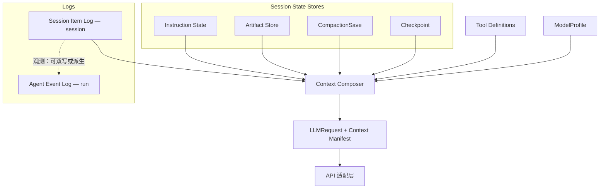

# Ocula Context Composer 与 Session 中间态

> Context window 的数据组成、持久化边界与编译流程。  
> 一次 API 调用的出口类型见 [`llm-provider.md`](llm-provider.md)（`LLMRequest`）；三参数对表见 [`llm-input.md`](llm-input.md)；行业背景见 [`context-analysis.md`](../notes/context-analysis.md)。

---

## 1. 目的与边界

### 1.1 定位

Ocula 的 context window 不是「一个可变 `messages[]`」，而是：

```
Session Event Log + Session State Stores + Tool Definitions + ModelProfile
        ↓
Context Composer（含 Compaction 投影策略）
        ↓
LLMRequest + Context Manifest
        ↓
API 适配层 → 厂商 API
```

**Context Composer** 是唯一允许产出「发给模型的 immutable input」的模块。Harness（`agent/loop`、tool 执行）只 mutate **SessionContext**（内存）、append **SessionItem**（jsonl）、经 **SessionTransform** 转为协议 `Message[]`，再调用 Composer 与 `LLMProvider`。

> **TypeScript（2026）：** 运行时真相为 [`SessionContext`](../notes/session-domain-model.md)（`{ messages }` only）；**Session Item Log** 存 `SessionItem`；**Context Composer**（`composeContext`）为唯一 LLM 输入出口；Agent 观测在 [`src/log`](../../src/log/)。  
> **Rust R1：** `ocula-composer` + `ocula-session` 已实现 Artifact Store 分级投影、TruncationFallback、`read_artifact`、prune compaction（无 LLM summary）；Session Log append-only 不变。

### 1.2 与相关文档的分工

| 文档 | 职责 |
|------|------|
| [`llm-provider.md`](llm-provider.md) | `LLMRequest` / Ocula 协议、API 适配层、ModelProfile 来源 |
| [`llm-input.md`](llm-input.md) | `system` / `tools` / `messages` 对表与现状缺口 |
| [`context-analysis.md`](../notes/context-analysis.md) | 行业 SOTA 与竞品参考 |
| [`agent-events.md`](agent-events.md) | **Agent Event Log**（run 级观测） |
| 本文 | **Session Item Log**、Session State Stores、Composer、Manifest |

### 1.3 设计 Invariant（五条）

1. **Session Item Log append-only** — 不 `splice` 删历史；compact 只改投影，不改事实。
2. **投影 immutable** — 每 turn 新建 `LLMRequest`；adapter 只读，不 mutate Composer 产出。
3. **Instruction State 独立于对话摘要** — `system` 每轮从 Instruction State 重建，不依赖 summary 记得规则。
4. **Compaction ≠ Checkpoint** — 前者调整 context 预算投影；后者保存可恢复快照；互不必然伴随。
5. **厂商中性** — Session 中间态使用 Ocula `ContentBlock`（见 [`llm-provider.md` §9.1](llm-provider.md#91-ocula-协议内核唯一依赖)），不存 SDK 专有类型。

---

## 2. 架构总览



---

## 3. 术语表

| 术语 | 定义 | 持久化 | 典型路径 / 模块 |
|------|------|--------|-----------------|
| **Agent Event Log** | 单次 run 的观测事件（trace、metrics、audit） | 是 | `.ocula/runs/<runId>.jsonl` |
| **Session Item Log** | 整场 session 的 append-only 事实 | 是 | `.ocula/sessions/<sessionId>.jsonl` |
| **Instruction State** | 拼进 `LLMRequest.system` 的规则与 prompt 来源 | 部分（文件源） | 内存 + `AGENTS.md` / `.ocula/rules`（远期） |
| **Artifact Store** | 大 tool 输出全文 | 是 | `.ocula/artifacts/<sessionId>/<artifactId>` + `<id>.meta.json` |
| **CompactionSave** | summary / structured 压缩的持久产物 | 是 | `.ocula/sessions/<sessionId>/compaction/<id>.json` |
| **Checkpoint** | 某 turn 的可恢复快照 | 是 | `.ocula/sessions/<sessionId>/checkpoints/<id>.json` |
| **Compaction** | 调整 Composer 投影策略的操作（过程） | 事件写入 Session Item Log | — |
| **Tool Definitions** | 本轮 `LLMRequest.tools` 的 schema 集合 | 否（运行时快照） | [`tools/`](../../src/tools/) `getToolDefinitions()` → Composer |
| **ModelProfile** | context 上限、token 计数策略等 | model 注册表 + env | [`llm/models/resolve.ts`](../../src/llm/models/resolve.ts) |
| **Context Composer** | 编译 `LLMRequest` + `Context Manifest` | 否 | [`src/context/composer/`](../../src/context/composer/) |
| **Context Manifest** | 本轮投影决策与预算说明 | 可选持久 / 观测 | compose 产出；statusline / inspect |
| **Bruma** | vision **保留产品名** | — | 本 repo 实现与 Spec 用 **Session Item Log** |

---

## 4. Agent Event Log 与 Session Item Log

| | **Agent Event Log** | **Session Item Log** |
|---|---------------------|------------------------|
| **Scope** | 单次 **run** | 整场 **session**（可跨多个 run） |
| **路径** | `.ocula/runs/<runId>.active.jsonl` | `.ocula/sessions/<sessionId>.jsonl` |
| **职责** | trace、context metrics、audit、UI tail | **source of truth**：user、assistant、tool、compaction、checkpoint 等事实 |
| **是否 append-only** | 是（按 run 分段压缩） | 是 |
| **与模型 input 关系** | 观测镜像；**不是**唯一事实源 | 事实源；Composer 读 **SessionContext.messages** + Stores 投影 |

**关系（目标）：**

- Session Event Log 为权威；Agent Event Log 可从其 **派生** 或 **双写** 观测字段。
- 第一版实现可并存；不得以 Agent Event Log 反向覆盖 Session Event Log。

详见 [`agent-events.md`](agent-events.md)。

---

## 5. Session Event Log — 条目 Spec

每行一条 JSON（NDJSON）。条目厂商中性；assistant / tool 块对齐 Ocula `ContentBlock`。

```typescript
export type SessionLogEntry =
  | UserMessageEntry
  | AssistantMessageEntry
  | ToolInvocationEntry
  | ToolOutcomeEntry
  | CompactionEventEntry
  | CheckpointCreatedEntry
  | RoutingEntry;

interface SessionLogEntryBase {
  id: string;
  sessionId: string;
  turn: number;
  at: string; // ISO 8601
}

export interface UserMessageEntry extends SessionLogEntryBase {
  kind: "user_message";
  text: string;
}

export interface AssistantMessageEntry extends SessionLogEntryBase {
  kind: "assistant_message";
  blocks: ContentBlock[];
}

export interface ToolInvocationEntry extends SessionLogEntryBase {
  kind: "tool_invocation";
  toolUseId: string;
  name: string;
  input: Record<string, unknown>;
}

export interface ToolResultSummary {
  summary: string;
  byteCount: number;
  lineCount?: number;
  truncated?: boolean;
}

export interface ToolOutcomeEntry extends SessionLogEntryBase {
  kind: "tool_outcome";
  toolUseId: string;
  artifactId?: string;
  resultSummary: ToolResultSummary;
}

export interface CompactionEventEntry extends SessionLogEntryBase {
  kind: "compaction";
  compactionKind: "prune" | "tail_window" | "summary";
  compactionRecordId?: string;
  excludedEntryIds: string[];
  beforeTokens?: number;
  afterTokens?: number;
}

export interface CheckpointCreatedEntry extends SessionLogEntryBase {
  kind: "checkpoint_created";
  checkpointId: string;
}

export interface RoutingEntry extends SessionLogEntryBase {
  kind: "routing";
  decision: RoutingDecision; // 见 llm-provider.md §9.5
}
```

**Append 时机（目标）：**

- user 输入 → `user_message`
- LLM 返回 → `assistant_message`
- 模型发起 tool → `tool_invocation`（可与 assistant 同 turn 关联）
- tool 执行完 → `tool_outcome`
- 发生 Compaction → `compaction`
- 创建 Checkpoint → `checkpoint_created`

---

## 6. Session State Stores

与 Session Event Log **并列**；Composer 编译时一并读取。

### 6.1 Instruction State

```typescript
export interface InstructionState {
  basePrompt: string;
  projectRules?: string;
  userMemory?: string;
  epoch: number;
}
```

- **来源：** 今日逻辑来自 [`src/agent/prompt.ts`](../../src/agent/prompt.ts)；远期 `AGENTS.md`、`.ocula/rules`。
- **Composer：** 每 turn 拼成 `LLMRequest.system`；**不参与** conversation summary。
- **`epoch`：** 规则文件变更时递增，便于 cache 与调试。

### 6.2 Artifact Store

```typescript
export interface Artifact {
  id: string;
  sessionId: string;
  toolUseId: string;
  contentType: "text" | "json" | "binary";
  path: string;
  byteCount: number;
  createdAt: string;
}
```

- **路径：** `.ocula/artifacts/<sessionId>/<artifactId>`
- **Session Event Log：** `tool_outcome` 只存 `artifactId` + `resultSummary`（`ToolResultSummary`）；全文在 Artifact Store。
- **Composer：** 默认只投影 `resultSummary`；模型可通过 `read_artifact` 类 tool 按需读取（产品行为，实现期定义阈值）。

### 6.3 CompactionSave

```typescript
export interface CompactionSave {
  id: string;
  sessionId: string;
  createdAtTurn: number;
  kind: "summary" | "structured";
  coversItemIds: string[];
  payload: SummaryPayload | StructuredPayload;
}

export interface StructuredPayload {
  goals: string[];
  decisions: string[];
  openQuestions: string[];
  fileAnchors: string[];
}
```

- **路径：** `.ocula/sessions/<sessionId>/compaction/<id>.json`（`compactionSavePath`）
- **何时写入：** 仅 **summary / structured** 类 Compaction（`/compact summary` → `runSummaryCompaction`）
- **prune / tail_window：** 只写 Session Item Log 的 `compaction` 行，**不**写 CompactionSave
- **Composer：** `applySummary` 引用 `activeCompactionSaveId`；Manifest 含 `coversItemIds`
- **legacy jsonl：** `compaction` Item 仍用字段名 `compactionRecordId`（磁盘 schema 不变）

### 6.4 Checkpoint

```typescript
export interface Checkpoint {
  id: string;
  sessionId: string;
  createdAtTurn: number;
  lastItemId: string;
  instructionEpoch: number;
  activeCompactionSaveId?: string;
  composerPolicyVersion?: string;
  label?: string;
}
```

- **路径：** `.ocula/sessions/<sessionId>/checkpoints/<id>.json`
- **用途：** resume、debug、fork；**不**等同于 CompactionSave
- **CLI：** `/checkpoint [label]` · `/checkpoint list` · `/resume <id>`
- **恢复：** 内存 `messages` 截到 `lastItemId`；Item Log 继续 append-only；`composeContext({ resumeFromCheckpointId })`

---

## 7. Compaction

### 7.1 定义

**Compaction** 是为把 context 投影塞进 **ModelProfile** 预算而调整 Composer 规则的一次操作。

- **不删除** Session Event Log 条目。
- **必留痕迹：** Session Event Log 的 `compaction` 事件 + 本轮 **Context Manifest**。

### 7.2 Compaction 类型

| 类型 | 行为 | 需要 CompactionSave |
|------|------|------------------------|
| **prune** | 旧 tool 结果 shrink / strip thinking（`applyPrune`） | 否 |
| **tail_window** | 只投影最近 N 轮（`applyTailWindow` / Checkpoint resume） | 否 |
| **summary** | LLM 摘要注入投影（`applySummary` + CompactionSave） | 是 |

### 7.3 `/compact` 命令（已实现）

| 命令 | 行为 |
|------|------|
| `/compact` / `/compact prune` | 写 `compaction` Item；下轮 compose **forcePrune** |
| `/compact preview` | dry-run token 估算（经 `composeContext`） |
| `/compact summary` | LLM 摘要 → **CompactionSave** + `compaction` Item；激活 `activeCompactionSaveId` |
| `/compact auto on\|off` | REPL 级 auto-prune 开关（超阈值 compose 内 prune，不写 Item Log） |

---

## 8. Checkpoint

### 8.1 定义

**Checkpoint** 是某一 turn 的 **可恢复快照**：保存 Composer 重建输入所需的指针与 metadata。

### 8.2 与 Compaction 的关系

| | Compaction | Checkpoint |
|---|------------|------------|
| **目的** | 控制本轮 **模型可见** context 大小 | **恢复 / 复现** 某一会话态 |
| **是否删事实** | 否 | 否 |
| **典型产物** | Manifest；可选 Compaction Record | Checkpoint 文件 + `checkpoint_created` 事件 |
| **依赖关系** | 独立 | 独立 |

可以：仅 Compaction、仅 Checkpoint、或两者先后发生。

### 8.3 恢复（目标行为）

加载 Checkpoint → 内存 `messages` 截到 `lastItemId` → Composer 读 `activeCompactionSaveId` / `instructionEpoch` → 继续 append Session Item Log。

---

## 9. Tool Definitions 与 ModelProfile

### 9.1 Tool Definitions

- **含义：** 本轮 `LLMRequest.tools` — 每个 tool 的 `name`、`description`、`input_schema`。
- **来源：** [`src/tools/`](../../src/tools/) — `getToolDefinitions()` 产出 `ToolSchema[]` 快照；`executeTool()` 执行 handler。
- **Composer：** [`composer/tool-definitions/`](../../src/context/composer/tool-definitions/) resolve 为 `LLMRequest.tools`。

### 9.2 ModelProfile

- **含义：** 当前 logical model 的 context 上限、输出上限、是否支持 tools/thinking、`tokenCount: "api" | "estimate"`。
- **来源：** [`llm-provider.md` §9.4](llm-provider.md#94-modelcapabilities)（**model 注册表** + env 覆盖）。
- **Composer：** 预算阈值、compact 触发、Manifest 中的 `limit` / `percentUsed`。

---

## 10. Context Composer

### 10.1 接口（TypeScript 已实现）

```typescript
export interface ComposeContextInput {
  sessionId: string;
  turn: number;
  messages: readonly SessionMessage[];
  instructionState: InstructionState;
  artifactStore: ArtifactStore;
  compactionStore: CompactionStore;
  checkpointStore: CheckpointStore;
  toolDefinitions: ToolSchema[];
  modelProfile: ModelProfile;
  compactionPolicy: CompactionPolicy;
  resumeFromCheckpointId?: string;
  activeCompactionSaveId?: string;
}

export interface ComposedContext {
  request: ComposedLLMRequest;
  manifest: ContextManifest;
}

export function composeContext(input: ComposeContextInput): Promise<ComposedContext>;
```

**流水线：** `messages` → `messagesFromContext` → `applyTailWindow`（resume）→ `applySummary` / `applyPrune` → `toMessageParams` + Instruction State → `LLMRequest`

### 10.2 Context Manifest

```typescript
export interface ContextManifest {
  turn: number;
  sessionId: string;
  modelProfile: ModelProfile;
  estimatedInputTokens: number;
  exactInputTokens?: number;
  includedItemIds: string[];
  excludedItemIds: string[];
  activeCompactionSaveId?: string;
  resumeCheckpointId?: string;
  alerts: ContextAlert[];
}
```

- 供 statusline、Agent Event Log、`inspect_context`、远期 Fleet（TODO #12）解释「为何丢 context」。

### 10.3 Loop 目标形态

```
AgentRun:
  turn += 1
  composed = composeContext({ messages: session.getMessages(), stores, … })
  response = runLLM(composed.request)
  append assistant / tool to SessionContext + Session Item Log
  （不 splice messages[]）
```

---

## 11. 现状 vs 目标

| 项 | 现状（2026 TS） | 远期 |
|----|-----------------|------|
| 会话事实 | **Session Item Log** append-only + 内存 `SessionContext.messages` | — |
| API 输入 | **`composeContext`** → `LLMRequest` | Instruction State 文件源 |
| Compact | **Compaction** 事件 + compose 投影；summary → **CompactionSave** | structured compaction |
| 大 tool 输出 | **ArtifactStore** spill（默认 8KB）+ `formatToolSummary` | `read_artifact` tool |
| 恢复 | **`/checkpoint` / `/resume`** | fork / Fleet |
| 观测 | **Agent Event Log** | 与 Session Item Log 派生优化（C6） |

---

## 12. 后续实现分期（代码指引）

> **本节为代码落地顺序，非当前文档交付范围。** 须先完成 [`llm-provider.md` §13](llm-provider.md#13-后续实现分期代码指引) 阶段 A–C（Ocula 协议 + `LLMProvider` + `ModelProfile`）。

| 阶段 | 内容 | 状态 |
|------|------|------|
| **C0** | Provider A–C | 部分 |
| **C1** | Session Item Log + Composer **prune** 投影 | **done** |
| **C2** | Artifact Store + spill | **done** |
| **C3** | Instruction State（`AGENTS.md` / rules） | 接口就绪 |
| **C4** | CompactionSave + `/compact summary` | **done** |
| **C5** | Checkpoint + resume | **done** |
| **C6** | Agent Event Log 与 Session Item Log 同步优化 | pending |

---

## 13. 相关文档

| 文档 | 关系 |
|------|------|
| [`llm-provider.md`](llm-provider.md) | `LLMRequest`、`ModelProfile`、API 适配层 |
| [`llm-input.md`](llm-input.md) | 三参数对表与现状缺口 |
| [`context-analysis.md`](../notes/context-analysis.md) | 行业 SOTA |
| [`agent-events.md`](agent-events.md) | Agent Event Log schema |
| [`vision.md`](../product/vision.md) | Bruma 保留产品名与产品方向 |
| [`agent.md`](../../agent.md) | 文档用词偏好 |
| [`context-backlog.md`](../notes/context-backlog.md) | Context 演进特性 backlog（分账、IR、实验与 Deferred） |

---

## 14. 一句话

**Session Item Log 存事实；Session State Stores 存 CompactionSave / Checkpoint / Artifact；Context Composer 每轮编译 immutable `LLMRequest` + Context Manifest；Compaction 管投影预算，Checkpoint 管恢复——二者独立。**

---

## 15. Context 特性 backlog（演进）

主 Spec（本文 §1–§14、C0–C6）落地后，可按 [`context-backlog.md`](../notes/context-backlog.md) 择项演进：

- **Core：** Context Budget Tiers（L1 Pinned / L2 Dialogue / L3 Reference / L4 Reserved）— 各块 token 分账，避免 dialogue 挤占 Instruction 与输出预留
- **优先：** Structured Session IR（files / tool / task；对话不做全 session 向量 graph）
- **Experiment / Backlog：** Priority Placement、Intent-scoped Working Set、Compose-time Dedup（CDC）
- **Deferred：** Compaction Invariants 验证（当前不纳入验收）
