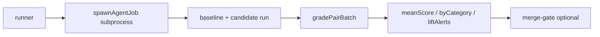

# Harness Eval 1.1

> **状态：** 1.1 · **实现：** [`packages/evals`](../../packages/evals/)  
> **设计依据：** [`agent-eval-task-taxonomy.md`](../notes/agent-eval-task-taxonomy.md)  
> **上游参考：** [`feature-ab-eval-guide.md`](../feature-ab-eval-guide.md)

Feature-scoped A/B：真 LLM harness + **pairwise judge**（1–5，candidate 相对 baseline）。

## 范围

- `@moontide/evals`：baseline/candidate 配对 run → judge → `pairs.jsonl` → `report.json`
- Case 字段：`category` + `gradingMode`（`objective` | `subjective`）+ `featureSurface`
- Batch judge（默认 8/批，同 category + gradingMode）
- **`suites/v2/`**：六类 58 case（`cases.jsonl` + fixtures / workspace / HTTP recordings）
- **`suites/v1/`**：legacy smoke（整文件 JSON）

**不含：** mock 主路径、CI 全量真 LLM eval（`pnpm eval:test` 仅跑单元测试）。

## 架构



## Workflow

1. 定义 baseline vs candidate（单变量，`--harness-config` 或 CLI flags）
2. 编写 case（`category`、`gradingMode`、可选 `expectedChecks` / `rubricBullets`）
3. `pnpm eval -- v2/deep_task --feature-surface=deep_protocol`
4. 读 report：`meanScore`、`winRate`、`regressionAlerts`、`liftAlerts`、`efficiency`
5. 合并前：`--merge-gate` + [Impact Card](../../.github/eval-impact-card.md)

## Case 示例

**Objective（external_research + HTTP replay）：**

```json
{
  "id": "ext-capital-api",
  "category": "external_research",
  "gradingMode": "objective",
  "featureSurface": ["tooling"],
  "steps": [{ "type": "prompt", "content": "Fetch https://gitee.com/api/v5/users/renyijiu ... login only." }],
  "expectedChecks": [
    { "kind": "tool_called", "name": "http_fetch" },
    { "kind": "reply_contains", "value": "renyijiu" }
  ]
}
```

**Subjective：**

```json
{
  "id": "deep-cache-decision",
  "category": "deep_task",
  "gradingMode": "subjective",
  "expectLift": true,
  "steps": [{ "type": "prompt", "content": "deep: redis vs memcached for session cache" }]
}
```

## Judge

| gradingMode | 流程 |
|-------------|------|
| `objective` | `expectedChecks` 确定性 gate → 无法区分时 LLM fallback |
| `subjective` | LLM pairwise + 可选 `rubricBullets`（`rubric-judge`） |

附加 grader（enrich，不进主 score）：`protocol-checks`、`efficiency-checks`。

### CLI 运行模式

| 模式 | flags | 用途 |
|------|--------|------|
| 全量 v2 | `pnpm eval -- v2` | 六类 58 case |
| 单题 debug | `--case-id=` + `--judge-mode=single` | 复现 |
| 只 agent | `--agent-only` | 落盘 response / 录 HTTP |
| 只 judge | `--judge-only --judge-from=pairs.jsonl` | 调 judge |
| Baseline delta | `--baseline-from=` / `--write-baseline` | 对比历史 |
| Merge gate | `--merge-gate` | CI / PR 门禁 |

## 合并决策（经验）

- `meanScore >= 3.5` 且目标 category 均分 ≥ 3.8 → 倾向合并
- `regressionAlerts` 非空 → 人工看 rationale
- `liftAlerts`（`expectLift` 题未 lift）→ 不 silent merge

## 命令

见 [`packages/evals/README.md`](../../packages/evals/README.md)。
