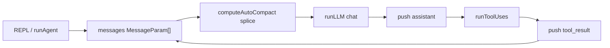

# Ocula LLM Input 对表

> 说明「成熟 agent 一次 LLM 请求应包含什么」，以及 **Ocula 当前实现** 落在哪、缺什么。  
> 行业背景见 [`context-analysis.md`](../notes/context-analysis.md)；Provider / API 适配层见 [`llm-provider.md`](llm-provider.md)；Session 中间态与 **Context Composer** 见 [`context-composer.md`](context-composer.md)（目标产出 **`LLMRequest`**）。  
> 本文只做 **API 对表 + 代码落点**，不涉及代码实现计划。

---

## 1. API 顶层：实际只有三个参数

Ocula 调用见 [`src/llm/client/anthropic.ts`](../../src/llm/client/anthropic.ts)：

```typescript
messages.create({ model, system, messages, tools, max_tokens })
```

| API 参数 | 含义 | Ocula 谁组装 | 现状 |
|----------|------|----------------|------|
| `system` | 静态/半静态指令 | [`src/agent/loop.ts`](../../src/agent/loop.ts) → `buildSystemPrompt()` | 有，每 turn 重建 |
| `tools` | 工具名 + description + schema | [`src/agent/tools/index.ts`](../../src/agent/tools/index.ts) → `toolSchemas()` | 有，按 config 动态注册 |
| `messages` | 对话时间线 | REPL / `runAgent` 创建数组，`loop.ts` append | 有，**单一可变数组** |
| `max_tokens` | 单次输出上限 | [`src/constants/llm.ts`](../../src/constants/llm.ts) `DEFAULT_MAX_TOKENS=8000` | 有，与 context 预算分开 |

**常见误解纠正：**

| 说法 | 实际落点 |
|------|----------|
| personal memory prompt | 应 **拼进 `system`**（或每轮从文件读出再拼），不是独立 API 字段 |
| user input | `messages` 里 **最新的 user 条目**，不是第 4 个参数 |
| tool output | `messages` 里 `role: user` 的 **`tool_result` block**，属于 session history |

---

## 2. `system` 里通常有什么

| 内容块 | 成熟做法 | Ocula | 代码 / 文件 | 备注 |
|--------|----------|---------|-------------|------|
| 身份 / 角色 | system 首段 | **有** | [`src/agent/prompt.ts`](../../src/agent/prompt.ts) | "You are Ocula…" |
| 工作区路径 | cwd / workdir | **有** | `prompt.ts` → `getWorkdir()` | 动态注入 |
| 全局 tool 选用策略 | prefer read_file over bash 等 | **有** | `prompt.ts` L8–11 | 与部分 tool description 重复 |
| Extension 使用说明 | code_repl runtime、templates | **有（混在 system）** | `prompt.ts` L14–23 | code_repl schema 里也有长 description |
| 项目规则 | `AGENTS.md` / `CLAUDE.md` | **无** | — | 未读 repo 指令文件 |
| 用户偏好 / 长期记忆 | `~/.ocula/` 或 MEMORY.md，每轮 re-inject | **无** | — | 远期 **Instruction State**（[`context-composer.md`](context-composer.md)） |
| 权限 / 审批提示 | "bash 可能需用户确认" | **无** | permission 在 [`runTool.ts`](../../src/agent/pipeline/runTool.ts) 执行层 | 模型不可见 |
| 压缩摘要 | 通常放 **messages**，不是 system | — | `/compact summary` 进 messages | 见 §4 |

**结论：** 今天 `system` ≈ 手写 [`prompt.ts`](../../src/agent/prompt.ts) 一整块；无 project rules / personal memory 独立来源。

---

## 3. `tools[]` 里通常有什么

| 内容块 | 成熟做法 | Ocula | 代码 / 文件 | 备注 |
|--------|----------|---------|-------------|------|
| Tool name | API schema | **有** | 各 `ToolDefinition.schema.name` | |
| Tool description | 每个 tool 一段 | **有** | [`builtins/fs-tools.ts`](../../src/builtins/fs-tools.ts) 等 | grep / code_repl 较详细 |
| input_schema | JSON Schema | **有** | 同上 | |
| 按配置启用/禁用 | 未启用不传 API | **部分** | `http_fetch` / `code_repl` / `deep_research` 条件注册 | [`register-defaults.ts`](../../src/agent/tools/register-defaults.ts) |
| Lazy / deferred 加载 | 先给名字，详情按需读 | **无** | 每 turn 全量 `toolSchemas()` | |
| 稳定排序（cache） | 固定 tool 顺序 | **部分** | catalog 注册顺序固定 | 未显式做 cache breakpoint |
| Extension prompt 进 tool desc | code_repl 动态拼 runtime/template | **有** | [`extensions/code-repl/index.ts`](../../src/extensions/code-repl/index.ts) | 与 system 重复列举 templates |

**结论：** Tool 层基本齐全；缺 lazy load、与 system 的去重/单一真相源。

---

## 4. `messages[]` 里通常有什么

| 内容块 | 成熟做法 | Ocula | 代码 / 文件 | 备注 |
|--------|----------|---------|-------------|------|
| 用户输入（首轮） | `role: user` 文本 | **有** | [`runAgent`](../../src/agent/loop.ts) / REPL | |
| 用户输入（后续轮） | messages 末尾 append | **有** | `continueReplAgent` push | 不是独立 API 字段 |
| Assistant 文本 | `role: assistant` text | **有** | loop push `response.content` | |
| Assistant tool 调用 | `tool_use` blocks | **有** | 模型返回，原样 push | |
| Tool 执行结果 | `role: user` + `tool_result` | **有** | [`runToolUses`](../../src/agent/pipeline/runTool.ts) | 全文进 content 字符串 |
| Thinking（若模型支持） | assistant thinking block | **有（若 API 返回）** | trace 采集；compact 可 strip | [`compact.ts`](../../src/context/compact.ts) |
| 旧对话 LLM 摘要 | synthetic user message | **部分** | `/compact summary` → `summarizeCompact` | auto compact **只用 prune**，不用 summary |
| 大 tool 输出外置 + 短引用 | artifact 文件 + receipt | **无** | 仅 `[compact: …]` 占位 | |
| 完整归档 vs 发给模型 | Session Event Log 与投影分离 | **无** | 同一 `messages[]` 被 splice | TODO #6；见 [`context-composer.md`](context-composer.md) |
| 多模态（图片等） | message content blocks | **无** | 仅 string / tool blocks | |

### 当前数据流



---

## 5. 你列的五项 → 正确落点

| # | 你的说法 | API 落点 | Ocula 现状 |
|---|----------|----------|--------------|
| 1 | system prompt | `system` | **有** — `prompt.ts` |
| 2 | tool description | `tools[].description` + `input_schema` | **有** — 各 tool 注册 |
| 3 | personal memory prompt | 并入 `system`（每轮从文件拼） | **无** |
| 4 | session history | 整个 `messages[]` | **有** — 但可变、可 splice |
| 5 | user input | `messages` 最新 user 条目 | **有** — 不是独立参数 |

---

## 6. 相关但不在「一次 LLM input」里

| 项 | 作用 | Ocula |
|----|------|---------|
| Context 用量估算 | 决定是否 compact | **有** — [`src/context/`](../../src/context/) metrics + context plugin |
| Event JSONL | 观测 / UI tail | **有** — 与发给模型的 messages **不是同一份** |
| `sessions.ts` | inspect_context / statusline | **有** — 存 messages **引用**，非 Session Event Log |
| Model context limit | 预算阈值 | **有但可能过时** — [`constants/llm.ts`](../../src/constants/llm.ts) 128K（DeepSeek 官方 1M） |
| Provider / Model 选型 | 谁发 HTTP、用哪个 model | **未分层** — 目标见 [`llm-provider.md`](llm-provider.md)（API 适配方案 A：`LLMProvider` + adapter） |
| adapter / normalize | SDK 与协议翻译 | **未分层** — 目标见 [`llm-provider.md` §5–§8](llm-provider.md#5-api-适配选型方案-a) |

---

## 7. 缺口优先级（对照 context-window 设计）

| 优先级 | 缺口 | 今天表现 | 建议方向（Ocula 演进，未实现） |
|--------|------|----------|----------------------------------|
| P0 | messages 一物两用 | loop 原地 `splice` | Session Event Log append-only + **Context Composer** → `LLMRequest` |
| P0 | 无 project / memory 注入 | 仅 `prompt.ts` | **Instruction State** → 拼 system |
| P1 | tool 输出全量进 messages | 大 read 全文进 tool_result | **Artifact Store** + receipt |
| P1 | instruction 可被 compact 间接丢 | summary 只摘要 messages | Instruction State 每轮重建，不参与 summary |
| P2 | Compaction 与恢复未分层 | prune 或 generic summary | **Compaction** 与 **Checkpoint** 独立；见 context-composer |
| P2 | context limit 128K | 与 DeepSeek 1M 不一致 | `ModelCatalog` + `ModelCapabilities`，见 [`llm-provider.md`](llm-provider.md) |
| P2 | Provider / Model 绑 Anthropic SDK | 仅 DeepSeek compat | API 适配方案 A：Preset + `LLMProvider` + 4 协议族 adapter，见 [`llm-provider.md`](llm-provider.md) |

---

## 8. 一句话总结

**Ocula 今天已覆盖：** `system`（手写）+ `tools`（完整 schema）+ `messages`（user / assistant / tool_result 循环）。

**尚未覆盖：** Instruction State、Session Event Log 与 `LLMRequest` 投影分离、Artifact Store、Compaction 与 Checkpoint——见 [`context-composer.md`](context-composer.md) 与 [`vision.md`](../product/vision.md)（保留代号 Bruma）。

---

## 相关文档

- [`context-composer.md`](context-composer.md) — Session Event Log、Context Composer、Compaction / Checkpoint
- [`context-backlog.md`](../notes/context-backlog.md) — Context 演进特性（分账、IR、实验与 Deferred）
- [`llm-provider.md`](llm-provider.md) — API 适配方案 A、Provider Preset、`LLMRequest`、`ModelCapabilities`
- [`context-analysis.md`](../notes/context-analysis.md) — 行业 SOTA 与产品对比
- [`vision.md`](../product/vision.md) — 产品名 Ocula；保留代号与未来方向
- [`agent-events.md`](agent-events.md) — 观测侧 JSONL（与 LLM input 分离）
