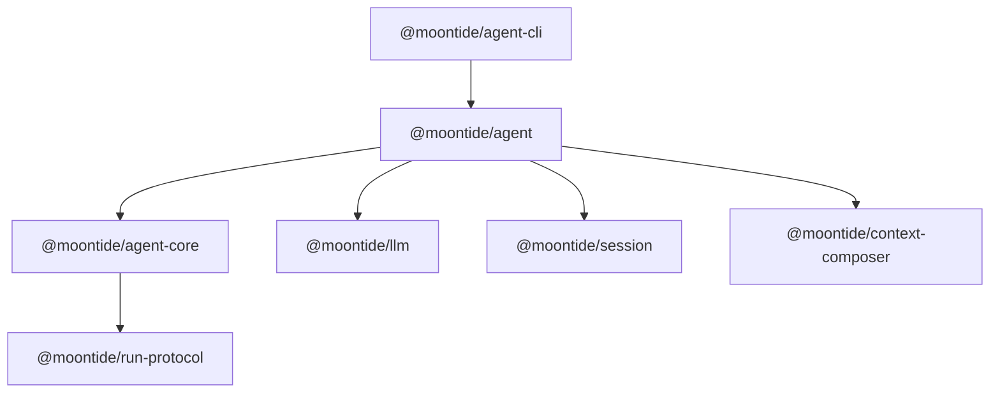

# @moontide/agent

本包即 **Harness**（文档中与「agent-harness」同义，**无**单独的 `@moontide/agent-harness` 包）。职责：装配 Session **materialize**、context **compile**、LLM、tools、hooks、sidecar，形成一次 MoonTide run；RunEvent bus 经 **derive** 产出 Agent Event。拆分说明：[`agent-harness-cli-split.md`](../../docs/notes/runtime/agent-harness-cli-split.md)。

**含 MoonTide Preset** — `instruction-state`、builtin plugins、`register-defaults`、deep-mode 等默认产品策略在本包内，不另拆 Preset 包。

**不是 CLI（Shell）** — REPL、stderr 渲染、`log/format` 在 `@moontide/agent-cli`。

## 四层包边界

| 包 | 唯一回答的问题 |
|----|----------------|
| `@moontide/llm` | 一次标准化 `LLMRequest` 应通过哪个 model / Provider route 执行，以及如何适配厂商 API 参数？ |
| `@moontide/agent-core` | 一个 LLM loop 下一步怎么运行，turn、tool 调用与固定 `RunEvent` 协议如何推进？ |
| **`@moontide/agent`（本包）** | 一个 MoonTide `AgentSession` 如何构建，Session、context preset、LLM、tools 与 hooks 如何装配？ |
| `@moontide/agent-cli` | 如何把 `@moontide/agent` 运行成 terminal REPL 产品？ |

运行调用链：`agent-cli → agent → agent-core → 注入的 StreamFn → agent stream-fn → llm adapter`。本包负责 preset、`StreamFn` 与其他端口装配；Session 事实源仍属于 `@moontide/session`，最终 context compile 算法仍属于 `@moontide/context-composer`。

### 与相邻包

| 包 | 角色 |
|----|------|
| `@moontide/agent-cli` | Shell：终端交互与观测渲染 |
| **`@moontide/agent`（本包）** | **Harness**：MoonTide run 装配 + Preset |
| `@moontide/agent-core` | Temporal core：`runLoop`、RunEvent bus |
| `@moontide/run-protocol` | RunEvent protocol 类型 |

## 职责

- **Run 入口**：`runAgent`、`AgentSession`、`AgentRun` — REPL 与 eval 共用
- **平台 bootstrap**：`bootstrapAgentPlatform`、`setupAgentEventPipeline`、`setupToolsPorts`
- **Runtime 注册表**：`AgentRuntime`、`RunObserverRegistry`、`ToolRegistry`、sidecar attach
- **Context 接线**：`composeForSession` / working-set · instruction-state · `@moontide/context-composer`
- **Session 桥接**：`SessionItemCommitPort`、session-persistence plugin
- **观测**：`AgentEventPipeline` 注入；`createRunEventDeriveListener`（RunEvent → Agent Event）
- **产品能力**：deep-mode、debug/context-inspect、always-allow tools

import 链：`@moontide/agent` → `@moontide/agent-core` → `@moontide/run-protocol`。

## 不做什么（硬边界）

| 禁止 | 说明 |
|------|------|
| `terminal/` · `log/format/` · `errors/report` | 终端 stderr 与 Agent Event **终端渲染** 在 agent-cli |
| direct REPL / slash UI | 在 agent-cli `cli/`（含 `/save`、`/resume session`） |
| `@moontide/agent-cli` import | Harness 不得依赖 CLI |

门禁：[`tests/conformance/architecture-boundaries.test.ts`](../../tests/conformance/architecture-boundaries.test.ts) — `@moontide/agent` 零 terminal / format / report import。

## 包依赖顺序



术语：**materialize**（session）· **compile**（composer）· **derive**（RunEvent → Agent Event）见 [`context-composer.md`](../../docs/spec/context-composer.md) §1.4。

## 谁应该用

| 调用方 | 用途 |
|--------|------|
| `@moontide/agent-cli` | 生产终端入口（经本包 run） |
| `@moontide/evals` | 无终端 Harness A/B |
| 集成测试 | `installTestRuntime()` · [`tests/helpers/test-runtime.ts`](../../tests/helpers/test-runtime.ts) |
| 第三方 embed（远期） | `bootstrapAgentPlatform` + 自建 pipeline |

## 对外 API

### package.json exports

| Subpath | 稳定性 |
|---------|--------|
| `@moontide/agent` | 稳定（workspace 内） |
| `@moontide/agent/testing` | **测试 / dev-only**（eval overrides 等） |

### API 分组（根 export 节选）

| 分组 | 代表符号 |
|------|----------|
| Run 入口 | `runAgent`, `continueReplAgent`, `AgentSession`, `AgentRun`, `LoopContext`, `createDefaultLoopContext` |
| Bootstrap | `bootstrapAgentPlatform`, `setupAgentEventPipeline`, `setupAgentObservers`, `teardownAgentPlatform`, `setupToolsPorts` |
| Runtime | `createAgentRuntime`, `getAgentRuntime`, `setAgentRuntime`, `AgentRuntime`, `RunObserverRegistry`, `ToolRegistry` |
| Pipeline | `AgentEventPipeline`, `publishAgentError`, `applyAgentEventPipeline`, `createRunEventDeriveListener` |
| Config / workdir | `getWorkdir`, `setWorkdir`, `readWorkspaceConfig`, `modelId`, `compactThreshold`, … |
| Instruction | `resolveInstructionState` |
| Tools | `getToolDefinitions`, always-allow helpers, `register-defaults` 经 runtime |
| Deep mode | `applyDeepPromptGate`, `isDeepModeEnabled`, `getActiveWorkMemId`, … |
| Session persistence | `saveActiveSessionToIndex`, `openSessionFromIndex`, `listSessions`, `autoSaveSession`, formatters（无 slash / `reply`） |
| Debug | `getDebugLevel`, `emitDebugRecord`（终端经 `AgentEventPipeline.writeDebugTerminal`）, `debugLogPath`, … |

完整 export 见 [`src/index.ts`](src/index.ts)。

## 最小用法

### 生产（与 agent-cli REPL 相同顺序）

```ts
import {
  bootstrapAgentPlatform,
  createAgentRuntime,
  getWorkdir,
} from "@moontide/agent";
import { createCliEventPipeline } from "@moontide/agent-cli/cli-event-pipeline";

const workdir = getWorkdir();
const runtime = createAgentRuntime();
await bootstrapAgentPlatform({
  runtime,
  workdir,
  pipeline: createCliEventPipeline(workdir),
});
// 之后 runAgent / REPL turn
```

`setupAgentEventPipeline` 适用于轻量测试（无 sidecar attach）：hooks + pipeline，不调用 `bootstrapPlugins`。

### 测试

```ts
import { createTestEventPipeline } from "@moontide/agent/testing";
import { installTestRuntime } from "../../tests/helpers/test-runtime.js";

installTestRuntime(tmpWorkdir, createTestEventPipeline({ debugTerminal: [] }));
```

## 相关文档与验收

| 文档 / 测试 | 内容 |
|-------------|------|
| [`agent-harness-cli-split.md`](../../docs/notes/runtime/agent-harness-cli-split.md) | §4 终端边界 · §18 拆包 |
| [`docs/spec/agent-core.md`](../../docs/spec/agent-core.md) | Temporal core 与 Harness 分工 |
| [`docs/spec/context-composer.md`](../../docs/spec/context-composer.md) | compile 与 manifest |
| [`tests/conformance/dev-startup.test.ts`](../../tests/conformance/dev-startup.test.ts) | bootstrap 顺序 · 冷启动 `runAgent` |
| [`tests/log-sync.test.ts`](../../tests/log-sync.test.ts) | RunEvent derive 不变量 |
